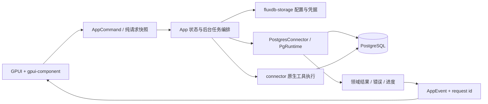

# PostgreSQL 真实接入详细设计

创建日期：2026-09-09；最后核对：2026-09-10。状态：设计完成，功能尚未实施。交付标准：达到本仓库当前 MySQL 的完整可用程度。本文与[任务清单](2026-09-09-postgresql-task-list.md)共同执行，不按阶段或里程碑缩减范围。

## 1. 范围与事实基线

### 1.1 本次交付与后续实现的区别

本次仅输出设计和任务清单，没有修改 Rust、连接真实业务库或验证数据库功能。下文“必须”“采用”“新增”均为实现要求；“现有”“已核对”为本次源码阅读结论。复用的是经确认的模型、交互与职责，不代表已有代码在 PostgreSQL 上已经可用。

源码基线：

| 项目 | 本地根路径 / 远程地址 | 本次核对提交 |
| --- | --- | --- |
| FluxDB | `/Users/shining3d/fusuwei/code/fluxDB-pg` | `fa743f65abb676de66b2e236ebab0be016d09093` |
| DBeaver | `/Users/shining3d/fusuwei/code/dbeaver` | `4ef3b32b473ba89a1eb6cfbb858d68d23322dc99` |
| dbx | `/Users/shining3d/fusuwei/code/rust/dbx` | `679b2e1d8031461ff0f3bef326d7f4c65a3ba878` |
| pgAdmin 4 | [pgadmin-org/pgadmin4](https://github.com/pgadmin-org/pgadmin4) | `153e3273d888959f29d2328b960e2b125e61e102` |

本地引用指向实际工作树，提交号用于复查；不能由提交号推断工作树完全干净。FluxDB 已有 `.gitignore` 修改和未跟踪的 `AGENTS.md`，均不属于本次文档交付。远程引用使用固定 commit URL，不依赖之后变化的 master。

### 1.2 已确认的现状

1. `DatabaseKind` 没有 PostgreSQL；connector 依赖仅启用 SQLx 的 MySQL/SQLite；真实连接路由集中在名字容易误导的 `parts/mock_data.rs`。它同时承担真实路由与 demo，新增实现不得遗漏其中任何入口。[R01、R03、R07]
2. `ObjectPath` 已有 database/schema，`ObjectKind::Schema` 已存在，应复用；但 `QueryRequest`、`SavedQuery` 和查询历史的主要上下文尚缺 schema。`CompletionColumn` 只有裸表名，跨 schema 批量列结果可能混淆。[R02、R12]
3. SQL 编辑器已有 `SqlDialect::Postgres`、关键词和部分测试，宿主 `DatabaseKind` 映射尚未接通；“编辑器支持方言”不能等同于真实数据库接入。[R14]
4. MySQL 拨号的注释与调用表明：`mysql_dial` 处理 SSH，主要供连接测试；对象、数据及执行等多处仍走 `mysql_connection_url`。高级表单存在不意味着参数在所有操作生效，不能复制这种分叉。[R04、R05]
5. MySQL 执行器以首关键字判断是否返回行，结果先 `fetch_all` 再转页；取消主要检查语句之间。PostgreSQL 的 `RETURNING`、空结果元数据、长查询取消需要独立设计。[R06]
6. `non_null_insert_values` 将 NULL 作为可省略值处理；PostgreSQL 必须区分未填写/DEFAULT、显式 NULL 和实际值，不能直接用于新插入链路。[R06]
7. 表结构与表操作 provider 已存在，但大量实现位于 `state.rs`；用户权限模型以 MySQL 的 user@host、认证插件、资源限制为中心。[R08、R09]
8. 导出、原生备份和 SQL 文件流程包含 UI 文件内的文件 I/O、SQL 生成或子进程执行。接入时需迁移实际复用到的执行职责，不能继续在 UI 增加 PostgreSQL SQL/驱动/凭据逻辑。[R15]
9. 查询结果编辑把两段对象名理解成 database.table，并只特殊处理反引号；历史补偿 SQL 有 MySQL 引用规则。两者都必须按方言修正，不能只改 connector。[R10、R11]
10. `AGENTS.md` 引用的 `docs/2026-09-04-gpui-component-ui-migration.md` 在当前工作树不存在。实施前重新检查；若仍缺失，直接按 AGENTS.md 的明确控件规则和本地 0.6.0 源码执行，不声称读过缺失文档。[R00、R17]

### 1.3 MySQL 功能对齐矩阵

“基线”表示已找到相应源码入口，不表示本次做过真实 MySQL 全量验收。MySQL 专属机制按 PostgreSQL 的等价业务能力实现；不向 PostgreSQL 发送 MySQL 语法，也不能把通用能力标为“不支持”而宣布完成。

| 编号 | 当前 MySQL 功能与入口 | PostgreSQL 完成标准 | 实施任务 |
| --- | --- | --- | --- |
| F01 | 新建/编辑/复制连接、测试、保存、重启恢复；R01/R04/R13 | PostgreSQL 类型、5432、维护数据库、用户/密码、连接串归一化、同链路测试和实际访问 | T02–T05、T19 |
| F02 | TLS、SSH、代理和超时配置；R04/R13 | TLS 证书验证、SSH 密码/私钥、代理、连接/查询超时真正作用于所有 PostgreSQL I/O | T04、T05、T19 |
| F03 | 分组、排序、显示数据库、展开/刷新/断开/删除；R07/R16 | connection → database → schema → table/view；同名对象互不覆盖，断开释放资源 | T03、T06、T20 |
| F04 | 新建/删除数据库；R05/R06 | PostgreSQL owner/encoding/template/locale 语义，独立维护连接执行，错误可解释 | T07、T20 |
| F05 | 对象列表、表/视图、列和注释；R05/R08 | catalog 精确加载，分页/按需展开，权限不足有明确状态 | T06、T08、T20 |
| F06 | 数据页、分页、多列排序、过滤、搜索/字段隐藏；R05/R06/R16 | 服务端筛选与预览一致；复用本地过滤、排序交互、字段布局；类型正确 | T09、T10、T21 |
| F07 | 新增/复制/修改/删除行、批量提交、撤销未提交修改；R05/R10 | 原子事务、可靠行定位、DEFAULT/NULL、生成列、并发冲突和失败保留草稿 | T11、T21 |
| F08 | 单元格详情、JSON、时间、二进制预览/上传/下载；R02/R10/R16 | bytea 全链路、精度/时区不丢失、摘要不可当完整值写回 | T09、T11、T21 |
| F09 | 全部/当前/选区执行、结果标签、多语句、进度/停止；R06/R07/R14 | dollar quote、RETURNING、多结果、空结果列、事务错误恢复和真正取消 | T12、T13、T21 |
| F10 | SQL 格式化、参数输入、补全、文档/语义提示；R12/R14 | PostgreSQL AST/分句/参数一致，schema/search_path、函数重载和外键补全 | T12、T14、T21 |
| F11 | 保存查询、本地 SQL、历史、补偿 SQL、结果集编辑；R10/R11/R13/R15 | 保存 database/schema/方言，单表可编辑规则准确，补偿可预览且作用域正确 | T03、T15、T21 |
| F12 | 表信息：列、索引、外键、触发器、DDL；R05/R08 | 读取 PG catalog；复合约束顺序、表达式索引及完整定义不丢失 | T08、T16、T21 |
| F13 | 新建表、设计表、字段/索引/外键/check/触发器/选项；R08/R16 | PostgreSQL provider 和结构差异计划；预览与执行一致，不套用 MySQL 属性 | T16、T17、T22 |
| F14 | 复制表、重命名、删除、清空；R08/R15 | schema 限定、独立序列、RESTRICT/CASCADE、identity 选项及依赖提示 | T18、T22 |
| F15 | 表导出 SQL/TXT/CSV/JSON/XML，行或选区 CSV/JSON/Markdown/INSERT；R15/R16 | 所有已有格式、字段选择、当前/全部/自定义条件和进度，PG 字面量正确 | T23 |
| F16 | SQL 文件编码、目标库、拆分/继续错误、日志/取消；R15 | 增加 schema，执行与编辑器共用分句；原生 dump 中 COPY/psql 内容正确路由 | T12、T24 |
| F17 | 数据库备份、结构/数据选项、原生/逻辑路径、记录和取消；R15 | pg_dump、备份目录/记录、权限和工具缺失反馈，输出可验证恢复 | T25 |
| F18 | 用户/角色、密码、授权撤销、成员关系、权限列表；R09/R16 | PostgreSQL role、LOGIN、成员关系、数据库/schema/表/序列/函数权限，完整可操作 | T26、T27 |
| F19 | 标签/脏状态/关闭保护、全局反馈、明暗主题；R14/R16/R17 | 通用体验保持，GPUI 前台不阻塞，迟到响应不污染新状态 | T01、T19–T22、T27、T28 |
| F20 | 现有 MySQL/TiDB/SQLite/Redis/Mongo 路由及配置兼容 | 新类型不改变旧序列化、不将旧连接路由到 PG、共享提取有回归证据 | T01、T02、T28 |

目标测试服务器版本为 PostgreSQL 14、15、16、17、18；14 为最低支持版本，按 `server_version_num` 分支，不能靠异常后盲试多份 SQL。此范围是设计选择，不是本次验证结论。CockroachDB、Redshift、openGauss、PostGIS/pgvector 专属管理、复制槽/集群运维、可视化执行计划和 CSV 导入不在当前 MySQL 对齐范围；扩展类型仍必须可识别、安全展示，不能使整页失败。现有 MySQL 没有对应能力的 PostgreSQL 全套运维页面不额外建设。

## 2. 必读顺序与参考采用原则

开始任意实现任务：先读 R00、本设计对应章节、任务条目的必读引用，再从 UI 事件追踪至 AppCommand → app 路由/provider → connector → storage，并读返回事件和测试。文末 Rxx 索引给出真实文件、关键符号和定位；不能只阅读当前准备改的单个函数。

统一先读 R01–R07 理解核心模型/连接/数据链路；UI 任务再读 R13–R17；各任务指定的 DBeaver/dbx/pgAdmin 代码必须阅读。参考代码有版本变动时使用记录的 commit 定位，任务记录写明实际阅读版本。

| 参考 | 借鉴内容 | 不照搬的内容 |
| --- | --- | --- |
| 本仓库 MySQL | AppCommand/AppEvent、DataPage、数据草稿、provider、通用页面、配置与凭据流程 | `USE`、反引号、`SHOW CREATE TABLE`、`AUTO_INCREMENT`、user@host、NULL 省略、逐次 runtime、测试与业务两套拨号 |
| DBeaver R20–R23 | database 独立连接、schema 缓存、catalog/版本分支、结构对象和 DDL 分离、原生工具参数 | Java/Eclipse 对象体系、大量旧版本兼容、把整个框架翻译成 Rust |
| dbx R24–R27 | Rust 驱动、TLS、pg_catalog 列/索引查询、复合外键位置配对、事务恢复测试、流式结果 | 巨型 postgres.rs、单连接池跨任务共享会话、失败后无条件重试、用首关键字判定所有结果、所有复杂值转换成浮点/JSON |
| pgAdmin R28–R31 | 结果集按连接隔离、数据保存事务/保存点、编辑列过滤、独立取消路径、pg_dump/psql 工具分工 | Python/Web 会话结构、把数据写进诊断日志、未经验证的客户端别名回写 |

## 3. Rust 与 GPUI 架构决策

### 3.1 分层与调用链



UI 不持有驱动 Client，不拼数据库 SQL，不读写配置或保存密码。core 放领域请求、标识、能力和数据，不放 GPUI Entity、驱动 Row 或 tokio 类型。app 负责工作流、预览计划、草稿与能力解释；connectors 负责连接、元数据 SQL、参数编码和执行；storage 负责持久化、密钥读取/清理及配置迁移。

现有 `Connector` 是同步 trait。保留它对 MySQL 等实现的兼容性；PostgreSQL 内部异步，由应用持有的 PostgreSQL service/runtime 在后台工作线程调用，同步桥仅出现在 connector 边界。禁止在 GPUI render、Entity update、AppCommand 前台处理过程中 `block_on`；禁止同步持有 AppState 锁等待数据库。先产生 `Started` 状态和不可变请求，再调后台任务，最后以完成命令更新状态。必要时新增小范围 effect/result 类型，不把全项目改造成另一个框架。

参考 Zed/GPUI 的工作方式是明确状态所有权、`Entity`/`WeakEntity` 和 task handle 生命周期、后台计算与前台更新隔离；本次没有读取独立 Zed 仓库，不声称引用了其具体文件。保留现有 editor-core/SQL adapter，不重写编辑器。

### 3.2 驱动选择：PG 使用 tokio-postgres，旧数据库保持 SQLx

已先检查现有 SQLx 0.8.6，而非直接添加另一套依赖。其 PostgreSQL `hostaddr` 解析会覆盖 `host`，TLS 使用同一 `options.host`；经本地 SSH 端口转发时无法直接同时表达“拨号 127.0.0.1”和“验证远端数据库主机名”。该版本连接保存取消参数，但未提供相应公开 CancelToken API。[R32]

选择 dbx 已验证采用的 `tokio-postgres 0.7`，实现时锁定并验证具体版本；本地已核对 0.7.18 的 `Config::hostaddr`、`connect_raw`、`Client::cancel_token`、`simple_query_raw`。用 `tokio-postgres-rustls 0.13` 对接已有 rustls 0.23；沿用当前 ring provider，避免照抄 dbx 的 aws-lc 初始化造成 provider 分歧。流读取按需增加 `futures-util`；不引入 deadpool，也不同时为 PG 保留两套驱动。[R24、R33]

这是因 TLS 路由、协议取消和通用查询需求选择公开驱动能力，不修改/复制 SQLx 私有协议实现。MySQL/TiDB/SQLite 的 SQLx 依赖和行为保持。新增依赖版本/features、MSRV、锁文件、许可证及构建体积在 T04 记录。

### 3.3 所有权、runtime、会话与取消

- `PgRuntime` 由 app 的连接服务持有，包含一个 Tokio runtime 及 PostgreSQL 会话注册表。请求通过 clone 的 service handle 访问，不能继续每次创建 connector 丢失所有会话；也不能用无界静态全局连接表。
- 会话键：`connection_id + config_generation + database + purpose`；查询 purpose 含稳定 `QuerySessionId`（映射 TabId，但 core 不依赖 UI）。独立查询标签不共享事务、临时表和 SET 状态。元数据/数据提交/备份不借用用户查询会话。
- 一个查询会话只有一个执行者；后续请求串行排队并可取消等待。元数据使用短生命周期连接和有界并发信号量，先不建设完整通用池；默认并发上限 4，可通过配置调整。没有定时轮询保活的无限后台任务。
- session 持有 Client、驱动 connection future 的 JoinHandle、transport guard、当前请求 token。连接 future 必须持续轮询；错误应更新状态，不能 `spawn` 后丢掉句柄和错误。
- 打开、测试、对象、补全、分页、提交、二进制、查询、管理全部调用唯一 `PgDialer`。有效配置优先级：本次明确请求上下文 → 结构化档案 → 明确默认值；日志不输出解析后的含密码 URL。
- 取消走 `CancelToken`，按当前 execution id 校验，另开经同一 transport/TLS 策略的连接发送；不靠结束 future 假装服务器已停止。token 发送成功不等于 SQL 已取消，必须等原执行返回 `57014` 或正常完成。完成与取消竞争时以服务器结果为准，旧 token 不得取消下一条请求。
- 取消超时/传输异常则关闭并废弃该会话，标记“执行结果待核实”；不自动重试写操作。连接驱动、转发线程和子进程在断开/编辑配置/删除连接/退出时一起释放。切换 database 需新连接；已有事务先显式提交或回滚后才能切换。
- 所有返回携带 request id、config generation、目标 object/query session；已关闭标签、已切换 schema、已刷新为更新请求时丢弃迟到结果。取消、失败、成功均清除对应 loading，其他任务状态不受影响。

### 3.4 最小结构拆分

以下均为**拟新增路径**，尚不存在。只按明确职责拆分，不为几行包装创建大量小文件。

```text
crates/fluxdb-core/src/parts/
  postgres_profile.rs         # PG 配置，使用公共 SecretRef
  sql_context.rs              # 查询会话/解析作用域、结构化对象身份
  table_metadata.rs           # 可编辑列、复合约束、PG 扩展元数据
  database_capabilities.rs    # 实际需要的能力；区分权限/版本/对象只读
  transfer.rs                 # 导出/备份/脚本请求与进度
crates/fluxdb-connectors/src/parts/
  postgres/mod.rs             # 真实 mod 边界，唯一必要 public re-export
  postgres/connector.rs       # Connector trait 适配
  postgres/connection.rs      # runtime/session/dial/取消生命周期
  postgres/metadata.rs        # database/schema/table/columns/catalog
  postgres/data.rs            # 筛选、排序、分页、bytea
  postgres/values.rs          # PostgreSQL 值/参数转换
  postgres/execution.rs       # 多语句、结果、事务、进度
  postgres/apply_changes.rs   # 原子变更和冲突结果
  postgres/ddl.rs             # catalog 到 DDL、结构动作执行
  postgres/completion.rs      # 作用域正确的批量元数据
  postgres/user_admin.rs      # 角色/ACL 读取与执行
  postgres/native_tools.rs    # pg_dump/psql 调用与取消
  transport/ssh.rs            # 从现有 SSH 桥机械提取后增加显式策略
  relational/mod.rs           # 仅真实共享的分页/校验/结果辅助
crates/fluxdb-app/src/parts/
  connections/               # 真实路由、生命周期，demo 单独保留
  create_table/              # 从 state 拆出的模型和各方言 provider
  table_actions/             # 复制/重命名/清空/删除计划
  query_execution/           # 请求准备、完成归并、历史联动
  user_admin/                # 通用工作流 + PostgreSQL 角色状态
  transfer/                  # 导出/备份/SQL 文件后台编排
apps/fluxdb-desktop/src/main_parts/
  connection_dialog/         # 原表单拆分 + postgres.rs
  sidebar/                   # database/schema 节点适配现有树
  user_admin/                # PostgreSQL 角色字段及权限表
```

新增 PG 文件用真实 `mod`，helper 默认私有或 `pub(super)`/`pub(crate)`。保留旧 `include!` 模块的边界；仅迁移确实共享的 helper，不整体改造所有数据库。

当前 `state.rs` 5291 行、dispatch 3724 行、shared 1837 行、connection_dialog 3656 行、tree_helpers 2432 行、app_boot 2641 行。要在这些文件增加功能前，先机械拆出对应职责，验证行为不变，再实现 PG；SQL 文件、导出等大文件同样先检查行数。纯移动与行为变更分开提交或至少在完成记录中分开说明。

### 3.5 接口覆盖与状态契约

不只增加 `test_connection`/`execute` 两个方法。现有 SQL 类 Connector 接口必须按下表实现，默认返回空列表的实现不能当作已接入。[R02、R04]

| 现有接口 | PostgreSQL 责任 | app/UI 消费 |
| --- | --- | --- |
| kind/test_connection | 类型、真实拨号/认证/探活 | 连接测试、保存前验证 |
| list_objects | 按父 ObjectPath 列库/schema/关系/列 | 树、对象列表、刷新 |
| create_database/delete_database | PG 独立维护连接 | 新建/删除数据库流程 |
| load_data/preview_data_export | 有界数据页与一致查询计划 | 数据表、筛选、导出预览 |
| apply_changes/load_cell_binary | 原子变更、完整二进制按需加载 | 草稿提交、单元格详情 |
| execute/execute_with_progress | 共用同一个执行引擎，后者增加逐语句事件与取消 | 查询与 SQL 文件 |
| list_completion_tables/columns/columns_for_tables/routines/triggers 及各 with_cancel | 全部实现，批量保留完整对象范围 | 补全/索引/提示 |
| list_indexes/list_foreign_keys/list_foreign_keys_with_cancel/list_triggers/table_ddl | catalog 元数据及 DDL | 表信息、新建/设计表 |

Redis 专属 `execute_command_workbench` 等不用于 PostgreSQL SQL 工作台，不为凑齐 trait 伪造实现。schema 管理、结构动作、角色和原生工具新增窄领域服务/命令；它们与 Connector 使用同一个 PgRuntime/PgDialer，但不把所有命令压进任意 SQL 字符串 API。

请求通用封套包含 `request_id`、`connection_id`、`config_generation`、`target`、可选 `query_session_id`。开始/进度/完成事件保持相同身份；进度限频并有界排队，完成事件不能被普通进度覆盖。`ApplyChangesResult` 增量携带提交状态和插入后实际身份；保留 `Connector::apply_changes -> Result<()>` 的旧适配入口供旧数据库使用，PG app 路由消费 richer result，不能返回成功后另查一次“猜测最后插入 ID”。

结构计划使用 `SqlExecutionPlan { steps, transaction_mode, expected_fingerprint }`（拟新增领域模型），每步有目标对象、语句、是否敏感/破坏性和预期结果。预览和实际执行由同一计划提供；授权确认之后如目标/SQL/结构指纹改变，不能沿用旧确认。计划对象不携带 GUI 状态或驱动类型。

## 4. 核心模型、作用域与持久化

### 4.1 配置

新增 `DatabaseKind::Postgres`，连接档案 `postgres_profile: Option<PostgresConnectionProfile>` 用 `serde(default, skip_serializing_if = "Option::is_none")`，同时覆盖 ConnectionConfig、ConnectionDraft、所有 fixture、config 重建和导入导出。旧枚举名字/旧字段/旧 profile 不重命名。

| 组 | 字段与语义 |
| --- | --- |
| Basic | host、port=5432、maintenance_database=postgres、username、password: SecretRef；database 在建连前确定，指定库不存在时准确报错，不静默换库 |
| Scope | 可选默认 schema、显示其他 databases、系统 schema 可见性；默认保留服务器 search_path，用户选择 schema 后建立明确会话上下文 |
| TLS | disable/prefer/require/verify-ca/verify-full、CA/客户端证书/私钥文件引用、可选 server_name；默认 prefer 兼容本地连接，界面明确展示实际加密/验证结果 |
| Transport | direct/SSH/代理；SSH 密码或私钥+口令、已知主机校验；SOCKS5/HTTP CONNECT 按现有表单能力提供明确选项，禁止仅保存不执行 |
| Advanced | connect_timeout=5s、query_timeout=0（无限）、idle TTL、TCP keepalive、application_name=FluxDB、可选 timezone；不照搬 MySQL charset/engine |

URI 导入只接受 postgres/postgresql scheme，解析至同一档案，处理 IPv6、百分号编码、特殊字符密码和查询参数冲突；不将含凭据 URI 原样存入 Endpoint/日志。未知连接参数报校验错误或明确列为不支持，不能静默丢弃。

通用 `SecretRef` 当前放在 redis_profile.rs，使用时可机械迁至公共职责文件再 re-export；不要新增 PgSecretRef。storage 按现有 secret slots 机制接入数据库密码、SSH 密码、私钥口令、代理密码；实际密钥仅驻留内存，落盘仅引用。更新密码、清空密码、删除连接、复制连接均要定义凭据处理：复制使用新 credential_ref；删除只清理该连接拥有的条目，不能删共享用户密钥。Keychain 保存失败不可显示“保存成功”。[R01、R13]

### 4.2 对象与查询作用域

`ObjectPath` 的 PG 定义：database 是物理连接库；schema 是 namespace；name 是对象本身（不拼点号）。例如连接 A 的 appdb、tenant_a、Order 与 tenant_b.Order 是不同对象。SQL 生成逐段双引号引用，只生成 `"schema"."table"`；不能生成跨数据库三段 DML 名称。两段 SQL 名称在 PostgreSQL 解释为 schema.table；MySQL 仍为 database.table。

给 QueryRequest、QueryEditorState、SavedQuery、QueryHistoryRecord/Entry 及补偿快照补充 schema/查询作用域；新增字段有兼容默认值。QueryRequest 同时携带可选 QuerySessionId；无 session 的内部请求使用隔离短连接。Tab 去重、树节点 ID、对象缓存、字段布局/虚拟文件夹、已保存查询、历史过滤、异步 request key 都必须包含完整作用域。节点 ID 使用结构化字段或长度编码，不以 `split('.')` 恢复对象名。

补全缓存内部 key 已有部分 schema 字段，应补齐流入/流出链路而非另起缓存。`CompletionColumn` 批量结果必须携带所属 database/schema/table；不能仅用裸 table 匹配。`RoutineRef` 增加签名/identity arguments 以区分重载。修改持久化索引结构后递增 `COMPLETION_INDEX_VERSION`，旧缓存失效重建，但不丢旧连接、查询和历史。[R02、R12]

大小写：未加引号的 SQL 标识符按 PG 折叠为小写；双引号保留大小写和转义；catalog 返回名称按原样持有，不 `eq_ignore_ascii_case` 合并对象。`search_path` 从服务器读取有效 schema 顺序；补全优先实际可见对象并能显式跨 schema，不能永远硬编码 public。权限/RLS 由服务器决定，UI 能力只指导展示，不能作为授权依据。

### 4.3 表元数据与编辑能力

保留用于轻量渲染的 Column/DataPage；新增 `TableMetadata`/列写入元数据承载 default、identity、generated、type identity、可编辑性和唯一键。所有数据库可给出兼容默认值，PG 不把 SQLx/tokio 的 Type 放进 core。

- 类型身份包含 schema+name（及会话内 OID/typmod 可选诊断），OID 不作为跨重连持久化身份。
- 索引扩展：键项（列或表达式）、顺序、NULLS、INCLUDE、predicate、method、有效状态；完整 definition 用于不支持图形编辑的属性保真。
- 外键按约束组织有序列对，保留 ref_schema、动作、match、deferrable/initially_deferred；兼容现有单列展示 adapter，不丢复合键。
- 触发器保留 events、timing、level、when、enabled、function identity 及完整定义；CHECK 独立元数据，不从字符串猜测。
- `ObjectKind` 增加物化视图/序列等确有展示需求的种类或等效明确扩展类型，禁止把所有 relkind 假装普通表。普通/分区表正常浏览；物化视图只读数据；外部表按能力只读；序列和 routine 供 DDL/补全，不要求新增完整运维页面。

## 5. 连接与传输实现

`PgDialer` 步骤：校验档案 → storage 提供运行时凭据 → 选择 database → 建 transport → 使用独立 TLS server_name → PostgreSQL 握手/认证 → 读版本/当前库/当前用户/search_path → 绑定资源生命周期。测试连接也完成这条路径，不仅探测 TCP 端口。

TLS 必须实现 require、verify-ca、verify-full 的差异；CA-only 验证证书链而不检查 DNS，verify-full 两者都检查；`require` 不等于 verify-full。禁用/允许降级策略是明确配置，验证失败不自动降级。SSH 本地拨号地址与远端 TLS 名称分别保存，`hostaddr`/`connect_raw` 只改变传输路由。证书过期、错误 CA、错误主机名、客户端证书不配对都有独立测试。

现有 `SshTunnel` 仅 accept 一次，且注释明确未校验 hostkey；直接给会话和取消连接共享会失败。[R18] 提取 transport 时保留旧调用兼容包装；PG 用显式 known_hosts 策略和每条物理流独立 guard，或经过测试的多通道桥。未知主机由明确 UI 流程展示指纹，变更指纹报错，不默认信任。取消和原生工具也必须有自己的有效通道。代理顺序在 profile 中明确，验证组合后显示，不允许后台绕过代理直连。

超时覆盖 DNS/SSH/代理/TLS/认证和探活整体预算；查询 timeout 在服务端 statement_timeout 与客户端 watchdog 协调，锁等待可单独限制。驱动 Notice 仅作限量消息，日志字段使用 operation、request_id、connection_id、database/schema、耗时、行数、SQLSTATE。SQL 参数、密码、证书正文、敏感角色语句均不写日志；服务端 detail 也可能含数据值，诊断呈现需脱敏。[R24、R28]

错误转换保留 SQLSTATE、schema/table/column/constraint、position 和脱敏 hint/detail，作为可选领域诊断附于现有 Error/UserFacingError；不是把驱动错误类型透传 UI。现有 `ErrorKind` 分类保持，必要的冲突/提交结果状态放业务结果中。

| 错误 | 映射与操作规则 |
| --- | --- |
| 28xxx（含 28P01） | Authentication；重新输入凭据，不自动重试 |
| 42501 | Permission；显示目标操作和缺失权限，不把列表清空当成功 |
| 3D000 / 3F000 / 42P01 | Query 或建连阶段 Connection；数据库/schema/表已不存在，精确失效上下文 |
| 23502 / 23503 / 23505 / 23514 | Query + 列/约束诊断；本次应用事务回滚、草稿保留 |
| 25P02 | Query + 事务 aborted 状态；允许恢复命令到达原会话 |
| 57014 | 根据本次取消/timeout 原因显示 Cancelled 或超时；不能把用户主动取消误报连接断开 |
| 40001 / 40P01 | 序列化冲突/死锁，回滚已失败的应用事务；用户检查后重试，不自动重放任意 SQL |
| 08xxx / I/O 断连 | Connection；废弃会话；若涉及 COMMIT 或不确定写入，OutcomeUnknown，先核实 |

## 6. 元数据与数据库操作

### 6.1 目录查询

采用 `pg_catalog` 为主，值使用 `$1...$n` 参数；名字是值时绑定，是标识符时逐段引用。按版本选查询，权限拒绝直接呈现，不当作版本不支持重试。

| 对象 | 来源与关键规则 |
| --- | --- |
| Databases | pg_database；datallowconn、datistemplate、CONNECT 权限；可选显示其他库。只加载列表，展开某库时才连接；无枚举权限仍可访问指定维护库 |
| Schemas | pg_namespace；默认隐藏 pg_catalog/information_schema/pg_toast/临时 schema，支持显式显示；不能把名称含 pg 的用户 schema 全部滤掉 |
| Tables/views | pg_class + pg_namespace + pg_description；r/p/v/m/f 分辨；reltuples 只作估计，不伪装精确总数；modified_at 未知时 None |
| Columns | pg_attribute、pg_type、pg_attrdef、pg_constraint；attnum > 0、NOT attisdropped、format_type、pg_get_expr、col_description；attidentity/attgenerated |
| Indexes | pg_index、pg_class、pg_am，indkey WITH ORDINALITY；pg_get_indexdef；区分键项和 INCLUDE，不把 attnum=0 表达式丢掉 |
| FK/CHECK | pg_constraint；conkey/confkey 通过相同序位配对；pg_get_constraintdef；同名约束以所属关系限定 |
| Triggers | pg_trigger、pg_proc；默认不展示内部约束触发器；pg_get_triggerdef、函数签名与函数定义分别读取 |
| Routines/sequences | pg_proc.prokind、pg_get_function_identity_arguments；pg_sequence 和依赖信息；schema/OID/签名避免重载冲突 |

读取 catalog 与转换至领域模型分开测试；提供普通用户而非超级用户场景。DDL/对象变更后按 database/schema/object 精确失效树、详情和补全，跨表外键等依赖需要失效相关对象。[R20、R21、R25、R26]

### 6.2 新建与删除数据库

`CreateDatabaseRequest` 保留既有 MySQL charset/collation 兼容入口，新增带默认值的引擎选项枚举或 PG options，不能借用 `charset` 存 owner。PG 支持 name、owner、encoding、template、LC_COLLATE/LC_CTYPE，合法值来自服务端或校验白名单；locale/template 兼容性错误直接解释。

CREATE/DROP DATABASE 在维护数据库的独立 autocommit 连接运行，不放进事务、不借当前查询会话。不能删除当前维护连接所在库；必要时用户明确选择另一个维护库。删除有业务确认和数据库名称校验；默认不 FORCE、不自动终止其他用户连接；有活动会话时报告失败。成功再清理该库标签/缓存/备份列表上下文，失败保留。schema 的创建/重命名/删除采用对象管理命令，默认 RESTRICT。[R05、R06、R20]

## 7. 数据、类型、过滤与安全提交

### 7.1 类型映射

| PostgreSQL | 展示/领域表示 | 编辑与导出规则 |
| --- | --- | --- |
| NULL/bool/int2/int4/int8 | Null/Bool/I64 | 不把空字符串当 NULL；整数越界报错 |
| numeric/decimal/money | 精确十进制文本 + 类型元数据 | 不经 f64；money 受 locale 影响，按服务端文本和明确类型绑定 |
| float4/float8 | 有限值可 F64；NaN/±Infinity 保留类型化文本 | JSON 导出不能生成非法 NaN 数字；SQL 导出生成 PG 可读类型表达式 |
| text/varchar/char/name/enum/domain | Text + 原类型 | domain 约束由服务端验证；enum 选项取元数据 |
| date/time/timetz/timestamp/timestamptz/interval | 保真文本 + 类型元数据 | timestamptz 有明确时区；timetz/interval/BC/infinity 不强塞普通日期控件 |
| uuid/inet/cidr/macaddr/bit/varbit/xml | 类型化文本 | 输入校验或服务器类型转换；不静默截断 |
| json/jsonb | Json 原文本 | JSON 校验；SQL NULL 与 JSON null 区分；jsonb 规范化是服务端行为 |
| bytea | BinarySummary / Bytes | 表浏览先摘要，详情才完整读取，导出完整字节；OID 大对象不是 bytea |
| arrays/range/multirange/composite/扩展类型 | PostgreSQL 文本表示 + 类型名 | 保留维度、边界、NULL 元素和引号；不能简单按逗号切分或 JSON 往返 |

服务端生成的数据页：标量按驱动原生类型解码；复杂类型用显式 `::text` 投影并保留原始元数据，避免手写二进制协议。任意 SQL：优先准备语句获取真实结果描述并按类型执行；对预先识别为缺少受支持解码器的无参数语句，选择文本协议后只执行一次。prepare 仅解析/描述，不执行原语句；事务恢复和不适合 prepare 的 utility 使用明确路径。

`simple_query_raw` 提供列名、行、CommandComplete，但 SimpleColumn 不提供类型 OID，不能杜撰类型：可用准备阶段的描述或已有 catalog 对应补充；仍未知时 type_name=None、只读。带参数且未知类型的结果必须明确表示无法解码，不伪装 NULL；不能把执行失败当信号再执行一遍有副作用的 SQL。[R24、R33]

动态参数使用驱动 `ToSql` 类型适配；复杂类型可使用明确的 PostgreSQL text-format 参数适配器并绑定目标类型，须验证 `encode_format`，不是向参数放 SQL 字符串。DEFAULT 不作为参数；它是 SQL 语法节点。字节长度限制沿用 HEX_EDIT_LIMIT/BINARY_FILE_UPLOAD_LIMIT，并在读取前和读取过程中都执行，不只依赖 UI。

**文本→类型化列的写入绑定（tokio-postgres 无 numeric/bigdecimal 解码）**：String/Json 值写入 numeric、money、json/jsonb、数组等非字符串列时，客户端会在发送前按推断参数类型校验 `ToSql`，文本无法直绑。采用**双重转换占位** `CAST(CAST($n AS text) AS <type>)`：内层 `AS text` 令 PG 推断 `$n` 为 text 从而通过客户端校验，外层 `AS <type>` 在服务端把 text 转成目标列类型完成赋值。字符串列（text/varchar/char/bpchar/name/citext）免转换；数组（`text[]`/`_text`）因参数被推断为数组类型，仍需上述双重转换。[T09]

### 7.2 查询分页、排序与筛选

表数据查询全限定对象名、已验证列、`LIMIT limit+1 OFFSET offset`，以额外一行计算 has_more；不默认 COUNT 全表。排序优先用户排序，追加主键作为稳定 tie breaker；无唯一键时展示分页可能随并发变化。offset/limit 转换受边界校验，不把 u64 无检查传入 PG 有符号整型。

过滤复用 FilterSpec/FilterOp 和 UI。共享操作描述，按 PG 类型生成表达式：IS NULL、比较、IN/NOT IN、BETWEEN、LIKE/NOT LIKE 等必须和现有操作集逐项核对；布尔、日期、numeric、JSON 不套用 MySQL 隐式类型转换。搜索大小写策略明确；LIKE 通配符的用户意图与转义区分；空 IN、有 NULL 的集合和字符串反斜杠有测试。预览 SQL 与实际参数化执行从同一计划生成；所有无法翻译的过滤返回明确错误，不能悄悄忽略。

导出预览可显式 COUNT，但单独后台执行、可取消，不能阻塞普通数据页。多个过滤/排序状态与请求绑定，旧响应不覆盖新排序。[R05、R06、R10]

**T10 实现**：`pg_load_data` 用 `LIMIT limit+1 OFFSET offset` 探测 has_more，普通分页不 COUNT；用户排序经 `data_order_by_clause`，随后 `pg_order_by_clause` 追加主键（未在用户排序中出现的）为稳定 tie breaker，同值行分页不随并发漂移。过滤（`pg_where_params`/`pg_filter_clause`）逐一翻译 FilterOp 到参数化 `$n` 表达式（IS NULL、比较、IN/NOT IN、BETWEEN、LIKE 模式），数值/类型比较沿用 T09 双重转换绑定；**非法过滤显式报错**——引用不存在的列、空 IN、缺比较值/BETWEEN 端点，均不静默忽略。[T10]

### 7.3 数据变更

复用 DataChangeSet、DataEditorState、行/单元格草稿交互；新增写入值意图 `Default | Null | Value`，可通过独立 `WriteValue` 与插入草稿字段表达，不污染只读 CellValue。旧 MySQL 适配器保留旧语义，PG 必须显式传递三态。

事务内按当前既有删除→更新→插入顺序执行，失败回滚整个批次；不自动关闭约束检查，不强制延迟全部外键。只修改实际脏列；identity/generated 字段默认不可写，复制行时清除由数据库生成的值；空插入是 `INSERT ... DEFAULT VALUES`。用 RETURNING 获取实际主键/默认值，但只在 COMMIT 确认成功后清除草稿及记录成功。

行定位优先完整主键；无主键则可用 NOT NULL 的非部分、非表达式唯一键。若当前 UI 允许无键表编辑，为保持能力采用原始值条件+事务内锁定候选行、确认恰好 1 行后在同一事务用该行物理定位更新；`ctid` 只在本事务内使用，绝不保存到跨页/历史身份，分区情况需同时限定 tableoid。重复行/无法可靠比较的类型禁止模糊写入并说明原因，不能 `LIMIT 1` 随机选。

更新/删除检查原始值与返回行数（期望 1）；0 为行消失/冲突/>1 为身份不唯一，均回滚。复杂值按可比较的保真形式比较；无可靠比较方式时要求稳定唯一键并明确并发保护限制。数据库断连发生在 COMMIT 周围时返回 OutcomeUnknown，保持草稿、要求刷新核实，禁止自动重放整批。失败详情定位具体草稿行/列/约束，敏感值不进日志。[R05、R06、R10、R29]

**T11 实现（连接器侧原子提交加固）**：`apply_changes` 单事务删→更→插（T09 已有），本任务补 **行数检查** 与 **生成列保护**：
- 更新/删除用 `execute` 取受影响行数，期望恰好 1；0 行视为目标消失/并发冲突、>1 视为身份不唯一，均归 `update_conflict_error` 并 `ROLLBACK` 整批。
- 经 `pg_generated_columns` 查询 `attgenerated`/`attidentity` 非空的生成列：新增行自动从插入列列表剔除（空表退化为 `DEFAULT VALUES`，值由数据库生成），更新对生成列 `SET` 显式拒绝。
- 数据库断连发生在 COMMIT 周围 → COMMIT 失败即报错并要求刷新核实，不自动重放。[T11]

**T11 实现（三态写入意图 DEFAULT/NULL/值）**：core 新增独立 `WriteValue = Default | Null | Value(CellValue)`（不污染只读 `Row.values`），`DataChangeSet` 增并行可选字段 `insert_intents: Option<Vec<Vec<WriteValue>>>`（缺省 `None` = 旧语义），PG 的 `pg_insert_values` 按表列序对齐三态落库：`Default` 省略列由数据库默认值填充、`Null` 显式写 NULL、`Value` 写具体值；服务端生成列一律剔除。MySQL/未升级调用方不设 `insert_intents`，插入语义回归不变。[T11]

## 8. SQL 编辑与执行

### 8.1 统一分句和参数

现有 app/connector/UI adapter 有多个分句入口，不能各加一个 PG 特判。把方言相关词法规则放进 core 的共享 SQL 支持职责，app 和 editor adapter 调用同一实现；纯移动后先保持 MySQL/SQLite 行为。[R06、R12、R14]

必须识别 `'...'`、`E'...'`、双引号标识符、`$$...$$`/`$tag$...$tag$`、行注释、嵌套块注释，以及函数/DO 块内部的分号。美元标签区分大小写，UTF-8 光标范围准确。参数识别不能误把 PG `::type` 的冒号、`$1` 与 snippet tabstop 或 dollar quote 混淆。SQL 文件、当前语句、选区执行、格式化、历史拆分采用一致语义；格式化遇到不支持语法保留原文并提示，不破坏函数体。

> **实现记录（T12 增量二）**：分句入口已分三处补齐 PG dollar-quote —— desktop 执行路径字节版 `split_statements` 与 snapshot 版 `split_statement_ranges_snapshot`、app 历史分句 `sql_statement_ranges`（`sql_format.rs`）。三者都识别 `$$...$$` 与 `$tag$...$tag$` 并跳过体内分号/引号；`$1` 参数、`$name` 以及 `::` 冒号因不满足开启符条件不计入。`E'...'` 由既有全局反斜杠转义覆盖无需特判。新建测试：desktop 3（字节、命名标签+参数、snapshot）+ app 2（`sql_text_statement_ranges` 函数体与命名标签+参数）。剩余增量：`::`/`$n` 与 snippet tabstop 消歧、复杂格式化保持函数体。

### 8.2 执行与结果协议

用户查询单次执行只在一个独占会话中运行。语句模式用真实准备描述/结果消息判断返回集，支持 SELECT/VALUES/TABLE/SHOW/EXPLAIN、WITH DML、INSERT/UPDATE/DELETE RETURNING、CALL 返回参数、无行结果。空行结果仍有列头，同名列按 ordinal 读取，不按名字取错列。

维护明确的 `statement_index → result_index[]` 关系。现有 summaries/results/rollback_snapshots 平行数组可保留兼容输出，但内部用带索引的 statement outcome，避免“失败或零结果后所有结果页偏移”。一次语句可返回行也影响行数；逐语句成功/错误/取消/已回滚/结果待核实不能都用布尔 success 假装表达。新增状态有 MySQL 兼容转换，所有 UI/历史消费点更新。

表浏览分页不重放写 SQL。任意查询通过流读取实现限量展示，可流式落本地临时结果文件支持翻页；不要 fetch_all 全结果进内存，也不通过翻页重新执行 RETURNING。查询结果写文件通过 app 的结果存储接口/后台 I/O，生命周期跟查询执行代绑定；限制文件大小、清理退出/替换结果，发生上限时显示截断范围。写语句已提交与展示截断是两件事，不能因为少展示数据宣称事务回滚。

### 8.3 事务、继续错误与取消

- 默认 autocommit：语句独立提交；continue_on_error 只在会话可继续时执行下一条。
- 用户显式 BEGIN 后，失败会使事务进入 aborted；不能在 ROLLBACK 前插入 SET search_path/补全查询，也不能偷偷 COMMIT/自动回滚用户整个事务。继续错误模式记录失败和后续不可执行状态，允许用户的 ROLLBACK/ROLLBACK TO 恢复语句执行；没有显式保存点时不能承诺继续执行普通 DML。[R27]
- 应用自己拥有的数据提交/结构计划事务，失败整体回滚；若嵌入明确授权的已有事务才用专属保存点，保存点命名不冲突。不能把 `continue_on_error` 等同“部分批次成功”。
- 本次脚本关闭拆分时按服务器批处理语义送出，多语句错误后的行为按服务器结果呈现；不能声称还能逐句继续。COPY FROM STDIN 及 psql 元命令交给第 11 节的脚本路径。
- CancelToken 取消正运行语句；接收取消完成并排空结果后再允许下一请求。aborted 会话显示需要回滚；断开/关闭时已存在的脏数据与运行查询确认流程扩展处理未结束事务。

> **实现记录（T13 增量一：aborted 事务态停止继续）**：PG 执行器 `pg_run_statements` 增加会话 aborted 感知 —— 语句失败返回 `25P02 in_failed_sql_transaction` 时置 `aborted`；`continue_on_error` 下不再盲目执行后续语句，而是逐条产出「已跳过：需 ROLLBACK 后继续」摘要（不自动回滚，符合 R27），未开 continue_on_error 仍立即停止。恢复路径由用户显式 `ROLLBACK` 完成，其后会话恢复正常。（真实 CancelToken/结果流式/statement→result 索引等余项另增增量。）
>
> **实现记录（T13 增量二：空结果保留列头 + ordinal 读取）**：结果集语句先 `prepare` 取 RowDescription 再执行，空结果仍保留列头（§8.2）；无法 prepare 时退回从首行取列。值一律按 ordinal 读取不靠列名（`query_rows_to_page` 按 `enumerate` 索引取），同名列不串位。新建 `pg_live_smoke_empty_result_retains_columns`（空结果列头 + 同名列 ordinal）。

### 8.4 补全、结果编辑和历史

接通 `DatabaseKind::Postgres → SqlDialect::Postgres → PostgreSqlDialect` 的 AST/语义链路。保留 CompletionIndex 的排序、模糊匹配、分页和 TTL；schema/quoted case/search_path/函数重载必须贯穿查询、缓存、持久化和插入文本。批量 columns 使用一次 catalog 查询（按真实范围分组），不能逐表 N+1；所有列表支持限量和取消。元数据来自独立会话，不影响用户事务。

实现记录（T14 增量一）：`postgres/completion.rs` 从 pg_catalog 提供真实补全 — tables 按 `relkind IN ('r','v','m','p','f')` 的常数 IN 列表（不绑定数组避免 `char[]` 类型推断失败）、`nspname = $1` 精确 schema、`relname ILIKE $2 ESCAPE '\'` 模糊匹配（ESCAPE 单反斜杠，避免 PG「invalid escape string」），LIMIT 限量；columns 一次批量查询按 `c.relname = ANY($2::text[])` 取真实表范围（非逐表 N+1），`pg_attribute.attnum > 0 AND NOT attisdropped` 排序列、`format_type` 得首参 schema/长度类型名、`col_description` 取注释、`EXISTS(pg_index … indisprimary AND attnum = ANY(indkey))` 判断主键、`attnotnull` 反推 nullable；routines 用 `pg_proc.prokind` 区分 f/p（a/w 按函数）；triggers 过滤 `NOT tgisinternal`。物理库缺省回退档案维护库，schema 显式 > 档案默认 > `public`。这些查询元数据取独立会话（`pg_connect` 新拨），不干扰用户事务；值一律 `$n` 参数化，值列表 `text[]` 数组绑定。增量二：app 分发层（mock_data.rs）把六类补全/外键路由真实化，PG 连接不再回退占位错误。

实现记录（T14 增量三～八）：

- **增量三 search_path 与跨 schema**：无显式 schema 时读服务器 `current_schemas(false)`，按 search_path 顺序作为补全范围（不硬编码 public）；四类查询统一 `nspname = ANY($1::text[])` + `array_position($1, nspname)` 排序，结果逐行携带真实 schema。同表名跨 schema 的列按 search_path **首个可见 schema** 解析（与 PG 未限定名解析一致），避免串列。显式 schema 仍可定向跨 schema。同时修掉 `pg_connect` 的 `SET search_path TO $1`：SET 属 utility 语句不接受 `$n`，配置档案带默认 schema 时必然建连失败；改为逐段 `pg_quote_identifier` 转义后设置并支持逗号分隔多段顺序。
- **增量四 大小写引用**：`identifier_needs_quote` 增加方言参数——PG 未加引号折叠为小写，含大写字母的标识符不加引号会指向另一个对象，故必须加引号（MySQL/SQLite 判定不变）。补全上下文按方言识别已输入的起始引号（MySQL 反引号 / PG 双引号）并纳入替换范围、强制加引号插入。CompletionIndex 表键改为按 catalog 原名持有，**不折叠**：PG 允许 `"Foo"` 与 `"foo"` 并存，折叠会合并两个真实对象并互相覆盖列。刷新 worker 的 dirty 匹配改为忽略大小写（dirty 来自 DDL 文本，各方言折叠规则不同：多刷可接受、漏刷不行），并清理无匹配表的 dirty 以免 scope 永久 dirty。
- **增量五 函数签名索引**：快照新增 routines（含 `pg_get_function_identity_arguments` 签名）与 triggers 并持久化，`COMPLETION_INDEX_VERSION` 2→3（旧缓存版本不匹配被拒后重建，连接/查询/历史不受影响）。索引去重键含签名：同名不同签名是不同候选，不合并。控制器例程/触发器改为索引优先、未命中走连接器后写回索引并持久化。补全项按签名分条：label 为 `name(signature)`、detail 标注函数/过程签名、文档给 schema 与参数。
- **增量六 插入文本引用与文档提示**：`CompletionTable` 增加 `comment`（`obj_description`），表注释随索引与快照传递；列候选文档为结构化多行（类型/可空/主键/注释），表为注释，触发器为 schema 与所属表——缺项不伪造占位。MySQL 不取 `table_comment`（与业务注释不同步）。
- **增量七 失效**：后台刷新触发（dirty 或 TTL 过期）时一并失效该 scope 的例程/触发器索引——二者无法按表名精确刷新，整体失效后按需重取，避免缓存长期返回过期元数据。
- **增量八 取消**：五个补全列表在「建连 + search_path 取完 → 主 catalog 查询之间」检查取消标记并提前返回空结果；`PostgresConnector` 覆写 `_with_cancel` 把 `should_cancel` 下传到多段往返内部，而非仅靠 trait 默认的调用前后各查一次。

验证证据（真实 PG 冒烟，`FLUXDB_PG_SMOKE` 门控）：`pg_live_smoke_completion_metadata`（表/列/批量列/例程/触发器 + 表列注释 + 引号建表 `"T14_Camel"`/`"Id"` 原名保留 + `t14_ovl(int)`/`t14_ovl(int,text)` 双重载签名）、`pg_live_smoke_completion_search_path_and_cross_schema`（默认 search_path 不含 t14_sa、档案默认 schema 生效、多段顺序 sa→sb、列取首个可见、显式跨 schema）、`pg_live_smoke_completion_does_not_disturb_user_transaction`（用户会话未提交数据在补全期间不被提交/回滚）、`pg_live_smoke_completion_cancel_returns_empty`。app 侧：跨 schema 同名表消歧、大小写不同对象不合并、重载分条与快照往返、DDL 后例程/触发器失效、元数据源不可用时降级保留本地候选。MySQL 回归：connectors 14 项、app 33 项通过；别名/CTE 相关 29 项通过。

结果编辑仅开放可证明来自一个基础表的直接列投影，含完整可靠行身份。JOIN、聚合、DISTINCT、窗口/计算列、CTE 复杂派生和不确定来源结果只读；可保留部分直接列编辑，但必须有明确来源证明。二段名称按 PG schema.table；引用标识符用解析器，不能靠现有反引号简易 parser。[R10、R30]

实现记录（T15 增量一～五）：

- **对象名解析**：`editable_query_object` 按方言解释段数——PG 二段为 `schema.table`（避免误写成 `public.table`）、三段为 `database.schema.table`，MySQL/TiDB/SQLite 仍为 `database.table`；标识符按方言引号解析（反引号/双引号，支持连续引号转义），PG 未加引号折叠为小写、带引号保留大小写。结果列元数据复用查找增加 schema 约束并优先精确名称匹配，避免同名跨 schema 取到对方元数据。
- **补偿 SQL 方言化**：三个回滚快照新增 `db_kind`（`#[serde(default, skip_serializing_if)]`），旧记录缺省按 MySQL 渲染以保持可读；标识符 PG 用双引号、限定名 PG 取 `schema.table`；字面量按列类型渲染——PG hex `bytea` 显式 `::bytea`（防止按 text 写入）、`numeric/decimal/money` 精确十进制文本按裸数值输出（不失真）、`json/jsonb` 具名转换；MySQL 保持 `X'..'` 与引号文本。
- **事务状态**：`QueryHistoryEntry.transaction_state`（已提交/未提交/已回滚）。一次执行内多条语句共用连接，BEGIN 后的写入先标未提交，COMMIT 转已提交，ROLLBACK 转已回滚；批次结束时事务仍未提交（连接释放即被服务端回滚）同样标已回滚，不谎报已提交；`ROLLBACK TO SAVEPOINT` 不结束事务；已回滚条目不再提供补偿 SQL。
- **敏感语句**：口令/角色/授权类语句（`SET PASSWORD`、`CREATE|ALTER|DROP USER|ROLE|LOGIN`、`GRANT|REVOKE`、含 `IDENTIFIED BY`）不入历史，仅记 debug 日志且不落 SQL 文本。
- **RETURNING 身份**：`Connector::apply_changes` 返回 `AppliedChangeOutcome`，PG 插入追加 `RETURNING` 主键列以捕获自增/序列生成的真实身份（编辑器无从得知），app 的插入补偿快照优先使用服务端身份、缺失时回退编辑器已知主键值；快照列元数据按请求 schema 获取。SQL 文本直接执行的 INSERT 仍不生成补偿快照（无法可靠捕获身份时不猜 SQL，与 MySQL 基线一致）。
- **保存查询 scope**：恢复已保存查询时把记录的 schema 一并交给编辑器（原先硬编码 `None` 会丢失作用域，PG 下同名跨 schema 的查询会落到错误 search_path）。

查询/数据修改历史沿用现有页面、保存和补偿入口。PG 历史保存完整对象身份、schema、方言；补偿 SQL 用 PG 双引号、布尔、bytea decode 和类型化字面量。对已有 MySQL 支持的简单单表 UPDATE/DELETE，在同一拥有的事务/连接读取并锁定前像；INSERT 及数据提交用 RETURNING 捕获真实身份。用户显式事务的历史先标未提交，COMMIT 后才可作为成功修改，ROLLBACK 后标已回滚；复杂语句不能生成可靠补偿时明确说明，不能生成猜测 SQL。补偿是需要用户检查并执行的新语句，不是保证能恢复任意并发后的数据库状态。[R11]

## 9. 表结构、DDL 与表操作

### 9.1 DDL 读取和结构保真

PostgreSQL 没有 `SHOW CREATE TABLE`，也没有通用 `pg_get_tabledef`。从统一 TableMetadata 构造表 DDL：列类型/default/identity/generated、主键/唯一/FK/CHECK、索引、表列注释；视图用 pg_get_viewdef，触发器用 pg_get_triggerdef，函数体用 pg_get_functiondef，附属序列及 OWNED BY 按依赖处理。[R21、R22、R25、R26]

DDL 在支持对象范围内可重建且顺序正确，不把完整备份等同字符串拼表。读取到图形编辑器尚不能表示的分区、RLS、排除约束、扩展属性时保留原定义，标记该属性只读；不得保存一次普通字段修改就删除它们。复杂对象完整导出由 pg_dump 负责；相关支持范围在 UI 明确，普通 MySQL 对齐范围中的表不能因此一律禁用设计。

### 9.2 PostgreSQL CreateTableProvider

复用列列表、索引/FK/check/触发器 tabs、输入校验框架和预览交互，新增独立 PostgresCreateTableProvider。provider 使用领域结构计划生成 SQL；UI 不生成 SQL。PG 类型列表覆盖第 7 节常用类型，优先 integer/bigint GENERATED BY DEFAULT AS IDENTITY；也读取并保留已有 serial 所绑定的 sequence。

PG 不显示 engine/charset/unsigned/zerofill/ON UPDATE 时间/索引前缀长度/MySQL 认证插件。对应提供 schema、identity 模式、collation（适用文本类型）、default expression、generated expression、索引 method/INCLUDE/predicate、FK 规则/延迟属性、trigger function。触发器“行内 MySQL BEGIN…END body”不是 PG 触发器：需要引用已存在函数或同时预览创建 trigger function 和 trigger 的明确计划。

设计表加载直接来自 metadata，不把展示 DDL 再用 MySQL parser 反向解析。结构差异动作：rename/add/drop column、ALTER TYPE [USING]、SET/DROP DEFAULT、SET/DROP NOT NULL、identity、COMMENT、增删改约束/索引/触发器。先校验依赖，类型转换需要用户可审阅的 USING，drop 和潜在数据损失使用已有危险操作确认。无修改应无 SQL；未知属性默认保留。

常规结构变更放同一事务，失败整体回滚；CREATE INDEX CONCURRENTLY 等禁止事务包裹的行为只在明确选项下生成独立执行计划并反馈部分执行状态，不默认加入。执行前重查结构指纹；变化时要求刷新/重新预览，不能拿过期快照覆盖他人 DDL。[R08、R22]

### 9.3 复制、重命名、清空与删除

- 重命名：`ALTER TABLE "s"."old" RENAME TO "new"`，新名是单段；更新相关标签/缓存，不修改其他 schema 同名表。
- 复制：对齐当前 MySQL `CREATE TABLE LIKE + INSERT SELECT` 语义（结构、索引、默认值、可选数据）；明确是否包含 FK/trigger，默认不隐式复制 MySQL LIKE 不带的这些对象。不能单用 CTAS 丢约束/索引。
- `LIKE INCLUDING ALL` 不代表复制完成：serial default 可能仍引用原序列，必须创建新序列、OWNED BY、重写 default；identity 使用独立生成器，复制显式 identity 数据时处理 OVERRIDING SYSTEM VALUE 和序列位置。生成列不参与写入。复制成功后插入新行不能消耗源表序列或发生重复主键。
- 清空：默认 TRUNCATE ... CONTINUE IDENTITY RESTRICT；用户可明确选择 RESTART IDENTITY / CASCADE，预览受影响依赖。不能把 MySQL “禁用外键检查”转换成 `session_replication_role=replica`。
- 删除：DROP TABLE/VIEW/MATERIALIZED VIEW 按 kind，默认 RESTRICT；CASCADE 必须显示依赖范围且由用户明确选择。普通错误（引用、权限、锁）不能被吞掉。

## 10. UI 与 gpui-component

使用当前安装的 `gpui-component 0.6.0`，不升级控件库来完成接入；新增 PG 展示适配已有 `UiColors` 和 AppIcon。普通布局容器可以 div，操作控件必须复用组件。[R13–R17]

| 场景 | 必用组件及复用点 |
| --- | --- |
| 连接/建库/危险操作/参数 | Dialog + Button + Input + Select + Checkbox/Switch；复用现有表单外框和全局 dialog host |
| database/schema 树 | Tree/TreeState + ListItem + ContextMenu/PopupMenu；已有树封装先核验；新增 schema 行不得用 div 仿列表项 |
| 表和查询数据 | 既有 DataTable/TableState/TableDelegate；保留选区、虚拟滚动、列宽、冻结列、右键菜单和快捷键 |
| 表结构/角色权限 | Table/DataTable、Tab/TabBar、Select/Input；字段根据 provider/capabilities 显示 |
| 详情/DDL/长值 | 现有编辑器 adapter 或 TextView、Sheet/Dialog、Scrollable；不重建独立 SQL 编辑器 |
| 状态与反馈 | Spinner/Progress、disabled、主窗口 show_message 单槽替换；错误细节留在任务/页面，不滥用通知 |

输入外框约 34px、13px 字体、rounded_md/border_1/input_bg；内部 Input appearance(false)、focus_bordered(false)、w_full/h_full。默认边框/hover 来自主题；focus 明亮 0x111111、暗黑 0x8ab4ff，hover 不覆盖 focus。按钮默认 rounded_md、cursor_pointer、hover/支持时 active；功能图标经 AppIcon/app_icon，不使用字符图标。

每个新/改弹窗同时测试 Esc、关闭按钮、外点关闭、内点不穿透、焦点恢复和键盘操作；运行中外点/Esc 关闭展示层与取消后台任务是独立动作，任务状态仍可从任务列表访问，不能静默遗留未知写入。嵌套菜单贴齐主菜单边缘。

连接对话框复用基础/TLS/SSH/代理/高级 tabs，database 与 schema 分别命名。schema 选择器按数据库异步加载，手工录入不需要先连库才能保存。表操作显示 database/schema/object；权限不足、只读对象、暂不支持的引擎属性给明确原因。刷新保留已有数据但覆盖 loading 状态并禁用冲突编辑，避免空白闪烁或用户对旧页提交。

通用控件如果不能满足交互，必须在对应任务记录验证过的组件/API、失败原因与替代方案；不能仅因样式不同自行造控件。

## 11. 导出、SQL 文件与备份

### 11.1 数据导出

保持 F15 的所有格式和范围。搬出 UI 中可复用的编码/文件写入职责，app 组织进度，connector 提供一致快照下的批量流。SQL INSERT 字面量由 PG provider 提供；值继续参数化执行，导出文本只是输出。bytea 不能导出摘要，decimal 不转浮点，数组/JSON/时区/NULL 都要验证往返；CSV 和 TXT 明确转义/NULL 表示，JSON 数值策略保持精度。

全表导出使用只读事务/明确一致性快照和有界分块，不能反复新连接 OFFSET 导出导致重复/漏行；若超长快照需用户主动取消，不默认无限保留。导出写 `.partial` 后成功原子改名；失败/取消不把部分文件计为成功文件。选区导出复用现有内存快照，无需再执行原 SQL。备份/导出目录与记录由 storage/app 文件服务维护。[R15]

### 11.2 SQL 文件

普通 SQL 文件保留编码选项，输入 PostgreSQL database/schema 后使用第 8 节分句与执行器；支持逐语句进度、continue_on_error、取消和完整错误位置，不能显示虚假完成率。大文件流式读取/分句，限制保留日志数量，文件 I/O 在后台。

含 `COPY ... FROM STDIN` 数据块或 psql 元命令的 pg_dump 文本不能直接按分号拆分。文件预检选择明确的“PostgreSQL 原生脚本（psql）”路径，说明与普通 SQL 模式的错误继续/日志能力差异；运行前预览目标库/工具/选项。使用 psql `--no-psqlrc`、非交互凭据和可配置 ON_ERROR_STOP；不能将任意脚本内容插入 shell 命令。原生脚本可能含本地命令，应作为用户选择执行脚本的内容审阅，不能由文件检测触发自动执行。普通 editor SQL 不支持的客户端元命令必须明确报错。[R15、R31]

### 11.3 备份

对齐现有数据库备份 UI 和记录：至少 plain SQL、结构/数据/完整、选定对象、owner/ACL 选项、目录、耗时、日志、取消。PostgreSQL 原生备份使用 pg_dump；不把 MySQL 的 lock-all-tables/single-transaction/routines 参数直接传入。pg_dump 自身提供一致性机制。逻辑导出可用于受支持表集合，不得在 pg_dump 不存在时悄悄标为“完整数据库备份”。

完整数据库备份覆盖 schema、sequence、constraints、indexes、functions、triggers、views、数据及用户选定 ACL/owner；集群全局角色不在单库 pg_dump 中，应说明边界，不声称备份包含集群级角色。custom 格式若提供，必须同时提供 pg_restore 路由；最小必需 plain 格式由 psql 恢复并验收，不能只验证文件不为空。[R23、R31]

原生工具路径为配置项，检测存在、版本与权限；pg_dump 不能使用比服务器主版本更旧的客户端。子进程使用 `Command` 参数数组，不经 shell；密码经短生命周期 0600 passfile（正确转义）或安全凭据机制，日志/进程参数不带密码。SSH/代理下保持通道至子进程结束；libpq 的 host/hostaddr 分别保持证书身份与拨号地址。进度按对象/字节显示，无法估计时用不确定进度，不能捏造百分比。

取消需终止并 wait/reap 自己创建的进程组、关闭管道和 transport；输出临时文件、凭据文件均清理，不能遗留成功记录。备份记录只有在进程退出成功、输出完成后落盘；恢复验证在隔离数据库进行。

## 12. 用户、角色与权限

复用现有用户管理页面布局、加载/选择/变更草稿/应用/错误反馈，不复用 user@host 作为 PG 身份。core 增加明确 PrincipalIdentity/引擎属性：MySql{user,host} 与 Postgres{role} 或等效类型，不能用空 host 偷渡 PG role；MySQL 序列化和 UI 保持原样。[R09]

PG provider 支持：列出角色、创建 LOGIN 用户/NOLOGIN 角色、修改密码、重命名/删除、LOGIN/SUPERUSER/CREATEDB/CREATEROLE/INHERIT/REPLICATION/BYPASSRLS、连接数量和有效期；按实际服务端权限启用并解释错误，不为完成任务授予超级权限。

成员关系来自 pg_auth_members；版本差异（如 PG16 的成员继承/SET 选项）基于版本处理，不把 MySQL default role 生搬硬套。对象权限支持数据库 CONNECT/CREATE/TEMP、schema USAGE/CREATE、表/视图 SELECT/INSERT/UPDATE/DELETE/TRUNCATE/REFERENCES/TRIGGER、sequence USAGE/SELECT/UPDATE、函数/过程 EXECUTE；函数按 schema+签名标识。GRANT OPTION 和成员 ADMIN OPTION 分开；PUBLIC 不是普通可登录角色。

读取 pg_roles、ACL 与角色关系，并区分直接授予、继承、PUBLIC 与 owner 隐含权限；不能只抓一段 SHOW GRANTS 文本。页面展示既有授权和新变更，apply 只变更草稿差异，不能因为用户无法读取全部 ACL 而覆盖成空授权。默认权限（ALTER DEFAULT PRIVILEGES）与现有对象权限分开表达；对模板/未来对象权限若提供入口必须明确作用范围。

删除角色遇到 ownership/dependencies 报告详情，不能自动 DROP OWNED/CASCADE 或改对象 owner。角色密码语句禁止进入普通 SQL 历史、保存查询、完整日志和错误回显。SQL 的标识符、权限关键字白名单与密码 literal 处理由 connector/provider 负责；PostgreSQL 角色 DDL 不支持把所有值都当普通绑定参数，需独立、审计过的字符串引用逻辑。[R09、R20、R29]

## 13. 验证、完成判定与更新规则

### 13.1 测试要求

不为纯文件移动编写复刻实现的测试；保留现有测试并增加跨层契约、真实数据库场景。Rust 修改至少 `cargo fmt --all`、`cargo check --workspace`；core/app/storage/connectors 改动跑相关测试，共享影响不确定则 `cargo test --workspace`。UI 必须验证 `cargo run -p fluxdb-desktop` 能启动。

测试环境使用显式 `FLUXDB_TEST_POSTGRES_URL` 和独立临时数据库/schema，不把当前 MySQL 开发库当 PG fixture；URL 不写日志。真实测试缺少环境只能报告“未运行”，不能用忽略测试数量代替通过。准备两个数据库、两个同名 schema/表、带双引号/点/空格/Unicode 名称、普通权限用户与管理用户，清理仅限测试自己创建的对象。

| 验证组 | 必须覆盖 |
| --- | --- |
| 配置与连接 | 旧配置 roundtrip、新枚举/缺省字段、URI 特殊字符、Keychain 无明文、TLS 各模式、SSH+TLS+取消/备份、代理、超时、错误凭据、连接释放 |
| 作用域 | 两库同名 schema/table、不同 schema 同名表、quoted case、search_path、会话隔离、切换/断开后的迟到事件、缓存版本升级 |
| 元数据与结构 | 空表、视图、物化视图、分区、复合 PK/FK 顺序、表达式/partial/INCLUDE 索引、identity/serial/generated、check、trigger function、DDL roundtrip、未知属性保留 |
| 数据 | 全类型表、极值 numeric/int8、时区/Infinity、SQL NULL/JSON null、bytea 空值与大值、数组元素 NULL、DEFAULT vs NULL、联合过滤、分页、并发冲突、全批回滚、COMMIT 断连 |
| 查询 | 空结果列、重复列名、RETURNING、VALUES、CTE DML、DO/dollar quote、嵌套注释、参数 ::/$n、显式事务失败/恢复、continue_on_error、pg_sleep 取消、查询完成与取消竞争、大结果内存上限 |
| 工作台 | 单表结果编辑/复杂结果只读、保存/恢复作用域、历史补偿和已回滚状态、SQL 文件编码/取消、导出所有格式、备份恢复到干净库 |
| 权限 | 非超级用户、直接/继承/PUBLIC 授权、成员管理、角色密码脱敏、缺权限失败、跨 schema/签名授权、删除有依赖的角色不误删对象 |
| UI 与回归 | 明暗主题、gpui-component、Esc/外点/内点/焦点、loading/disabled、运行任务关闭保护、MySQL 功能矩阵和 TiDB/SQLite/Redis/Mongo 受影响入口回归 |

性能判定：数据表只读取所需页；无 fetch_all 任意大查询；补全按批次/可取消且 render 不取库；内存随批大小/显示页受限，文件结果受配置上限；连续打开关闭/取消后无累积连接、线程、临时文件。记录数据量、环境、耗时、RSS 和连接数，不虚构固定毫秒承诺。

### 13.2 唯一完成口径

F01–F20 每行有可运行实现、对应测试/手工证据；T01–T28 全部完成，不能用 demo/mock 或“可执行 SQL”替代现有 MySQL 的图形功能。MySQL 特有且 PG 不适用的属性必须有本设计说明及 UI 正确处理；PG 必须具备的等价能力不能留到后续。

**每完成一个任务，无论执行人是谁，必须在同一提交/交付中更新任务清单**：勾选该项、填写执行人/时间、说明完成了什么、改动文件/符号、验证命令与结果、参考代码实际阅读版本、剩余限制。没有验证或仍有必需工作时不勾选；只写“已完成”无效。任务失败/阻塞记录原因与下一步，不能假定其他人会补记。

## 14. 参考代码索引

以下链接均为本次定位过的现有文件；行号只作定位辅助，以关键符号和上述固定版本为准。新增路径只在第 3.4 节列出，不混入已存在参考。Rxx 是任务清单的必读索引。

### R00 — 仓库约束

| 绝对文件路径 | 关键符号与定位 | 必须理解的内容 |
| --- | --- | --- |
| `/Users/shining3d/fusuwei/code/fluxDB-pg/AGENTS.md` | [# AGENTS.md](/Users/shining3d/fusuwei/code/fluxDB-pg/AGENTS.md:1)（1 行） | 分层、拆分、组件、验证和禁止工作流 |

### R01 — 连接配置与通用凭据

| 绝对文件路径 | 关键符号与定位 | 必须理解的内容 |
| --- | --- | --- |
| `/Users/shining3d/fusuwei/code/fluxDB-pg/crates/fluxdb-core/src/parts/connection.rs` | [pub enum DatabaseKind](/Users/shining3d/fusuwei/code/fluxDB-pg/crates/fluxdb-core/src/parts/connection.rs:2)（2 行）<br>[pub struct ConnectionConfig](/Users/shining3d/fusuwei/code/fluxDB-pg/crates/fluxdb-core/src/parts/connection.rs:17)（17 行）<br>[pub struct ConnectionDraft](/Users/shining3d/fusuwei/code/fluxDB-pg/crates/fluxdb-core/src/parts/connection.rs:337)（337 行） | 新增类型的全部构造与兼容默认 |
| `/Users/shining3d/fusuwei/code/fluxDB-pg/crates/fluxdb-core/src/parts/mysql_profile.rs` | [pub struct MysqlConnectionProfile](/Users/shining3d/fusuwei/code/fluxDB-pg/crates/fluxdb-core/src/parts/mysql_profile.rs:184)（184 行）<br>[pub enum MysqlTransportLayer](/Users/shining3d/fusuwei/code/fluxDB-pg/crates/fluxdb-core/src/parts/mysql_profile.rs:138)（138 行） | 已有配置分组及参数归一化 |
| `/Users/shining3d/fusuwei/code/fluxDB-pg/crates/fluxdb-core/src/parts/redis_profile.rs` | [pub struct SecretRef](/Users/shining3d/fusuwei/code/fluxDB-pg/crates/fluxdb-core/src/parts/redis_profile.rs:31)（31 行） | 复用公共凭据引用，避免新建重复类型 |

### R02 — 领域接口与数据身份

| 绝对文件路径 | 关键符号与定位 | 必须理解的内容 |
| --- | --- | --- |
| `/Users/shining3d/fusuwei/code/fluxDB-pg/crates/fluxdb-core/src/parts/connector.rs` | [pub trait Connector](/Users/shining3d/fusuwei/code/fluxDB-pg/crates/fluxdb-core/src/parts/connector.rs:10)（10 行）<br>[pub struct CreateDatabaseRequest](/Users/shining3d/fusuwei/code/fluxDB-pg/crates/fluxdb-core/src/parts/connector.rs:2)（2 行） | 同步接口与默认不支持能力 |
| `/Users/shining3d/fusuwei/code/fluxDB-pg/crates/fluxdb-core/src/parts/object_query.rs` | [pub struct ObjectPath](/Users/shining3d/fusuwei/code/fluxDB-pg/crates/fluxdb-core/src/parts/object_query.rs:15)（15 行）<br>[pub struct QueryRequest](/Users/shining3d/fusuwei/code/fluxDB-pg/crates/fluxdb-core/src/parts/object_query.rs:33)（33 行）<br>[pub struct CompletionColumn](/Users/shining3d/fusuwei/code/fluxDB-pg/crates/fluxdb-core/src/parts/object_query.rs:226)（226 行）<br>[pub struct QueryExecutionResult](/Users/shining3d/fusuwei/code/fluxDB-pg/crates/fluxdb-core/src/parts/object_query.rs:61)（61 行） | schema 缺口、结果映射和批量列身份 |
| `/Users/shining3d/fusuwei/code/fluxDB-pg/crates/fluxdb-core/src/parts/data_page.rs` | [pub struct Column](/Users/shining3d/fusuwei/code/fluxDB-pg/crates/fluxdb-core/src/parts/data_page.rs:11)（11 行）<br>[pub struct ForeignKeyInfo](/Users/shining3d/fusuwei/code/fluxDB-pg/crates/fluxdb-core/src/parts/data_page.rs:30)（30 行）<br>[pub enum CellValue](/Users/shining3d/fusuwei/code/fluxDB-pg/crates/fluxdb-core/src/parts/data_page.rs:74)（74 行） | 现有元数据宽度与值表示 |
| `/Users/shining3d/fusuwei/code/fluxDB-pg/crates/fluxdb-core/src/parts/changes.rs` | [pub struct DataChangeSet](/Users/shining3d/fusuwei/code/fluxDB-pg/crates/fluxdb-core/src/parts/changes.rs:2)（2 行）<br>[pub struct RowIdentity](/Users/shining3d/fusuwei/code/fluxDB-pg/crates/fluxdb-core/src/parts/changes.rs:100)（100 行） | 变更集合与定位条件 |

### R03 — connector 入口与依赖

| 绝对文件路径 | 关键符号与定位 | 必须理解的内容 |
| --- | --- | --- |
| `/Users/shining3d/fusuwei/code/fluxDB-pg/crates/fluxdb-connectors/Cargo.toml` | [sqlx =](/Users/shining3d/fusuwei/code/fluxDB-pg/crates/fluxdb-connectors/Cargo.toml:8)（8 行） | 当前 MySQL/SQLite features |
| `/Users/shining3d/fusuwei/code/fluxDB-pg/crates/fluxdb-connectors/src/lib.rs` | [include!("parts/mysql.rs")](/Users/shining3d/fusuwei/code/fluxDB-pg/crates/fluxdb-connectors/src/lib.rs:34)（34 行） | include 根作用域和共享依赖 |
| `/Users/shining3d/fusuwei/code/fluxDB-pg/crates/fluxdb-connectors/src/parts/common.rs` | [fn is_mysql_protocol_kind](/Users/shining3d/fusuwei/code/fluxDB-pg/crates/fluxdb-connectors/src/parts/common.rs:4)（4 行） | MySQL/TiDB 路由判断 |

### R04 — MySQL 测试与拨号

| 绝对文件路径 | 关键符号与定位 | 必须理解的内容 |
| --- | --- | --- |
| `/Users/shining3d/fusuwei/code/fluxDB-pg/crates/fluxdb-connectors/src/parts/mysql/connection_url.rs` | [fn mysql_connection_url](/Users/shining3d/fusuwei/code/fluxDB-pg/crates/fluxdb-connectors/src/parts/mysql/connection_url.rs:1)（1 行）<br>[fn mysql_dial](/Users/shining3d/fusuwei/code/fluxDB-pg/crates/fluxdb-connectors/src/parts/mysql/connection_url.rs:53)（53 行） | URL、SSH、测试与业务路径分叉 |
| `/Users/shining3d/fusuwei/code/fluxDB-pg/crates/fluxdb-connectors/src/parts/mysql/connector.rs` | [impl Connector for MySqlConnector](/Users/shining3d/fusuwei/code/fluxDB-pg/crates/fluxdb-connectors/src/parts/mysql/connector.rs:18)（18 行）<br>[fn test_connection](/Users/shining3d/fusuwei/code/fluxDB-pg/crates/fluxdb-connectors/src/parts/mysql/connector.rs:23)（23 行） | 完整 trait 适配与超时 |

### R05 — MySQL 对象、数据和结构链路

| 绝对文件路径 | 关键符号与定位 | 必须理解的内容 |
| --- | --- | --- |
| `/Users/shining3d/fusuwei/code/fluxDB-pg/crates/fluxdb-connectors/src/parts/mysql/objects.rs` | [fn mysql_list_objects](/Users/shining3d/fusuwei/code/fluxDB-pg/crates/fluxdb-connectors/src/parts/mysql/objects.rs:1)（1 行） | database/table 列表 |
| `/Users/shining3d/fusuwei/code/fluxDB-pg/crates/fluxdb-connectors/src/parts/mysql/data.rs` | [fn mysql_load_data](/Users/shining3d/fusuwei/code/fluxDB-pg/crates/fluxdb-connectors/src/parts/mysql/data.rs:1)（1 行）<br>[fn mysql_load_cell_binary](/Users/shining3d/fusuwei/code/fluxDB-pg/crates/fluxdb-connectors/src/parts/mysql/data.rs:139)（139 行）<br>[async fn mysql_columns](/Users/shining3d/fusuwei/code/fluxDB-pg/crates/fluxdb-connectors/src/parts/mysql/data.rs:198)（198 行） | 分页、二进制按需读取、列元数据 |
| `/Users/shining3d/fusuwei/code/fluxDB-pg/crates/fluxdb-connectors/src/parts/mysql/apply_changes.rs` | [fn mysql_apply_changes](/Users/shining3d/fusuwei/code/fluxDB-pg/crates/fluxdb-connectors/src/parts/mysql/apply_changes.rs:1)（1 行） | 事务、删除更新插入顺序和参数绑定 |
| `/Users/shining3d/fusuwei/code/fluxDB-pg/crates/fluxdb-connectors/src/parts/mysql/metadata.rs` | [fn mysql_indexes](/Users/shining3d/fusuwei/code/fluxDB-pg/crates/fluxdb-connectors/src/parts/mysql/metadata.rs:9)（9 行）<br>[fn mysql_foreign_keys](/Users/shining3d/fusuwei/code/fluxDB-pg/crates/fluxdb-connectors/src/parts/mysql/metadata.rs:65)（65 行）<br>[fn mysql_table_ddl](/Users/shining3d/fusuwei/code/fluxDB-pg/crates/fluxdb-connectors/src/parts/mysql/metadata.rs:185)（185 行） | 结构读取与 DDL |
| `/Users/shining3d/fusuwei/code/fluxDB-pg/crates/fluxdb-connectors/src/parts/mysql/completion.rs` | [fn mysql_completion_columns_for_tables](/Users/shining3d/fusuwei/code/fluxDB-pg/crates/fluxdb-connectors/src/parts/mysql/completion.rs:125)（125 行） | 批量补全入口 |

### R06 — 共享文件内实际包含的方言假设

| 绝对文件路径 | 关键符号与定位 | 必须理解的内容 |
| --- | --- | --- |
| `/Users/shining3d/fusuwei/code/fluxDB-pg/crates/fluxdb-connectors/src/parts/shared.rs` | [fn non_null_insert_values](/Users/shining3d/fusuwei/code/fluxDB-pg/crates/fluxdb-connectors/src/parts/shared.rs:391)（391 行）<br>[fn mysql_execute_query_with_progress](/Users/shining3d/fusuwei/code/fluxDB-pg/crates/fluxdb-connectors/src/parts/shared.rs:680)（680 行）<br>[fn split_sql_statements](/Users/shining3d/fusuwei/code/fluxDB-pg/crates/fluxdb-connectors/src/parts/shared.rs:1096)（1096 行）<br>[fn push_data_filter_clause](/Users/shining3d/fusuwei/code/fluxDB-pg/crates/fluxdb-connectors/src/parts/shared.rs:1461)（1461 行） | NULL 省略、首词结果判断、分句与筛选；只提取语义真正共享部分 |

### R07 — App 路由、命令与返回

| 绝对文件路径 | 关键符号与定位 | 必须理解的内容 |
| --- | --- | --- |
| `/Users/shining3d/fusuwei/code/fluxDB-pg/crates/fluxdb-app/src/parts/mock_data.rs` | [MySqlConnector::new().test_connection](/Users/shining3d/fusuwei/code/fluxDB-pg/crates/fluxdb-app/src/parts/mock_data.rs:103)（103 行）<br>[fn load_data_for_connection](/Users/shining3d/fusuwei/code/fluxDB-pg/crates/fluxdb-app/src/parts/mock_data.rs:529)（529 行）<br>[fn load_table_info_for_connection](/Users/shining3d/fusuwei/code/fluxDB-pg/crates/fluxdb-app/src/parts/mock_data.rs:691)（691 行） | 名字虽为 mock_data，但含全部真实数据库路由 |
| `/Users/shining3d/fusuwei/code/fluxDB-pg/crates/fluxdb-app/src/parts/controller/dispatch.rs` | [pub fn dispatch](/Users/shining3d/fusuwei/code/fluxDB-pg/crates/fluxdb-app/src/parts/controller/dispatch.rs:2)（2 行） | 命令与副作用分支 |
| `/Users/shining3d/fusuwei/code/fluxDB-pg/crates/fluxdb-app/src/parts/controller/api.rs` | [pub fn merge_loaded_children](/Users/shining3d/fusuwei/code/fluxDB-pg/crates/fluxdb-app/src/parts/controller/api.rs:161)（161 行）<br>[pub fn preview_data_export](/Users/shining3d/fusuwei/code/fluxDB-pg/crates/fluxdb-app/src/parts/controller/api.rs:66)（66 行） | 后台结果合并与导出入口 |
| `/Users/shining3d/fusuwei/code/fluxDB-pg/crates/fluxdb-app/src/parts/controller/data_loading.rs` | [fn load_data_page_command](/Users/shining3d/fusuwei/code/fluxDB-pg/crates/fluxdb-app/src/parts/controller/data_loading.rs:45)（45 行）<br>[fn load_table_info](/Users/shining3d/fusuwei/code/fluxDB-pg/crates/fluxdb-app/src/parts/controller/data_loading.rs:15)（15 行） | loading、错误、表详情返回 |

### R08 — 建表、设计表与表操作 provider

| 绝对文件路径 | 关键符号与定位 | 必须理解的内容 |
| --- | --- | --- |
| `/Users/shining3d/fusuwei/code/fluxDB-pg/crates/fluxdb-app/src/parts/create_table_provider.rs` | [pub trait CreateTableProvider](/Users/shining3d/fusuwei/code/fluxDB-pg/crates/fluxdb-app/src/parts/create_table_provider.rs:1)（1 行）<br>[pub fn create_table_provider](/Users/shining3d/fusuwei/code/fluxDB-pg/crates/fluxdb-app/src/parts/create_table_provider.rs:27)（27 行） | 复用 provider 和类型能力接口 |
| `/Users/shining3d/fusuwei/code/fluxDB-pg/crates/fluxdb-app/src/parts/state.rs` | [pub struct CreateTableState](/Users/shining3d/fusuwei/code/fluxDB-pg/crates/fluxdb-app/src/parts/state.rs:704)（704 行）<br>[fn create_table_apply_design_ddl](/Users/shining3d/fusuwei/code/fluxDB-pg/crates/fluxdb-app/src/parts/state.rs:1964)（1964 行）<br>[trait TableActionSqlProvider](/Users/shining3d/fusuwei/code/fluxDB-pg/crates/fluxdb-app/src/parts/state.rs:2608)（2608 行）<br>[fn create_table_mysql_design_statements](/Users/shining3d/fusuwei/code/fluxDB-pg/crates/fluxdb-app/src/parts/state.rs:2852)（2852 行） | 必须先拆分，避免 MySQL DDL parser 用于 PG |
| `/Users/shining3d/fusuwei/code/fluxDB-pg/crates/fluxdb-app/src/parts/table_info.rs` | [fn apply_table_info_result](/Users/shining3d/fusuwei/code/fluxDB-pg/crates/fluxdb-app/src/parts/table_info.rs:48)（48 行） | 表信息状态合并 |

### R09 — 现有用户管理

| 绝对文件路径 | 关键符号与定位 | 必须理解的内容 |
| --- | --- | --- |
| `/Users/shining3d/fusuwei/code/fluxDB-pg/crates/fluxdb-core/src/parts/user_admin.rs` | [pub struct DatabaseUserIdentity](/Users/shining3d/fusuwei/code/fluxDB-pg/crates/fluxdb-core/src/parts/user_admin.rs:12)（12 行）<br>[pub struct DatabaseUserAdminProvider](/Users/shining3d/fusuwei/code/fluxDB-pg/crates/fluxdb-core/src/parts/user_admin.rs:64)（64 行）<br>[pub fn create_user_sql](/Users/shining3d/fusuwei/code/fluxDB-pg/crates/fluxdb-core/src/parts/user_admin.rs:120)（120 行） | user@host、角色输入和 SQL provider |
| `/Users/shining3d/fusuwei/code/fluxDB-pg/crates/fluxdb-app/src/parts/user_admin.rs` | [fn load_user_admin_users](/Users/shining3d/fusuwei/code/fluxDB-pg/crates/fluxdb-app/src/parts/user_admin.rs:30)（30 行）<br>[fn load_user_admin_grants](/Users/shining3d/fusuwei/code/fluxDB-pg/crates/fluxdb-app/src/parts/user_admin.rs:102)（102 行） | 列表、fallback、授权结果链路 |

### R10 — 数据编辑和结果集编辑

| 绝对文件路径 | 关键符号与定位 | 必须理解的内容 |
| --- | --- | --- |
| `/Users/shining3d/fusuwei/code/fluxDB-pg/crates/fluxdb-app/src/parts/data_editor.rs` | [文件入口](/Users/shining3d/fusuwei/code/fluxDB-pg/crates/fluxdb-app/src/parts/data_editor.rs:1) | 草稿、选中、身份与二进制工作流 |
| `/Users/shining3d/fusuwei/code/fluxDB-pg/crates/fluxdb-app/src/parts/query_result_edit.rs` | [fn editable_query_object](/Users/shining3d/fusuwei/code/fluxDB-pg/crates/fluxdb-app/src/parts/query_result_edit.rs:57)（57 行）<br>[fn parse_sql_identifier](/Users/shining3d/fusuwei/code/fluxDB-pg/crates/fluxdb-app/src/parts/query_result_edit.rs:120)（120 行）<br>[fn apply_query_result_column_metadata](/Users/shining3d/fusuwei/code/fluxDB-pg/crates/fluxdb-app/src/parts/query_result_edit.rs:137)（137 行） | 二段名字、反引号解析与结果列来源缺口 |

### R11 — 历史和补偿 SQL

| 绝对文件路径 | 关键符号与定位 | 必须理解的内容 |
| --- | --- | --- |
| `/Users/shining3d/fusuwei/code/fluxDB-pg/crates/fluxdb-app/src/parts/query_history.rs` | [fn query_history_rollback_snapshot](/Users/shining3d/fusuwei/code/fluxDB-pg/crates/fluxdb-app/src/parts/query_history.rs:30)（30 行）<br>[fn query_history_rollback_sql](/Users/shining3d/fusuwei/code/fluxDB-pg/crates/fluxdb-app/src/parts/query_history.rs:687)（687 行）<br>[fn sql_history_quote_ident](/Users/shining3d/fusuwei/code/fluxDB-pg/crates/fluxdb-app/src/parts/query_history.rs:977)（977 行） | 前像加载、快照、SQL 字面量和对象范围 |

### R12 — 格式化、AST 与补全缓存

| 绝对文件路径 | 关键符号与定位 | 必须理解的内容 |
| --- | --- | --- |
| `/Users/shining3d/fusuwei/code/fluxDB-pg/crates/fluxdb-app/src/parts/sql_format.rs` | [pub fn format_sql_text_for_dialect](/Users/shining3d/fusuwei/code/fluxDB-pg/crates/fluxdb-app/src/parts/sql_format.rs:1)（1 行）<br>[fn sql_statement_ranges](/Users/shining3d/fusuwei/code/fluxDB-pg/crates/fluxdb-app/src/parts/sql_format.rs:240)（240 行） | 方言格式化和执行范围 |
| `/Users/shining3d/fusuwei/code/fluxDB-pg/crates/fluxdb-app/src/parts/query_completion.rs` | [pub fn sql_scope_symbols](/Users/shining3d/fusuwei/code/fluxDB-pg/crates/fluxdb-app/src/parts/query_completion.rs:172)（172 行）<br>[fn sql_completion_context](/Users/shining3d/fusuwei/code/fluxDB-pg/crates/fluxdb-app/src/parts/query_completion.rs:280)（280 行） | AST/作用域/补全意图 |
| `/Users/shining3d/fusuwei/code/fluxDB-pg/crates/fluxdb-app/src/parts/completion_index.rs` | [struct CompletionSnapshotSignature](/Users/shining3d/fusuwei/code/fluxDB-pg/crates/fluxdb-app/src/parts/completion_index.rs:733)（733 行） | 索引、作用域和失效 |
| `/Users/shining3d/fusuwei/code/fluxDB-pg/crates/fluxdb-app/src/parts/controller/query_completion.rs` | [impl AppController](/Users/shining3d/fusuwei/code/fluxDB-pg/crates/fluxdb-app/src/parts/controller/query_completion.rs:138)（138 行） | 补全取消、缓存、元数据加载 |

### R13 — 配置持久化与连接表单

| 绝对文件路径 | 关键符号与定位 | 必须理解的内容 |
| --- | --- | --- |
| `/Users/shining3d/fusuwei/code/fluxDB-pg/crates/fluxdb-storage/src/lib.rs` | [pub struct FileStorage](/Users/shining3d/fusuwei/code/fluxDB-pg/crates/fluxdb-storage/src/lib.rs:49)（49 行）<br>[pub struct QueryHistoryRecord](/Users/shining3d/fusuwei/code/fluxDB-pg/crates/fluxdb-storage/src/lib.rs:464)（464 行）<br>[fn mysql_profile_secret_slots](/Users/shining3d/fusuwei/code/fluxDB-pg/crates/fluxdb-storage/src/lib.rs:658)（658 行） | 配置/历史、Keychain slots、去敏保存 |
| `/Users/shining3d/fusuwei/code/fluxDB-pg/apps/fluxdb-desktop/src/main_parts/connection_dialog.rs` | [fn new_connection_modal](/Users/shining3d/fusuwei/code/fluxDB-pg/apps/fluxdb-desktop/src/main_parts/connection_dialog.rs:1846)（1846 行）<br>[fn connection_form](/Users/shining3d/fusuwei/code/fluxDB-pg/apps/fluxdb-desktop/src/main_parts/connection_dialog.rs:3074)（3074 行） | 连接类型选择与现有通用输入外框；阅读完整相关分组 |
| `/Users/shining3d/fusuwei/code/fluxDB-pg/apps/fluxdb-desktop/src/main_parts/navicat_main/connection_forms.rs` | [impl NavicatMain](/Users/shining3d/fusuwei/code/fluxDB-pg/apps/fluxdb-desktop/src/main_parts/navicat_main/connection_forms.rs:1)（1 行） | 表单归一化、校验和保存命令 |

### R14 — 现有编辑器宿主

| 绝对文件路径 | 关键符号与定位 | 必须理解的内容 |
| --- | --- | --- |
| `/Users/shining3d/fusuwei/code/fluxDB-pg/apps/fluxdb-desktop/src/main_parts/sql_editor_adapter/dialect.rs` | [pub enum SqlDialect](/Users/shining3d/fusuwei/code/fluxDB-pg/apps/fluxdb-desktop/src/main_parts/sql_editor_adapter/dialect.rs:35)（35 行）<br>[Postgres](/Users/shining3d/fusuwei/code/fluxDB-pg/apps/fluxdb-desktop/src/main_parts/sql_editor_adapter/dialect.rs:40)（40 行） | 方言预留、关键词和 DatabaseKind 映射 |
| `/Users/shining3d/fusuwei/code/fluxDB-pg/apps/fluxdb-desktop/src/main_parts/sql_editor_adapter/statements.rs` | [文件入口](/Users/shining3d/fusuwei/code/fluxDB-pg/apps/fluxdb-desktop/src/main_parts/sql_editor_adapter/statements.rs:1) | 语句范围与当前语句行为 |
| `/Users/shining3d/fusuwei/code/fluxDB-pg/apps/fluxdb-desktop/src/main_parts/sql_editor_adapter/execution.rs` | [文件入口](/Users/shining3d/fusuwei/code/fluxDB-pg/apps/fluxdb-desktop/src/main_parts/sql_editor_adapter/execution.rs:1) | 查询执行适配 |
| `/Users/shining3d/fusuwei/code/fluxDB-pg/apps/fluxdb-desktop/src/main_parts/sql_editor_adapter/mod.rs` | [文件入口](/Users/shining3d/fusuwei/code/fluxDB-pg/apps/fluxdb-desktop/src/main_parts/sql_editor_adapter/mod.rs:1) | adapter 及 PostgreSQL 既有测试 |
| `/Users/shining3d/fusuwei/code/fluxDB-pg/apps/fluxdb-desktop/src/main_parts/navicat_main/table_state.rs` | [文件入口](/Users/shining3d/fusuwei/code/fluxDB-pg/apps/fluxdb-desktop/src/main_parts/navicat_main/table_state.rs:1) | 宿主更新编辑器方言与上下文 |

### R15 — 导出、文件与备份执行

| 绝对文件路径 | 关键符号与定位 | 必须理解的内容 |
| --- | --- | --- |
| `/Users/shining3d/fusuwei/code/fluxDB-pg/apps/fluxdb-desktop/src/main_parts/menus_dialogs/database_backup.rs` | [fn run_native_mysqldump](/Users/shining3d/fusuwei/code/fluxDB-pg/apps/fluxdb-desktop/src/main_parts/menus_dialogs/database_backup.rs:612)（612 行）<br>[fn run_logic_backup](/Users/shining3d/fusuwei/code/fluxDB-pg/apps/fluxdb-desktop/src/main_parts/menus_dialogs/database_backup.rs:863)（863 行） | 原生/逻辑备份及应迁出的子进程/SQL/I/O |
| `/Users/shining3d/fusuwei/code/fluxDB-pg/apps/fluxdb-desktop/src/main_parts/menus_dialogs/sql_file_execution.rs` | [fn start_sql_file_execution](/Users/shining3d/fusuwei/code/fluxDB-pg/apps/fluxdb-desktop/src/main_parts/menus_dialogs/sql_file_execution.rs:305)（305 行）<br>[async fn read_sql_file](/Users/shining3d/fusuwei/code/fluxDB-pg/apps/fluxdb-desktop/src/main_parts/menus_dialogs/sql_file_execution.rs:1308)（1308 行） | 文件读取、执行进度和编码 |
| `/Users/shining3d/fusuwei/code/fluxDB-pg/apps/fluxdb-desktop/src/main_parts/menus_dialogs/data_export.rs` | [fn refresh_table_data_export_preview](/Users/shining3d/fusuwei/code/fluxDB-pg/apps/fluxdb-desktop/src/main_parts/menus_dialogs/data_export.rs:119)（119 行） | 导出条件预览与后台任务 |
| `/Users/shining3d/fusuwei/code/fluxDB-pg/apps/fluxdb-desktop/src/main_parts/data_editor_model/export.rs` | [fn write_data_row_export](/Users/shining3d/fusuwei/code/fluxDB-pg/apps/fluxdb-desktop/src/main_parts/data_editor_model/export.rs:94)（94 行）<br>[fn write_data_row_insert_export](/Users/shining3d/fusuwei/code/fluxDB-pg/apps/fluxdb-desktop/src/main_parts/data_editor_model/export.rs:392)（392 行） | CSV/JSON/Markdown/INSERT 和实际文件写入 |
| `/Users/shining3d/fusuwei/code/fluxDB-pg/apps/fluxdb-desktop/src/main_parts/app_state.rs` | [enum TableDataExportFormat](/Users/shining3d/fusuwei/code/fluxDB-pg/apps/fluxdb-desktop/src/main_parts/app_state.rs:1423)（1423 行）<br>[enum DataRowExportFormat](/Users/shining3d/fusuwei/code/fluxDB-pg/apps/fluxdb-desktop/src/main_parts/app_state.rs:1776)（1776 行） | 已存在格式完整列表 |

### R16 — 现有 UI 复用点

| 绝对文件路径 | 关键符号与定位 | 必须理解的内容 |
| --- | --- | --- |
| `/Users/shining3d/fusuwei/code/fluxDB-pg/apps/fluxdb-desktop/src/main_parts/tree_helpers.rs` | [文件入口](/Users/shining3d/fusuwei/code/fluxDB-pg/apps/fluxdb-desktop/src/main_parts/tree_helpers.rs:1) | 树身份、schema 分类、节点关系，先拆对应职责 |
| `/Users/shining3d/fusuwei/code/fluxDB-pg/apps/fluxdb-desktop/src/main_parts/sidebar.rs` | [文件入口](/Users/shining3d/fusuwei/code/fluxDB-pg/apps/fluxdb-desktop/src/main_parts/sidebar.rs:1) | 现有对象树和连接入口 |
| `/Users/shining3d/fusuwei/code/fluxDB-pg/apps/fluxdb-desktop/src/main_parts/data_editor_model/table_delegate.rs` | [文件入口](/Users/shining3d/fusuwei/code/fluxDB-pg/apps/fluxdb-desktop/src/main_parts/data_editor_model/table_delegate.rs:1) | 单元格/时间/操作 delegate |
| `/Users/shining3d/fusuwei/code/fluxDB-pg/apps/fluxdb-desktop/src/main_parts/data_table_ui/table_area.rs` | [文件入口](/Users/shining3d/fusuwei/code/fluxDB-pg/apps/fluxdb-desktop/src/main_parts/data_table_ui/table_area.rs:1) | 通用数据表布局 |
| `/Users/shining3d/fusuwei/code/fluxDB-pg/apps/fluxdb-desktop/src/main_parts/cell_detail_table_info/table_info.rs` | [文件入口](/Users/shining3d/fusuwei/code/fluxDB-pg/apps/fluxdb-desktop/src/main_parts/cell_detail_table_info/table_info.rs:1) | 表结构展示 |
| `/Users/shining3d/fusuwei/code/fluxDB-pg/apps/fluxdb-desktop/src/main_parts/create_table.rs` | [文件入口](/Users/shining3d/fusuwei/code/fluxDB-pg/apps/fluxdb-desktop/src/main_parts/create_table.rs:1) | 新建/设计表及其子职责 |
| `/Users/shining3d/fusuwei/code/fluxDB-pg/apps/fluxdb-desktop/src/main_parts/user_admin.rs` | [文件入口](/Users/shining3d/fusuwei/code/fluxDB-pg/apps/fluxdb-desktop/src/main_parts/user_admin.rs:1) | 用户页面与 MySQL 专属字段 |
| `/Users/shining3d/fusuwei/code/fluxDB-pg/apps/fluxdb-desktop/src/main_parts/user_admin_privileges.rs` | [文件入口](/Users/shining3d/fusuwei/code/fluxDB-pg/apps/fluxdb-desktop/src/main_parts/user_admin_privileges.rs:1) | 授权矩阵 |
| `/Users/shining3d/fusuwei/code/fluxDB-pg/apps/fluxdb-desktop/src/main_parts/navicat_main/dispatch_and_messages.rs` | [fn dispatch](/Users/shining3d/fusuwei/code/fluxDB-pg/apps/fluxdb-desktop/src/main_parts/navicat_main/dispatch_and_messages.rs:2)（2 行） | UI 消息与 AppCommand |
| `/Users/shining3d/fusuwei/code/fluxDB-pg/apps/fluxdb-desktop/src/main_parts/navicat_main/table_actions.rs` | [文件入口](/Users/shining3d/fusuwei/code/fluxDB-pg/apps/fluxdb-desktop/src/main_parts/navicat_main/table_actions.rs:1) | 表操作 UI → 命令调用链 |

### R17 — gpui-component 0.6.0 实际组件

本机 Cargo registry 路径可能在另一台机器不同；用 `rg --files ~/.cargo/registry/src` 定位同版本，不复制组件源码。

| 绝对文件路径 | 关键符号与定位 | 必须理解的内容 |
| --- | --- | --- |
| `/Users/shining3d/.cargo/registry/src/index.crates.io-1949cf8c6b5b557f/gpui-component-0.6.0/src/dialog/dialog.rs` | [pub struct Dialog](/Users/shining3d/.cargo/registry/src/index.crates.io-1949cf8c6b5b557f/gpui-component-0.6.0/src/dialog/dialog.rs:26)（26 行） | Dialog 关闭/取消/遮罩 |
| `/Users/shining3d/.cargo/registry/src/index.crates.io-1949cf8c6b5b557f/gpui-component-0.6.0/src/input/input.rs` | [文件入口](/Users/shining3d/.cargo/registry/src/index.crates.io-1949cf8c6b5b557f/gpui-component-0.6.0/src/input/input.rs:1) | Input 外观和焦点配置 |
| `/Users/shining3d/.cargo/registry/src/index.crates.io-1949cf8c6b5b557f/gpui-component-0.6.0/src/button/button.rs` | [文件入口](/Users/shining3d/.cargo/registry/src/index.crates.io-1949cf8c6b5b557f/gpui-component-0.6.0/src/button/button.rs:1) | Button 样式和事件 |
| `/Users/shining3d/.cargo/registry/src/index.crates.io-1949cf8c6b5b557f/gpui-component-0.6.0/src/select.rs` | [文件入口](/Users/shining3d/.cargo/registry/src/index.crates.io-1949cf8c6b5b557f/gpui-component-0.6.0/src/select.rs:1) | 异步数据下拉状态 |
| `/Users/shining3d/.cargo/registry/src/index.crates.io-1949cf8c6b5b557f/gpui-component-0.6.0/src/tree.rs` | [pub struct Tree](/Users/shining3d/.cargo/registry/src/index.crates.io-1949cf8c6b5b557f/gpui-component-0.6.0/src/tree.rs:32)（32 行） | Tree/TreeState，render_item 返回 ListItem |
| `/Users/shining3d/.cargo/registry/src/index.crates.io-1949cf8c6b5b557f/gpui-component-0.6.0/src/table/data_table.rs` | [文件入口](/Users/shining3d/.cargo/registry/src/index.crates.io-1949cf8c6b5b557f/gpui-component-0.6.0/src/table/data_table.rs:1) | DataTable 的选区/虚拟滚动/键盘 |
| `/Users/shining3d/.cargo/registry/src/index.crates.io-1949cf8c6b5b557f/gpui-component-0.6.0/src/table/delegate.rs` | [文件入口](/Users/shining3d/.cargo/registry/src/index.crates.io-1949cf8c6b5b557f/gpui-component-0.6.0/src/table/delegate.rs:1) | TableDelegate 扩展职责 |
| `/Users/shining3d/.cargo/registry/src/index.crates.io-1949cf8c6b5b557f/gpui-component-0.6.0/src/tab/tab_bar.rs` | [文件入口](/Users/shining3d/.cargo/registry/src/index.crates.io-1949cf8c6b5b557f/gpui-component-0.6.0/src/tab/tab_bar.rs:1) | TabBar |
| `/Users/shining3d/.cargo/registry/src/index.crates.io-1949cf8c6b5b557f/gpui-component-0.6.0/src/menu/popup_menu.rs` | [文件入口](/Users/shining3d/.cargo/registry/src/index.crates.io-1949cf8c6b5b557f/gpui-component-0.6.0/src/menu/popup_menu.rs:1) | 菜单/子菜单 |
| `/Users/shining3d/.cargo/registry/src/index.crates.io-1949cf8c6b5b557f/gpui-component-0.6.0/src/popover.rs` | [文件入口](/Users/shining3d/.cargo/registry/src/index.crates.io-1949cf8c6b5b557f/gpui-component-0.6.0/src/popover.rs:1) | 浮层定位与关闭 |

### R18 — 现有 SSH 桥与已知限制

| 绝对文件路径 | 关键符号与定位 | 必须理解的内容 |
| --- | --- | --- |
| `/Users/shining3d/fusuwei/code/fluxDB-pg/crates/fluxdb-connectors/src/parts/redis/ssh_tunnel.rs` | [pub(crate) struct SshTunnel](/Users/shining3d/fusuwei/code/fluxDB-pg/crates/fluxdb-connectors/src/parts/redis/ssh_tunnel.rs:33)（33 行）<br>[match handle.accept()](/Users/shining3d/fusuwei/code/fluxDB-pg/crates/fluxdb-connectors/src/parts/redis/ssh_tunnel.rs:145)（145 行） | 只有一次 accept；hostkey 校验现状；需要保持 guard 生命周期 |

### R19 — 本仓库回归测试入口

| 绝对文件路径 | 关键符号与定位 | 必须理解的内容 |
| --- | --- | --- |
| `/Users/shining3d/fusuwei/code/fluxDB-pg/crates/fluxdb-connectors/src/parts/tests.rs` | [文件入口](/Users/shining3d/fusuwei/code/fluxDB-pg/crates/fluxdb-connectors/src/parts/tests.rs:1) | SQL/连接/绑定既有测试 |
| `/Users/shining3d/fusuwei/code/fluxDB-pg/crates/fluxdb-app/src/parts/tests/data_editor.rs` | [文件入口](/Users/shining3d/fusuwei/code/fluxDB-pg/crates/fluxdb-app/src/parts/tests/data_editor.rs:1) | 数据编辑行为 |
| `/Users/shining3d/fusuwei/code/fluxDB-pg/crates/fluxdb-app/src/parts/tests/query.rs` | [文件入口](/Users/shining3d/fusuwei/code/fluxDB-pg/crates/fluxdb-app/src/parts/tests/query.rs:1) | 执行、编辑器、作用域 |
| `/Users/shining3d/fusuwei/code/fluxDB-pg/crates/fluxdb-app/src/parts/tests/table_info_and_sql_format.rs` | [文件入口](/Users/shining3d/fusuwei/code/fluxDB-pg/crates/fluxdb-app/src/parts/tests/table_info_and_sql_format.rs:1) | 结构与格式化 |
| `/Users/shining3d/fusuwei/code/fluxDB-pg/crates/fluxdb-app/src/parts/tests/user_admin.rs` | [文件入口](/Users/shining3d/fusuwei/code/fluxDB-pg/crates/fluxdb-app/src/parts/tests/user_admin.rs:1) | 用户管理 |
| `/Users/shining3d/fusuwei/code/fluxDB-pg/crates/fluxdb-app/src/parts/tests/system_sqlite.rs` | [文件入口](/Users/shining3d/fusuwei/code/fluxDB-pg/crates/fluxdb-app/src/parts/tests/system_sqlite.rs:1) | 现有 SQLite/MySQL opt-in 真实测试方式 |
| `/Users/shining3d/fusuwei/code/fluxDB-pg/apps/fluxdb-desktop/src/main_parts/tests.rs` | [文件入口](/Users/shining3d/fusuwei/code/fluxDB-pg/apps/fluxdb-desktop/src/main_parts/tests.rs:1) | UI 交互测试入口 |

### R20 — DBeaver：database 隔离、schema 与 role

| 绝对文件路径 | 关键符号与定位 | 必须理解的内容 |
| --- | --- | --- |
| `/Users/shining3d/fusuwei/code/dbeaver/plugins/org.jkiss.dbeaver.ext.postgresql/src/org/jkiss/dbeaver/ext/postgresql/model/PostgreDataSource.java` | [protected PreparedStatement prepareReadDatabaseListStatement](/Users/shining3d/fusuwei/code/dbeaver/plugins/org.jkiss.dbeaver.ext.postgresql/src/org/jkiss/dbeaver/ext/postgresql/model/PostgreDataSource.java:213)（213 行）<br>[protected Connection openConnection](/Users/shining3d/fusuwei/code/dbeaver/plugins/org.jkiss.dbeaver.ext.postgresql/src/org/jkiss/dbeaver/ext/postgresql/model/PostgreDataSource.java:521)（521 行） | 列库筛选、按 database 改配置重新建连 |
| `/Users/shining3d/fusuwei/code/dbeaver/plugins/org.jkiss.dbeaver.ext.postgresql/src/org/jkiss/dbeaver/ext/postgresql/model/PostgreDatabase.java` | [static class RoleCache](/Users/shining3d/fusuwei/code/dbeaver/plugins/org.jkiss.dbeaver.ext.postgresql/src/org/jkiss/dbeaver/ext/postgresql/model/PostgreDatabase.java:1072)（1072 行）<br>[public static class SchemaCache](/Users/shining3d/fusuwei/code/dbeaver/plugins/org.jkiss.dbeaver.ext.postgresql/src/org/jkiss/dbeaver/ext/postgresql/model/PostgreDatabase.java:1331)（1331 行） | pg_roles/pg_namespace cache |
| `/Users/shining3d/fusuwei/code/dbeaver/plugins/org.jkiss.dbeaver.ext.postgresql/src/org/jkiss/dbeaver/ext/postgresql/model/PostgreRole.java` | [pg_catalog.pg_auth_members](/Users/shining3d/fusuwei/code/dbeaver/plugins/org.jkiss.dbeaver.ext.postgresql/src/org/jkiss/dbeaver/ext/postgresql/model/PostgreRole.java:105)（105 行） | 成员关系按 roleid/member 查询 |

### R21 — DBeaver：catalog 结构缓存

| 绝对文件路径 | 关键符号与定位 | 必须理解的内容 |
| --- | --- | --- |
| `/Users/shining3d/fusuwei/code/dbeaver/plugins/org.jkiss.dbeaver.ext.postgresql/src/org/jkiss/dbeaver/ext/postgresql/model/PostgreSchema.java` | [public class TableCache](/Users/shining3d/fusuwei/code/dbeaver/plugins/org.jkiss.dbeaver.ext.postgresql/src/org/jkiss/dbeaver/ext/postgresql/model/PostgreSchema.java:838)（838 行）<br>[public class ConstraintCache](/Users/shining3d/fusuwei/code/dbeaver/plugins/org.jkiss.dbeaver.ext.postgresql/src/org/jkiss/dbeaver/ext/postgresql/model/PostgreSchema.java:942)（942 行）<br>[class IndexCache](/Users/shining3d/fusuwei/code/dbeaver/plugins/org.jkiss.dbeaver.ext.postgresql/src/org/jkiss/dbeaver/ext/postgresql/model/PostgreSchema.java:1116)（1116 行）<br>[public static class ProceduresCache](/Users/shining3d/fusuwei/code/dbeaver/plugins/org.jkiss.dbeaver.ext.postgresql/src/org/jkiss/dbeaver/ext/postgresql/model/PostgreSchema.java:1241)（1241 行） | 关系/列、复合约束、索引表达式和函数元数据 |
| `/Users/shining3d/fusuwei/code/dbeaver/plugins/org.jkiss.dbeaver.ext.postgresql/src/org/jkiss/dbeaver/ext/postgresql/model/PostgreTableColumn.java` | [文件入口](/Users/shining3d/fusuwei/code/dbeaver/plugins/org.jkiss.dbeaver.ext.postgresql/src/org/jkiss/dbeaver/ext/postgresql/model/PostgreTableColumn.java:1) | 列类型、默认值、identity/generated 领域属性 |

### R22 — DBeaver：表结构与 DDL

| 绝对文件路径 | 关键符号与定位 | 必须理解的内容 |
| --- | --- | --- |
| `/Users/shining3d/fusuwei/code/dbeaver/plugins/org.jkiss.dbeaver.ext.postgresql/src/org/jkiss/dbeaver/ext/postgresql/edit/PostgreTableManager.java` | [protected String beginCreateTableStatement](/Users/shining3d/fusuwei/code/dbeaver/plugins/org.jkiss.dbeaver.ext.postgresql/src/org/jkiss/dbeaver/ext/postgresql/edit/PostgreTableManager.java:86)（86 行）<br>[protected void addStructObjectCreateActions](/Users/shining3d/fusuwei/code/dbeaver/plugins/org.jkiss.dbeaver.ext.postgresql/src/org/jkiss/dbeaver/ext/postgresql/edit/PostgreTableManager.java:141)（141 行） | 根据对象元数据生成 DDL 与分区差异 |
| `/Users/shining3d/fusuwei/code/dbeaver/plugins/org.jkiss.dbeaver.ext.postgresql/src/org/jkiss/dbeaver/ext/postgresql/model/PostgreTableForeignKey.java` | [文件入口](/Users/shining3d/fusuwei/code/dbeaver/plugins/org.jkiss.dbeaver.ext.postgresql/src/org/jkiss/dbeaver/ext/postgresql/model/PostgreTableForeignKey.java:1) | 外键动作和多列关联 |

### R23 — DBeaver：原生备份工具

| 绝对文件路径 | 关键符号与定位 | 必须理解的内容 |
| --- | --- | --- |
| `/Users/shining3d/fusuwei/code/dbeaver/plugins/org.jkiss.dbeaver.ext.postgresql/src/org/jkiss/dbeaver/ext/postgresql/tasks/PostgreDatabaseBackupHandler.java` | [public void fillProcessParameters](/Users/shining3d/fusuwei/code/dbeaver/plugins/org.jkiss.dbeaver.ext.postgresql/src/org/jkiss/dbeaver/ext/postgresql/tasks/PostgreDatabaseBackupHandler.java:99)（99 行） | pg_dump 工具选项/对象过滤与命令参数 |

### R24 — dbx：驱动、TLS、类型和查询

| 绝对文件路径 | 关键符号与定位 | 必须理解的内容 |
| --- | --- | --- |
| `/Users/shining3d/fusuwei/code/rust/dbx/crates/dbx-core/Cargo.toml` | [tokio-postgres =](/Users/shining3d/fusuwei/code/rust/dbx/crates/dbx-core/Cargo.toml:25)（25 行）<br>[tokio-postgres-rustls =](/Users/shining3d/fusuwei/code/rust/dbx/crates/dbx-core/Cargo.toml:27)（27 行） | 依赖版本与 TLS provider 差异 |
| `/Users/shining3d/fusuwei/code/rust/dbx/crates/dbx-core/src/db/postgres.rs` | [fn pg_value_to_json](/Users/shining3d/fusuwei/code/rust/dbx/crates/dbx-core/src/db/postgres.rs:505)（505 行）<br>[async fn execute_select_prepared](/Users/shining3d/fusuwei/code/rust/dbx/crates/dbx-core/src/db/postgres.rs:637)（637 行）<br>[async fn execute_select_text](/Users/shining3d/fusuwei/code/rust/dbx/crates/dbx-core/src/db/postgres.rs:699)（699 行）<br>[pub async fn connect](/Users/shining3d/fusuwei/code/rust/dbx/crates/dbx-core/src/db/postgres.rs:762)（762 行）<br>[fn postgres_tls_config](/Users/shining3d/fusuwei/code/rust/dbx/crates/dbx-core/src/db/postgres.rs:908)（908 行） | 类型映射、文本/二进制路径、连接/TLS；不是直接复制重试/池策略 |

### R25 — dbx：关系与列目录

| 绝对文件路径 | 关键符号与定位 | 必须理解的内容 |
| --- | --- | --- |
| `/Users/shining3d/fusuwei/code/rust/dbx/crates/dbx-core/src/db/postgres.rs` | [pub async fn list_databases](/Users/shining3d/fusuwei/code/rust/dbx/crates/dbx-core/src/db/postgres.rs:1099)（1099 行）<br>[fn postgres_tables_sql](/Users/shining3d/fusuwei/code/rust/dbx/crates/dbx-core/src/db/postgres.rs:1131)（1131 行）<br>[pub async fn list_schemas](/Users/shining3d/fusuwei/code/rust/dbx/crates/dbx-core/src/db/postgres.rs:1252)（1252 行）<br>[const POSTGRES_COLUMNS_SQL](/Users/shining3d/fusuwei/code/rust/dbx/crates/dbx-core/src/db/postgres.rs:1269)（1269 行） | pg_database/namespace/class/attribute，format_type 和 identity |

### R26 — dbx：约束、索引和数据传输

| 绝对文件路径 | 关键符号与定位 | 必须理解的内容 |
| --- | --- | --- |
| `/Users/shining3d/fusuwei/code/rust/dbx/crates/dbx-core/src/db/postgres.rs` | [const POSTGRES_INDEXES_SQL](/Users/shining3d/fusuwei/code/rust/dbx/crates/dbx-core/src/db/postgres.rs:1532)（1532 行）<br>[pub async fn list_foreign_keys](/Users/shining3d/fusuwei/code/rust/dbx/crates/dbx-core/src/db/postgres.rs:1652)（1652 行）<br>[pub async fn list_triggers](/Users/shining3d/fusuwei/code/rust/dbx/crates/dbx-core/src/db/postgres.rs:1691)（1691 行）<br>[pub async fn copy_out](/Users/shining3d/fusuwei/code/rust/dbx/crates/dbx-core/src/db/postgres.rs:1728)（1728 行）<br>[pub async fn copy_in](/Users/shining3d/fusuwei/code/rust/dbx/crates/dbx-core/src/db/postgres.rs:1742)（1742 行） | 索引 INCLUDE、FK 位置对应、trigger 和 COPY 协议；COPY Vec 全量缓冲不能直接用于大备份 |

### R27 — dbx：事务失败恢复

| 绝对文件路径 | 关键符号与定位 | 必须理解的内容 |
| --- | --- | --- |
| `/Users/shining3d/fusuwei/code/rust/dbx/crates/dbx-core/src/db/postgres.rs` | [pub async fn execute_query_with_schema_and_max_rows](/Users/shining3d/fusuwei/code/rust/dbx/crates/dbx-core/src/db/postgres.rs:1450)（1450 行）<br>[fn is_transaction_recovery_statement](/Users/shining3d/fusuwei/code/rust/dbx/crates/dbx-core/src/db/postgres.rs:1502)（1502 行） | 先处理恢复命令，避免 SET search_path 使 ROLLBACK 无法到达 |
| `/Users/shining3d/fusuwei/code/rust/dbx/crates/dbx-core/tests/live_postgres_transaction_recovery.rs` | [async fn live_postgres_schema_queries_can_recover_after_transaction_abort](/Users/shining3d/fusuwei/code/rust/dbx/crates/dbx-core/tests/live_postgres_transaction_recovery.rs:9)（9 行） | BEGIN/失败/aborted/ROLLBACK 后恢复的真实测试 |

### R28 — pgAdmin：查询连接与取消

仓库：`https://github.com/pgadmin-org/pgadmin4`；以下均为固定提交源码链接，本次已下载阅读。

| 仓库内完整路径 | 关键符号与固定版本链接 | 必须理解的内容 |
| --- | --- | --- |
| `web/pgadmin/utils/driver/psycopg3/connection.py` | [def execute_async](https://github.com/pgadmin-org/pgadmin4/blob/153e3273d888959f29d2328b960e2b125e61e102/web/pgadmin/utils/driver/psycopg3/connection.py#L1088)（1088 行） | 会话连接、分批读取、独立 pg_cancel_backend 取消路径；FluxDB 采用驱动 CancelToken |
| `web/pgadmin/utils/driver/psycopg3/connection.py` | [def async_fetchmany_2darray](https://github.com/pgadmin-org/pgadmin4/blob/153e3273d888959f29d2328b960e2b125e61e102/web/pgadmin/utils/driver/psycopg3/connection.py#L1384)（1384 行） | 会话连接、分批读取、独立 pg_cancel_backend 取消路径；FluxDB 采用驱动 CancelToken |
| `web/pgadmin/utils/driver/psycopg3/connection.py` | [def cancel_transaction](https://github.com/pgadmin-org/pgadmin4/blob/153e3273d888959f29d2328b960e2b125e61e102/web/pgadmin/utils/driver/psycopg3/connection.py#L1672)（1672 行） | 会话连接、分批读取、独立 pg_cancel_backend 取消路径；FluxDB 采用驱动 CancelToken |

### R29 — pgAdmin：数据保存事务

仓库：`https://github.com/pgadmin-org/pgadmin4`；以下均为固定提交源码链接，本次已下载阅读。

| 仓库内完整路径 | 关键符号与固定版本链接 | 必须理解的内容 |
| --- | --- | --- |
| `web/pgadmin/tools/sqleditor/utils/save_changed_data.py` | [def save_changed_data](https://github.com/pgadmin-org/pgadmin4/blob/153e3273d888959f29d2328b960e2b125e61e102/web/pgadmin/tools/sqleditor/utils/save_changed_data.py#L19)（19 行） | 编辑列过滤、默认值/主键处理、保存失败 rollback/savepoint |
| `web/pgadmin/tools/sqleditor/utils/save_changed_data.py` | [def failure_handle](https://github.com/pgadmin-org/pgadmin4/blob/153e3273d888959f29d2328b960e2b125e61e102/web/pgadmin/tools/sqleditor/utils/save_changed_data.py#L244)（244 行） | 编辑列过滤、默认值/主键处理、保存失败 rollback/savepoint |

### R30 — pgAdmin：可编辑结果与对象身份

仓库：`https://github.com/pgadmin-org/pgadmin4`；以下均为固定提交源码链接，本次已下载阅读。

| 仓库内完整路径 | 关键符号与固定版本链接 | 必须理解的内容 |
| --- | --- | --- |
| `web/pgadmin/tools/sqleditor/command.py` | [class TableCommand](https://github.com/pgadmin-org/pgadmin4/blob/153e3273d888959f29d2328b960e2b125e61e102/web/pgadmin/tools/sqleditor/command.py#L442)（442 行） | 主键、表来源、query tool 的可编辑性边界 |
| `web/pgadmin/tools/sqleditor/command.py` | [class QueryToolCommand](https://github.com/pgadmin-org/pgadmin4/blob/153e3273d888959f29d2328b960e2b125e61e102/web/pgadmin/tools/sqleditor/command.py#L805)（805 行） | 主键、表来源、query tool 的可编辑性边界 |

### R31 — pgAdmin：备份/恢复工具分工

仓库：`https://github.com/pgadmin-org/pgadmin4`；以下均为固定提交源码链接，本次已下载阅读。

| 仓库内完整路径 | 关键符号与固定版本链接 | 必须理解的内容 |
| --- | --- | --- |
| `web/pgadmin/tools/backup/__init__.py` | [def _get_args_params_values](https://github.com/pgadmin-org/pgadmin4/blob/153e3273d888959f29d2328b960e2b125e61e102/web/pgadmin/tools/backup/__init__.py#L208)（208 行） | pg_dump 参数、SSH 地址、非交互工具执行 |
| `web/pgadmin/tools/backup/__init__.py` | [def create_backup_objects_job](https://github.com/pgadmin-org/pgadmin4/blob/153e3273d888959f29d2328b960e2b125e61e102/web/pgadmin/tools/backup/__init__.py#L408)（408 行） | pg_dump 参数、SSH 地址、非交互工具执行 |
| `web/pgadmin/tools/restore/__init__.py` | [def get_restore_util_args](https://github.com/pgadmin-org/pgadmin4/blob/153e3273d888959f29d2328b960e2b125e61e102/web/pgadmin/tools/restore/__init__.py#L283)（283 行） | pg_restore 与 psql 不同文件格式路径 |
| `web/pgadmin/tools/restore/__init__.py` | [def get_sql_util_args](https://github.com/pgadmin-org/pgadmin4/blob/153e3273d888959f29d2328b960e2b125e61e102/web/pgadmin/tools/restore/__init__.py#L377)（377 行） | pg_restore 与 psql 不同文件格式路径 |

### R32 — SQLx 0.8.6 选型核对

| 绝对文件路径 | 关键符号与定位 | 必须理解的内容 |
| --- | --- | --- |
| `/Users/shining3d/.cargo/registry/src/index.crates.io-1949cf8c6b5b557f/sqlx-postgres-0.8.6/src/options/parse.rs` | ["hostaddr" =>](/Users/shining3d/.cargo/registry/src/index.crates.io-1949cf8c6b5b557f/sqlx-postgres-0.8.6/src/options/parse.rs:77)（77 行） | hostaddr 覆盖 options.host |
| `/Users/shining3d/.cargo/registry/src/index.crates.io-1949cf8c6b5b557f/sqlx-postgres-0.8.6/src/connection/tls.rs` | [hostname: &options.host](/Users/shining3d/.cargo/registry/src/index.crates.io-1949cf8c6b5b557f/sqlx-postgres-0.8.6/src/connection/tls.rs:57)（57 行） | TLS 使用同一个 host |
| `/Users/shining3d/.cargo/registry/src/index.crates.io-1949cf8c6b5b557f/sqlx-postgres-0.8.6/src/connection/mod.rs` | [pub struct PgConnectionInner](/Users/shining3d/.cargo/registry/src/index.crates.io-1949cf8c6b5b557f/sqlx-postgres-0.8.6/src/connection/mod.rs:40)（40 行） | 取消参数私有，未提供同等公开 token API |

### R33 — tokio-postgres 已核对的公开能力

| 绝对文件路径 | 关键符号与定位 | 必须理解的内容 |
| --- | --- | --- |
| `/Users/shining3d/.cargo/registry/src/index.crates.io-1949cf8c6b5b557f/tokio-postgres-0.7.18/src/config.rs` | [pub fn hostaddr](/Users/shining3d/.cargo/registry/src/index.crates.io-1949cf8c6b5b557f/tokio-postgres-0.7.18/src/config.rs:413)（413 行）<br>[pub async fn connect_raw](/Users/shining3d/.cargo/registry/src/index.crates.io-1949cf8c6b5b557f/tokio-postgres-0.7.18/src/config.rs:739)（739 行） | 传输地址与身份分离，自定义已连接流 |
| `/Users/shining3d/.cargo/registry/src/index.crates.io-1949cf8c6b5b557f/tokio-postgres-0.7.18/src/client.rs` | [pub async fn query_raw](/Users/shining3d/.cargo/registry/src/index.crates.io-1949cf8c6b5b557f/tokio-postgres-0.7.18/src/client.rs:422)（422 行）<br>[pub async fn simple_query_raw](/Users/shining3d/.cargo/registry/src/index.crates.io-1949cf8c6b5b557f/tokio-postgres-0.7.18/src/client.rs:680)（680 行）<br>[pub fn cancel_token](/Users/shining3d/.cargo/registry/src/index.crates.io-1949cf8c6b5b557f/tokio-postgres-0.7.18/src/client.rs:721)（721 行） | 流式结果、简单协议及取消 token |
| `/Users/shining3d/.cargo/registry/src/index.crates.io-1949cf8c6b5b557f/tokio-postgres-0.7.18/src/cancel_token.rs` | [pub async fn cancel_query_raw](/Users/shining3d/.cargo/registry/src/index.crates.io-1949cf8c6b5b557f/tokio-postgres-0.7.18/src/cancel_token.rs:51)（51 行） | 原始传输上的取消；发送成功不保证执行已取消 |
| `/Users/shining3d/.cargo/registry/src/index.crates.io-1949cf8c6b5b557f/tokio-postgres-0.7.18/src/simple_query.rs` | [pub struct SimpleColumn](/Users/shining3d/.cargo/registry/src/index.crates.io-1949cf8c6b5b557f/tokio-postgres-0.7.18/src/simple_query.rs:19)（19 行）<br>[Message::RowDescription](/Users/shining3d/.cargo/registry/src/index.crates.io-1949cf8c6b5b557f/tokio-postgres-0.7.18/src/simple_query.rs:57)（57 行） | SimpleColumn 只有 name，不能认为它携带类型 OID |
| `/Users/shining3d/.cargo/registry/src/index.crates.io-1949cf8c6b5b557f/tokio-postgres-rustls-0.13.0/src/lib.rs` | [文件入口](/Users/shining3d/.cargo/registry/src/index.crates.io-1949cf8c6b5b557f/tokio-postgres-rustls-0.13.0/src/lib.rs:1) | 与现有 rustls 配置整合 |
| `/Users/shining3d/.cargo/registry/src/index.crates.io-1949cf8c6b5b557f/postgres-types-0.2.14/src/lib.rs` | [ToSql::encode_format](/Users/shining3d/.cargo/registry/src/index.crates.io-1949cf8c6b5b557f/postgres-types-0.2.14/src/lib.rs:936)（936 行） | 动态参数采用 Text 格式前必须核对的公开编码契约 |
