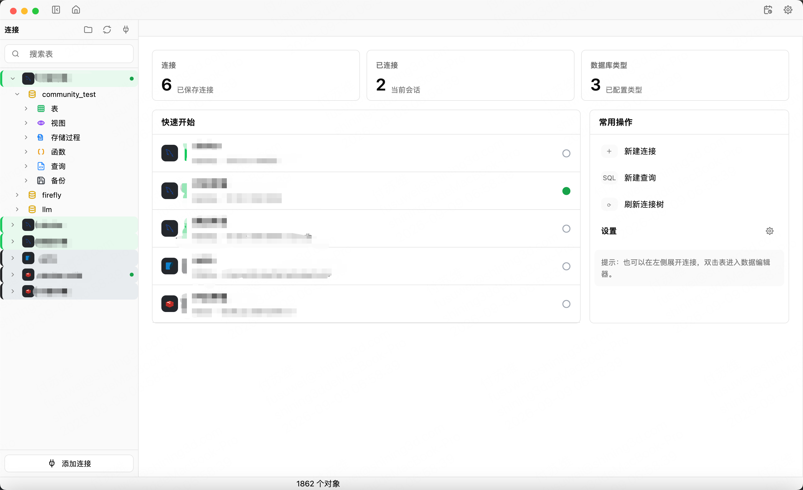
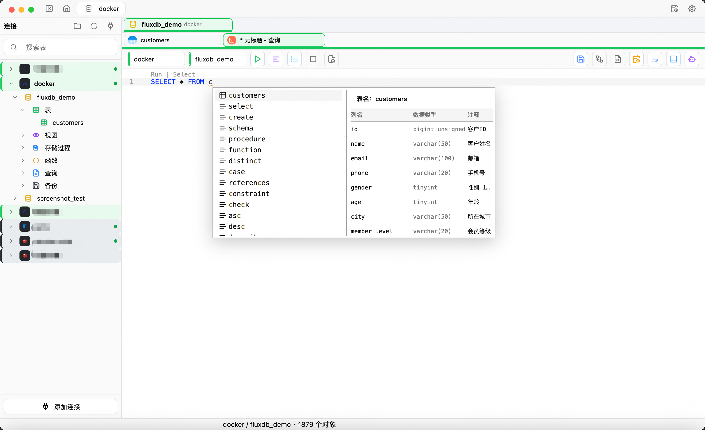
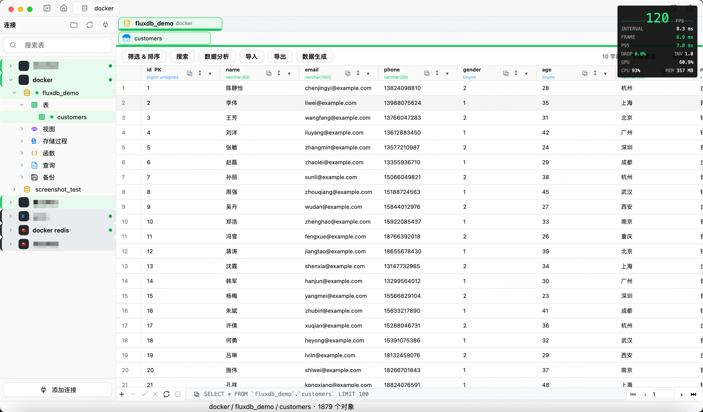
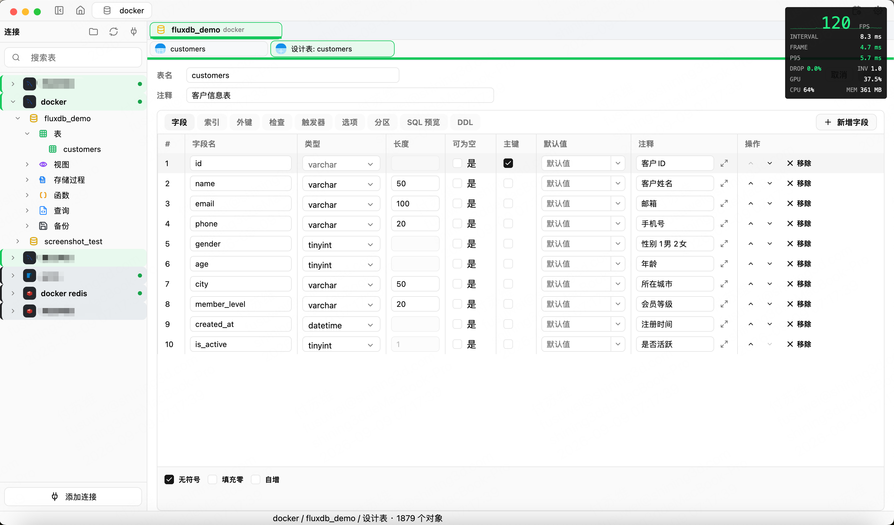
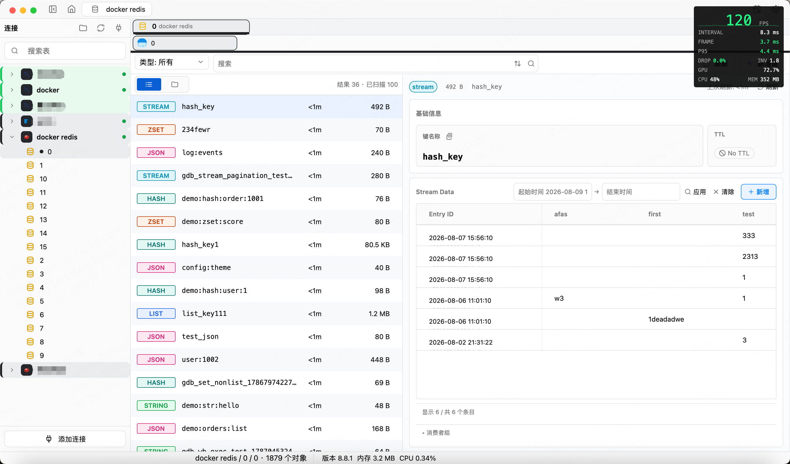

# FluxDB — 跨平台数据库管理客户端（Rust + GPUI）

**[English](./README.en.md) | 简体中文**


## 早期阶段说明

> 本项目处于早期阶段，还在积极开发中，尚未经历大量真实场景测试，可能存在各种 bug。目前仅支持 macOS 平台，Windows / Linux 支持规划中。
>
> 本项目**完全由 AI 生成**，人工角色是**需求定义与验收**：提出目标、审阅差异、运行测试、目验 UI 效果。


## 快速开始

> 当前阶段仅发布 macOS 目标；Windows / Linux 支持规划中。

### 从源码运行

前置：安装 [Rust 工具链](https://rustup.rs)（edition 2024，建议使用较新 nightly 或 stable Rust）。

```bash
git clone https://github.com/你的账号/fluxDB.git
cd fluxDB

# 运行桌面端
cargo run -p fluxdb-desktop
```

### 打包 macOS 应用

使用仓库自带的打包脚本生成自包含 `.app` 与 DMG：

```bash
./scripts/package-macos.sh
```

脚本会构建 release 版本、内嵌 Homebrew 动态库、ad-hoc 签名，并生成 `.dmg`（可用 `PROFILE=debug`、`CREATE_DMG=0` 等环境变量调整）。

> 生成的 bundle 为 ad-hoc 签名、未公证，分发给他人时可能触发 Gatekeeper 拦截，需右键「打开」或用 `xattr -dr com.apple.quarantine` 放行。

## 项目简介

FluxDB 是一个开源的**跨平台数据库管理客户端 / 数据库 GUI 工具**，基于 **Rust + GPUI** 构建的原生桌面应用。内置 **SQL 编辑器**、表结构管理、数据浏览与编辑等一整套能力，通过统一连接器层同时支持 **MySQL、SQLite、Redis**。无论你在找数据库管理工具、SQL 编辑器，还是 Rust 桌面应用参考，FluxDB 都值得一看。

### 核心能力

- **多数据库连接**：通过统一的连接器层（`fluxdb-connectors`）支持 **MySQL、SQLite、Redis** 三类数据源，一套交互面对三种后端。
- **SQL 编辑器内核**（`fluxdb-editor-core`）：独立、与业务解耦的通用编辑器，内置语法高亮、代码折叠、Inlay/Block 渲染、BlockMap/DisplayMap 分层文本模型。
- **智能补全**：关键字/表/列级 SQL 补全，文档面板与语义对齐；
- **表结构管理**：Schema 浏览、列信息面板、DDL 编辑器、创建表（含外键）、表对象悬浮预览卡。
- **数据编辑**：查询结果可编辑回写、mock 数据生成、SQL 格式化、查询历史、工作台历史、用户管理、终端内嵌 Redis。

### 界面预览

| 主界面 |
| :---: |
|  |

| SQL 编辑器 | 数据结果编辑 |
| :---: | :---: |
|  |  |

| 表结构 / Schema | Redis 键值浏览 |
| :---: | :---: |
|  |  |

### 架构分层

```
apps/fluxdb-desktop          桌面入口（GPUI 应用、内容视图、编辑器组件）
├─ crates/fluxdb-app         应用层：查询、补全、表信息、数据编辑、Redis 命令等业务聚合
├─ crates/fluxdb-core        核心层：连接、连接器、数据分页、终端、用户/工作台
├─ crates/fluxdb-connectors  连接器层：common / mock / mysql / sqlite / redis
├─ crates/fluxdb-editor-core 通用编辑器内核（语法、折叠、Inlay/Block、文本模型）
├─ crates/fluxdb-editor-language  编辑器语言适配器协议
└─ crates/fluxdb-storage     存储层
```

设计要点：

- 纯 Rust 前后端一体（无 WebView 渲染依赖）。
- 编辑器内核与业务严格解耦，独立可测。
- 连接器抽象统一，新增数据源只需实现一组 trait。

### 技术栈

| 层 | 技术 |
|----|------|
| 语言 | Rust |
| UI 框架 | GPUI |
| 连接器 | MySQL / SQLite / Redis（ioredis 适配） |
| 测试 | fluxdb-app / fluxdb-desktop 双测试套件 |

## 当前阶段完成度

### 已完成

- **MySQL**：连接管理、SQL 编辑器与补全、表结构浏览与管理（建表/改表/DDL）、数据浏览与编辑回写、SQL 文件执行、数据导出、备份列表。
- **SQLite**：与 MySQL 同套交互的基础能力。
- **Redis**：连接总览、键值浏览与编辑、工作台、终端内嵌命令。


### 承诺

- 会**积极修复反馈的 bug**。
- 会**慢慢扩展更多数据库支持**，连接器层已按可插拔抽象设计，新增数据源只需实现一组 trait。

## 后期规划

- [x] **接入 MySQL**：连接管理、SQL 编辑器与补全、表结构浏览与管理、数据浏览与编辑回写等。
- [x] **接入 Redis**：连接总览、键值浏览与编辑、工作台、终端内嵌命令。
- [ ] **设置项真正生效**：部分设置配置尚未真实接入，逐步让各项偏好设置完整生效。
- [ ] **支持 Windows / Linux 平台**：目前仅支持 macOS，后续补齐 Windows、Linux 的打包与适配。
- [ ] **接入 MongoDB**：基于现有连接器抽象新增 NoSQL 数据源，支持集合浏览、文档查看与编辑。
- [ ] **多语言支持**：为界面与应用内容接入国际化（i18n），支持中英文等多语言切换。
- [ ] **AI 接入**：引入大模型能力，探索自然语言转 SQL、智能补全增强与查询结果智能解释等场景。

## 致谢

本项目站在以下开源工作的肩上，**致以最诚挚的感谢**：

- **[zed](https://github.com/zed-industries/zed)** —— GPUI 生态的源头。其组件树、编辑器与性能调优实践是我们的活教材，本项目编辑器内核与 UI 分层方案直接借鉴其工程化思路。
- **[gpui-kit](https://github.com/longbridge/gpui-kit)** —— 补充 gpui 欠缺的基础组件（输入框、弹窗、控件库），显著加速 UI 开发并提升交互完备度。
- **[dbx](https://github.com/t8y2/dbx)** —— 多数据库抽象与连接管理提供重要参考模型。
- **[RedisInsight](https://github.com/RedisInsight/RedisInsight)** —— Redis 可视化客户端的事实标准，本项目的 Redis 详情、键值浏览与 ioredis 复用均受其架构启发。

没有这些优秀项目，FluxDB 不会以这么高的起点诞生。

## License

FluxDB 采用 [GPL-3.0](./LICENSE) 开源协议。

## 支持与赞助 🍵

> 喜欢 FluxDB？来杯咖啡、奶茶，或者捐点 AI token 给作者续命——每一条代码注释、每一次提交，背后都是它。

如果 FluxDB 对你有帮助，欢迎支持作者。你的每一份赞助都是持续维护与迭代的动力：

- ☕ **支持开发一小时的咖啡**
- 🧋 **深夜调 bug 的奶茶**
- 🤖 **驱动下一次"再让它写一个功能"的 AI token**

哪怕是一杯奶茶，也能让作者含泪多修一个 bug。扫一扫，感谢有你：

**支付宝** | **微信**
:---: | :---:
 | 

> 图片待补充：将二维码分别放到 `docs/sponsor/alipay.png` 与 `docs/sponsor/wechat.png`。

