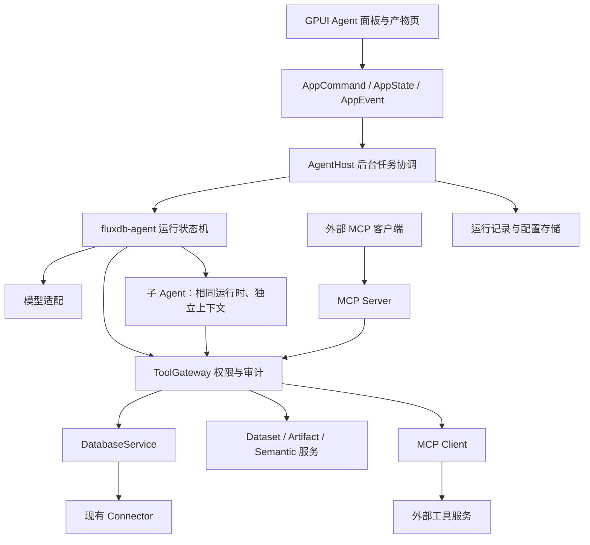
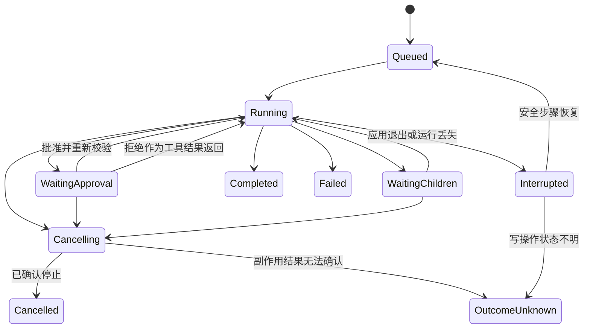

# FluxDB Agent 与 MCP 详细设计

> 状态：待实施设计；本文不表示相关能力已经实现。  
> 编写日期：2026-09-19。  
> 修订记录：  
> - 2026-09-19 写操作改为“预演 + 提交前一致性校验”，涉及 §7.3、§8.2、§8.3、§8.4、§8.5、§8.6、§15 P2、§16.1、§17。  
> - 2026-09-19 引入可选运行引擎（AgentEngine）与能力声明，涉及 §1.1、§1.3、§2.4、§4.2、§5.2、§6.3、§10.4、§14、§15、§16.1、§17。  
> - 2026-09-19 新增运行检查器（Run Inspector）并列为 P1 交付，涉及 §10.3、§12、§13.1.1、§14、§15 P1、§16.1。  
> - 2026-09-19 新增上下文缓存与 token 成本控制（§10.6）、循环开源参考与对照基线（§10.2、§16.2）、图表规格与组件实测结论（§11.4），涉及 §2.4、§10.2、§10.6、§11.4、§16.1、§16.2、§17。  
> - 2026-09-19 工具输出改为 for_model / for_ui 双投影并引入 ToolKind（§7.1.1）；结果数据按引用传递、新增 `dataset.profile` / `dataset.aggregate`、`dataset.read` 增加 Run 级累计预算（§7.2、§7.2.1）；涉及 §7.1、§7.2、§7.3、§10.4.3、§10.6.2、§16.1。  
> - 2026-09-19 同步 ER 专项修订：关系新增 `required_filters`、role 对内唯一、usage 判定去主体化、路径搜索 hub 抑制；涉及 §7.2、§11.3、§16.1。  
> 适用平台：Windows、Linux、macOS。  
> 设计原则：复用现有应用服务和 Connector，拥有自己的 Agent 产品与运行状态，通过稳定工具契约扩展能力。

ER 专项设计见 [ER 关系模型与图形工作区设计](er-design.md)：包含原生组件选型、全库/当前表关系视图、大库加载，以及供 Agent 使用的精确关系结构。该专项数据结构仍待用户确认，不能视为已经批准实施。

## 1. 产品目标

### 1.1 用户明确提出的目标

FluxDB 要实现自己的通用 Agent，以数据库工作台为起点，逐步覆盖数据分析、BI、ER 图、图表和数据库之外的任务。

必须满足以下要求：

1. **自定义子 Agent**：用户可以创建、编辑、复制、启停子 Agent，配置名称、职责、提示词、模型、可用工具、上下文范围和预算。ER 图助手、BI 分析师、SQL 助手是内置模板，也可由用户自行创建。
2. **感知工作台上下文**：理解当前激活连接、数据库、schema、表、查询标签页和选中 SQL；用户说“分析这张表”“帮我查一下当前连接”时，能够明确解析目标。
3. **生成及执行 SQL**：支持解释、生成、修改、插入编辑器、受控执行、展示结果、定位错误和有限次数的修复重试。
4. **扩展为 BI 与图形工作台**：分析结果能够形成数据集、ER 图、图表、仪表盘和报告，支持保存、继续编辑、重新执行和追溯来源。
5. **超出数据库领域**：通过 MCP 或内置工具接入文件、搜索、办公系统、图片生成等能力。Agent 内核不能绑定 SQL、某种数据库或某个 UI 页面。
6. **MCP 权限可控**：只读、可写、危险操作、连接与对象范围、外部工具和数据外发均可控制；内置 Agent、子 Agent、外部 MCP 客户端都不能绕过控制。
7. **运行引擎可选**：用户可以选择由 FluxDB 自己的运行内核驱动对话（填写模型凭据），也可以复用已安装的外部 Agent 运行时（命令行 Agent 或 ACP 类协议），从而复用已有订阅而不单独配置 API Key。无论选择哪种引擎，工具调用、权限与审批都必须经过同一网关；引擎之间的能力差异必须显式声明并在 UI 可见。
8. **执行过程可见**：用户在页面实时看到当前 Agent 的步骤、工具调用、子 Agent 委托与进度、审批、结果和消耗；支持展开详情与历史回看。展示真实运行事件和简短进度说明，不以模型私有思维链作为产品依赖。

产品定位：**具有数据库专业能力、支持自定义子 Agent 的通用桌面 Agent 工作台。**

需要区分两个独立维度，不要混为一谈：

- **对话入口**：在 FluxDB 内发起（Agent 面板），或由外部客户端经 MCP Server 接入（§9.1）。
- **运行引擎**：FluxDB 内部对话底层由哪种运行时驱动（§10.4）。

两个维度互相正交，可同时启用。

### 1.2 扩展目标与优先级

| 能力 | 用户价值 | 阶段 |
| --- | --- | --- |
| 当前表/选中 SQL 的解释与生成 | 降低数据库日常操作成本 | P1 |
| 可控只读查询与结果追溯 | 从聊天转为可验证的任务执行 | P1 |
| 用户可配置子 Agent | 按 ER、BI、诊断等职责复用任务配置 | P1 基础，P3 完整 |
| MCP Server 与 MCP Client | 对外提供 FluxDB 能力，同时使用外部工具 | P2 |
| 可审批写入及危险操作 | 在明确授权后完成实际工作 | P2 |
| ER 图与关系分析 | 展示真实外键，并标注推测关系 | P3 |
| BI 指标、图表和报告 | 将正确业务口径转化为可保存产物 | P3 |
| SQL 执行计划与健康诊断 | 定位慢查询、锁等待、统计信息等问题 | P4 |
| 数据质量检查 | 检查空值、重复值、引用完整性与分布变化 | P4 |
| 可保存分析流程 | 将成功分析保存为带参数的可重跑流程 | P4 |
| 跨来源分析 | 在授权范围内组合数据库、CSV 和外部 API | P4 |
| 历史对比与指标异常提示 | 比较快照、解释变化，支持显式配置定期任务 | P4 |
| 文件、检索、办公与图片工具 | 扩展数据库之外的工作 | P4 |

“异常解释”必须区分数据事实与推测，不能把相关性描述为因果关系。“生成图片”和“绘制统计图”使用不同工具和产物类型。

### 1.3 首版不包含的内容

- 不开放任意宿主 shell、任意 Python/JavaScript 执行和自动下载安装 MCP 服务。
- 不让模型自行创建高权限 Agent、修改权限、导出凭据或批准自己的操作。
- 不做无限递归的多 Agent 团队，也不先建设复杂可视化工作流平台。
- 不将完整 Goose、DB-GPT、WrenAI 产品及其运行服务整体嵌入桌面应用。
- 不承诺所有数据库具有相同的只读保护、事务回滚、取消或诊断能力；能力不足时明确反馈。
- 不把所有表结构、全部数据行或完整会话自动传给模型。
- 首版只交付 native 引擎；外部引擎（CLI 子进程、ACP）只预留 trait 边界与能力声明，不在首版开放，也不宣称对外部引擎自带工具、上下文外发和用量计量具有与 native 同等的控制力（§10.4）。

## 2. 参考项目与源码证据

### 2.1 调研范围与证据等级

本轮核对了以下项目的 GitHub 源码树，并下载了关键文件读取接口、配置或实现片段。链接固定到本次观察到的提交，避免主分支变化导致文档失真。**未构建、未运行这些外部项目，未完成安全审计，源码存在不等于适合直接接入。**

证据分级：

- **A：读取关键源码**，可作为具体设计依据；仍需集成验证。
- **B：核对源码路径**，作为后续阅读入口，不表示实现已经审查。
- **C：概念或产品参考**，不能用作具体 API、维护状态、默认安全行为的依据。

### 2.2 优先参考项目

| 项目 | 参考目的 | 本项目决策 |
| --- | --- | --- |
| [Goose](https://github.com/aaif-goose/goose) | Rust Agent、扩展、子 Agent、会话与审批 | 借鉴职责划分，不复制完整产品；子 Agent 审批必须自行闭环 |
| [DBHub](https://github.com/bytebase/dbhub) | 少量工具、对象发现、SQL 执行策略 | 工具按需开放；结果和权限契约由 FluxDB 定义 |
| [Postgres MCP](https://github.com/crystaldba/postgres-mcp) | SQL 分析、健康检查、受限执行 | 后续诊断工具参考；不把其 restricted 模式等同于 FluxDB 严格只读 |
| [Rust MCP SDK](https://github.com/modelcontextprotocol/rust-sdk) | MCP Client/Server、工具路由及传输 | 优先采用 rmcp；先锁定发布版本并做 P0 验证 |
| [MCP Toolbox](https://github.com/googleapis/mcp-toolbox) | 数据源、工具和工具组配置 | 借鉴配置组织；不引入独立 Go 服务作为桌面必需依赖 |
| [WrenAI](https://github.com/Canner/WrenAI) | 指标、模型、关系、业务语义 | 借鉴语义模型，逐步实现项目级轻量语义层 |
| [LangGraph](https://github.com/langchain-ai/langgraph) | 暂停恢复、状态、重试与执行事件 | 借鉴执行语义，不引入 Python 主运行时 |
| [Rig](https://github.com/0xPlaygrounds/rig) | 模型适配与可控 Agent 运行 | 候选依赖；保留 FluxDB 状态机、工具网关和权限边界 |

### 2.3 已读取的源码与具体借鉴点

| 编号/等级 | 固定源码位置 | 已观察内容 | FluxDB 对应位置 |
| --- | --- | --- | --- |
| R1 / A | [Goose agents/agent.rs](https://github.com/aaif-goose/goose/blob/d57c9a4d73289e86245d9df19201376fc0db03fe/crates/goose/src/agents/agent.rs) | `AgentConfig`、`is_subagent`、`dispatch_tool_call`、`list_tools`、`submit_tool_confirmation` 等入口 | `fluxdb-agent` runtime、tool 契约 |
| R2 / A | [Goose platform_extensions/summon.rs](https://github.com/aaif-goose/goose/blob/d57c9a4d73289e86245d9df19201376fc0db03fe/crates/goose/src/agents/platform_extensions/summon.rs) | 独立子会话、delegate、后台任务、子任务通知；约 1393 行注释指出审批消息未转发时使用 Auto 避免挂起 | 子 Agent 会话隔离；**不复制 Auto 处理，必须转发审批** |
| R3 / A | [DBHub builtin-tools.ts](https://github.com/bytebase/dbhub/blob/80b87cb74f16c20a711d8b1d12a0cbb08432f8cd/src/tools/builtin-tools.ts) | 默认 `execute_sql`、`search_objects` 两个工具；`explain_sql`、`health_check` 按需启用 | 工具目录和分组，不一次注入全部工具 |
| R4 / A | [DBHub execute-sql.ts](https://github.com/bytebase/dbhub/blob/80b87cb74f16c20a711d8b1d12a0cbb08432f8cd/src/tools/execute-sql.ts) | 按工具配置生成策略，调用 `sqlVerdict`，将 readonly/maxRows 下传，逐语句返回结果 | 应用权限网关与执行约束；其分类器正确性未审计 |
| R5 / A | [Postgres MCP server.py](https://github.com/crystaldba/postgres-mcp/blob/15c8e33353546148acc2d8bd784551cf3905d1e2/src/postgres_mcp/server.py) | `explain_query` 的 analyze 分支，`analyze_db_health`、索引分析工具，restricted/unrestricted 驱动选择 | 数据库诊断工具包及显式风险分类 |
| R6 / A | [Postgres MCP safe_sql.py](https://github.com/crystaldba/postgres-mcp/blob/15c8e33353546148acc2d8bd784551cf3905d1e2/src/postgres_mcp/sql/safe_sql.py) | AST 深层检查；允许语句类型中还包含 `CreateExtensionStmt`、`VacuumStmt` 等，后面有进一步检查 | 借鉴 AST 检查；不能直接把其允许集合用作严格只读定义 |
| R7 / A | [rmcp router/tool.rs](https://github.com/modelcontextprotocol/rust-sdk/blob/dbd238275534c3a8da4d91b7220655e878216988/crates/rmcp/src/handler/server/router/tool.rs) | `ToolRouter`、`ToolRoute`、`call`、启停路由与变更通知接口 | MCP Server 动态工具适配 |
| R8 / A | [rmcp child_process.rs](https://github.com/modelcontextprotocol/rust-sdk/blob/dbd238275534c3a8da4d91b7220655e878216988/crates/rmcp/src/transport/child_process.rs) | `TokioChildProcess`、builder、stderr、graceful shutdown | MCP Client 的 stdio 服务生命周期 |
| R9 / A | [Wren manifest.rs](https://github.com/Canner/WrenAI/blob/871118e94f1525c401d867074c05e7e8eefca1cc/core/wren-core-base/src/mdl/manifest.rs) | model、relationship、measure、cube 等宏生成模型，以及主键/来源访问接口 | BI 语义定义、ER 元数据；字段细节继续读宏实现 |
| R10 / A | [LangGraph types.py](https://github.com/langchain-ai/langgraph/blob/aa742fb31e2827d569b843e3600aeda2e0528e4b/libs/langgraph/langgraph/types.py) | checkpoint/task/interrupt 相关类型、RetryPolicy 等 | FluxDB 运行事件、暂停恢复和重试分类 |
| R11 / A（入口） | [Rig agent/run.rs](https://github.com/0xPlaygrounds/rig/blob/2d16c1b25f6749b3a2cd841beddf767106495069/crates/rig-agent/src/agent/run.rs) | 此文件当前是 `crate::run` 重导出，不是运行机制实现 | 不能根据旧路径认定 API；继续阅读 R15 |
| R12 / A | [Toolbox internal/server/config.go](https://github.com/googleapis/genai-toolbox/blob/576b9f74f93a7564dcaaf6d6c06d799b8de3fb1d/internal/server/config.go) | Source/Tool/Group/Auth 配置、Origin/Host、stdio 和请求大小等设置 | 外部服务配置、工具组及传输边界 |

进一步阅读入口（B，仅核对路径）：

- R13：[Goose subagent_handler.rs](https://github.com/aaif-goose/goose/blob/d57c9a4d73289e86245d9df19201376fc0db03fe/crates/goose/src/agents/subagent_handler.rs)、[subagent_task_config.rs](https://github.com/aaif-goose/goose/blob/d57c9a4d73289e86245d9df19201376fc0db03fe/crates/goose/src/agents/subagent_task_config.rs)。
- R14：[rmcp Counter 示例](https://github.com/modelcontextprotocol/rust-sdk/blob/dbd238275534c3a8da4d91b7220655e878216988/examples/servers/src/common/counter.rs)。
- R15：[Rig run/mod.rs](https://github.com/0xPlaygrounds/rig/blob/2d16c1b25f6749b3a2cd841beddf767106495069/crates/rig-agent/src/run/mod.rs)、[agent/hook.rs](https://github.com/0xPlaygrounds/rig/blob/2d16c1b25f6749b3a2cd841beddf767106495069/crates/rig-agent/src/agent/hook.rs)。
- R16：[Wren manifest-macro/src/lib.rs](https://github.com/Canner/WrenAI/blob/871118e94f1525c401d867074c05e7e8eefca1cc/core/wren-core-base/manifest-macro/src/lib.rs)。
- R17：[LangGraph pregel/_retry.py](https://github.com/langchain-ai/langgraph/blob/aa742fb31e2827d569b843e3600aeda2e0528e4b/libs/langgraph/langgraph/pregel/_retry.py)、[pregel/_checkpoint.py](https://github.com/langchain-ai/langgraph/blob/aa742fb31e2827d569b843e3600aeda2e0528e4b/libs/langgraph/langgraph/pregel/_checkpoint.py)。

### 2.4 其他候选的定位

| 项目 | 定位和限制 |
| --- | --- |
| [HenkDz/postgresql-mcp-server](https://github.com/henkdz/postgresql-mcp-server) | C；可补充研究只读实现，本轮未核实版本及默认模式，不采信搜索摘要中的默认行为 |
| [Vanna](https://github.com/vanna-ai/vanna) | C；自然语言/已确认 SQL 示例复用；本轮未核实归档状态，不写入归档日期 |
| [Chat2DB](https://github.com/Chat2DB/Chat2DB) | C；数据库工作台与 AI 的交互参考 |
| [DB-GPT](https://github.com/eosphoros-ai/DB-GPT) | C；数据应用和工作流产品参考，不作为首版必需依赖 |
| [CrewAI](https://github.com/crewAIInc/crewAI) | C；角色和任务配置参考；不根据二手评测认定其路由或权限行为 |
| ACP（Agent Client Protocol） | C；外部引擎候选协议。仅据二手资料了解到 Goose 以此复用已有 Claude/ChatGPT/Gemini 订阅，**本轮未读取协议规范与实现**，不据此认定其能力、版本与安全模型；开放外部引擎前必须补 A 级核对 |
| [dbx](https://github.com/t8y2/dbx) | C；Rust + Tauri 数据库客户端，已实现 MCP Server 与本地 bridge、SQL 安全判定、模型流式与取消。本地可读，建议补 A 级源码核对后并入 §2.3 |
| [codex-rs](https://github.com/openai/codex) | C；Rust 编写的 Agent harness，循环为状态机，审批流水线、上下文压缩、会话持久化与沙箱均为循环一等关注点。见 §10.2 参考表；本轮未读源码，其沙箱能力不可作为 FluxDB 的承诺依据 |
| DBeaver `org.jkiss.dbeaver.model.ai` | C；成熟的数据库客户端内 AI 函数调用模型（函数类型、审批规则、对话截断、Schema 压缩）。本地可读，建议补 A 级源码核对后并入 §2.3 |

复制源码或引入依赖前，必须核对所选提交/版本的许可证、NOTICE 和传递依赖；以上调研不代表已完成许可证审查。

## 3. 现有项目基础与改造边界

### 3.1 已有代码位置

| 现有位置 | 可复用内容 | 必要调整 |
| --- | --- | --- |
| [core/parts/connector.rs](../crates/fluxdb-core/src/parts/connector.rs) | Connector、元数据读取、进度与取消相关接口 | 在数据库能力层增加受控执行契约；默认实现不能静默忽略约束 |
| [core/parts/object_query.rs](../crates/fluxdb-core/src/parts/object_query.rs) | QueryRequest、QueryExecutionOptions | 复用基础请求，独立定义安全约束，避免把展示分页当作安全限额 |
| [core/parts/sql_context.rs](../crates/fluxdb-core/src/parts/sql_context.rs) | QuerySessionId | 统一分配会话 ID，避免标签页 ID 和 Agent ID 碰撞 |
| [app/parts/state.rs](../crates/fluxdb-app/src/parts/state.rs) | AppState.active_tab、TabKind、QueryEditorState、AppCommand/AppEvent | 文件已超过 2,500 行；先按职责拆分，再接入 Agent 状态 |
| [app/controller/query_completion.rs](../crates/fluxdb-app/src/parts/controller/query_completion.rs) | `execute_query_text_with_progress`、`execute_query_text_for_scope_with_progress` | 抽出不依赖标签页的数据库应用服务，保留现有调用行为 |
| [app/parts/query_history.rs](../crates/fluxdb-app/src/parts/query_history.rs) | 查询历史及部分写入回滚快照 | 复用适用部分，不把快照当作通用回滚保证 |
| [app/parts/completion_index.rs](../crates/fluxdb-app/src/parts/completion_index.rs) | 元数据索引 | 复用检索；增加权限过滤、版本和过期标识 |
| [desktop/navicat_main/loading.rs](../apps/fluxdb-desktop/src/main_parts/navicat_main/loading.rs) | 编辑器文本、选区和查询交互 | 提取 UI 上下文 DTO，不将 GPUI Entity 传入 Agent |
| [storage/lib.rs](../crates/fluxdb-storage/src/lib.rs) | FileStorage、跨平台目录、配置持久化 | 新增独立 Agent 存储文件，先拆出涉及的过大职责文件 |
| [storage/credential.rs](../crates/fluxdb-storage/src/credential.rs) | 三平台凭据后端 | 通过存储层新增模型/MCP 凭据接口，禁止明文配置 |
| [connectors/postgres/executor.rs](../crates/fluxdb-connectors/src/parts/postgres/executor.rs) | PostgreSQL 执行路径 | 接入执行约束、数据库取消及结果限制 |
| [connectors/shared_read_exec.rs](../crates/fluxdb-connectors/src/parts/shared_read_exec.rs) | 共享读取执行实现 | 按实际调用链增加限制，不另建一套驱动 |

现有按 scope 执行入口仍位于 AppController，且会调用 SQL 展示限行及回滚快照逻辑。新服务必须明确区分“执行 SQL 原文”“结果获取上限”和“UI 展示分页”；不能直接包装该方法就宣称满足 Agent 安全要求。

### 3.2 不破坏现有交互

- 手动执行 SQL 的现有路径保持行为兼容；先提取服务，再让 Agent/MCP 使用受控入口。
- Agent 默认使用独立数据库会话，不借用编辑器事务、临时表或 SET 状态。
- 插入/替换编辑器 SQL 通过 AppCommand；使用标签页和文本版本检查，避免覆盖用户刚修改的内容。
- Agent 与 MCP 不能绕过应用层直接读取连接配置、凭据或调用数据库驱动。

## 4. 总体架构

### 4.1 运行调用关系



工具网关是代码强制边界。每个调用都先解析、分类和授权，再执行；模型提供的工具名、连接 ID、权限字段都不构成授权。

### 4.2 crate 依赖方向

```text
fluxdb-desktop → fluxdb-app
fluxdb-app → fluxdb-agent + fluxdb-mcp + fluxdb-core + fluxdb-storage + fluxdb-connectors
fluxdb-mcp → fluxdb-agent（工具执行契约）+ rmcp
fluxdb-agent → 标准库 / serde / async 基础 / 模型适配依赖
fluxdb-storage → fluxdb-core + fluxdb-agent（持久化记录与存储契约）
fluxdb-connectors → fluxdb-core
```

- `fluxdb-agent` 不依赖 `fluxdb-app`、GPUI 或数据库驱动。
- `AgentEngine`（§10.4）属于 Agent 层契约；native 实现随 `fluxdb-agent` 提供，外部引擎实现按需单独放在 `providers/` 下，不反向依赖 App。模型库（如 Rig）只在 native 实现内部使用，不出现在 `AgentEngine` 的签名里。
- 通用 ToolExecutor/RunStore 接口归 Agent 层；App/Storage 实现。数据库专属模型仍归 Core/App。
- `fluxdb-mcp` 通过注入 `Arc<dyn ToolExecutor>` 对外调用应用能力，不反向依赖 App。
- 原生数据库工具直接调用 Rust 服务，无需经过本机 MCP 网络往返。
- 使用 `Arc<dyn Tool>` 承载运行期异构工具；确定实现的内部服务保留具体类型。
- 不把数据库、MCP、Agent 的所有类型继续堆进 `fluxdb-core`。

### 4.3 部署选择

首版运行内嵌后台 AgentHost，桌面退出时取消任务并持久化状态。不要承诺退出应用后仍持续运行。

MCP Server 首版选择用户显式启用的本地 Streamable HTTP 服务，与桌面应用共用 AgentHost/ToolGateway；绑定 loopback，按客户端分配凭据和权限。远程监听、TLS/OAuth 部署另列阶段，不默认为局域网开放。

MCP Client 支持配置过的 stdio 服务，随后支持 Streamable HTTP。stdio Server 命令行入口可以后续新增 `apps/fluxdb-mcp/`；届时必须定义独立进程的存储锁、凭据访问和审批通道，不能让两个进程各自维护不一致的权限和连接状态。

## 5. 自定义 Agent 与子 Agent

### 5.1 三个概念

- **AgentDefinition**：可编辑、可版本化的配置模板，描述职责、模型及工具范围。
- **AgentSession**：某个 Agent 的对话与上下文记录，可以有多次 Run。
- **AgentRun**：一次可取消、可追踪的执行，子任务也有独立 Run，并记录 parent/root ID。

子 Agent 使用同一运行内核；ER/BI 能力来自工具、指令和输出约束，不各自再写一个 Agent 循环。

### 5.2 配置样例

以下为拟定的 FluxDB TOML 格式，不是第三方框架配置：

```toml
schema_version = 1
id = "er-designer"
revision = 1
name = "ER 图助手"
description = "根据授权表结构和真实外键生成可编辑 ER 图"
enabled = true
instructions = "优先使用真实外键。推测关系必须标注依据和待确认状态。默认不读取业务行数据。"
model_profile = "inherit"
engine_profile = "inherit"   # inherit | native | 已配置的外部引擎 ID，见 §10.4
tools = ["er.search_entities", "er.get_neighborhood", "er.find_join_paths", "er.describe_entities", "er.propose_relationship", "artifact.create_er"]
output_kinds = ["er_diagram", "report"]

[context]
inherit = "selected"
include_schema = true
include_row_samples = false

[permissions]
profile = "metadata_only"

[delegation]
allowed_agents = []
max_children = 0

[budget]
max_steps = 12
max_duration_secs = 180
max_output_tokens = 6000
```

上述预算是初始可调产品默认值，需要结合真实模型评测调整，不是散落执行器中的硬编码。模型 token 限额与宿主实际计量分别实施；并发任务启动前预留共享预算，模型不提供 usage 时保守计量并展示估算。

用户通过设置界面编辑，导入外部配置时先显示工具范围和权限差异。模板请求的权限不自动变成授予权限；配置内不能保存 Key、shell 启动脚本或可执行钩子。

### 5.3 内置模板

| 模板 | 工具范围 | 默认输出 | 默认权限 |
| --- | --- | --- | --- |
| SQL 助手 | 元数据、查询、SQL 草稿 | SQL、Dataset、解释 | 查询只读 |
| ER 图助手 | 元数据、外键、ER 产物 | ErDiagram | 仅元数据 |
| BI 分析师 | 语义指标、查询、图表、报告 | Dataset、Chart、Report | 查询只读 |
| 数据库诊断师 | 执行计划、健康检查 | 诊断报告 | 诊断授权子集 |
| 数据质量助手 | 元数据、聚合检查 | 检查报告 | 查询只读 |

“仅元数据”也可能包含敏感表名、注释；发送到模型仍受外发策略约束。

### 5.4 调度和权限继承

用户可以通过 `@子Agent` 显式选择；未指定时由主 Agent 在已启用模板范围内选择，宿主校验 allowed_agents。入口 `agent.delegate` 接收目标模板 ID、具体任务、选定上下文引用和期望输出类型。

有效权限为各层限制的交集：

```text
全局策略 ∩ 工作区策略 ∩ 连接/对象策略 ∩ 入口主体策略
∩ 父任务授权 ∩ 子 Agent 请求范围 ∩ 本次任务授权
```

任一显式拒绝都生效；审批只能满足策略中的 Ask，不能覆盖 Deny。子 Agent 的委托链不能提升权限。最终执行前重新读取当前策略，运行中撤销权限阻止后续调用；已发送到数据库的操作只能尽力取消，不承诺撤销。

默认委托深度 1、最多并发 2 个子任务，主任务与子任务共享总预算。只读独立工作可并行；写操作按连接/执行会话排队；涉及同一产物的修改使用版本校验。

父任务取消向全部后代传播；子任务审批事件携带 root_run_id、parent_run_id、child_run_id，统一显示在主窗口。父任务等待子结果不能阻塞事件接收。等待审批释放执行并发槽，恢复时重新获取。

子任务返回结构化摘要、产物引用、证据和失败项，不默认把完整对话复制给父任务。所有产物引用重新验证访问权限。

## 6. 当前工作台上下文

### 6.1 采集与解析

UI 只采集当前界面状态；App 完成连接解析、权限校验及元数据读取。

```rust
// 设计草图：以下自有类型在实施时定义，非可直接复制编译的完整代码。
pub struct WorkspaceContextInput {
    pub tab_id: Option<TabId>,
    pub selected_object: Option<ObjectPath>,
    pub selected_sql: Option<String>,
    pub editor_revision: Option<u64>,
}

pub struct DatabaseContextSnapshot {
    pub connection_id: ConnectionId,
    pub connection_revision: u64,
    pub database: Option<String>,
    pub schema: Option<String>,
    pub objects: Vec<ObjectPath>,
    pub metadata_revision: Option<String>,
}
```

数据库上下文属于 App/Core 领域；通用 Agent 只接收带类型标签的 ContextItem、资源 ID、经过裁剪的内容，不直接依赖 TabId。

目标解析顺序：用户显式指定 > 本次附加对象 > 活动标签页所属连接/对象 > 明确选中的导航连接。存在矛盾时展示冲突并要求选择，不静默切到另一个连接。没有连接时仍允许纯文本或外部工具任务；执行数据库工具前必须补齐目标。

### 6.2 固定快照，避免误操作

- 点击发送时固定本次 Run 的上下文，显示“连接 / 数据库 / schema / 表”上下文标签。
- 用户切换标签页只影响下一条消息，不修改已经运行的任务目标。
- 主动切换运行中目标创建新的上下文修订；尚未执行的写操作必须重新准备、重新审批。
- 连接被删除、修改地址、账号或重新导入时，旧修订失效；不能仅凭同一个 ConnectionId 继续执行。
- 元数据缓存按连接修订、权限范围、数据库/schema 分区；权限变更即失效。
- 编辑器写回校验 tab_id 和 editor_revision，不匹配时提供新建查询或差异预览。
- 外部 MCP 客户端默认不能读取用户当前活动标签；必须显式授权 `workspace.read_context`，数据库调用默认显式指定 scope。

### 6.3 上下文预算与外发

先注入工具摘要、当前对象标识与业务定义；按需获取结构、关联表和少量样本。上下文标记来源、时间、权限范围及是否经过脱敏。

支持 `metadata_only`、`masked_samples`、`full_authorized` 外发配置。SQL 文本和注释也可能含敏感值，不能只脱敏结果行。重试、更换模型、更换引擎、子 Agent 继承上下文时均重新执行外发策略；受限制的上下文禁止自动切换到不允许的模型提供方。

外发策略的可执行性取决于运行引擎：只有 `egress_policy_enforced = true` 的引擎（首版仅 native）能够保证上下文只发往策略允许的提供方。外部引擎由其自身配置决定实际提供方，宿主无法保证，因此 `metadata_only` 及任何限定提供方的配置下禁止选择此类引擎，UI 说明原因而不是静默降级（§10.4.3）。

工具返回值、表注释、文件内容和远程工具描述作为不可信数据，不能覆盖系统指令或批准工具调用。长期记忆仅保存用户确认的业务定义和偏好；不能自动把模型猜测写成事实。

## 7. 工具契约与执行网关

### 7.1 稳定契约

工具采用 JSON Schema 输入/输出，加宿主维护的副作用、作用域、超时和结果预算信息。外部 MCP annotations 只能提供提示，不能作为可信权限依据。

```rust
use std::{future::Future, pin::Pin};

pub type ToolFuture<'a, T> =
    Pin<Box<dyn Future<Output = T> + Send + 'a>>;

pub trait Tool: Send + Sync {
    fn spec(&self) -> &ToolSpec;
    fn execute<'a>(
        &'a self,
        context: ToolExecutionContext,
        input: serde_json::Value,
    ) -> ToolFuture<'a, Result<ToolOutput, ToolError>>;
}

pub trait ToolExecutor: Send + Sync {
    fn call<'a>(
        &'a self,
        request: ToolCallRequest,
    ) -> ToolFuture<'a, Result<ToolCallOutcome, ToolError>>;
}
```

使用 boxed future 保证接口可作为 `dyn` 注入，无需假定 async trait 自动支持对象安全。`Tool` 原始实例只归 ToolGateway 所有，运行时和 MCP 持有 `ToolExecutor`，不能直接调用原始工具绕过网关。ToolCallOutcome 可为 Completed 或 PendingApproval；等待审批由 Run 状态机管理，不长期持有数据库事务。

每个工具必须明确：输入版本、必需权限、资源定位方式、结果大小、可取消程度、是否可重试、是否有副作用。参数先完成完整流式拼装，再进行 Schema 验证；绝不执行未收齐的 JSON 片段。

#### 7.1.1 工具输出双投影

工具结果有两个受众，需求不同：模型要继续推理（内容进上下文，计入预算），UI 要展示给用户（可以是几十万行数据或一张图）。**单一输出无法同时满足，且把“只回灌引用”交给各工具自觉是不可靠的**——新增工具直接返回全量结果集时，编译期与代码审查都拦不住。因此把区分写进契约：

```rust
pub enum ToolKind {
    /// 结果内容对模型推理有用，按预算回灌
    Information,
    /// 只产生副作用或渲染产物，回灌引用与确认即可
    Action,
}

pub struct ToolOutput {
    /// 回灌模型的内容：摘要、引用、确认或结构化统计。计入上下文预算
    pub for_model: ModelFacing,
    /// 展示给 UI 的内容：全量数据、产物、渲染指令。不计入上下文预算
    pub for_ui: UiFacing,
}
```

`ToolKind` 属于 `ToolSpec`，由宿主定义，**不接受模型或外部 MCP 声明**。网关据此统一处理：

- `Action` 类（打开标签页、生成图表/ER 图/报告、执行写操作）只回灌引用与结果确认，产物与全量数据经 `for_ui` 进入渲染层与 Artifact 存储。
- `Information` 类按上下文预算回灌，超限时由网关裁剪并在 `for_model` 中标注截断，而非由工具自行决定。
- 工具执行失败时，错误按 §7.3 脱敏后始终回灌模型，不因 `ToolKind` 为 `Action` 而丢弃——模型需要知道失败才能改正。

上下文预算的计量点因此收敛到网关一处（§5.2、§10.6.2），运行检查器（§13.1.1）分别展示两侧内容以便核对。不支持该区分的运行引擎在 `EngineCapabilities.tool_result_projection` 声明为 `false`，其结果整体回灌并按保守上限计量（§10.4.3）。

### 7.2 工具目录

以下为内部 ID；MCP 映射可采用下划线别名以兼容客户端工具名约束，映射表必须双向唯一。

| 工具 | 核心输入 | 核心输出 | 权限 |
| --- | --- | --- | --- |
| `db.list_connections` | 分页/筛选 | 授权连接的脱敏展示信息 | 连接可见性 |
| `db.search_schema` | scope、关键词、对象类型 | 有界对象摘要、游标 | 元数据读取 |
| `db.describe_objects` | scope、对象列表 | 列/类型/键/索引/注释、版本 | 元数据读取 |
| `db.execute_query` | scope、SQL、参数、执行请求 ID | 执行摘要、DatasetRef、截断信息 | 内容分类后决定 |
| `dataset.profile` | dataset_id、列选择 | 列级统计：min/max、null 率、distinct 数、分布直方图桶 | 数据集读取及外发 |
| `dataset.aggregate` | dataset_id、分组键、度量与过滤 | 宿主端确定性计算的有界聚合结果 | 数据集读取及外发 |
| `dataset.read` | dataset_id、游标、列选择 | 类型化分页数据；受 Run 级累计读取预算约束 | 数据集读取及外发 |
| `sql.create_draft` | SQL、来源/目标上下文 | SQL artifact | 本地产物写入 |
| `db.explain_query` | scope、SQL、analyze | 计划与执行统计 | 诊断；analyze 单独授权 |
| `db.health_check` | scope、检查项 | 各检查结果/权限不足原因 | 诊断 |
| `semantic.resolve_metric` | 指标名称、范围 | 指标定义、版本和歧义 | 语义读取 |
| `er.search_entities` | 模型、关键词、筛选与分页 | 授权实体摘要及匹配原因 | ER 元数据读取 |
| `er.get_neighborhood` | 中心实体、深度、列粒度、关系筛选和预算 | 有界子图、完整关联条件（字段配对 + `required_filters`）、usage、版本及覆盖情况 | ER 关系读取 |
| `er.find_join_paths` | 源/目标实体、角色、搜索预算 | 有界候选路径、歧义、放大风险、`skipped_hubs` 及搜索完整度 | ER 关系读取 |
| `er.describe_entities` | 实体、列粒度、指定列/关键词与分页 | 必要字段、类型、注释、主键及唯一约束 | ER 元数据读取 |
| `er.propose_relationship` | 端点、字段配对、业务角色及证据 | 未确认关系建议 ID，不修改数据库 | 本地关系建议写入 |
| `artifact.create_er` | 模型/关系修订引用、视图范围 | ErDiagramRef；不确认关系、不复制新逻辑模型 | 本地产物写入 |
| `artifact.create_chart` | dataset_id、图表规格 | ChartRef | 本地产物写入 |
| `artifact.create_report` | 结论、证据、产物引用 | ReportRef | 本地产物写入 |
| `agent.delegate` | 定义 ID、任务、上下文引用 | 子 Run ID/结果 | 委托权限 |

所有连接列表、元数据列表在发现阶段就过滤权限；知道某个 ID 不等于拥有读取权。分页游标与主体、scope、查询版本绑定，防止换主体复用。

#### 7.2.1 结果数据按引用传递，不按值传递

`db.execute_query` 返回的是 DatasetRef 与结构描述，不是数据本身：列名与类型、行数（或未知标识）、截断原因，以及**有界样本行**。查询返回几十万行时，回灌模型的内容大小与总行数无关。这不是优化项，而是可行性前提——全量回灌既超出上下文，也会让模型在原始行上做算术并得出错误结论。

模型完成任务所需的四类信息都不要求全量数据：选择图表类型与字段映射用结构描述，编写下钻 SQL 用结构描述与少量样本，给出数值结论用 `dataset.aggregate` / `dataset.profile` 的宿主端计算结果。**数值结论由宿主计算、模型转述**，与 §11.4 “模型不凭样本编造数值” 和 §11.2 “截断数据禁止用于全量统计” 是同一条约束的不同侧面。

`dataset.read` 是逃生口，不是常规路径，必须有累计预算，否则模型可以靠反复翻页把整个结果集读回上下文，既回到全量回灌又额外消耗轮次：

| 约束 | 默认值 | 说明 |
| --- | --- | --- |
| 单次返回行数 | 100 | 同时受字节与单元格大小限制 |
| **单个 Run 对同一 dataset 的累计读取** | 500 行 / 20k token | 超限拒绝并回灌原因，不静默截断 |
| 重复游标检测 | 开启 | 同参数重复调用直接拒绝 |
| 计量点 | ToolGateway | 不在工具内部实现，与 §5.2 预算统一 |

**工具描述须明确引导：需要定位具体数据时编写新的过滤/聚合 SQL，而不是翻页遍历。** 工具描述是行为控制手段，不只是文档；描述缺失这条引导时，模型的默认行为是分页读取。该引导同样适用于 `er.get_neighborhood`、`er.find_join_paths` 等有界子图工具——扩大范围靠调整查询条件，不靠反复翻页累积。

ER 与 SQL Agent 的关系读取采用上表四个 `er.*` 读取工具，不直接访问底层 SQLite、Rust 对象或完整 ER 文件，也不默认看图识别关联。`db.search_schema`/`db.describe_objects` 保留给原始数据库元数据场景；两组适配共用元数据能力，不重复建设缓存与权限判定。按任务选择工具集，避免同一轮将语义相近的全套工具同时注入。

内部 ER 工具直接调用 ErModelService；外部 MCP 将请求映射到同一工具网关和服务。`since_revision` 与删除同步由宿主处理，不增加模型同步工具；模型仅在确需更多结果时使用查询分页。完整参数、索引、usage、快照及路径算法以 [ER 专项设计第 5.9、6.4–6.11 节](er-design.md) 为准，仍属于待确认工程契约。

### 7.3 执行顺序

```text
校验调用主体与 run 状态
→ 校验参数 Schema / 版本 / 大小
→ 解析资源与固定目标
→ 分类实际副作用（包括 SQL、外部服务、数据外发）
→ 合并策略并检查预算
→ 写操作且后端支持时执行预演（短事务内执行并立即回滚，§8.6）
→ 生成不可变 PreparedAction（含预演结果或预演不可用原因）
→ Allow / Deny / PendingApproval
→ 执行前重查策略与目标修订、消费审批凭据
→ 写入 Started 记录
→ 受控执行（有预演结果时先做一致性校验）
→ 保存结果或未知结果状态
→ 按 ToolKind 生成双投影输出（§7.1.1）：for_ui 全量，for_model 摘要/引用
→ 网关按上下文预算裁剪 for_model 并标注截断
```

预演只针对写操作，且必须在网关内部完成，不作为独立工具暴露给模型。预演失败、超时或后端不支持时不阻断流程，改为标记 `preview_unavailable` 并附原因进入审批，由用户凭 SQL 全文决定。

网关拒绝、审批、执行开始/结束必须审计；预演的发起、结果与降级原因同样审计。内部错误保留诊断信息但向模型返回脱敏错误，不返回连接串、密码或敏感环境变量。

## 8. 权限、只读、可写与危险操作

### 8.1 权限结构

将三件事分开：**操作权限、审批策略、资源范围**。一个 read/write 布尔值无法表达真实需求。

```rust
pub enum DatabaseAccessMode {
    MetadataOnly,
    ReadOnly,
    ReadWrite,
}

pub enum Decision {
    Deny { reason: String },
    Allow,
    Ask { prepared_action_id: String },
}
```

危险类别单独配置：破坏性 DML、DDL、账号权限、备份恢复、数据库维护、外部文件写入、网络外发、代码执行。ReadWrite 仅允许进入写操作策略判断，不代表所有危险操作自动 Allow。

### 8.2 默认策略矩阵

| 操作 | 仅元数据 | 只读 | 可写（默认审批） |
| --- | --- | --- | --- |
| 授权对象结构 | Allow | Allow | Allow |
| 查询业务数据 | Deny | Allow，受预算/外发限制 | Allow，受预算/外发限制 |
| 有约束的 INSERT/UPDATE/DELETE | Deny | Deny | Ask；后端支持时凭预演真实影响行数审批（§8.6） |
| 无条件批量修改/删除 | Deny | Deny | Deny；显式开启对应危险能力后逐次 Ask，同样优先凭预演结果 |
| DROP/TRUNCATE/其他破坏性 DDL | Deny | Deny | Deny；显式开启后逐次 Ask，**不预演**，凭 SQL 全文审批 |
| 账号、授权、恢复数据库 | Deny | Deny | 独立高风险能力，默认 Deny |
| EXPLAIN，不实际执行 | 按后端元数据权限 | Allow，受成本限制 | Allow |
| EXPLAIN ANALYZE | Deny | 默认 Ask，且底层语句必须符合只读约束 | Ask，按实际 SQL 风险处理 |
| VACUUM/ANALYZE/安装扩展 | Deny | Deny | 独立维护权限，默认 Deny |
| 创建本地图表/ER/报告 | 允许使用已授权元数据 | Allow | Allow |
| 导出文件/发往外部服务 | 独立策略 | 独立策略 | 独立策略 |

用户可对确定范围的普通写入授予“本任务允许”，但破坏性操作默认逐次审批。生产连接可锁定最大只读权限；模型和子 Agent 无权修改锁定。

审批依据分两类，UI 必须明确标注当前属于哪一类，不能让用户误把预估当作实测：

- **实测**：预演成功，展示真实影响行数与变更样本。
- **未实测**：预演不可用或被降级，只展示 SQL 全文、目标范围与风险说明，不展示任何影响行数估算。

### 8.3 SQL 只读不能依赖前缀

- 复用项目已有 SQL parser，按实际数据库方言解析所有语句；未知语法和无法可靠分类的语句在只读模式拒绝执行，可保留生成草稿能力。
- 检查 CTE 内写入、多语句、SELECT INTO、COPY/OUTFILE、CALL/DO、动态 SQL、会话设置及 EXPLAIN 的实际目标。
- 单纯 SELECT 也可能调用有副作用的函数、读取外部资源或获取锁；数据库角色和引擎约束是必要边界。
- 用户 SQL 不能修改安全会话设置或绕过宿主管理的事务。首版 Agent 写操作不允许自行 BEGIN/COMMIT，也不支持跨工具调用保持开放写事务。
- 预演与正式提交各自是宿主在单次工具调用内开启并关闭的短事务，不跨工具调用，**不在等待审批期间持有事务**。等待审批时数据库上不得存在本次操作的开放事务或锁。
- 应用层表名过滤无法可靠约束视图、函数、动态 SQL 和跨库间接访问；有严格对象隔离需求时，必须使用数据库角色、授权视图或引擎级策略。无法保证时拒绝宣称对象级隔离已生效。

### 8.4 各数据库实施方式

| 数据库 | 只读基础 | 实施注意 |
| --- | --- | --- |
| PostgreSQL | 优先只读角色；宿主管理 READ ONLY 事务与 statement/lock timeout | 阻止事务逃逸和危险函数；只读事务不替代角色权限和网络隔离 |
| MySQL | 只读账号权限，验证版本后的只读事务设置 | 临时表、存储过程、非事务表、隐式提交需要明确限制 |
| SQLite | 只读打开标志，结合 query_only 等可用限制 | 限制 ATTACH、扩展加载和自定义函数；不能复用可写句柄后假定安全 |
| Redis | ACL 账号和命令类别/命令白名单 | 单独模型；禁止用 SQL 分类器；EVAL/模块命令默认不可用 |

后端安全能力使用明确的执行约束和能力反馈。现有 Connector 增加例如 `execute_guarded(request, constraints, ...)` 的稳定数据库能力入口；未实现的后端返回 Unsupported，不退回不受控 `execute`。首先实现 PostgreSQL，再逐个完成其他后端测试后开放开关。

结果限制包括行数、字节数、单元格大小、执行时间和并发。停止读取结果不等于数据库停止执行；必须尽可能下发服务端超时/取消。仅为展示追加 LIMIT 不能作为完整保护。

预演能力按后端分别判定，不支持时返回 `preview_unavailable` 并附原因，不得静默跳过或伪造行数：

| 数据库 | 预演支持 | 变更样本 | 事务级超时下发 |
| --- | --- | --- | --- |
| PostgreSQL | 支持（事务内执行后 ROLLBACK） | 支持，`UPDATE/DELETE ... RETURNING` | `statement_timeout`、`lock_timeout`、`idle_in_transaction_session_timeout` |
| MySQL | 仅 InnoDB 等事务引擎支持；MyISAM 等非事务表不支持 | 不支持 RETURNING，只给影响行数 | `innodb_lock_wait_timeout`、`max_execution_time`；**无原生 idle-in-transaction 超时，必须由宿主看门狗按 `information_schema.innodb_trx.trx_started` 终止** |
| SQLite | 支持 | 视版本而定，不保证 | `busy_timeout` |
| Redis | 不支持，无事务回滚语义 | 不适用 | 不适用 |

即便事务窗口很短，预演与提交仍必须下发服务端超时与锁等待上限，避免个别语句把窗口拉长。长事务的实际代价是后端相关的：PostgreSQL 会钉住 `xmin horizon` 阻碍 VACUUM 回收，并可能让排队的 `ALTER TABLE` 连带堵死整张表的后续查询；MySQL 会造成 undo history 增长与 purge 滞后，且 RR 隔离级别下 gap lock 的实际锁范围大于 WHERE 字面范围；SQLite 会阻塞 WAL checkpoint。因此任何实现都不得以“窗口很短”为由省略超时下发。

### 8.5 审批必须绑定具体执行内容

审批面板展示：调用主体/父子任务、连接与环境、数据库/schema、SQL 全文或操作差异、参数、风险原因、影响范围及其来源标注（实测/未实测）、不可回滚提示和超时。

```text
PreparedAction = 主体 + 根任务/工具调用 ID + 工具实现版本
               + 连接配置修订 + scope + 精确 SQL/参数
               + 执行约束 + 策略版本 + 过期时间
               + 预演结果 Preview | PreviewUnavailable{reason}

Preview = rows_affected + sample_ref? + 预演时间戳
        + tolerance（提交前一致性校验的允许偏差，默认 0）
```

PreparedAction 由宿主保存为不可变记录，并通过稳定规范化编码生成摘要；不能只对 SQL 做去空格处理后比较。审批票据是不可猜测、一次性、可过期的 ID，绑定完整动作。参数/目标/策略变化必须重新准备和审批；模型修改了 SQL 不得复用旧票据。预演结果属于 PreparedAction 的组成部分，一并参与摘要计算；重新预演产生新的 PreparedAction 与新票据。

预演结果有独立且更短的有效期（默认不超过审批票据有效期，建议 60 秒量级）。预演过期后票据仍在有效期内的，提交前必须重新预演并重新确认，不得直接提交。

审批拒绝后向 Agent 返回结构化原因。禁止模型通过换工具、换子 Agent、换 MCP 服务重复提交同一被拒动作以规避限制。

### 8.6 写入保护：预演与提交前一致性校验

静态预估影响行数与实际执行存在竞争，不能把预估当作保证；同时，等待人工审批期间持有开放写事务会造成不可控的长事务（§8.4）。首版采用两个独立短事务的方案，既取得真实影响行数，又不在等待期间持有事务。

```text
阶段 1  预演（短事务，不等待人工输入）
        BEGIN
        下发执行约束与服务端超时
        执行目标语句，取得 rows_affected
        后端支持时取变更样本（如 PostgreSQL RETURNING）
        ROLLBACK
        → 写入 PreparedAction.Preview

阶段 2  审批（无事务，可长时间等待）
        展示真实 rows_affected、变更样本、SQL 全文
        用户批准 / 拒绝 / 过期

阶段 3  提交（短事务，批准后）
        BEGIN
        重查策略与目标修订，消费审批票据
        执行同一语句，取得 rows_affected_2
        |rows_affected_2 - Preview.rows_affected| > tolerance
            → ROLLBACK，返回 PreviewMismatch，回到阶段 2 重新确认
        COMMIT
```

阶段 1 与阶段 3 各自是毫秒级短事务，中间不持有任何锁或开放事务。`tolerance` 默认为 0，可按连接配置；放宽 tolerance 必须在审批面板明示。

**预演的适用边界**，不满足时返回 `preview_unavailable` 并降级为凭 SQL 全文审批，不得跳过审批：

- DDL 与隐式提交语句不预演，预演即等于执行。
- 非事务引擎/表（如 MySQL MyISAM）不预演。
- 检测到目标对象存在具有事务外副作用的触发器或函数（如外部调用、写文件、跨库访问）时不预演；无法可靠检测时按不支持处理。
- 预演耗时超过阈值（默认 3 秒）时中止预演并降级，避免同一重语句执行两遍造成负载翻倍。

**预演的已知副作用**，必须在 UI 明示：

- 序列与自增值不随回滚退回（PostgreSQL sequence、MySQL AUTO_INCREMENT），预演会消耗取值并造成跳号。以 INSERT 为主的语句默认不预演。
- 预演会真实触发数据库内部的触发器与约束检查；其事务内效果随回滚撤销，事务外效果不可撤销，这也是上面触发器判定的原因。
- 预演产生的锁在回滚时释放，但预演期间仍可能与其他会话竞争。

**仍然无法承诺的部分**：

- 阶段 3 与阶段 1 之间数据可能变化，一致性校验只能发现行数偏差，不能保证受影响的是同一批行。需要严格保证时使用显式条件或由用户改写 SQL 限定主键范围。
- 已有回滚快照只覆盖已实现情形；没有可靠回滚能力时，在批准前展示限制。
- 阶段 3 中连接中断或客户端取消后，写入可能已经提交，进入 OutcomeUnknown，不自动重试（§10.5）。阶段 1 中断按预演失败处理，不进入 OutcomeUnknown。

按 §8.4 逐后端开放：首先实现 PostgreSQL 预演，其余后端在完成事务、超时与样本能力验证后再开启开关。

## 9. MCP 双向接入

### 9.1 MCP Server：外部 Agent 使用 FluxDB

- rmcp 负责协议解析和传输，Adapter 将请求映射为 ToolCallRequest，统一走 ToolGateway。
- tools/list 只暴露当前主体可见工具；tools/call 始终再次授权。
- resources/read 同样执行权限检查，不能通过资源 URI 绕过工具权限。
- 数据集资源使用不可猜测 ID，绑定所有者/工作区/来源权限；不返回本机任意路径。
- 不将 Prompt、Resource、工具描述视作权限授予。
- 首版不开放通过 MCP 直接委托全部自定义 Agent，避免外部客户端间接扩大工具范围；后续按模板单独授权。

HTTP 首版默认关闭；启用后仅监听 loopback，每个客户端使用独立随机凭据，保存哈希或安全凭据引用，支持撤销。校验 Host/Origin、防止 DNS rebinding 和浏览器跨源调用；不能把 CORS 当认证。请求体大小、并发和超时均有限制。

不依赖客户端自报名称作为身份；不共享一个永久管理员 Token 给全部客户端。跨机器接入必须先实现 TLS、认证授权及 token audience 校验，不仅是修改监听地址。

### 9.2 外部客户端如何完成审批

不能假设每个 MCP 客户端都支持相同的交互审批扩展。首版采用 FluxDB 自己的可见工具结果协议：

1. 执行请求需要审批时返回 `approval_required`、`action_id`、过期时间和安全摘要，不执行。
2. 桌面主窗口显示审批，结果由宿主保存。
3. 客户端调用 `actions.status(action_id)` 查看状态；状态轮询不触发执行。
4. 获批后客户端调用 `actions.execute(action_id)`，服务端原子消费票据并执行已保存动作；重复调用返回已有状态/结果。

这组工具仅对支持受控写入的客户端暴露，是 FluxDB 应用协议，不宣称为 MCP 标准审批方法。无桌面审批通道的进程只允许预授权操作，其余返回 `approval_unavailable`。不通过无限等待阻塞 HTTP 请求。

### 9.3 MCP Client：FluxDB 使用外部工具

配置内容：server_id、transport、绝对可执行文件路径及参数数组或 URL、credential_ref、允许工具列表、信任级别、输入外发规则、超时和输出大小。

- stdio 直接传参数数组启动，避免 `sh -c`/字符串拼接；stdout 仅作协议，stderr 单独采集并脱敏。
- 只向子进程传最小环境变量集合，不默认继承模型 Key、数据库密码和所有宿主环境。
- 启动失败、断连、超时、工具列表变化必须在设置和任务中可见。
- 外部工具用 server_id 命名空间隔离；工具说明或 Schema 变化后更新版本，重大权限变化要求重新授权。
- 远程重定向、凭据转发与认证 audience 必须受控；不把某服务的 Token 转发给另一主机。
- 客户端取消发送取消信号并关闭必要资源；取消不保证远程副作用回滚。

**信任边界：启动本地 MCP 进程本身可能赋予其当前 OS 用户的能力。工具 allowlist 只能控制 FluxDB 发出的调用，无法约束恶意进程自行访问文件/网络。**首版只运行用户明确安装和信任的服务；未实现跨平台进程沙箱前，不展示“已沙箱隔离”。

远程工具的真实副作用同样无法由本地静态推断证明。未知工具默认为外部不可信能力，明确授权后调用；严格只读任务默认禁用无法保证只读的外部服务。

## 10. Agent 运行状态、事件与模型

### 10.1 状态机



预算耗尽记录为独立停止原因，保留已生成产物。等待审批设置过期时间，等待子任务有超时，不能无限挂起。已完成的数据库操作无法因用户稍后点击取消而撤销。

### 10.2 主循环草图

```rust
// 省略错误传播和完整类型，仅说明边界；不绑定某个 SDK API。
loop {
    budget.check()?;
    cancel.check()?;
    let input = context_builder.build(&run, &policy)?;
    let turn = model.complete_stream(input, events.clone(), cancel.clone()).await?;

    match turn {
        ModelTurn::ToolCalls(calls) => {
            for call in calls {
                // 网关内部处理参数、作用域、审批和执行约束。
                let outcome = executor.call(bind_call_to_run(call, &run)).await?;
                persist_and_apply_outcome(&mut run, outcome).await?;
                // PendingApproval/子任务等待将控制权交回调度器。
                if run.is_waiting() { return Ok(run); }
            }
        }
        ModelTurn::Final(output) => {
            validate_artifact_references(&output)?;
            return finish_run(run, output).await;
        }
    }
}
```

真实实现应保存同一模型 turn 中尚未执行的调用队列与各调用状态，恢复时不会跳过兄弟调用或重新执行已完成调用。首版顺序执行工具；只有明确无依赖且只读的调用才允许后续并行。

**可参考的开源循环实现**（均为 C 级，本轮只读了二手资料，未读源码；实施前需补 A 级核对）：

| 实现 | 语言 | 可借鉴点 | 注意 |
| --- | --- | --- | --- |
| [Goose `agents/agent.rs`](https://github.com/aaif-goose/goose/blob/v1.30.0/crates/goose/src/agents/agent.rs) | Rust | 循环实现为产出 `AgentEvent` 的异步流（`Message` / `HistoryReplaced`），`reply_internal` 接收会话、配置与取消令牌；含失败重试后重建会话、工具完成后排空 elicitation 消息；**提供方差异处理**：部分模型要求回传 thinking，另一些要求在带工具调用的 assistant 消息上附 `reasoning_content` | 与 FluxDB 同语言、同为多提供方，是最直接的对照。R1/R2/R13 已在 §2.3 登记，本条补充循环层观察 |
| [codex-rs `codex-core`](https://github.com/openai/codex) | Rust | 循环即状态机：解析流式事件 → 识别工具调用 → 分派 → 收集结果 → 回灌，直到模型给出无工具调用的最终文本。**审批流水线、上下文压缩、会话持久化、沙箱都是循环的一等关注点**，而非外挂；线程生命周期含 create/resume/fork/archive；持久化事件历史以便客户端重连 | 与 §10.1 状态机、§10.5 恢复、§13.1.1 检查器的目标一致。其沙箱按编译期平台分叉（macOS sandbox-exec / Linux Landlock），FluxDB 首版不做沙箱，不可照搬该承诺 |

两者的共同结构是：**循环 + 上下文管理器 + 工具注册表 + 审批系统**四件套，与本文 §10.2 / §6.3 / §7.1 / §8.5 的划分一致。这是交叉印证，不是采纳依据；具体实现仍以本文契约为准。

评测时（§16.2）同一批样例应同时用 native 引擎和一个成熟外部 Agent 各跑一遍，作为自研循环质量的对照基线。缺少基线时无法判断任务失败源于模型、提示词还是循环本身。

### 10.3 事件契约

```text
RunQueued / RunStarted / TurnStarted / TextDelta / TurnFinished
ToolProposed / ApprovalRequired / ApprovalResolved
ToolStarted / ToolProgress / ToolFinished
ChildQueued / ChildStarted / ChildFinished / ArtifactCreated
StepDeclared / StepStatusChanged / ProgressSummary
UsageUpdated / RunInterrupted / RunFinished
```

每个事件携带 run_id、root_run_id、单调 seq、时间和必要的 call_id。UI 按 run_id/seq 去重并有界缓存；关键事件不能丢失，文本增量允许合并。后台到 UI 使用有界通道，避免高频流式更新耗尽内存。

执行详情增加稳定的关联字段：event_id、parent_run_id、turn_id、step_id、parent_step_id、delegation_call_id、attempt、schema_version（按事件类型可选）。由运行时分配，不能信任模型提供的父任务 ID。ChildQueued 在排队时即产生，用户能够区分未启动与正在运行；子任务失败/取消必须产生终态，不能只依赖父任务一句总结。

单 Run 按 seq 排序；多个 Run 的 seq 不可直接比较。父子关系与委托调用定义因果顺序，存储侧可分配 root_event_seq 用于合并回看，该顺序表示接收顺序，不声称跨进程精确执行先后。展示时间与耗时分别用时间戳及运行时单调时钟计算。

StepDeclared 是可选的任务计划，修改时有修订；ToolStarted/Finished 等实际事件是执行事实。不能因为模型输出“已查询”就让 UI 标记工具成功；没有工具事件时只显示模型进度说明。ProgressSummary 是短小的面向用户说明，不采集/要求完整私有推理链。Provider 为协议延续要求保留的 opaque reasoning/signature 字段不作为公开说明展示。

UI 打开历史/重连时使用原子取得的状态快照与 high-water cursor，然后补取后续事件，按 event_id/seq 去重；发现断档时补拉或显示记录不完整，不能用推测补写执行。关键事件来自宿主持久化记录，工具参数/结果详情可按权限和保留策略单独加载。

事件流同时是运行检查器（§13.1.1）的数据来源，因此每轮模型交互需额外记录 `TurnStarted` / `TurnFinished`，携带轮次序号、引擎与模型标识、采样参数、token 分段统计、上下文裁剪决策与停止原因。这些字段必须在运行时采集，事后无法从结果反推。

AppState 只存运行摘要、必要消息视图和产物引用；数据库连接、JoinHandle、取消令牌、待审批唤醒器放 AgentHost，不进入可克隆的 AppState。已有同步 Connector 调用在有界后台工作池运行，不能阻塞 GPUI 或无限制占用 Tokio worker。

### 10.4 运行引擎抽象

#### 10.4.1 为什么需要抽象

内置 Agent 的对话循环可以由两类运行时驱动：

- **native**：FluxDB 自己实现 §10.2 的主循环，直接调用模型 API。需要用户配置模型凭据。
- **外部引擎**：复用用户机器上已安装的 Agent 运行时，FluxDB 只负责编排、工具与权限。用户复用已有订阅，不必单独申请 API Key。

外部引擎不是可有可无的便利项：**不提供这条路径，等于要求每个用户都持有模型 API Key**，把大量已有订阅用户挡在内置 Agent 之外。但外部引擎会削弱宿主对循环内部的控制，因此必须用能力声明把差异显式化，而不是假装两者等价。

#### 10.4.2 契约

```rust
// 设计草图：实施时定义，不绑定某个 SDK。
pub trait AgentEngine: Send + Sync {
    fn kind(&self) -> EngineKind;
    fn capabilities(&self) -> EngineCapabilities;

    /// 驱动一次 Run。引擎负责与模型/外部运行时交互，
    /// 所有工具调用必须回调注入的 ToolExecutor，不得自行执行。
    fn run<'a>(
        &'a self,
        run: RunHandle<'a>,
        executor: &'a dyn ToolExecutor,
        events: &'a EventSink,
        cancel: CancelToken,
    ) -> ToolFuture<'a, Result<RunOutcome, EngineError>>;
}

pub enum EngineKind {
    Native,          // 宿主主循环 + ModelClient
    CliSubprocess,   // 本机 Agent 命令行运行时
    Acp,             // Agent Client Protocol 一类的外部 Agent 协议
}
```

`ToolExecutor` 是唯一出口（§7.1），因此**无论哪种引擎，FluxDB 自己的工具调用都仍然经过 ToolGateway，权限、预演与审批不受引擎选择影响**。这是引擎可选的前提，也是允许外部引擎执行写操作的依据。

native 引擎内部继续使用最小 `ModelClient` 能力：消息、工具 Schema、流式文本、完整工具调用、用量和停止原因。Provider 原生类型不能泄漏到 AppState/持久化记录。

#### 10.4.3 能力声明与不变量差异

```rust
pub struct EngineCapabilities {
    pub tool_result_projection: bool, // 能否落实 §7.1.1 的 for_model / for_ui 双投影
    pub egress_policy_enforced: bool, // 宿主能否决定上下文发往哪个提供方
    pub own_tools_controlled: bool,   // 引擎自带工具是否可由宿主关闭并验证
    pub exact_usage: bool,            // 用量是否为实测而非估算
    pub deterministic_replay: bool,   // 能否记录足以复现的模型/参数/上下文
}
```

| 不变量 | native | CliSubprocess | Acp |
| --- | --- | --- | --- |
| FluxDB 工具调用经过 ToolGateway | 是 | 是（经 MCP 回调） | 是（经 MCP 回调） |
| 权限、预演、审批生效 | 是 | 是 | 是 |
| 工具结果可分别投影给模型与 UI | 是 | 否 | 否 |
| 上下文外发目标由宿主策略决定 | 是 | **否**，由外部运行时自身配置决定 | **否** |
| 引擎自带工具（文件、命令执行等）可控 | 无自带工具 | **需显式关闭且无法完全证明** | **无法完全证明** |
| 用量与预算精确计量 | 是 | 估算 | 估算 |
| 取消后副作用确定 | 是 | 进程终止，外部副作用不确定 | 依协议而定 |
| 可复现记录（模型、参数、上下文） | 完整 | 部分 | 部分 |

由此产生的硬性约束：

- 外发策略为 `metadata_only` 或任何限制提供方的场景，**禁止使用 `egress_policy_enforced = false` 的引擎**，不得以“用户自己配置的”为由放行（§6.3）。
- 外部引擎必须按 §9.3 的信任边界对待：**启动本机 Agent 运行时等于赋予其当前 OS 用户的能力**，工具 allowlist 只能约束 FluxDB 发出的调用，无法约束该进程自行访问文件与网络。未实现跨平台进程隔离前，不展示“已沙箱隔离”。
- `tool_result_projection = false` 时，工具结果只能整体回灌，上下文预算按保守上限计量，且 UI 需说明该引擎下预算控制较弱。
- 预算与步数上限（§5.2）对所有引擎生效；无法精确计量时按估算并明确标注来源。
- 引擎切换不改变 AgentDefinition 的工具范围与权限档位；引擎不是提权途径。

#### 10.4.4 选择与配置

引擎在两处配置，取更严者：全局默认引擎（设置页）与 AgentDefinition 的 `engine_profile`（默认 `inherit`）。不可用引擎（未检测到命令行运行时、缺少凭据）在 UI 置灰并说明原因，不静默回退到另一种引擎——回退可能改变数据外发范围。

不自动切换到更贵或外发范围不同的模型或引擎。记录实际引擎、模型、模板 revision、工具版本、策略版本与用量估算来源，便于复现。

#### 10.4.5 Rig 决策与分期

首版只实现 native。外部引擎在本文只固定 trait 边界与能力字段，具体协议（命令行参数格式、ACP 版本、握手与版本漂移处理）另行设计。

P0 用固定 Rig 发布版验证：流式参数拼装、暂停工具执行、取消、错误转换、状态恢复及至少两个提供方协议差异。Rig 的复用范围限定在 native 引擎内部的模型接入；是否复用其 Agent 循环取决于能否保留宿主对每次工具调用的控制。不能先包一层庞大兼容框架，也不能在未验证前决定完全不用 Rig。`AgentEngine` 抽象不得由 Rig 的类型定义，避免更换模型库时同时动摇引擎边界。

### 10.5 恢复与重试

- 工具调用至少记录 Prepared/Started/Completed；Started 后崩溃且无结果，写操作进入 OutcomeUnknown。
- 同一 call_id 不重复执行已完成动作；但本地日志无法与远程数据库提交形成原子事务，不能宣称 exactly-once。
- 纯读取网络瞬时错误允许有界退避重试；SQL 语法修复属于新调用，重新分类和授权。
- DML、DDL、外发、远程副作用不因超时自动重试。
- 恢复时重新验证连接修订、策略、模板版本和资源引用；旧审批票据过期或策略变化后失效。
- 关闭应用前持久化可恢复状态；下次启动显示“中断/结果待确认”，不自动重放未确认的写入。

### 10.6 上下文缓存与 token 成本

Agent 循环每轮都要重发全部历史，token 成本随轮数近似平方增长。控制手段按收益排序如下，**前两条是结构性的，必须在 P1 定型**，后面几条可以逐步加。

#### 10.6.1 提示词缓存（收益最大）

主流提供方的提示词缓存都是**前缀匹配**：渲染顺序为 `tools` → `system` → `messages`，前缀中任意一个字节变化都会让其后全部失效。因此这是提示词装配代码的架构约束，不是事后加标记就能生效的开关。

设计要求：

- **系统提示词冻结**。不得插入当前时间、用户名、会话 ID、连接名等易变值；这些一律放到 `messages` 靠后位置注入。
- **工具定义确定性序列化**（按名称排序），且**同一会话内不增删工具**。工具渲染在位置 0，任何变动使整个缓存失效。需要“模式切换”时通过消息内容表达，不要换工具集。
- **按稳定性分层放置断点**：静态系统前缀末尾一个显式断点，会话增长部分用自动缓存跟随。
- **子 Agent 与任何派生调用必须逐字节复用父任务的 `system` / `tools` / 模型标识**，仅在尾部追加差异内容，否则完全命中不到父任务缓存（§5.4）。
- **并发扇出先发一个请求、待其开始产出后再发其余**，否则 N 个并发请求都按未命中计费，彼此读不到对方正在写入的条目。
- **主循环固定单一模型**。缓存按模型隔离，中途切换模型等于全部重建；子任务换便宜模型的收益必须扣除缓存重建成本后再评估。
- 缓存条目有存活时间：轮次间隔小于数分钟时默认短存活即可持续刷新；间隔在数分钟到一小时之间才考虑长存活选项，其写入成本更高。

**必须可验证**：响应用量字段中的缓存读取量是唯一事实来源。`run_turns`（§12）记录每轮的缓存写入/读取/未命中分段，运行检查器（§13.1.1）展示。健康的循环表现为“读取量随轮次累积增长、写入量仅为上一轮新增部分”；若每轮写入量都接近整段会话，说明前缀被上游改写了。**§16.1 需有常驻断言：两次相同前缀的请求，第二次必须出现缓存读取。** 缓存失效通常不是一开始就写错，而是后续某次提示词装配改动引入的静默回归——不报错，只是账单变高。

不同提供方的缓存语义与最小可缓存长度不同，能力差异纳入模型适配层声明；不支持缓存的提供方不得因此放宽上下文预算。

#### 10.6.2 工具结果不全量回灌

见 §7.1.1 的工具输出双投影与 §7.2.1 的结果引用传递。产物类工具（图表、ER 图、报告、打开标签页）标记为 `Action`，只回灌引用与确认；查询类工具回灌受限样本与列统计，全量结果进 Dataset（§11.2）。数值结论走 `dataset.aggregate` / `dataset.profile` 由宿主计算后转述，其大小与总行数无关。这是 BI 与图形场景最大的单项节省：一次数十万行的查询加出图加结论，回灌模型的内容仍在千 token 量级。

#### 10.6.3 其余手段

| 手段 | 说明 | 冲突点 |
| --- | --- | --- |
| Schema 裁剪与预算 | §6.3 的 scope + token 预算；按需取结构而非全量注入 | 裁剪过度导致答案错误，检查器需展示被裁条目 |
| 按 Agent 裁剪工具集 | 每个 AgentDefinition 只注册自身 `tools`，减少工具 Schema 体积 | 不同 Agent 拥有不同前缀、各自独立缓存；**同一 Agent 内工具集必须稳定** |
| 结果摘要器 | 查询结果按行数、字节、列统计生成模型可读摘要 | 摘要不得用于“全量统计”结论（§11.2） |
| 代码路由优先 | 显式选择与上下文规则匹配优先于让模型选择子 Agent（§5.4） | — |
| 历史压缩/上下文清理 | 清理或摘要早期工具结果 | 属于历史改写，会使该位置之后的缓存失效；需与缓存策略统一权衡，不可两处各自实现 |
| 子任务换便宜模型 | 探索类只读子任务使用低成本模型 | 缓存按模型隔离，收益需扣除重建成本 |

上下文预算的计量点在 ToolGateway 与上下文装配处，不散落在各工具内（§5.2）。外部引擎无法精确计量时按保守上限估算并标注来源（§10.4.3）。

## 11. ER、BI 与统一产物

### 11.1 统一产物模型

```rust
pub struct ArtifactManifest {
    pub id: ArtifactId,
    pub kind: String,
    pub schema_version: u32,
    pub revision: u64,
    pub owner_scope: ResourceScope,
    pub produced_by: RunId,
    pub inputs: Vec<ArtifactRef>,
    pub content: BlobRef,
}
```

通用运行层保存 kind 和版本；应用注册类型校验器及渲染器。新增 Image/File 不要求改写 Agent 主循环。所有产物有来源、修订和访问控制；删除源连接或撤权后，派生数据默认同步限制访问，不能靠派生产物绕过。

### 11.2 Dataset

Dataset 保存列类型、批次数据、来源 SQL/参数的受控记录、scope、执行时间、行数是否已知、截断原因、读取预算和生命周期。

结果数据保留 Decimal、时间/时区、NULL、二进制等类型，不能全部转成字符串或浮点数。`rows_returned` 与 `total_rows` 分开，未知总量不得伪造。被截断的数据禁止无提示地用于“全量统计”。

首版采用版本化类型编码和分块本地文件，复用现有 CellValue 映射；记录每块大小/校验和。Arrow/Parquet/DuckDB 按 P4 实际跨源和计算需求引入，先测打包体积与三平台支持。

查询结果不能先完整加载内存再截断。由驱动读取路径和存储写入路径共同实施背压、行数及字节限制。模型只得到 schema、有限样本和 dataset_id；后续分页或聚合必须通过工具。

### 11.3 ER 图

ER 的权威模型分为结构快照、逻辑关系目录和图形视图；AgentGraphSlice 是查询结果投影，不是另一份独立关系存储。ER Artifact 引用确定的模型/关系修订及视图，模型后续改变不悄悄篡改历史产物。需要持久化历史产物时保留其依赖快照，不能使用短期分页 snapshot_id 替代。

- 首次打开数据库 ER 自动生成节点和数据库外键关系，无需模型参与；无外键仍显示表，逻辑关系可由用户维护或 Agent 提议。
- 一条关系保存精确字段配对、`required_filters`（软删/租户这类常驻谓词）、业务角色、双向基数及依据；origin、review、enforcement、validity、evidence 分开，不用一个标签混合来源和确认状态。**`required_filters` 缺失会让生成的 SQL 把无效数据算进结果且不报错**，属于必须结构化的部分，不能只写在描述里。
- Agent 通过 `ToolGateway → ER 工具 → ErModelService` 读取按需结构，UI 也调用同一服务。画布坐标、缩放和隐藏节点不影响 Agent 的关系查询。
- 服务根据确认修订、有效性和条件完整度计算 `usage.join_candidate`；判定不依赖调用主体，因此对同一 `graph_revision` 确定且可缓存。模型不可修改。可作为 JOIN 候选不等于可执行 SQL 或保证聚合正确。
- 邻域默认只返回关联字段，其他列按需 describe；快照分页和有界路径搜索返回截断/完整度，增量缓存由宿主管理。
- Agent 提议不自动确认关系；用户拖动布局保存独立视图修订，刷新不覆盖布局。`artifact.create_er` 只创建图形产物引用，不能借生成图批准候选关系。
- 从 ER 图生成 DDL 是单独草稿操作，执行必须审批；导出 Mermaid/SVG 时转义和净化标签，禁止执行脚本。

底层当前单列 ForeignKeyInfo 不足以表达完整复合外键，需要先补约束读取契约。具体模型、查询服务和数据结构确认项见 [ER 专项设计](er-design.md)。SQL Agent 可与 ER 画布并行推进，但正式关系工具接入前必须先实现共享关系服务和查询契约。

### 11.4 图表和报告

ChartSpec 包含 dataset_id/revision、图表类型、字段映射、明确聚合、排序、过滤、标题、单位和时区。宿主校验字段存在、类型兼容、数据完整性；优先使用数据库或确定性数据处理工具完成聚合，模型不凭样本编造数值。

#### 11.4.1 模型交付声明式规格，不交付渲染代码

`artifact.create_chart` 的输入是受 Schema 约束的 ChartSpec，**不是 HTML、JavaScript、SVG 或绘图代码**。理由：

- 可校验——类型不在枚举内直接拒绝并把原因回灌模型重试，不会渲染出未定义内容。
- 可持久化与可编辑——落为 Artifact 后由用户在 UI 继续调整，不是模型一次性产物。
- 可省 token——模型不生成大段绘图代码；工具按 §7.1 只回灌 `ChartRef`（§10.6.2）。
- 安全——不存在执行模型生成脚本的路径。

#### 11.4.2 组件现状（已核对 gpui-component 0.6.0 源码树）

`chart/` 导出 `AreaChart`、`BarChart`、`CandlestickChart`、`LineChart`、`PieChart`、`RadarChart`、`SankeyChart`；`plot/` 提供 `axis`、`grid`、`scale`（含 `ScaleBand` / `ScalePoint`）、`shape`、`tooltip`、`label` 原语；表格复用顶层 `table` 模块。

对应首批图表的落地方式：

| 首批图表 | 落地方式 |
| --- | --- |
| 表格 | 顶层 `table` 模块 |
| 柱状 | `BarChart`（`ScaleBand`） |
| 折线 | `LineChart`（`ScalePoint`） |
| 饼图 | `PieChart` |
| 散点 | **无现成组件**，需基于 `plot/shape` + `plot/scale` 自绘，按 UI 约定记录原因 |

**`LineChart` / `AreaChart` 使用点标度（`ScalePoint`），数据点按等距排列，不按 x 值成比例。** 因此时间序列若存在缺失区间，图形会静默压缩缺口而不报错——这对 BI 场景是错误结论的来源。约束：ChartSpec 声明 `x.scale = "time"` 时，宿主必须在渲染前把序列按声明粒度对齐补齐（缺失点显式置空并在图上标注），或改用基于 `plot/scale` 的连续标度自绘；**不得把未对齐的序列直接交给点标度渲染**。该校验属于宿主职责，不依赖模型自觉。

不引入 WebView 作为图表兜底：打包体积、三平台 WebView 行为差异，以及禁用脚本/网络/文件访问后的可用性都不成立，散点等缺失类型用 `plot` 原语自绘代价更低。

报告中的每个数值结论关联 Dataset/查询或语义定义；外部事实记录来源链接，推测标注为推测。图表主题（明暗）、导出、字体与三平台打包需要单独验收。

### 11.5 BI 语义层

项目级存储：业务模型、字段说明、指标表达式、维度、时间字段、单位、默认过滤条件、关联基数、确认示例、定义版本。

例如“销售额”必须明确：支付还是下单、退款处理、币种、时区、关联明细是否重复计数。存在多种口径时 Agent 先说明/澄清，不能静默选择。

语义模型可引用 SQL 表达式，但表达式仍受方言解析和执行授权；语义定义不是安全 SQL 的豁免。更新定义需要用户确认并保留版本；历史报告固定使用原版本，重新执行时显示定义变化。

## 12. 存储、审计与隐私

复用 FileStorage::default_root 和现有凭据后端，不硬编码用户目录。现有 rusqlite/serde_json 可用于新存储，避免首版引入额外数据库服务。

```text
<应用数据根>/agent/
  agent.sqlite          定义、会话、运行、事件、审批、产物索引
  artifacts/            有界分块产物数据
  staging/              写入中的临时块
```

建议表：agent_definitions、sessions、runs、messages、tool_calls、run_events、approvals、artifacts、artifact_edges、semantic_definitions、run_turns。模板、记录和消息都有 schema_version；SQLite 迁移在 storage 层事务执行。

`run_turns` 支撑运行检查器（§13.1.1），按 `(run_id, turn_index)` 记录每轮的引擎/模型标识、采样参数、token 分段统计、上下文条目引用、裁剪决策与停止原因。**完整请求载荷默认不落库**，仅在用户按会话显式开启时写入独立分块文件并登记引用；该类记录有独立且更短的保留期与容量上限，超限自动清理，不随配置导出。

关键约束：

- `(run_id, seq)` 唯一，`(run_id, call_id)` 唯一；审批消费原子更新。
- 事件与状态摘要在同一 SQLite 事务更新；UI 事件在持久化成功后发布关键完成状态。
- 文件块先 staging 写入并完成必要同步，再发布文件、提交索引；崩溃时清理孤立块并检测缺失产物，不能返回成功但不可读的引用。
- 只允许一个后台存储协调器写入；后续多进程模式需单独定义锁和恢复机制。
- 日志记录元信息、策略决策与脱敏错误；聊天、SQL 和数据集是敏感应用数据，配置保留期限、总容量和清理策略。
- API Key、MCP Token、数据库密码仅存 credential_ref；导入导出配置不得包含明文秘密。
- 清理日志或源数据前检查产物依赖；保留报告时可显示源数据已过期，不假装可重新验证。
- 凭据安全存储不等于聊天/数据集已加密，UI 必须准确描述本地存储保护范围。

## 13. UI 与交互

### 13.1 Agent 工作区

- 对话区：选择 Agent、上下文标签、输入框、停止按钮。
- 执行区：工具执行状态、子任务树、预算、错误与审批等待状态。
- 写操作审批弹框：区分“实测（预演所得真实影响行数与变更样本）”与“未实测（预演不可用，仅 SQL 全文与风险说明）”；预演不可用时说明原因并且不展示任何行数估算；预演会消耗序列取值时给出提示。
- 产物区：SQL 草稿、结果表格、ER 图、图表和报告；支持“在工作台打开”。
- 上下文标签允许移除/替换，发送前明确标注将使用的连接；不因 Agent 面板获得焦点而丢失原工作台目标。

### 13.1.1 运行检查器（Run Inspector）

自研运行内核的行为调整依赖可观测性：提示词、工具描述与上下文裁剪策略的每次修改，都必须能看到模型实际收到了什么，否则只能靠猜测反复试错。因此运行检查器是 P1 交付物，不是后续优化项。

页面分为两层：**默认执行过程**面向日常用户，显示任务进度和主/子 Agent 调用；**高级运行检查器**面向排障，按需展示请求、上下文和 token 细节。正常查看执行过程不要求先开启完整模型请求记录。

按 run_id 打开，按 §10.3 的 `seq` 顺序回放，每一轮展示：

| 分区 | 内容 |
| --- | --- |
| 请求 | 本轮实际发送的 system 提示词、消息序列、工具 Schema 列表、模型与引擎标识、采样参数 |
| 预算 | 本轮与累计 token 分布，按 system / 历史消息 / 上下文条目 / 工具 Schema / 工具结果分段；标注来源为实测或估算（§10.4.3） |
| 上下文 | 注入的 ContextItem 及其来源、时间、权限范围、是否脱敏；被裁剪掉的条目及裁剪原因 |
| 工具调用 | 工具名、参数、网关判定（Allow/Deny/Ask 及理由）、预演结果或降级原因、执行耗时；区分回灌模型的内容与展示给 UI 的内容 |
| 响应 | 文本增量合并结果、工具调用、停止原因、错误与重试记录 |
| 子任务 | 子 Run 入口，可逐层下钻；显示 root/parent 关系 |

交互要求：

- 支持“复制本轮请求”用于离线复现；复制与导出按外发策略处理，默认脱敏并需要显式确认。
- 支持按工具名、判定结果、错误类型过滤，便于定位工具选错和被拒调用。
- 只读视图，不得从检查器重放请求或重新执行工具调用；重跑走正常 Run 入口并重新授权。

**原始请求载荷包含 SQL、表结构和数据样本，属于敏感应用数据。** 默认只持久化元信息与分段统计；完整载荷记录默认关闭，由用户按会话显式开启，且受 §12 的保留期限、容量上限与清理策略约束，不随配置导出。

### 13.1.2 默认执行过程与子 Agent 任务树（P1 必需）

对话中的每次 Run 都有可展开的执行卡片。默认展示当前状态、正在运行/排队/等待审批的任务数量、耗时和最近动作；展开后显示主 Agent 下的步骤、工具调用与子 Agent 卡片。右侧详情面板展示被选中节点，不为每次调用弹模态框。

示意（用于说明交互，不代表固定每次都委托或执行这些步骤）：

```text
主 Agent · 分析本月新增用户及渠道变化       运行中
  已完成  获取当前连接与业务指标定义
  已完成  er.describe_entities             0.2 秒
  运行中  BI 分析师 · 按渠道分析             8 秒
    已完成  获取关系和统计口径
    已完成  db.execute_query               1.1 秒
    运行中  artifact.create_chart
  等待中  汇总分析结果
```

短查询由主 Agent 直接完成时只显示实际工具调用，不为制造“多 Agent”效果虚构委托。图标使用 AppIcon；状态有文本、图标和颜色，不只用颜色表达。

每个子 Agent 节点包含：

- 模板名称/revision、实际 run_id、任务描述、委托来源和简短委托目的。
- 状态：排队、请求模型、执行工具、等待审批、等待子任务、完成、失败、已取消、结果未知。
- 开始/结束时间、耗时、轮次、可见模型/引擎标识。
- 实际获得的上下文范围摘要和权限范围，不默认展开完整父会话。
- 工具列表、产物入口、失败原因，以及可用时的 token/费用。

点击工具调用可查看：工具名、脱敏参数、目标连接/对象、是否读取缓存及结果时间、网关决策、attempt、执行进度、输出摘要和 Dataset/Artifact 引用。精确 SQL 按主体权限提供展开查看，秘密始终脱敏；大量行不直接塞入任务树。

### 13.1.3 运行中的交互与状态真实性

- 默认折叠已成功的工具调用，运行项/失败项/待审批项突出显示。提供“仅当前活动”“仅错误”“工具/Agent 筛选”和关键字搜索。
- 用户停留底部时跟随最新活动；用户滚动查看历史后停止自动滚动，显示“有新进度”入口，不抢焦点、不反复展开折叠项。
- 任务树和时间线提供两种投影；并行子任务分别显示，不能画成虚假的串行步骤。
- 动态任务没有可靠总步骤数时只显示已完成/活动数量和阶段，不显示伪造完成百分比。请求模型尚未返回时显示“正在请求模型”，不生成虚假工具进度。
- 子任务审批显示完整委托链和真实目标；用户在统一审批面板决策，父任务保持可浏览状态。关闭详情不批准操作。
- 用户可从执行页面“停止整个任务”或“停止该子任务”，通过正常 AppCommand 发出；父任务收到子任务取消结果后决定是否给出部分结果。取消期间显示正在停止，数据库写入结果不明时保留 OutcomeUnknown。
- 高级检查器保持只读，不直接重放；执行页面的重新尝试创建新 Run/attempt，关联原记录并重新校验权限。不能把失败调用一键无条件重发。
- 父 Run 不得显示全部完成而仍有受其管理的非终态子任务；主动结束时取消/等待剩余子任务，并明确部分完成状态。UI 合计根任务用量时按实际模型调用去重，不能把父摘要和子用量再次相加。

### 13.1.4 存储、引擎差异与性能

任务树由 runs 的 root/parent/delegation_call_id 和 run_events 重建，步骤/工具使用稳定 ID；状态摘要与终态事件同事务提交。默认保存结构化执行元信息和脱敏安全摘要，完整请求、原始参数/结果仍按保留策略按需记录。已清理的详情显示“详情未记录/已过期”，不能用模型重新生成伪装历史。

外部运行引擎的能力声明增加 `tool_trace`、`child_run_trace`、`step_progress` 和 `trace_replay`。只有实际返回的事件才展示；如果只能观察 MCP 回调，页面说明“仅展示 FluxDB 工具调用，外部引擎内部步骤不可见”。不靠解析普通回复猜测子 Agent 是否启动，未知 token 显示未知/估算而不是零。

GPUI 任务列表使用现有列表/树与虚拟化能力，详情懒加载。高频进度合并更新，终态和审批不丢弃；长会话按 root_event_seq 分页，避免一次挂载全部事件。切换页面不停止实际任务，重新打开恢复展开项、选中项和滚动位置。

键盘可展开任务、移动到工具详情、打开产物和进入审批；使用现有组件、UiColors、AppIcon，状态变化不频繁播报打断用户。默认不展示框架内部堆栈等实现信息，高级错误详情按需展开。

### 13.2 设置

模型配置、Agent 模板、MCP 服务、连接权限和隐私配置分组显示。模板编辑可进行无执行的参数校验和权限预览；运行中修改模板只影响新 Run，除非用户显式重启任务。

### 13.3 项目规范

使用 gpui-component 0.6.0 的现有控件和项目封装；颜色走 UiColors、图标走 AppIcon，反馈统一 show_message。弹框支持关闭按钮、Esc、遮罩关闭；关闭审批弹框保持待处理或显式拒绝，不视为批准。

所有耗时任务有 loading/disabled 和取消反馈；键盘可操作上下文标签、任务列表、审批按钮与产物页。UI 不直接调用模型、MCP、数据库或配置文件。

## 14. 代码组织与实施草图

以下均为计划新增/拆分位置，不表示文件已经存在。按阶段创建，避免一次性建立空模块树。

```text
crates/fluxdb-agent/src/
  lib.rs
  parts/definition.rs       AgentDefinition、版本与校验
  parts/context.rs          通用 ContextItem、引用与预算
  parts/model.rs            ModelClient、模型事件
  parts/tool.rs             Tool / ToolExecutor / ToolOutput
  parts/engine.rs           AgentEngine / EngineKind / EngineCapabilities
  parts/runtime.rs          native 引擎的单次运行状态机
  parts/scheduler.rs        子任务、预算和取消传播
  parts/events.rs           RunEvent
  parts/persistence.rs      RunStore 契约与记录类型
  providers/rig.rs          候选模型适配，P0 通过后加入，仅供 native 引擎内部使用
  engines/native.rs         native 引擎实现（§10.2 主循环）
  engines/external/         外部引擎实现，按 §10.4 分期加入，首版不创建

crates/fluxdb-mcp/src/
  lib.rs
  parts/server.rs           MCP 请求到 ToolExecutor
  parts/client.rs           外部工具调用适配
  parts/registry.rs         服务发现、版本与工具命名映射
  parts/transport.rs        stdio / HTTP 生命周期

crates/fluxdb-app/src/parts/
  agent/host.rs             后台协调与 UI 事件桥接
  agent/state.rs            App 侧 Agent 视图状态
  agent/commands.rs         Agent 子命令与事件
  agent/context.rs          工作台上下文快照
  agent/gateway.rs          唯一受控工具执行入口
  agent/policy.rs           权限交集、风险和审批
  agent/database_service.rs 与现有查询路径共用的应用服务
  agent/tools/database.rs   数据库 Tool 实现
  agent/tools/artifact.rs   产物 Tool 实现
  agent/dataset.rs          Dataset 生命周期
  agent/artifacts.rs        产物校验与修订
  agent/semantic.rs         BI 定义及查询口径

crates/fluxdb-core/src/parts/
  execution_policy.rs       数据库执行约束/能力，不含 Agent UI 类型

crates/fluxdb-storage/src/parts/
  agent_store.rs            RunStore 实现及迁移
  agent_artifacts.rs        分块数据存储与清理
  agent_credentials.rs      模型/MCP 凭据的存储层接口

apps/fluxdb-desktop/src/main_parts/agent/
  panel.rs                 对话与状态展示
  context_bar.rs           当前对象上下文
  approvals.rs             主/子 Agent 统一审批
  execution_tree.rs         默认执行过程、父子任务树与过滤
  execution_details.rs      工具/子任务详情与产物入口
  inspector.rs             运行检查器视图与逐轮回放
  settings.rs              模板、模型与 MCP 设置
  artifacts.rs             产物页路由
```

AppCommand/AppEvent 增加嵌套入口而不是把所有 Agent 变体平铺进现有巨大文件：

```rust
pub enum AgentCommand {
    Start { definition_id: String, input: String, context: WorkspaceContextInput },
    Cancel { run_id: RunId },
    ResolveApproval { approval_id: ApprovalId, resolution: ApprovalResolution },
    Resume { run_id: RunId },
    SaveDefinition { definition: AgentDefinition, expected_revision: Option<u64> },
    OpenArtifact { artifact_id: ArtifactId },
}
// AppCommand::Agent(AgentCommand)
// AppEvent::Agent(AgentAppEvent)
```

Start 校验配置和上下文后只排队，不在 dispatch 中阻塞等待模型。OpenArtifact 是展示命令；真实写入编辑器用独立命令校验文本版本。

实现参考映射：runtime/model→R1/R11/R15；scheduler→R2/R13；gateway/database tools→R3/R4；diagnostics→R5/R6；MCP→R7/R8/R12/R14；恢复→R10/R17；BI→R9/R16。

## 15. 阶段计划与交付标准

### P0：边界验证与现有代码提取

1. 分离 state.rs 中与新增能力相关的状态/命令职责，保持 include! 作用域和既有行为；结构拆分单独提交。
2. 提取无标签页依赖 DatabaseService，统一会话分配，保持原 UI 路径测试通过。
3. rmcp 固定发布版完成本地 client/server 调用、错误、取消和进程退出验证。
4. Rig 固定发布版完成流式工具参数、可拦截执行、暂停恢复和两个模型协议的最小验证。
5. PostgreSQL 受控只读执行与图表渲染分别做小型验证。
6. 确定 `AgentEngine` / `EngineCapabilities` 的签名，并用 native 引擎走通一次完整 Run，证明工具调用确实经 `ToolExecutor` 出口；外部引擎此阶段不实现，只确认该签名不依赖模型库类型。

交付：明确依赖版本/feature、验证平台和限制；代码草图替换成经编译的实际接口。不以 main 分支源码版本号推断 crates.io 已发布 API。

### P1：单 Agent 与基础自定义子 Agent

交付：模型配置、native 引擎、上下文标签、SQL 生成/只读执行、Dataset、执行事件、取消、持久化、默认执行过程与父子任务树、运行检查器（§13.1.1–13.1.4）、一个可创建和编辑的子 Agent 模板，完成一级委托。引擎选择在设置页可见但只有 native 可选，其余置灰并说明原因。

首个贯通场景：“分析当前表，生成查询并绘制简单趋势图”。SQL 与 Dataset 是正式产物，图表可先以最小类型验证链路。

验收：切换标签页不改变运行目标；子 Agent 不能扩权；父任务取消传递；无任何写权限也能完成正常只读任务；数据量有界。未完成后端保护的平台/数据库禁用执行，仅保留草稿能力。

### P2：权限完整闭环与 MCP 双向接入

交付：连接级策略、受控 DML、PostgreSQL 预演与提交前一致性校验、危险操作逐次审批、MCP Server 本地 HTTP、MCP Client stdio、客户端身份管理与结果轮询。

验收：同一操作从 UI Agent、子 Agent、MCP 进入得到相同策略结论；改参数旧审批失效；重复执行已获批 action 不重复写入；没有审批通道时不会默认放行；请求中断返回正确的未知结果状态。

预演相关验收：等待审批期间目标库上不存在本次操作的开放事务或锁（以 `pg_stat_activity` / `information_schema.innodb_trx` 实测为准）；预演不可用时降级为凭 SQL 全文审批且不展示任何行数估算；阶段 3 行数偏差超过 tolerance 时回滚并重新确认；预演过期后不得直接提交；DDL 与非事务表不进入预演路径。

### P3：ER 与 BI 子 Agent 产品化

交付：模板管理界面、ER 编辑与来源标记、语义指标、图表/报告、版本化产物和重新执行。

验收：无外键时不会把推测关系显示为真实约束；截断数据不能生成无提示全量结论；指标歧义能被识别；每个关键数字可追溯到数据及口径；自定义模板与内置模板使用相同运行内核。

### P4：专业诊断与通用工具

交付顺序按需求确定：执行计划/健康检查、质量检查、保存分析流程、跨源计算、文件/搜索/办公/图片服务、显式配置的周期任务、外部运行引擎。

周期任务在执行时再次检查权限；默认只读、无交互审批能力时拒绝写入；桌面退出时不承诺继续运行，独立守护服务另行设计。自由代码执行必须先完成三平台隔离方案、资源限制和清理机制。

外部引擎（§10.4）若因用户覆盖面需要提前，可从本阶段前移，但前置条件不可省略：补齐对应协议的 A 级源码/规范核对；实现引擎探测、版本握手与解析失败降级；完成三平台子进程启动、环境变量最小化与退出清理；在外发策略与能力声明上通过 §16.1 的 Engine 用例。未满足前置条件不得开放，也不得因“用户自己装的”而放宽外发限制。

## 16. 测试、评测与验收

### 16.1 自动化测试

| 范围 | 必测行为 |
| --- | --- |
| Policy | deny 优先、只读拒绝 DML/DDL、scope 交集、子 Agent 不扩权、撤权生效 |
| Approval | 参数/连接修订变化失效、过期、一次性消费、并发重复提交、无 UI 拒绝 |
| Preview | 预演后立即回滚且无残留锁、等待审批期间无开放事务、行数偏差超 tolerance 回滚、预演过期拒绝提交、DDL/非事务表/触发器副作用/超时四类降级路径、序列跳号提示、预演中断不进入 OutcomeUnknown |
| Engine | 各引擎的工具调用一律经 ToolExecutor、引擎切换不改变权限档位与工具范围、`egress_policy_enforced=false` 时受限外发配置拒绝启动、能力声明与 UI 展示一致、引擎不可用时置灰而非静默回退、预算与步数上限在所有引擎生效 |
| Cache | **常驻断言：相同前缀的第二次请求必须出现缓存读取**；系统提示词与工具序列化在相同输入下逐字节一致；子 Agent 派生请求复用父任务的 system/tools/模型标识；会话内工具集不变；历史压缩后的失效范围符合预期 |
| Projection | `Action` 类工具的 `for_model` 不含全量数据、`for_ui` 不丢数据；`Information` 超预算时由网关裁剪并标注截断而非工具自裁；工具失败时错误始终回灌；**大结果集回灌大小与总行数无关**；`dataset.read` 单次上限、Run 级累计上限、重复游标拒绝均生效且计量在网关；`dataset.aggregate`/`profile` 结果可追溯到 Dataset 修订 |
| Chart | ChartSpec 非法类型/字段/类型不兼容被拒并回灌原因、时间序列未对齐时拒绝点标度渲染、聚合由数据库或确定性工具完成、`create_chart` 只回灌引用不回灌数据、明暗主题与导出 |
| Context | 表/连接切换、删除重建连接、编辑器版本冲突、跨主体资源读取 |
| SQL | 多语句、CTE 写入、EXPLAIN ANALYZE、函数副作用、方言未知语法、事务逃逸 |
| Runtime | 同 turn 多工具调用中断恢复、父子取消、等待释放槽位、预算共享、死锁和超时 |
| Recovery | 执行前/执行后/结果持久化前崩溃，写结果不明不自动重放 |
| Dataset | 行/字节/单元格限制、类型保真、未知总量、截断标识、过期与访问控制 |
| MCP | tools/resources 双重授权、Schema 更新、断连、取消、请求大小和进程清理 |
| Injection | 表注释/数据/外部工具输出中的指令不能增加权限或读取秘密 |
| ER 工具读取 | 字段粒度、复合条件、`required_filters` 全链路不丢失且落在 ON 子句、role 对内唯一、usage 对同一 graph_revision 确定、状态前缀索引生效、hub 抑制与 `skipped_hubs`、刷新重绑四步规则无相似度猜测、分页快照与宿主增量；截断/覆盖不足不能被解释为没有关系 |
| UI | loading、停止、父子审批、Esc/遮罩、键盘操作、明暗主题 |
| Inspector | 逐轮记录与 seq 回放一致、token 分段合计与总量吻合、裁剪决策可见、完整载荷默认不落库、开启后受保留期与容量上限约束、导出脱敏、只读不可重放执行 |
| Execution UI | 排队及并行子任务可见、委托链准确、审批上浮、同一调用重试 attempt 可区分、取消子任务/根任务、结果未知不误报成功；模型进度不冒充执行事实；外部事件缺失明确标注 |
| Trace Replay | 快照与事件衔接无漏项/重复、乱序/重复/断档处理、历史分页、详情过期、去重用量、长事件流有界内存；用户看历史时不抢滚动位置 |

数据库安全测试需要真实 PostgreSQL/MySQL/SQLite/Redis 测试环境，覆盖各自边界；只使用模拟 Connector 不足以证明只读和回滚有效。

### 16.2 模型任务评测

建立固定业务样例：当前表 SQL、跨表关联、指标口径歧义、ER 推断、无权限对象、慢查询、错误 SQL 修复、大结果集、外部工具注入。

衡量任务成功率、SQL 结果正确性、工具选错率、审批漏检、无依据结论、Token/费用、延迟和恢复成功率。比较“工具少”时同时观察调用轮数和 Schema Token，不单独追求工具数量。Token 指标须区分未命中、缓存写入与缓存读取三段，否则缓存策略的效果不可见（§10.6.1）；成本以“每个完成任务的费用”衡量，而非每次请求——需要更多轮次才能完成的便宜请求并不更便宜。

**自研循环的对照基线**：同一批固定样例除用 native 引擎运行外，还需用一个成熟外部 Agent 运行一遍并记录同样指标。缺少该基线时，无法区分失败源于模型能力、提示词、上下文裁剪还是循环实现本身，也无法判断 §10.2 中“顺序执行工具、委托深度 1、轮数上限”等保守设定是否成为瓶颈。基线差距显著且集中在长程多步任务时，作为把外部引擎从 P4 前移的依据（§15）。对照运行仅用于评测，不改变产品默认引擎。

上线门槛：权限回归用例不得出现越权；模型回答正确性阈值由固定样例基线确定。模型升级、模板修改、工具 Schema 变化、**提示词装配路径改动**都需要重跑相关评测，提示词装配改动还需复核缓存命中断言（§16.1 Cache）。

### 16.3 仓库验证要求

- Rust 修改后运行 cargo fmt、cargo check。
- 修改 Core/App/Storage/Connectors/Agent/MCP 逻辑后运行相关测试，影响不清楚时运行 cargo test。
- UI 行为修改后运行 cargo run -p fluxdb-desktop 并确认主窗口启动及关键交互。
- 在 Windows、Linux、macOS 验证凭据、stdio 子进程、取消清理、路径、渲染和安装包。单个平台的成功不能替代三平台验收。

本文提交仅新增设计文档，不包含运行实现、依赖变更或 UI 修改；本轮未执行 Rust 构建及外部项目运行测试。

## 17. 关键决策与实施前待定项

已确定：

1. 自有通用 Agent 运行与权限模型，数据库为第一个能力域。
2. 自定义子 Agent 使用同一内核，模板可编辑且权限逐层收窄。
3. 上下文在 Run 启动时固定；数据库会话独立于编辑器。
4. 内置工具与 MCP 共用唯一网关；危险操作审批绑定具体动作。
5. 写操作采用预演 + 提交前一致性校验的两段短事务模型；审批期间不持有数据库事务；预演不可用时降级为凭 SQL 全文审批，不展示行数估算。
6. 运行引擎可替换：`AgentEngine` 与 `EngineCapabilities` 现在固定边界，首版只实现 native；工具、权限与审批不随引擎变化，能力差异显式声明并影响外发策略的可用范围。
7. Dataset/Artifact 是可访问控制、可追溯、可版本化的一等对象。
8. 先完成 PostgreSQL 纵向闭环，再逐个开放其他后端，不同时承诺所有数据库安全能力。

P0 必须落定：

- rmcp 与 Rig 的发布版本、feature 和 API 集成结果。
- Rig 的复用范围：模型适配或含受控运行能力；不要形成两个互相竞争的状态机。Rig 只能出现在 native 引擎内部，不得进入 `AgentEngine` 签名。
- 外部引擎的候选协议选型（命令行 Agent 运行时 / ACP 一类协议）及其 A 级核对结论；能否在不牺牲外发策略的前提下开放。
- 图表/ER 渲染实现、依赖体积与三平台能力；散点等缺失类型基于 `plot` 原语自绘的工作量，以及时间序列对齐后点标度的可用性（§11.4.2）。
- 各目标提供方的缓存语义差异：最小可缓存长度、断点数量上限、存活时间选项与用量字段；以及提示词装配路径能否做到逐字节稳定（§10.6.1）。
- 现有 Connector 会话和取消机制能满足哪些强约束，哪些必须新增。
- 预演路径的后端实测：PostgreSQL 的 `idle_in_transaction_session_timeout` / `lock_timeout` 下发效果与 `RETURNING` 取样开销；MySQL 侧看门狗按 `information_schema.innodb_trx` 终止长事务的可行性与延迟；预演耗时阈值与 tolerance 默认值。
- 根据实际任务评测调整步骤、时间、并发和结果预算默认值。

这些待定项影响具体依赖和实现细节，不改变本文的目标、权限边界与分层。
