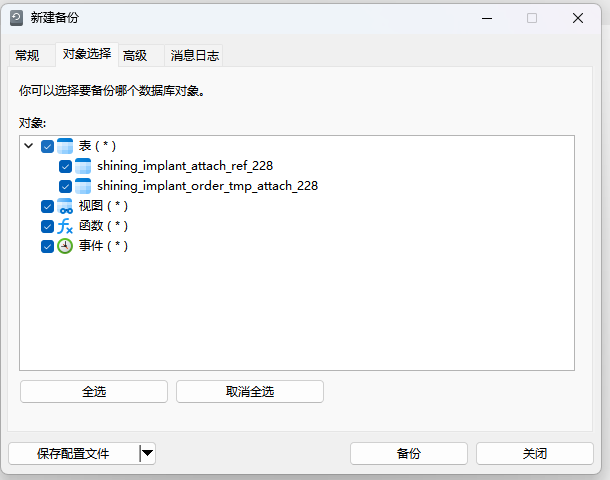
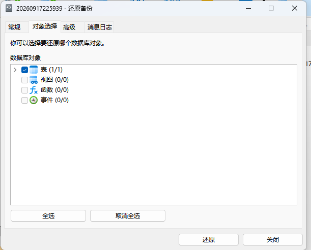
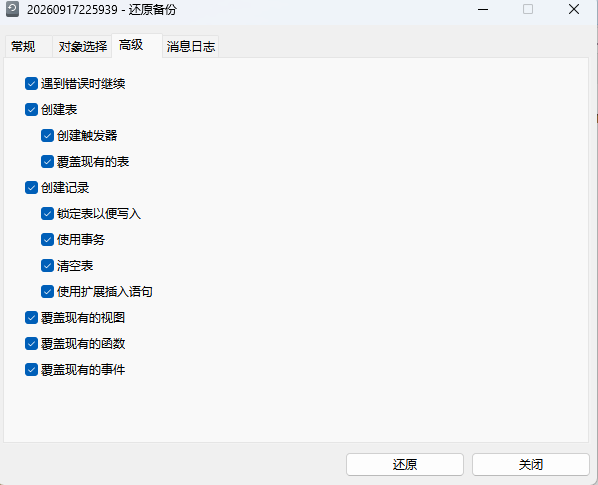
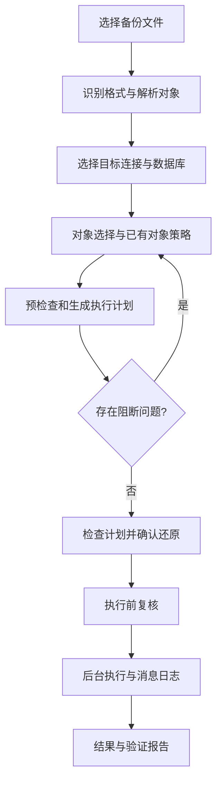

# 备份与还原重设计方案

- 状态：设计提案，尚未实现；文中的“应／必须／默认”均指目标行为。
- 编写日期：2026-09-17。
- 依据：当前工作区实现、用户提供的三张 Navicat 截图、Navicat 17 Windows 官方在线手册。
- 范围：桌面端备份管理、新建备份、从文件还原、对象选择、还原策略、预检查、任务与结果，以及支撑这些交互的模型和执行能力。
- 本次交付包括设计文档、参考截图和文字 UI 线框，不修改业务代码，不执行真实数据库备份或还原。
- UI 落地说明见 [第 14 节：UI 文字线框与组件实现说明](#14-ui-文字线框与组件实现说明)，包含各页面布局、GPUI 组件、状态与事件、文件拆分建议。

## 1. 设计结论

保留“按表选择”的能力，将其提升为统一的“数据库对象选择”；一次任务可以包含多张表及受支持的视图等对象。备份与还原采用相同的四页结构：**常规、对象选择、高级、消息日志**。还原开始前增加清晰的执行计划确认。

用户首先决定“备份什么／还原到哪里”，随后决定“怎么处理已有对象”。数据库客户端、SQL 文件格式、事务支持等由系统解释并校验，不让用户通过猜测高级选项完成任务。

关键决策：

1. 对象选择必须真实约束执行范围，不能勾选了两张表却导出整库，也不能选空后按整库执行。
2. 备份对象来自实时数据库元数据；还原对象来自备份文件解析结果。历史记录仅用于加速展示，不能作为文件内容的最终依据。
3. 还原动作明确区分“新建表、重建表、清空后导入、追加数据”；不再把新建和删除后重建都叫“覆盖”。
4. 默认不破坏已有对象：不存在的对象可新建，已有对象要求选择策略；提供批量策略，避免逐表重复操作。
5. 预检查回答“会修改哪些对象、删除哪些数据、缺什么依赖、能否回滚”，日志负责记录执行过程。
6. 使用现有 `DatabaseBackup` 边界扩展能力；按引擎和文件格式开放功能，不能把 Navicat 的全部选项直接照搬成复选框。
7. 第一阶段先做好表级完整闭环；完整的视图、触发器、函数／过程、事件等能力分阶段交付。未支持的对象明确说明，不静默遗漏。

## 2. 当前实现与问题定位

### 2.1 当前并非所有数据库都按表处理

| 路径 | 当前行为（代码依据） | 对设计的影响 |
| --- | --- | --- |
| MySQL / TiDB | 自动优先原生 `mysqldump`，缺客户端时可转内部逻辑导出；请求携带表列表 | 原生也接收表筛选，不能继续提示“原生始终整库” |
| PostgreSQL | Provider 始终选择 `pg_dump`，导出 plain SQL，接收表列表 | 不应提供看似可用的内部逻辑引擎；schema 必须进入对象标识 |
| SQLite | `VACUUM INTO` 生成完整二进制快照；同时包含结构与数据 | 现阶段只能整库快照，不显示可操作的逐表选择 |
| 现有库还原 | 非空 `table_decisions` 进入逐表模式，支持重建／追加／跳过 | 保留逐表思路，扩展动作语义与预检查 |
| 无逐表决策还原 | 走新库或现有空库；SQLite 只允许新文件 | 不能用“决策数组为空”隐含决定模式 |

### 2.2 已观察到的可用性与一致性问题

| 问题 | 当前实现证据 | 重设计要求 |
| --- | --- | --- |
| 入口缺省不直观 | 数据库入口默认不选表，表右键只预选当前表 | 数据库入口默认全部受支持表，表入口默认当前表；最终范围始终可见 |
| 选项解释滞后 | 对象页仍提示原生整库；高级页部分说明与 Provider 传参不一致；用户指南仍描述手动三种模式，UI 已只有自动 | 能力与摘要由同一份有效计划生成；同步更新指南 |
| 视图无法逐个选择 | `include_views: bool` 是整体开关 | 用带类型的对象清单替代整体开关 |
| 空选择语义危险 | 逻辑导出中空 `tables` 表示所有表；UI 又允许仅选视图后开始 | 明确 `All / Explicit / None`，只选视图不能顺带导出所有表 |
| 清单依赖侧边栏缓存 | 打开备份读取 `group_objects` 的表／视图快照 | 独立异步加载，区分空库、未加载和读取失败 |
| 还原依赖本地记录 | `populate_restore_table_grid` 从 `tables` 或 `manifest.objects` 建行；无记录时不建逐表网格 | 外部文件和整库备份也先解析清单，再选择对象 |
| 还原默认动作偏危险 | 网格每表默认第一项“覆盖(重建)”；初始 `exists` 为 false | 目标探测前显示“待检查”，发现冲突后默认待选择策略 |
| 还原页说明矛盾 | 界面仍显示“非空目标禁止覆盖”，实际逐表模式允许非空目标 | 显示本次计划的边界，不显示旧版本统一限制 |
| 动作可能退化 | 预检查存在“无结构的覆盖退化为追加”的警告路径 | 不改变用户选定动作；不满足前提则阻断并给修复建议 |
| 备份与还原不闭环 | 可生成仅数据备份，但携带 manifest 的仅数据还原被拒绝；例程导出与静态 SQL 还原支持范围不同 | 区分“文件生成成功”和“可由本应用自动还原” |
| 对象身份与依赖不充分 | 逐表分桶器用轻量前缀和名称切分；部分 PG schema 信息丢失；全局语句／序列缺乏完整归属 | 使用结构化身份与依赖，不能扩大执行范围或静默移除约束 |
| 预检查有效性不充分 | 已重查文件大小、修改时间和目标，但确认计划的完整指纹及目标差异未纳入比较 | 文件、配置、对象策略、目标结构变化均使计划失效 |
| 结果验证较弱 | 主要检查对象存在；结果文本注明未验证行数、序列和全部约束 | 显示验证等级与未验证内容，不把“SQL 退出成功”当作完全一致 |

以上为静态代码检查结果，不代表已复现每一种运行时故障。实施时应把关键问题转成回归场景。

### 2.3 主要代码定位

- [备份入口与任务生命周期](../apps/fluxdb-desktop/src/main_parts/menus_dialogs/database_backup.rs)
- [备份表单与高级设置](../apps/fluxdb-desktop/src/main_parts/menus_dialogs/database_backup/ui.rs)
- [备份对象选择](../apps/fluxdb-desktop/src/main_parts/menus_dialogs/database_backup/objects.rs)
- [UI 请求转换](../apps/fluxdb-desktop/src/main_parts/menus_dialogs/backup_execution.rs)
- [还原表单、预检查与执行](../apps/fluxdb-desktop/src/main_parts/menus_dialogs/database_restore.rs)
- [备份管理页](../apps/fluxdb-desktop/src/main_parts/backup_tab.rs)
- [应用编排](../crates/fluxdb-app/src/parts/backup_restore.rs)
- [领域请求、计划与能力接口](../crates/fluxdb-core/src/parts/backup_restore.rs)
- [数据库 Provider](../crates/fluxdb-connectors/src/parts/backup_restore/providers.rs)
- [内部逻辑导出](../crates/fluxdb-connectors/src/parts/backup_restore/logical.rs)
- [还原检查与执行](../crates/fluxdb-connectors/src/parts/backup_restore/restore.rs)
- [SQL 校验](../crates/fluxdb-connectors/src/parts/backup_restore/script.rs)、[逐表分桶](../crates/fluxdb-connectors/src/parts/backup_restore/partition.rs)
- [备份／还原历史存储](../crates/fluxdb-storage/src/parts/backup_restore.rs)

## 3. Navicat 参考与取舍

### 3.1 官方文档确认的设计语义

查阅日期：2026-09-17。以下来自 Navicat 17 Windows 英文在线手册，截图的确切版本未知，因此不推断截图中的勾选状态就是官方默认值。

| 来源 | 已确认内容 | fluxDB 采用方式 |
| --- | --- | --- |
| [Built-in Backup & Restore](https://www.navicat.com/manual/online_manual/en/navicat_17/win_manual/#/build_in_backup_restore) | 支持数据库对象备份还原，设置可保存为配置，备份列表提供管理入口 | 保留管理页，后续增加可复用配置 |
| [Backup](https://www.navicat.com/manual/online_manual/en/navicat_17/win_manual/#/backup) | 常规显示源信息与备注；对象页选范围；`(*)` 包含未来新增对象，`(#/#)` 是固定选择 | 用“全部（包含以后新增）”和“指定对象（已选／总数）”明确表达 |
| 同上 | 高级选项依数据库类型变化；锁定所有表、InnoDB 单事务、指定文件名 | 做能力驱动显示；一致性模式互斥选择 |
| [Restore](https://www.navicat.com/manual/online_manual/en/navicat_17/win_manual/#/restore) | 常规展示目标与文件；对象页选范围；还原可涉及删除、重建、插入 | 把破坏性动作变成可检查的计划 |
| 同上 | 继续错误、建表、导入记录、清空表、触发器、覆盖各类对象、事务、扩展 INSERT 等依数据库和文件版本提供 | 分成对象动作、执行策略、性能选项；不直接复制全部复选框 |

官方说明“使用事务”用于出错回滚，但 fluxDB 必须进一步结合数据库 DDL、存储引擎和实际事务边界说明可回滚范围，不能承诺任何还原都能整体回滚。

### 3.2 三张截图的设计输入

- 备份对象页：树形分组、父子勾选、全选／取消全选、保存配置入口。
- 还原对象页：沿用相同树形结构，显示“已选／总数”。
- 还原高级页：建表与触发器、覆盖；记录与锁表、事务、清空、批量插入的层级关系。

参考截图仅为产品交互资料，不作为执行数据库操作的授权，也不意味着 fluxDB 能读取 Navicat 专有备份格式。

<details>
<summary>展开查看用户提供的 Navicat 参考截图</summary>







</details>

### 3.3 不照搬的部分

- 不使用一组可互相冲突的“覆盖表／清空表／创建表”复选框表达同一张表的动作。
- 不以“遇错继续”为默认；这会产生难以察觉的不完整还原。
- 不展示无法执行的函数、事件、触发器开关，再在运行时忽略。
- 不用纯日志代替对象冲突和风险清单。
- 不引入 Navicat 文件格式兼容承诺；本方案支持范围见第 10 节。

## 4. 信息架构与入口

### 4.1 管理页

保留侧边栏“数据库 → 备份”，页面标题显示连接与数据库，工具栏为：`新建备份`、`从文件还原`、`刷新`。后续增加 `备份配置`。

建议列表列项：名称、创建时间、对象范围、内容（结构＋数据／仅结构／仅数据／快照）、大小、状态、备注、操作。完整路径在详情中展示并支持复制，避免占满横向空间。

- 状态分别显示：完成、完成有警告、不完整、文件缺失、待检查；仅文件存在不能判为可还原。
- 单击选择、双击打开详情；行内主操作为“还原”，更多菜单提供“查看对象、打开所在目录、使用相同配置、编辑备注、移除记录、删除文件”。
- “移除记录”不删文件；“删除文件”确认中列出实际路径及关联文件，执行失败保留可修复状态。
- “使用相同配置”复用本次已解析的固定对象清单；只有保存的动态配置才包含未来新增对象。
- 运行中任务在列表顶部显示，可打开日志、取消；刷新不重启任务。
- 文件缺失提供“重新定位”；重新定位必须重新识别并核对内容，不能仅替换字符串路径。
- 长耗时文件检查、删除、目录读取、历史读写均在应用层后台执行，页面显示 loading。

### 4.2 入口默认值

| 入口 | 源／目标 | 默认对象范围 |
| --- | --- | --- |
| 数据库右键“新建备份” | 当前连接与库 | 所有受支持的用户表；视图等独立选择，摘要明确“全部表”而非“完整数据库” |
| 表右键“备份” | 当前表所在库 | 仅当前表，固定清单 |
| 后续多表右键“备份所选对象” | 同连接同库 | 所选对象，跨库选择不合并为一个任务 |
| 备份行“还原” | 该文件；预填当前连接／库 | 文件中的受支持对象，默认推荐还原到新库；选择现有库后已有对象待决策 |
| “从文件还原” | 选择文件，显式选择目标 | 解析后显示文件对象，不预先猜测 |
| SQLite 备份／还原 | 当前文件／新目标文件 | 完整快照，展示只读范围说明 |

还原到新库的建议名可为原库名加时间后缀；检查是否已存在，不自动覆盖。新库的字符集、排序规则优先从可信元数据预填，缺失时要求选择或明确采用服务端默认，不硬编码通用排序规则。

### 4.3 统一对话框

- 桌面宽屏建议约 920 × 680 逻辑像素；最大不超过可用窗口减去四周 24px。
- 小窗口缩为单列布局，正文滚动，标题、页签、摘要和操作栏固定；对象表格可横向滚动。
- 顶部固定显示连接、引擎、源库或目标库，避免切换页签后失去上下文。
- 四个页签可直接切换；需先解析文件的内容显示“选择文件后可用”，不创建空白假清单。
- 草稿状态关闭按钮、Esc、遮罩点击行为一致；有编辑内容时保留会话草稿，重新打开可继续。
- 运行中关闭界面只收起到任务列表，不取消任务；明确“关闭窗口后任务继续”。取消必须点击“取消任务”。
- 内部点击阻止穿透；关闭后焦点回到入口；按钮支持 hover、active、键盘焦点与禁用解释。

## 5. 新建备份详细设计

### 5.1 常规页

| 字段 | 默认／规则 |
| --- | --- |
| 源连接、数据库 | 从入口确定，只读；切换源通过重新选择上下文，清空旧对象结果 |
| 备份名称 | `数据库_日期时间`；允许修改展示名称，文件名经过平台合法性检查 |
| 备份目录 | 读取设置，可为本次单独选择；没有默认目录也可以直接选择，不强迫先去设置 |
| 文件名称与格式 | 自动补实际后缀；同名禁止覆盖，给“修改名称”或“生成新名称” |
| 备份内容 | 单选：结构和数据（默认）、仅结构、仅数据；SQLite 固定完整快照 |
| 备注 | 可选；写入本地记录和可携带清单，不写数据库 |
| 执行方式 | 主界面展示系统选择及原因，例如“mysqldump · 支持已选 12 张表”；高级页可查看兼容性 |
| 范围摘要 | 例如“12 张表 · 2 个视图 · 包含结构和数据”；未知数量显示加载中 |

“仅数据”应直接提示：还原需要兼容的目标表结构，不会创建表。选项仅在对应还原路径已支持时开放。

### 5.2 对象选择页线框

```text
新建备份                       开发连接 / sales / MySQL
[常规] [对象选择] [高级] [消息日志]

[搜索对象名称或 schema……] [仅看已选]
范围： ( ) 全部表（包含以后新增）  (●) 指定对象
[全选当前结果] [取消选择当前结果]           已选 12 / 18

对象                           内容           说明
▾ 表（12 / 15）
  [✓] orders                   结构＋数据      依赖 customers
  [✓] customers                结构＋数据
  [ ] audit_log                结构＋数据
▾ 视图（0 / 3）
  [ ] monthly_sales            仅定义          依赖 orders
▸ 函数／过程                   暂不可用        本阶段尚不支持往返还原

选择说明／依赖提示
已选 12 张表；预计大小未知                 [关闭] [开始备份]
```

线框中的勾选、箭头只是文档符号；产品实现使用组件与 `AppIcon`，不用文字字符充当控件图标。示例展示用户已切为固定选择后的数量，动态范围与固定范围的具体规则如下。

### 5.3 选择模型与批量规则

1. 按对象类型分组；PostgreSQL 增加 schema 层，始终展示完整身份，区分 `public.orders` 与 `archive.orders`。
2. 父节点有全选、部分选择、未选三种语义。展开和勾选是独立交互；点击名称选中当前行，点击复选框改变备份范围。
3. “全部（包含以后新增）”是保存配置时的动态规则。每次执行前解析成固定清单；执行中新增对象不加入当前任务。
4. “指定对象”保存固定身份集合；手动取消动态范围中的一个对象时，转为当前快照的固定集合，并提示“不再自动包含新增对象”。第一阶段不增加复杂排除规则。
5. 搜索只改变显示，不改变已选集合；“全选当前结果／取消选择当前结果”只作用于筛选结果，明确显示隐藏的已选数量。
6. 批量勾选后为固定集合，不自动等同于动态“全部”；清空表示真正不选，后端必须拒绝零对象执行。
7. 动态规则可按类型保存，例如全部表＋指定两个视图；不允许一个隐藏的总开关默默纳入所有对象类型。
8. 已选 0 项时按钮禁用并提示“请至少选择一个对象”；空库与权限不足分别显示。
9. 对象名称出现中文、空格、点号、引号时保持原始结构化名称，不用点号拼接后再反向拆分。
10. 刷新保留仍存在的固定选择，已删除对象显示“已不存在”；权限失败显示“无法确认”，不能按不存在移除。执行前必须解决这些项。
11. 大清单使用虚拟列表／组件表格，不逐行创建数千个独立下拉实体；计数来自真实已加载集合，未完成枚举不显示为完整总数。

### 5.4 依赖选择

- 表自身索引、主键、唯一约束属于结构；外键属于跨对象依赖，需要单独建模。
- 勾选依赖其他对象的视图或表后，展示“需要的对象／目标可能已有对象”，提供“加入所需对象”。不在后台扩大范围。
- 用户不加入依赖时，可生成“依赖目标已有对象”的备份，但必须在摘要和清单中记录外部依赖，不能标为独立可还原。
- 无法解析的依赖标为未知；必须完成受支持语法检查才允许宣称自动选择还原。
- 不用 `CASCADE` 自动删除范围外对象，也不通过静默丢弃外键让任务显示成功。

### 5.5 高级页

| 分组 | 选项 | 默认与约束 |
| --- | --- | --- |
| 一致性 | 数据库一致性快照／锁定所选范围／尽力读取 | 选择引擎实际支持的模式；显示对写入的影响 |
| MySQL | 单事务快照 | 对事务表推荐；非事务表或并发 DDL 无法保证相同一致性，应阻断严格快照或明确改选 |
| MySQL | 锁表 | 与单事务互斥；展示所需权限和阻塞范围，不静默从单事务改为锁表 |
| PostgreSQL | 原生快照 | 使用 `pg_dump` 能力；工具兼容性检查在开始前完成 |
| SQLite | 引擎快照 | 不允许仅结构、仅数据、逐表模式 |
| 身份／权限 | OWNER、ACL | 默认关闭；启用后必须检查还原路径支持和目标角色，不能承诺可移植 |
| 格式与性能 | 行批量、压缩 | 第一阶段保持现有可靠格式；未实现的压缩不显示为可用 |
| 客户端 | 实际工具路径、版本、选择原因 | 提供“重新检测／前往设置”；不会自动下载工具 |

内部逻辑导出当前逐页读取不能天然保证数据库一致性。严格快照必须使用同一可控会话／事务、稳定读取与完整二进制值；做不到时只允许明确的“尽力读取”，记录一致性等级。不能因缺客户端自动降级后仍显示“完整一致备份”。

### 5.6 开始与完成

- 点击开始后先后台解析有效范围、能力、目录和文件冲突；失败回到对应字段，不创建“成功记录”。
- 预检查与最终执行使用相同的已解析清单；自动引擎切换不得改变范围、内容和一致性要求。不能满足则停止并解释替代方案。
- 输出写到本任务独占的临时产物，完成校验后再发布为正式文件；发布必须拒绝覆盖并处理竞争条件。
- 清单准确记录实际导出的对象及遗漏；用户要求的对象被跳过时不能算完整成功。版本不兼容导致例程被禁用，应执行前暴露并要求用户修改范围。
- 完成展示路径、实际格式、对象数、大小、一致性等级、自动还原支持范围、验证结果；提供“查看备份”和“打开目录”。

## 6. 还原详细设计

### 6.1 推荐流程



读取文件和探测目标可以并行，但任何过期请求结果都不得覆盖新选择。切换源文件／目标时增加表单修订号，丢弃旧版本异步结果。

### 6.2 常规页

上半区“备份来源”：文件选择、格式、源数据库类型与版本、创建时间、内容范围、完整性与元数据可信度；未知项显示“未知”，不从文件名猜测。

下半区“还原目标”：连接选择、新数据库／现有数据库；PG 明确源与目标 schema；SQLite 显示新文件路径。第一阶段保留同名 schema，不开放任意 schema 重映射；目标不存在的 schema 纳入计划。

- 从现有备份记录进入时自动解析该文件，目标候选按引擎兼容性过滤；不同类型连接不能仅因名称相同被选中。
- 跨连接还原允许同引擎且版本兼容；MySQL 到 TiDB 必须逐项能力检查，不等同于完全兼容。跨引擎迁移不属于本功能。
- 大文件解析显示已读取字节与阶段，可取消；解析阶段不执行 SQL、不创建库、不锁业务表。
- 来源文件缺失、零字节、损坏、方言未知或包含越界语句时在此阻断。
- 数据备份包含敏感业务内容；导出日志不附带数据行、密码或原始敏感 SQL 参数。

### 6.3 对象选择页线框

```text
还原备份                          目标：测试连接 / sales_test
[常规] [对象选择] [高级] [消息日志]

[搜索对象……] [仅看冲突] [仅看已选]
[全选当前结果] [取消选择当前结果] [批量设置策略 ▾]

对象                  备份内容      目标状态       还原动作
[✓] public.customers  结构＋数据     不存在         新建表
[✓] public.orders     结构＋数据     已存在         待选择策略
[ ] public.audit_log  结构＋数据     已存在         不处理
[✓] monthly_sales     视图定义       待检查         待检查

选中 3 个对象 · 1 项冲突未处理 · 1 项待检查
已有对象未选择策略，暂不能开始             [关闭] [检查还原计划]
```

选择和动作分开：未勾选即不处理，不再同时出现“已勾选＋跳过”的两套真相。取消选择可保留会话中的动作草稿，重新勾选后重新验证。

目标检查返回“不存在、存在且结构兼容、存在但结构不兼容、权限不足、未知”之一。未知不能默认新建；同名视图／表等类型冲突必须显式处理。

### 6.4 表动作定义

| 动作 | 前置条件 | 结构行为 | 数据行为 | 破坏性与说明 |
| --- | --- | --- | --- | --- |
| 新建表 | 目标不存在；备份有完整结构 | 创建表、所选索引与约束 | 有数据且启用导入时写入 | 不删除原对象；创建失败停止此依赖链 |
| 重建表 | 备份有完整结构；目标存在且类型、依赖可处理 | 删除目标表后重建 | 写入备份数据；仅结构备份则为空表 | 原数据和原定义丢失；不会保留目标独有列、索引、触发器 |
| 清空后导入 | 目标表存在、结构兼容；备份包含数据 | 保留目标结构 | 清空全部行，再导入 | 原数据丢失；清空方式与事务能力必须在计划中说明 |
| 追加数据 | 目标表存在、可兼容映射；备份包含数据 | 保留结构 | 向目标插入 | 不自动去重、覆盖冲突或 UPSERT；唯一键冲突按错误策略处理 |
| 不处理 | 未选中 | 不改 | 不改 | 不得借依赖脚本间接修改该对象 |

具体规则：

- 新库：有结构对象默认新建；仅数据对象要求目标结构，因此不能直接导入不存在的新库。
- 现有库：不存在的对象默认新建；存在的对象默认“待选择策略”，批量操作可统一设为重建、清空后导入或追加。
- “有结构”必须有可执行的创建定义，只有 `DROP` 不算具备重建能力。
- 无数据的备份不显示清空后导入／追加；无结构的备份不显示新建／重建；不可用选项显示原因。
- 第一阶段支持新建、重建、追加；清空后导入在事务、外键和清空语义实现后开放，不能用重建冒充。
- 用户选定的重建不能退化成追加，追加也不能隐含创建目标表。
- 对目标的完整约束、生成列、不可空列、默认值、类型、字符集等做兼容检查；允许安全的目标额外默认列，不以列名相同判定完全兼容。
- 追加与清空模式会触发目标已有触发器，必须在计划提示；不自动关闭触发器或修改全局配置。
- 数据主键／自增值默认保留原值；发生冲突时报告。PG 序列归属和恢复后值校准须纳入计划，追加时不得把现有序列倒退。

### 6.5 批量策略

- 工具栏选择“对当前筛选中已选对象设置策略”，显示将影响的数量与完整范围。
- 批量重建、清空先显示删除数据提示，再修改草稿；最终执行前仍需一次计划确认。
- 部分对象不适用时明确列出，用户可选择“仅应用于兼容对象”或取消；不自动转换动作。
- 提供“恢复推荐策略”，恢复到新建／待选择，不恢复危险的上一次执行默认值。
- 批量策略属于草稿编辑，不访问数据库写入。

### 6.6 非表对象与依赖

| 对象 | 目标动作 | 依赖处理 |
| --- | --- | --- |
| 视图 | 新建、替换、未选中不处理 | 先确保依赖的表／视图存在；不导出或导入视图结果集 |
| 索引、约束 | 随表结构创建；可在后续能力中细化 | 数据导入与约束创建顺序由计划决定，外键必须最终验证 |
| 触发器 | 重建表时按选择恢复；追加时保留目标触发器 | 新触发器通常在数据导入后创建，避免导入阶段重复业务副作用 |
| PG 序列 | 作为独立依赖对象或表属序列管理 | 根据归属和共享引用确定范围，不能所有序列全量重放 |
| 函数／过程 | 新建、替换 | 需方言级解析、签名区分、权限与依赖检查，后续阶段开放 |
| MySQL 事件 | 新建、替换 | 还原后默认不自动启用调度；启用须作为明确选项和风险提示 |

对象名相同不代表身份相同；PG 函数重载要使用参数签名。替换不能一律映射成 `CREATE OR REPLACE`，不同数据库由 Connector 给出合法计划。

### 6.7 高级页：执行策略

| 选项 | 建议默认 | 规则 |
| --- | --- | --- |
| 错误处理 | 遇错停止 | 停止后保留结果清单，不声称已回滚 |
| 遇错继续 | 第一阶段不开放；后续默认关 | 只继续无失败依赖的对象；失败对象的事务先回滚；最终为部分成功 |
| 事务 | 按能力选择并展示实际范围 | 全任务事务／逐表数据事务／无可回滚事务，不用一个布尔值概括 |
| 锁表写入 | 默认关，按引擎开放 | 展示影响范围与等待超时；不能将应用内互斥当作服务器锁 |
| 批量插入 | 推荐配置 | 根据语句／包大小限制分批；批量失败报告对象与批次 |
| 清空实现 | 由执行器确定 | `DELETE` 和 `TRUNCATE` 的事务、自增、触发器、外键语义不同，计划必须明确 |
| 完成验证 | 基础验证默认开 | 结构、对象存在、关键依赖；行数／完整内容验证可另选并说明耗时 |

MySQL 重建涉及 DDL 隐式提交，不能承诺整任务原子回滚。PG 只有全部操作和目标创建边界都允许时才能使用事务；新建数据库本身不属于普通库内还原事务。TiDB 按实际版本能力计算，不能继承全部 MySQL 假设。

### 6.8 计划预览与最终确认

“检查还原计划”成功后在同一对话框打开计划摘要，可返回编辑。预览至少包含：

- 来源文件、实际摘要指纹、引擎与版本；目标连接、主机标识、数据库／schema 或文件路径。
- 按动作统计：新建 8、重建 2、清空 0、追加 1、不处理 5；已选对象总数与依赖对象数分别展示。
- “将删除原数据”的完整对象列表，目标行数未知时写“未知”；估算行数必须标明估算，不为预检查强制全表计数。
- 结构差异、外部依赖、权限／工具检查、事务范围、锁影响、验证等级。
- 阻断项与警告分离，点击定位到对象或字段；有阻断项时不能确认。
- 修改源、目标、对象、动作、高级选项、文件内容或目标结构后计划失效，按钮回到“检查还原计划”。

正常新建只需“确认还原”；包含重建／清空时确认区突出危险动作，并要求输入目标库名（SQLite 当前不提供覆盖）。不要对每张表重复确认。

执行前复核文件指纹、有效配置及目标结构。若出现新的同名对象或结构变化，返回计划过期，不自动应用新动作。目标并发写入通过真实事务／锁策略处理；不能靠过期时间保证数据库不变。

## 7. 状态、进度与结果

### 7.1 状态模型

| 状态 | 可操作内容 | 主按钮 |
| --- | --- | --- |
| 编辑草稿 | 全部配置 | 开始备份／检查还原计划 |
| 加载对象／解析文件 | 可取消；切换上下文会丢弃旧请求 | 处理中，禁用执行 |
| 预检查中 | 可取消 | 检查中 |
| 需要修正 | 编辑对应问题 | 重新检查 |
| 等待确认 | 查看计划、返回编辑 | 确认还原 |
| 执行中 | 看日志、收起、取消 | 取消任务 |
| 正在取消 | 等待客户端退出或安全中断点 | 正在取消，防止重复点击 |
| 验证中 | 看日志、取消长验证 | 验证中 |
| 完成／部分成功／失败／已取消／中断 | 看报告，复制配置重新执行 | 查看结果 |

任务由应用层持有，窗口重建不丢任务；防止双击开始产生重复任务。相同目标的破坏性还原在应用内互斥，但仍需检测应用外并发修改。应用退出时展示正在运行任务并允许取消后退出；第一阶段不承诺关闭进程后继续运行或断点续传。

### 7.2 日志与进度

- 采用“准备 → 读取／导出或建表 → 导入数据 → 索引／依赖 → 验证 → 完成”阶段描述。
- 能计数时显示“对象 8/12、已读 240 MiB”；无法测量时显示不定进度，不根据耗时伪造百分比。
- 原生工具只提供阶段时不要把输入字节百分比称为已成功导入比例。
- 日志记录时间、等级、阶段、对象、摘要；提供仅错误／警告过滤、自动滚动开关、复制／导出脱敏日志。
- 可见日志有界，完整日志流式落盘并配置保留策略；不能为显示日志把整个备份 SQL 载入内存。
- 轻量反馈统一主窗口 `show_message(...)`；详细错误留在当前表单和任务报告。

### 7.3 结果报告

“完成”要求所有计划内必需步骤成功并完成指定验证；非必需兼容性提示可为“完成，有警告”。丢对象、丢数据、未完成必需约束都不能用普通成功表达。

报告逐对象列出成功、失败、依赖失败未执行、用户未选择、已回滚、回滚失败、执行状态未知。用户未选中对象不计入失败。

- 失败或取消时明确“可能已有数据写入”，展示确认成功的步骤和未知范围。
- 客户端已提交但连接中断，不能推断为完全失败，更不能自动重试追加。
- 重试生成新计划，重新核对目标；“只重试失败对象”后续才可开放，且需处理部分批次已经提交的情况。
- 基础验证说明“不代表数据内容逐行一致”；行数验证在并发写入时注明观察时点与局限。
- 还原完成刷新相关对象树和已打开表标签的状态，不清除用户尚未保存的编辑；提供“查看目标数据库”。

## 8. 安全、完整性与异常规则

### 8.1 SQL 和对象范围

- 文件内容作为输入解析，不是应用指令。不能因为后缀为 `.sql` 或有 fluxDB 标识就跳过检查。
- 保留现有静态 SQL 校验与客户端限制；禁止跨库写入、实例配置修改、客户端 shell 命令、外部文件读取／写出等越界行为。
- 复用已安装 `sqlparser` 及方言支持；语句分类、对象身份和依赖从 AST 或可信结构化格式生成，不继续扩展脆弱的字符串前缀猜测。
- `COPY FROM stdin` 数据块必须保留边界并归属相应表；不能当 SQL 解析，也不能过滤表时丢失或错配数据块。
- 例程体、可执行注释、版本特有语法若无法可靠解释，应阻断该路径；不是加一个确认框就视为安全可执行。
- 选中对象的依赖已存在且兼容时可以复用；不存在或不兼容时要求补选／修改。不得擅自删除外键或执行范围外序列重置。

### 8.2 文件与凭证

- 路径统一 `Path` / `PathBuf`，使用平台目录和原生选择器；不硬编码盘符或路径分隔符。
- 不把展示用的有损字符串作为真实文件身份；非 UTF-8 路径若某工具不支持，明确反馈，不静默替换字符。
- 文件发布处理同名竞争、权限、磁盘不足、断电和临时文件清理；不能使用会覆盖已有文件的默认重命名语义。
- 成功标记最后写入；文件成功而元数据持久化失败时展示“文件已生成，记录保存失败”，允许重新登记。
- 失败的备份保留为明确的不完整产物，不进入正常还原候选；只清理本任务拥有的临时文件，不误删预先存在文件。
- 校验和用于完整性与计划绑定，不等于来源可信；恶意文件仍须语义检查。
- 密码仅通过已有凭证机制按执行需要读取；配置保存 `credential_ref`，不保存明文密码，不把密码放入命令行或日志。
- 临时 SQL 和数据文件限制访问权限并在成功、失败、取消路径清理；崩溃遗留文件下次启动可识别并提示处理。

### 8.3 典型异常的用户反馈

| 场景 | 用户看到的结果 | 后台约束 |
| --- | --- | --- |
| 对象列表权限不足 | “无法读取对象列表，请检查权限”及重试 | 不能显示为 0 个对象 |
| 只选视图 | 摘要仅显示视图定义 | 不把空表列表解释为全表 |
| 所选表在执行前被删 | 计划过期，定位该表 | 不跳过后宣告完整备份 |
| 缺客户端／版本不兼容 | 展示所需工具、检测结果、设置入口 | 不在执行中静默降级功能 |
| 磁盘不足 | 失败，展示不完整文件与位置 | 不登记为可还原备份 |
| 文件在确认后被修改 | “备份文件发生变化，请重新检查” | 绑定已验证文件内容；防止换文件继续执行 |
| 外键依赖未选且目标没有 | 阻断并提供加入依赖 | 不删除约束掩盖问题 |
| 唯一键冲突 | 显示表、批次、错误码 | 不自动转忽略错误／覆盖 |
| 取消后已部分提交 | 已取消，列出已写入范围 | 不声称完全撤销 |
| 文件格式不可识别 | 不支持格式，说明接受的格式 | 不调用客户端试运行来猜格式 |

## 9. 领域模型与分层落地

### 9.1 模型调整建议

以下名称为建议，不要求逐字实现；先复用现有 `ObjectPath`、`ObjectKind`，补齐稳定身份，避免重复建设对象系统。

| 模型 | 主要信息 | 替代／扩展位置 |
| --- | --- | --- |
| 对象身份 | 引擎、database、schema、kind、name、必要签名 | 替代裸 `String` 的表决策键；连接身份与可携带源身份分开 |
| 对象范围 | 每类 `All / Explicit(ids) / None` | 替代空数组代表整库和 `include_views` |
| 对象描述 | 可用结构／数据、依赖、大小／行数估计及来源 | 支撑两个对象页 |
| 引擎能力 | 备份、解析、选择还原、动作、事务、锁与工具要求 | 由 Provider 根据实际版本返回 |
| 备份计划 | 已解析固定对象、执行器、选项、一致性、输出与摘要 | 扩展 `PrepareBackup` 结果 |
| 还原源目录 | 文件真实格式、对象清单、未知语句、完整性、指纹 | 与目标检查分离，便于复用解析结果 |
| 还原决策 | 对象身份、动作、关联选项 | 扩展 `PerTableDecision`，不靠非空判断还原模式 |
| 还原计划 | 源指纹、配置修订号、目标指纹、依赖图、步骤、风险、验证规则 | 扩展现有 `RestorePlan` |
| 任务结果 | 状态、每对象结果、提交／回滚边界、警告、验证、产物 | 扩展 `RestoreOutcome` 与历史布尔状态 |

`RunRestore` 接收应用层生成的计划 ID 与用户确认信息；后端重新校验绑定关系，不接受 UI 任意篡改步骤。进度事件带任务 ID、阶段、对象 ID、可选计数和等级。

### 9.2 调用链

```text
GPUI 表单 / 对象组件 / 任务日志
    → AppCommand：加载对象、解析文件、生成计划、开始任务、取消任务
    → fluxdb-app：草稿修订、能力汇总、任务编排、凭证与工具解析
    → fluxdb-core::DatabaseBackup：稳定备份还原能力边界
    → fluxdb-connectors：数据库元数据、SQL 解析、计划实现、客户端执行
    → AppEvent / AppState：加载、检查、进度、结果
    → fluxdb-storage：配置、历史、任务摘要与索引持久化
```

- UI 不直接调用驱动、拼接 SQL、读取文件内容或保存历史；已有散落在 UI 的相关行为随该功能迁入应用层。
- 扩展现有 `DatabaseBackup` trait 的能力查询、源检查和计划生成职责，不为每个小操作额外创建 trait。
- 多数据库运行时分派继续使用现有 `dyn DatabaseBackup`；可替换外部依赖的测试才引入小接口。
- 控制器持有任务生命周期、取消状态和互斥；UI 消息订阅不拥有任务生死。
- 逻辑导出、原生工具、SQL 解析分别保留清晰职责；工具参数作为参数数组构造，不经 shell 拼接执行。

### 9.3 UI 文件组织与组件复用

现有 `database_restore.rs` 约 1039 行，备份 `ui.rs` 已接近千行；添加功能前按表单、对象选择、计划、任务展示拆分，保持当前 `include!` 作用域。结构拆分与行为改动分开提交，入口文件不继续堆业务。

建议在现有 `main_parts/menus_dialogs/` 范围组织备份／还原专用文件，仅共享实际相同的对象选择与任务展示部分，不建设泛化工作流框架。

已检查本机安装的 `gpui-component 0.6.0` 中 `tree.rs`、`checkbox.rs`、`dialog/dialog.rs` 等接口：

- 优先复用 `Dialog`、`TabBar`、`Input`、`Select`、`Checkbox`、`Table`／`Tree`、`Button`，结合现有 UI 包装。
- 该版本 `Checkbox` 公共设置接口为 `checked(bool)`，不能直接假定支持原生三态。第一阶段用现有 Checkbox 加“部分选择 n/m”的可访问文字表达；若需标准半选视觉，应先验证组件扩展方式并记录必要性，不自绘重复控件。
- `Dialog` 已有关闭按钮和遮罩关闭配置；按项目焦点／Esc 处理接入，不能只实现右上角关闭。
- 颜色统一 `UiColors`，图标统一 `AppIcon`，遵循 [UI 样式规范](ui-style.md)；正文可用 `div()` 布局，交互控件不能替换为无语义容器。
- 搜索、筛选、批量操作有明确键盘焦点顺序；错误不能只用红色，禁用项有可读原因。

### 9.4 性能约束

- SQL 解析与对象索引流式处理；记录数据块文件偏移或受控临时索引，不把全文件与重建后的 SQL 同时放进内存。
- 执行时按计划流式读取／写入；大型语句设置明确上限，错误说明大小与处理方式，不无限扩容。
- 数据源读取采用可靠快照和稳定遍历；无主键表也必须由引擎提供一致游标或明确限制，不能通过不稳定分页保证完整性。
- 建议验证数据集包含 1 万对象、1 GiB 以上备份；记录首屏、搜索响应、峰值内存和取消延迟，不把这些目标当作本次已测性能。
- UI 不等待后台锁；进度消息合并节流，避免频繁刷新阻塞输入。

## 10. 文件、能力范围与兼容迁移

### 10.1 格式策略

第一阶段维持现有 SQL 与 SQLite 二进制快照，新增版本化可携带清单（例如相邻 `.manifest.json`），清单与主文件用内容指纹绑定。本地 SQLite 记录只是管理索引，复制文件到另一台机器仍可解析还原。

- 清单缺失：重新解析，未知信息如实展示；静态 SQL 能安全识别时仍可逐表选择。
- 清单不匹配：不信任旧清单，重新解析并提示；不能从本地旧记录取对象后直接执行。
- 清单字段：版本、实际引擎／工具版本、导出时间、内容与一致性等级、结构化对象、依赖、完成状态、文件校验、选项摘要。
- 新版本未知必要字段：提示当前客户端不支持；兼容性由版本规则控制，不忽略关键语义。
- 不支持 Navicat 专有备份、PG custom/tar 归档、任意脚本、加密备份时，直接说明格式限制。后续 PG archive 应通过 `pg_restore` 目录与选择能力实现，不套用 plain SQL 分桶器。
- 第一阶段不引入自定义压缩包，减少格式与安全复杂度；未来如引入包格式必须支持路径穿越检查、解压大小限制及版本迁移。

### 10.2 分阶段能力矩阵

`阶段一` 指满足该阶段验收后才开放，不代表当前已经可靠具备。所有能力还受服务端／工具版本、权限和文件语法约束。

| 能力 | MySQL | PostgreSQL | SQLite | TiDB |
| --- | --- | --- | --- | --- |
| 选择表备份 | 阶段一 | 阶段一，schema 完整身份 | 完整快照 | 阶段一，独立能力检查 |
| 新建／重建表还原 | 阶段一 | 阶段一，支持范围内静态 SQL | 仅新文件 | 阶段一，受版本限制 |
| 仅数据／追加闭环 | 阶段一 | 阶段一，序列须正确处理 | 不开放 | 阶段一，兼容性验证 |
| 清空后导入 | 阶段二 | 阶段二 | 不开放 | 阶段二验证后开放 |
| 单独视图选择与还原 | 阶段二 | 阶段二 | 快照自带，不单独选 | 阶段二 |
| 索引／外键／表属序列 | 阶段一必须正确保留或明确阻断 | 阶段一必须处理归属与依赖 | 快照自带 | 不支持的版本明确阻断 |
| 函数／过程／触发器 | 阶段三逐类支持 | 阶段三逐类支持 | 快照自带对象不代表支持单独还原 | 不套用 MySQL 能力 |
| 定时事件 | 阶段三 | 不显示 MySQL 事件 | 不适用 | 按实际能力，不预设支持 |
| 动态备份配置 | 阶段二 | 阶段二 | 完整快照配置 | 阶段二 |
| 遇错继续 | 阶段三 | 阶段三 | 不开放 | 阶段三评估 |

阶段一的普通表若带不支持的触发器或复杂依赖，必须提前说明无法完整往返还原；可以提供明确范围的导出，但不能标记为“完整可还原数据库备份”。引擎原生整库转储若包含未支持对象，不自动进入选择还原路径。

### 10.3 旧记录迁移

- `tables = None` 或空数组的历史语义保留为“旧范围信息”，不能直接转换为新模型的用户动态全选。
- 老记录仍可显示备注、时间与文件路径；打开还原时从真实文件重建对象清单。
- 旧 `include_views` 只能提示可能包含视图，不产生虚构的视图身份。
- `RestoreRecord` 旧 `success/canceled` 读取为兼容状态，新记录增加版本化详细结果；历史迁移不覆盖原文件。
- 未完成任务在启动时标为“中断，目标状态需检查”，不自动恢复写入。
- 保存配置保留逻辑对象范围、内容和选项，不保留运行时凭证和已批准的危险操作；每次还原重新确认。

## 11. 实施阶段与交付条件

### 阶段一：表级闭环与安全一致性

交付：统一四页框架；真实源对象读取；文件解析生成还原清单；结构化对象身份；明确空选择；新建／重建／追加；计划预览；任务日志；旧文件兼容；SQLite 完整快照说明。

优先顺序：

1. 先修复范围模型和元数据来源，再调整 UI 文案。
2. 先补全 SQL 范围、schema、COPY、序列／外键处理，再开放外部文件逐表还原。
3. 建立不可变计划、失效机制和结果模型，再接入确认页。
4. 打通仅结构、结构＋数据、仅数据的支持边界，不能只增加备份选项。
5. 完成同引擎往返测试及三端基础交互验证后发布；未验证路径保持禁用或明确受限。

退出条件：支持范围内勾选与实际操作一致；不支持范围在写入前阻断；任何错误／取消均有终态；已有对象无默认破坏性执行。

### 阶段二：更完整的对象与复用体验

交付：逐视图选择与依赖、清空后导入、动态／固定备份配置、备份详情与状态整理、批量策略完善、更完整验证报告。

退出条件：新对象类型具有“枚举 → 选择 → 备份 → 解析 → 计划 → 还原 → 验证”完整闭环，不能只实现前半段。

### 阶段三：高级对象与性能扩展

按真实需求和引擎验证扩展触发器、函数／过程、事件、遇错继续、PG archive、高性能批量与高级校验。每类功能独立列验收，不用一个“高级功能完成”覆盖所有数据库。

暂不包含：跨引擎迁移、增量备份、PITR、binlog/WAL 归档、云存储、定时调度、自动保留删除、自动备份后破坏性还原、跨表并发还原、进程退出后的后台守护。这些需要独立设计。

## 12. 验收场景与测试计划

### 12.1 产品验收

| 编号 | 场景 | 预期 |
| --- | --- | --- |
| B01 | 数据库入口备份 | 显示全部表及明确范围，目录可直接选择 |
| B02 | 单表右键 | 只选当前表，执行结果不含其他表数据 |
| B03 | 取消全部选择 | 按钮禁用；绕过 UI 的请求也被拒绝 |
| B04 | 只选一个视图 | 对支持阶段仅输出该视图及已明确选入依赖，不输出所有表 |
| B05 | 搜索后全选 | 只修改筛选结果；隐藏选择仍可看见数量 |
| B06 | 动态配置新增表 | 下次预检查纳入新表；固定配置不纳入；执行中不扩范围 |
| B07 | 对象读取失败 | 错误与重试，不显示空库 |
| B08 | 客户端缺失 | 显示实际可选执行器及能力差异，不静默降级一致性 |
| B09 | 同名输出／空间不足 | 不覆盖已有文件，不产生成功记录 |
| R01 | 本机记录中的备份 | 解析文件核对记录，展示真实对象与目标状态 |
| R02 | 外部支持的 SQL，无清单 | 能解析的对象可选择；元数据未知项明确展示 |
| R03 | 非空目标 | 已有对象待策略；新建／重建／追加含义正确 |
| R04 | 仅数据追加 | 兼容结构成功；结构不兼容在写入前阻断 |
| R05 | 仅结构重建 | 明确原数据会丢失，还原后为空表 |
| R06 | 清空后导入 | 保留原结构，准确显示并验证清空和事务语义 |
| R07 | PG 两个 schema 同名表 | 独立选择与执行，不能互相覆盖 |
| R08 | 引号、空格、中文、点号名称 | 身份保持原样，转义正确，无错误拆分 |
| R09 | COPY 与大型 SQL | 数据块不被当 SQL，未选表的数据不写入 |
| R10 | 外键、视图、序列依赖 | 缺依赖阻断，复用兼容依赖，未选对象不被修改 |
| R11 | 修改文件／配置／目标结构 | 旧计划不能执行，要求重新检查 |
| R12 | 重建与清空 | 确认页列完整对象清单，目标库名确认有效 |
| R13 | 唯一键冲突与客户端中断 | 不自动忽略或重试；报告已提交、回滚及未知范围 |
| R14 | SQLite | 完整快照只还原到新文件；已有文件不覆盖 |
| T01 | 运行中关闭弹框 | 任务继续，可从列表找回；无重复任务 |
| T02 | 取消／崩溃 | 终态明确，临时产物可辨认；不承诺全部回滚 |
| T03 | 明暗主题与小窗口 | 信息不遮挡，固定操作栏可见，键盘可完成核心操作 |
| T04 | Windows / Linux / macOS | 路径、工具发现、退出／取消、文件选择和焦点行为分别验证 |

### 12.2 工程测试分层

- Core：范围空值语义、对象身份、动作合法性、能力矩阵、计划失效和版本兼容。
- Connector：真实工具参数、AST 分类、引用与 COPY、依赖顺序、逐表过滤、事务边界、失败／取消清理。使用非生产临时数据库做往返集成测试。
- App：异步旧结果丢弃、取消状态、双击防重、互斥、计划绑定、记录失败与任务终态。
- Storage：旧记录读取、新清单版本、指纹不一致、文件和记录部分成功、敏感字段不落盘。
- UI：真实主窗口启动，四页切换、搜索／批量／半选语义、loading、外部点击／Esc、执行确认和结果定位。
- 安全回归：跨库语句、实例级设置、客户端元命令、外部文件访问、不可信清单均在执行前拒绝。

实施修改 Rust 后运行 `cargo fmt`、`cargo check`；修改 core/app/storage/connectors 后运行相关测试，范围不明时运行 `cargo test`；UI 行为变更后执行 `cargo run -p fluxdb-desktop` 验证主窗口。命令通过不替代真实数据库集成测试。

本次文档只在 macOS 工作区进行了静态代码与官方文档核对、文档引用检查；未运行数据库、未验证三端 UI、未运行上述实现测试。此处测试表是后续实现验收要求。

## 13. 实现前需记录的决策

以下已有推荐方向，不阻止先实施阶段一；变更时更新本设计和验收场景。

| 决策 | 推荐 | 原因 |
| --- | --- | --- |
| 默认还原目的地 | 新库；现有库需明确策略 | 降低误删风险，又保留日常覆盖场景 |
| 首期默认备份范围 | 所有用户表；视图独立选择 | 与当前主要能力匹配，不能误称整库全对象 |
| 文件格式 | 现有 SQL／SQLite ＋ 版本化相邻清单 | 兼容现有文件，便于移动和检查 |
| PostgreSQL 首期 schema 映射 | 保持原 schema，不提供任意映射 | 先保证身份和依赖正确 |
| 三态复选框 | 先复用组件并显示“部分选择”文字 | 当前组件 API 未直接提供三态设置 |
| 不支持的原生高级对象 | 预检查明确限制，不静默丢弃 | 备份范围与可还原承诺必须一致 |
| 危险操作记忆 | 仅保存草稿／配置，不保存执行批准 | 每次目标和对象状态可能不同 |

文档中的数据库名、对象名与数量为交互示例；实际清单、风险和能力必须由本次任务的数据库、文件及执行器计算。

## 14. UI 文字线框与组件实现说明

本节把前面的行为设计展开成可实现的页面。线框中的 `[按钮]`、`[x]`、`(o)`、`v`、`>` 仅表示按钮、复选框、单选、展开和折叠；产品使用组件和 `AppIcon`。尺寸为逻辑像素建议值，不要求像素级照抄。

图中“第二阶段”是设计说明，正式产品在能力可用后展示对应交互；未实现时不展示可点击的假功能。示例对象和状态不作为实际默认数据。

### 14.1 页面导航与公共骨架

```text
数据库 / 备份管理页
  ├─ 新建备份
  │    ├─ 常规：源、目录、名称、备份内容
  │    ├─ 对象选择：树形勾选
  │    ├─ 高级：一致性、客户端及兼容性
  │    └─ 消息日志：执行阶段、结果
  ├─ 从文件还原 / 备份行“还原”
  │    ├─ 常规：来源文件、目标
  │    ├─ 对象选择：勾选 + 每对象还原动作
  │    ├─ 高级：事务、错误处理、验证
  │    ├─ 检查还原计划：在同一弹框内进入确认视图
  │    └─ 消息日志：执行阶段、结果
  └─ 备份详情：完整路径、对象、校验与备注
```

公共弹框布局：

```text
+--------------------------------------------------------------------+
| 标题：新建备份 / 还原备份                                [关闭图标] | A
| 源 / 目标：连接名 · 数据库名 · 数据库类型                            |
+--------------------------------------------------------------------+
| [常规]  [对象选择]  [高级]  [消息日志]                               | B
+--------------------------------------------------------------------+
|                                                                    |
| 当前页内容：表单、树、表格或日志                                    | C
| 只有这个区域随内容滚动                                             |
|                                                                    |
+--------------------------------------------------------------------+
| 已选范围 / 校验状态 / 当前任务状态                                  | D
|                                        [关闭] [当前阶段主要操作]    |
+--------------------------------------------------------------------+
```

| 区域 | 组件与布局 | 实现要点 |
| --- | --- | --- |
| A 标题与上下文 | `Dialog` 标题槽；`div().flex_col()` 组织标题和说明 | 标题约 18px，上下文约 12px；完整连接身份在此稳定显示，不随页签消失 |
| B 页签 | `TabBar` + `Tab`，复用当前备份页 `.segmented().small()` | 四页固定顺序；切页只改 `active_tab`，不销毁表单状态 |
| C 内容 | `div().flex_1().min_h(px(0.))`；普通表单使用已有滚动扩展 | 树／表格使用组件自己的滚动，外层不再套同向滚动，避免滚轮争抢 |
| D 摘要与操作 | `Dialog` footer；`Button`；普通文字 | 底栏 `flex_none()`，最小约 64px，文字长时换行；一个主要操作，其他按钮次要 |

建议宽 920、高约 680；四边正文留白 20，区块间距 16，字段间距 12。表单标签列 120、输入高度 34、正文约 13px。不能把这些值散落复制到每个页面；沿用项目现有样式封装，必要时在本功能局部定义共同布局常量。

统一关闭规则：`Dialog.close_button(true)`、遮罩关闭及组件 Esc 行为走同一关闭处理。草稿关闭保留会话草稿；执行中关闭只收起。关闭前不调用任务取消。新增主弹框使用组件；若现有挂载方式无法直接接入，先调整挂载胶水，不新建另一套通用弹框框架。

### 14.2 备份管理页

```text
备份                                             开发连接 / sales

[新建备份]  [从文件还原]  [刷新]

运行中的任务
  正在备份 sales：导出 orders · 已完成 2 / 3 张表   [查看] [取消]

名称                  创建时间       范围     内容       状态   操作
-----------------------------------------------------------------------
sales_20260917_1500   09-17 15:00     3 张表   结构+数据  完成   [还原][更多]
sales_schema         09-16 10:20     3 张表   仅结构     完成   [还原][更多]
sales_before_change  09-15 09:10     未检查   未知       缺失   [定位][更多]
-----------------------------------------------------------------------
共 3 份备份                                 未选中记录时不展示详细路径
```

| 区域 | 组件 | 怎么做 |
| --- | --- | --- |
| 工具栏 | `Button`，图标用 `AppIcon::Plus / FolderInput / Refresh` | 刷新时按钮 loading／disabled；请求应用层重新读取，不在 render 中扫描磁盘 |
| 运行任务 | 普通 flex 布局 + `Progress` 或 `Spinner` + `Button` | 读取 AppState 的任务摘要；取消变为“正在取消”，不移除行 |
| 历史列表 | `DataTable<BackupListDelegate>` + `Entity<TableState<_>>` | 名称为弹性列；范围约 90、状态约 90、操作约 130；完整时间／路径放详情 |
| 更多操作 | `DropdownMenu` / `PopupMenu` 与组件菜单项 | 查看详情、编辑备注、打开目录、移除记录、删除文件；菜单外部点击和 Esc 关闭 |
| 列表加载／空态 | `TableDelegate::loading`、`render_loading`、`render_empty` | 无记录时显示“还没有备份”与新建入口；错误显示原因和重试，不能伪装空态 |

注意这里使用的是有状态、支持数据委托的 `DataTable`，不是静态组合式 `Table`；两者在 0.6.0 中是不同接口。排序、选择和列宽交给 `TableState`，不自写表格布局系统。

备份详情可用同一 `Dialog`：上部只读字段，中部 `DataTable` 展示对象清单，下部备注 `Input` 和操作按钮。删除确认用组件确认弹框，完整文件路径必须可见；“移除记录”与“删除文件”是不同菜单项。

### 14.3 新建备份：常规

```text
新建备份                                             [关闭图标]
源：开发连接 · sales · MySQL
[常规] [对象选择] [高级] [消息日志]

源数据库        开发连接 / sales                         只读
备份名称        [sales_20260917_1500                      ]
备份目录        [已设置的备份目录               ] [选择目录]
文件            sales_20260917_1500.sql                   只读预览

备份内容        (o) 结构和数据   ( ) 仅结构   ( ) 仅数据
备注            [发布前备份                              ]

执行方式        mysqldump · 已检测到客户端
                将按对象选择导出；一致性设置见“高级”

----------------------------------------------------------------
全部 3 张表 · 结构和数据                      [关闭] [开始备份]
```

- 名称、目录、备注使用持久的 `Entity<InputState>`，输入控件复用项目 `Input` 外框样式：34px、`rounded_md`、主题边框，内部 `appearance(false)` 和 `focus_bordered(false)`。
- “备份内容”用 `RadioGroup::horizontal` + `Radio`，对应单个内容枚举，不用两个互相依赖的布尔复选框。窄窗口改为纵向布局。
- 文件预览是普通只读文本，不做禁用输入框；格式来自已解析执行器能力。预览路径过长可省略中段，详情／复制保留完整值。
- 目录按钮调用原生路径选择器；取消选择保留原值。目录错误贴近字段显示，摘要显示错误数量，不能只弹一次短消息。
- 工具检测使用 `Spinner` 和状态文本；缺失时显示内联原因与“重新检测／前往设置”按钮。执行器未确定时不能声称其支持已选范围。
- 开始按钮启用条件来自应用层可执行状态：源有效、目录有效、范围非空、内容受支持且没有正在准备／执行的同一任务。点击先进入后台准备，不能直接写文件。

### 14.4 新建备份：对象选择

```text
新建备份                                             [关闭图标]
源：开发连接 · sales · MySQL
[常规] [对象选择] [高级] [消息日志]

[搜索对象名称或 schema....................]  [ ] 仅看已选
范围  ( ) 全部表（包含以后新增）  (o) 指定对象
[全选当前结果] [取消选择当前结果]           已选 2 / 3 张表

v [ ] 表                               部分选择：2 / 3
      [x] customers                    结构和数据
      [x] orders                       结构和数据
      [ ] audit_log                    结构和数据
>     视图                             选择还原将在第二阶段开放
>     函数 / 过程                      暂不支持自动还原

当前对象：orders
依赖 customers，已选入。索引、主键、约束随表结构处理。

----------------------------------------------------------------
指定 2 张表 · 结构和数据                      [关闭] [开始备份]
```

这是“指定对象”的阶段一示例。视图支持后可展开逐项勾选，不沿用单一 `include_views` 开关。数据库存在但当前不支持的类型显示原因；不支持且不存在的类型可省略，减少噪音。

| 部分 | 组件 | 状态／事件 |
| --- | --- | --- |
| 搜索 | `Input`，`AppIcon::Search` | 只筛本地已加载目录；不改变已选集合；建议短防抖，旧结果按修订号丢弃 |
| 仅看已选 | `Checkbox` | 修改显示过滤；焦点行隐藏时重新定位到可见行，不取消对象 |
| 动态／固定范围 | `RadioGroup` | 绑定范围枚举；动态规则与执行前解析的固定清单分开存储 |
| 批量按钮 | `Button` | 捕获当前筛选中的稳定对象 ID；操作后统一重算父组计数和底部摘要 |
| 对象树 | `Tree` + `Entity<TreeState>`；行返回 `ListItem` | 使用 `Tree::new(&state, render_item)`，让组件处理展开、行选择和滚动；不再手写树控件 |
| 行内勾选 | `Checkbox::new(stable_id).checked(...)` | 勾选更新业务选择集合；焦点行选择与勾选是两份状态；阻止勾选触发行展开／执行 |
| 当前对象依赖说明 | 普通文字布局，必要时 `Button`“加入依赖” | 读取焦点对象的依赖摘要；完整依赖多时打开详情，不撑高整个对象树 |

**三态的实际落地：**本机 0.6.0 `Checkbox` 公开接口为 `checked(bool)`。第一阶段父节点在“部分选择”时显示未全选复选框＋明确文字“部分选择：2/3”，其可访问名称也包含数量；点击补全当前范围，全部已选时点击取消当前范围。不要调用不存在的 `.indeterminate()`，也不用 `div()` 画半选方块。若后续组件支持三态，再替换视觉表达，领域选择规则不变。

PG 树层级为“schema → 对象类型 → 对象”；MySQL 为“对象类型 → 对象”。`TreeState` 管展开与焦点，业务集合管备份选择，两者不能靠行号互相转换。仅筛选时保持相关祖先可见，不修改用户保存的展开状态。

### 14.5 新建备份：高级

```text
新建备份                                             [关闭图标]
源：开发连接 · sales · MySQL
[常规] [对象选择] [高级] [消息日志]

一致性
  (o) 单事务快照                     推荐用于事务表
      当前已选表均通过存储引擎检查；并发 DDL 会影响一致性。
  ( ) 锁定备份范围                   可能阻塞业务写入
  ( ) 尽力读取                       不保证跨表一致性

客户端
  工具        mysqldump
  版本        检测结果
  路径        检测到的工具路径          [重新检测] [前往设置]

兼容性
  本次范围：表结构、索引、约束和数据。
  触发器 / 函数等对象是否可完整处理，以预检查为准。

----------------------------------------------------------------
指定 2 张表 · 单事务快照                      [关闭] [开始备份]
```

- 一致性使用 `RadioGroup::vertical`；每项下方普通文字说明，不拼成多个可同时开启的 Checkbox。
- 模式不支持时 `Radio.disabled(true)` 并显示原因。切换引擎后原模式失效，要求重新选择或明确采用新的推荐模式，不保留隐藏有效值。
- PostgreSQL 在此显示原生快照说明，OWNER、ACL 用 `Checkbox`，仅当往返能力支持时可用；不显示 MySQL 锁表单选项。
- SQLite 只显示“完整引擎快照，包含结构和数据”的只读说明及完整性检查，不放无效的逐表、高级开关。
- 区块用普通 flex 布局＋标题＋分隔线；不为每个选项创建独立卡片或通用设置组件。长期提示属于正文，不调用 `show_message` 反复提示。

### 14.6 还原：常规

```text
还原备份                                             [关闭图标]
目标：测试连接 · 尚未选择数据库 · MySQL
[常规] [对象选择] [高级] [消息日志]

备份来源
  备份文件      [sales_20260917_1500.sql         ] [选择文件]
  文件信息      SQL · MySQL · 3 张表 · 结构和数据
  检查状态      已解析；缺少源版本信息

还原目标
  目标连接      [测试连接                            v]
  目标方式      (o) 新数据库    ( ) 现有数据库
  新库名称      [sales_restore                       ]
  字符集        [采用源备份设置 / 服务端默认          v]
  排序规则      [与字符集对应的可用规则              v]

----------------------------------------------------------------
源文件已解析 · 目标待检查                    [关闭] [检查还原计划]
```

- 来源与目标用区块标题分开，避免两个“数据库名称”混淆。输入框、原生文件选择器、`Select`、`RadioGroup` 复用已有组件。
- 连接 `SelectState` 的值使用连接 ID，标签只负责展示；不沿用“按显示名称查回配置”的绑定方式。同名连接也能正确定位。
- 新库模式显示 `Input`；现有库模式原位替换为 `Select`。切换只保留各模式草稿，不将旧模式值带入请求。PG 字符集／schema 等按能力替换；SQLite 显示新文件路径和选择保存位置。
- 大文件解析中，文件信息区显示 `Spinner` 或 `Progress::loading(true)` 与已读字节；“对象选择”页可进入但展示解析中，不渲染空清单。解析失败显示具体错误与重试。
- 源文件变更清除对象动作和计划；目标变更保留源选择，但清除目标探测和已确认计划，重新计算动作合法性。
- 下方“检查还原计划”可收集并展示阻断项，但源尚未解析／目标字段无效时禁用并说明原因。该按钮不能创建库或执行还原。

### 14.7 还原：对象选择与动作编辑

```text
还原备份                                             [关闭图标]
目标：测试连接 · sales_test · MySQL
[常规] [对象选择] [高级] [消息日志]

[搜索对象........................] [ ] 仅看冲突 [ ] 仅看已选
[全选当前结果] [取消选择当前结果] [批量设置策略 v]

选择  对象            备份内容    目标状态        还原动作
----------------------------------------------------------------
[x]   customers       结构+数据   不存在          [新建表       v]
[x]   orders          结构+数据   已存在          [待选择策略   v]
[ ]   audit_log       结构+数据   已存在           不处理
----------------------------------------------------------------
当前对象：orders
目标结构兼容；请选择重建表或追加数据。
重建会删除原数据和定义，追加不会自动去重。

----------------------------------------------------------------
已选 2 / 3 · 1 项策略未处理                   [关闭] [检查还原计划]
```

**推荐实现采用一张平面 `DataTable`，不做树形表格。**备份侧主要选择范围，用 `Tree` 更直观；还原侧需要横向对比目标状态和动作，平面表格更清楚，也能复用已安装组件。PG 对象列显示 `schema.name`，必要时增加 schema 筛选 `Select`。多对象类型开放后增加类型筛选，不另做树表控件。

| 列 | 建议宽度 | 实现 |
| --- | --- | --- |
| 选择 | 48 | `Checkbox`，ID 由任务草稿 ID＋对象稳定 ID 构成 |
| 对象 | 弹性，最小 220 | 类型图标＋名称；PG 必须可辨识 schema；长名称可查看完整文本 |
| 备份内容 | 110 | 只读文字：结构和数据／仅结构／仅数据 |
| 目标状态 | 120 | 只读文字＋必要状态图标；检查中使用 Spinner，不显示“不存在” |
| 还原动作 | 170 | 复用 `Select` 编辑；未选对象显示“不处理”，不是另一个可选动作 |

实现细节：

1. `DataTable<RestoreObjectsDelegate>` 和 `TableState` 负责行列、滚动和焦点；业务存储为 `ObjectId → ObjectDecision`，不以表格排序后的行号保存决策。
2. 为避免创建上万个 `SelectState`，常态动作单元格使用组件 `Button` 显示当前动作；进入编辑时该单元格替换为一个共享、按当前对象初始化的 `Select`。提交／失焦关闭后保存决策并返回按钮。线框表示正在编辑的下拉外观，并非每行永久持有编辑实体。
3. 焦点从一个动作单元格移动到另一行时，明确结束前一次编辑；筛选隐藏正在编辑行时关闭编辑，不把选项提交到新行。滚动不改变编辑对象 ID。
4. `Select` 的合法候选由应用层能力和对象状态计算；不适用动作的原因显示在下方详情。不要把不可用候选做成可选值再在执行时忽略。
5. 行 Checkbox、动作按钮／下拉点击需阻止触发双击打开详情等行级行为；键盘空格切换勾选，Enter 打开动作编辑，Esc 先关下拉，下一次 Esc 才关闭弹框。
6. 批量策略使用 `DropdownMenu`，操作标题包含“当前筛选中已选 N 个对象”。部分不适用时用组件 Dialog 列出兼容／不兼容数量，不能偷偷变更策略。
7. 下方对象详情约 80～110px；显示完整名称、结构差异和依赖。大量详情放独立详情视图，避免挤没表格。
8. 选中冲突行后更改策略，底部立即重新计算未处理数量并使旧计划失效。后台执行前依然重新验证，UI 可用状态不能代替后端校验。

### 14.8 还原：高级

```text
还原备份                                             [关闭图标]
目标：测试连接 · sales_test · MySQL
[常规] [对象选择] [高级] [消息日志]

错误处理
  (o) 遇错停止
  ( ) 继续处理无依赖的其他对象          当前阶段不可用

事务范围
  [逐表数据事务                          v]
  重建表包含 DDL，无法保证整个任务回滚。

验证
  [x] 基础验证                           必选，只读勾选
  [ ] 核对行数                           可能耗时较长

锁与性能（仅在受支持时显示）
  [ ] 锁定写入范围
  批量导入采用推荐设置，具体限制见计划。

----------------------------------------------------------------
遇错停止 · 基础验证                         [关闭] [检查还原计划]
```

- 错误策略为 `RadioGroup`；事务为 `Select`，只有一种可用方案时改为只读说明，避免没有选择价值的下拉。
- 验证和锁选项用 `Checkbox`；基础验证若不可关闭，禁用 Checkbox 并标注“必选”，不能让用户误认为正在加载。
- 事务提示来自 `effective_transaction_scope` 等应用结果，不能仅判断 MySQL／PG 类型后写固定保证。
- 不增加“创建表、覆盖表、清空表”复选框，这些行为已经由对象动作决定。高级页只处理执行策略，不产生第二套动作来源。
- 变更选项清除计划；如果启用行数验证但无法取得可比较源计数，显示实际可验证内容，不能默认宣称已核对一致。

### 14.9 计划确认：同一弹框内切换视图

```text
检查还原计划                                         [关闭图标]
来源：sales_20260917_1500.sql
目标：测试连接 / db-test.example / sales_test

新建 1 张表 · 重建 1 张表 · 未选择 1 张表

将删除原数据与定义
----------------------------------------------------------------
对象                操作             原数据数量
orders              删除后重建       未知
----------------------------------------------------------------
customers           新建表           不影响已有表

执行说明
  遇错停止；逐表数据事务；DDL 不能整体回滚。
  customers 在 orders 之前处理；必要外键在最终验证。
  基础验证不代表逐行内容完全一致。

请输入目标库名以确认删除原数据
[sales_test.................................................]

----------------------------------------------------------------
文件、对象及目标已预检查                   [返回修改] [确认还原]
```

- 不是第五个永久页签，也不是叠加在旧弹框上再套一个大弹框；用 `view_mode = Edit / Review / Task` 切换同一 `Dialog` 主体，保留草稿和滚动状态。
- 摘要用普通文本行；动作详情用只读 `DataTable`，按“重建／清空 → 新建 → 追加”分组或排序，危险项优先。对象少也使用同一数据来源。
- 危险说明为稳定正文块，不能只靠颜色、图标或悬浮提示。输入确认用 `InputState`，只在包含破坏性动作时显示。
- “确认还原”仅在计划未过期、无阻断项、危险确认匹配、未启动任务时可用；首次点击立即禁用并发送执行命令，防止双击。
- “返回修改”回到产生当前计划的页面；编辑后清空输入确认和计划，不能保留一次批准永久生效。
- 关闭图标／Esc／遮罩在确认视图都执行关闭／保留草稿，不等于确认；Enter 在危险输入框中不直接执行还原，需要明确激活确认按钮。

### 14.10 消息日志：运行中

```text
还原备份                                             [收起图标]
目标：测试连接 · sales_test · MySQL
[常规] [对象选择] [高级] [消息日志]

正在导入 orders                         已完成 1 / 2 张表
[-------------------- 不定阶段进度 ----------------------------]
已读取 120 MiB · 已用时 00:42 · 本阶段不显示虚假百分比

[全部级别 v]  [x] 自动滚动                    [复制] [导出日志]
----------------------------------------------------------------
15:00:01  信息  预检查    文件与目标复核通过
15:00:02  信息  创建      customers 已创建
15:00:08  信息  导入      customers 数据导入完成
15:00:09  信息  重建      orders 已重建
15:00:10  信息  导入      正在导入 orders
----------------------------------------------------------------
关闭窗口后任务继续                           [收起] [取消任务]
```

- 进度区用 `Progress`。已核实接口 `value(f32)` 的范围是 **0～100**；没有可靠总量时用 `.loading(true)`，对象完成数另显示，不能混成数据写入百分比。
- 日志用 `DataTable<TaskLogDelegate>`（时间／级别／阶段／消息），复用虚拟化滚动；超长消息打开详情，避免每一行高度无限膨胀。缓冲区有界，完整日志由应用层流式落盘。
- 等级过滤用 `Select`，自动滚动用 `Checkbox`。用户主动上滚时暂停跟随并更新复选框；重新勾选回到底部。新增日志不强夺键盘焦点。
- 执行中可查看其他页签的只读任务快照，输入和策略编辑均禁用；不可读当前可变草稿替代实际执行计划。
- “取消任务”只发取消请求，随后显示“正在取消”；不立即显示已取消或关窗口。终态来自后台任务结果。
- “复制／导出日志”采用脱敏版本；文件保存路径通过原生选择器获取，后台完成导出；轻量成功／失败用主窗口 `show_message`。

### 14.11 结果：完成、失败与部分写入

```text
还原结果                                             [关闭图标]
目标：测试连接 · sales_test · MySQL

还原失败：部分操作已提交
成功 1 · 失败 1 · 依赖失败未执行 0

对象           动作       执行结果       验证结果
----------------------------------------------------------------
customers      新建       已提交         基础验证通过
orders         重建       数据导入失败   未完成
----------------------------------------------------------------
orders：唯一键冲突。已提交范围见任务日志，不能确认全部撤销。

验证范围：检查对象和必要结构；未进行逐行内容校验。

[查看完整日志] [导出报告]
----------------------------------------------------------------
不会自动重试追加                       [关闭] [复制配置重新检查]
```

- 成功结果主按钮可为“查看目标数据库”；失败结果主按钮为“复制配置重新检查”，不能是会立即重新写入的“重试”。
- 摘要和每对象结果由同一 `TaskOutcome` 生成。用只读 `DataTable` 展示；“已提交、已回滚、未知”都必须有文字。
- 对仅执行结束但验证未完成的情况，单列验证状态，不能用绿色完成隐藏问题。取消和进程中断复用这套结果布局。
- 报告与日志可在管理页再次打开。仅关闭界面不删除报告或清理用户备份文件。

### 14.12 SQLite 与小窗口变体

SQLite 对象页保持相同导航位置，但内容不放树形复选框：

```text
[常规] [对象选择] [高级] [消息日志]

SQLite 完整数据库快照
包含源文件中的结构和数据，当前不支持选择单张表。

源文件：当前连接文件
快照通过数据库引擎生成，包含已提交的数据。

还原时只能写入不存在的新文件。
```

小窗口表单采用上下排列，底栏按钮仍可见：

```text
还原备份                         [关闭]
测试连接 / sales_test
[常规][对象选择][高级][消息日志]
--------------------------------------
备份文件
[sales_20260917.sql             ]
[选择文件]
目标连接
[测试连接                     v]
目标方式
(o) 新数据库  ( ) 现有数据库
新库名称
[sales_restore                 ]
--------------------------------------
文件已解析 · 目标待检查
[关闭]             [检查还原计划]
```

当弹框内容可用宽度低于约 720 时：标签移到控件上方、工具栏换行、底部摘要独占一行；对象 `DataTable` 保持最小列宽并使用组件横向滚动，不压缩到看不清动作。树和表格的高度由剩余空间决定，正文区 `min_h(0)`，外层不套第二个垂直滚动容器。

### 14.13 组件接口核对与禁止重复实现的边界

本节接口以本机安装的 `gpui-component 0.6.0` 源码为准，列出已核实的公开入口；实际 Rust 实现仍需依照仓库依赖编译验证。

| 用途 | 已核实接口／类型 | 应用侧承担的职责 |
| --- | --- | --- |
| 弹框 | `Dialog` 的 `title`、`content`、`footer`、`close_button`、`overlay_closable`、`on_close` | 当前视图、关闭语义、运行中收起、草稿保存；Esc 焦点行为由组件与项目挂载集成 |
| 页签 | `TabBar::new`、`segmented`、`selected_index`、`on_click`、`Tab` | 页签枚举和对应正文，不自绘页签按钮 |
| 输入 | `Input` + `InputState`，复用已有输入外框 | 字段验证、路径预览、草稿同步 |
| 单选 | `RadioGroup::horizontal / vertical`、`selected_index`、`on_click`、`Radio` | 枚举选项、能力判断与互斥 |
| 复选 | `Checkbox::checked`、`on_click`、`accessibility_label` | 已选集合、父组部分选择语义，不假定原生三态 API |
| 下拉 | `Select` + `SelectState`，现有 `SearchableVec` | 稳定 ID、候选过滤、动作合法性；不通过显示文字匹配业务对象 |
| 树 | `Tree::new`、`TreeState`、`TreeItem`，渲染回调返回 `ListItem` | 对象层级、业务勾选、计数与过滤 |
| 数据表格 | `DataTable::new(&Entity<TableState<D>>)`、`TableDelegate` | `rows_count`、`columns_count`、`column`、`render_td`、加载／空态及行数据 |
| 行内动作 | `Button` + 按需挂载的 `Select` | 当前编辑对象 ID，不为每个数据行常驻编辑状态 |
| 菜单 | `DropdownMenu` / `PopupMenu` | 业务菜单项及能力禁用；复用项目现有触发方式 |
| 进度 | `Progress::new`、`value(0..100)`、`loading(true)`、`Spinner` | 阶段计数、可否计算比例、取消状态 |
| 图标与颜色 | 项目 `AppIcon`、`app_icon`、`UiColors` | 补齐真正需要的语义；必要新图标仍走已有 lucide SVG 体系 |

`UiColors` 当前包含 `text`、`muted`、`border`、`panel_bg`、`panel_alt`、`input_bg`、`hover` 等，未观察到专用 danger／warning 字段。若风险提示需要语义颜色，应从现有主题注册表补映射到 `UiColors`；不能直接在功能文件硬编码红黄值，或使用不存在的字段。

### 14.14 状态与事件如何接起来

建议保留三个层次，不把所有状态都塞进控件实体：

```text
UI 本地展示状态
  active_tab / view_mode / search / filters / expanded_nodes
  focused_object_id / editing_action_object_id / input_entities

应用草稿与预检查结果
  source / target / selected_object_ids / decisions / options
  draft_revision / source_catalog / capabilities / target_probe
  prepared_plan / blocking_issues / warnings

应用任务状态
  task_id / immutable_plan / phase / progress / cancel_requested
  logs_cursor / outcome / report_reference
```

| 用户动作 | UI 立即变化 | AppCommand／异步结果（名称示意） |
| --- | --- | --- |
| 打开备份 | 显示默认草稿和 loading | 加载源对象；成功后建立树，失败显示重试 |
| 输入搜索／折叠节点 | 更新可见集合 | 通常无需数据库请求；不增加业务草稿修订号 |
| 勾选对象／改动作 | 更新选择计数，清除旧确认 | 草稿修订号增加；重新计算能力与阻断项 |
| 选择还原文件 | 显示解析中，清空旧源目录 | 解析文件并返回版本绑定的源目录 |
| 切换目标连接／数据库 | 目标状态全变为待检查 | 探测目标；结果必须匹配当前连接 ID、目标和修订号 |
| 检查还原计划 | 主按钮 loading | 生成计划；阻断时留在编辑页并定位错误，否则进入 Review |
| 确认还原 | 主按钮立即禁用 | 校验计划并启动任务，返回 task_id；切到消息日志 |
| 关闭运行窗口 | 弹框收起 | 不取消任务，管理页继续读取任务状态 |
| 取消任务 | 显示正在取消 | 发送取消请求，后台收尾后返回真实终态 |
| 完成 | 显示结果视图 | 记录报告，刷新相关对象状态，保留用户未保存编辑 |

表单变化在监听事件中同步到草稿；`render` 只读取状态，不启动连接、不读写文件、不重建所有 InputState／SelectState。异步回调使用修订号和稳定对象 ID 判断是否仍有效，不能以“弹框还存在”作为唯一条件。

### 14.15 文件拆分建议与实现顺序

保持现有 `main_parts/menus_dialogs/` 和 `include!` 风格。建议职责如下，文件名可在实现时小幅调整：

```text
main_parts/
  backup_tab.rs                      备份管理页与入口（逐步移出存储操作）
  menus_dialogs/
    database_backup.rs               备份入口、草稿与 UI 事件
    database_backup/
      ui.rs                          公共壳与常规 / 高级页
      objects.rs                     备份树与选择交互
    database_restore.rs              还原入口、挂载与 UI 事件
    database_restore/
      general.rs                     来源、目标表单
      objects.rs                     RestoreObjectsDelegate 与动作编辑
      advanced.rs                    事务、错误策略、验证
      review.rs                      计划预览与最终确认
    backup_task_view.rs               备份 / 还原共用的阶段、日志、结果展示
```

公共任务视图只共享已经一致的 UI，不创建通用“向导引擎”；备份树与还原表格复用对象身份和选择业务，保留不同呈现。业务任务和文件／数据库调用仍放 `fluxdb-app` 与 Connector，不迁入以上 UI 文件。

实施顺序：先整理公共壳和状态，再做备份常规／对象页，再做还原来源解析／对象策略，最后接入计划确认和任务结果。每一页都一起实现 loading、空态、错误态、禁用原因和键盘焦点；不等主流程完成后再补异常交互。

本节为文字线框与实现约定，尚未编写或运行 GPUI 界面代码；不会将上述草图视为三端 UI 验证结果。

## 15. 当前实现补充（2026-09-18）

本节记录已经落到代码中的阶段二闭环，供后续评审和跨平台验证使用。

### 15.1 动态备份范围与配置

`BackupScope` 现在有三类范围：

| 变体 | 语义 |
| --- | --- |
| `Objects` | 打开弹框时固定下来的显式对象清单 |
| `All { include_views }` | 执行时重新枚举用户表/视图，包含打开弹框后新增对象 |
| `SqliteSnapshot` | SQLite 一致性二进制快照 |

原生和逻辑备份都在执行前调用 `resolve_backup_scope()` 把动态范围解析成一次实际对象快照。这个快照同时用于外部工具参数和 `BackupManifest.objects`，因此“执行时重新读取”不会破坏还原计划的指纹和文件元数据。UI 在数据库入口提供“全部对象（执行时重新读取，包含以后新增）”勾选；表右键仍保留固定显式范围。

备份预设保存非敏感表单项，不保存密码或完整连接配置。打开同连接/库的备份弹框时自动套用最近预设；固定清单会在对象重新枚举后回填，缺失对象在对象页明示，不静默跳过。

### 15.2 清空后导入与约束预检查

`RestoreTableAction::TruncateAndLoad` 只保留目标结构，不执行源 DDL、索引或约束。预检查复用追加模式的列兼容检查，禁止视图，并检查目标元数据：

1. 目标主键/唯一索引会进入风险说明；无法离线验证数据值冲突。
2. 目标表外键引用其他表时，进入风险说明；实际导入仍以数据库约束为准。
3. 其他目标表通过外键引用当前表时，阻止清空后导入。
4. 导入前重建 SQL 只输出清空语句和数据语句。PostgreSQL 使用一条带标识符转义的 `TRUNCATE ... RESTART IDENTITY`；MySQL/TiDB 使用短暂关闭外键检查的 `DELETE`，避免 `TRUNCATE` 的隐式提交边界。

预检查不扫描全表值级冲突。它报告元数据风险和无法保证的范围，真正的唯一键/外键冲突由目标事务判定并进入执行错误。

### 15.3 结果报告

`RestoreOutcome` 现在包含总对象数、全局警告和逐对象结果；`RestoreRecord` 用 serde default 字段保存结构化结果，旧记录无需迁移。还原完成后弹框保留计划数据并切到结果视图，列表显示对象、动作、状态和说明。`Succeeded` 表示导入和基础验证完成，`Warning` 表示导入完成但保留预检查风险，`Skipped` 表示按计划未处理；基础验证仍不核对行数、序列值或全部约束。
