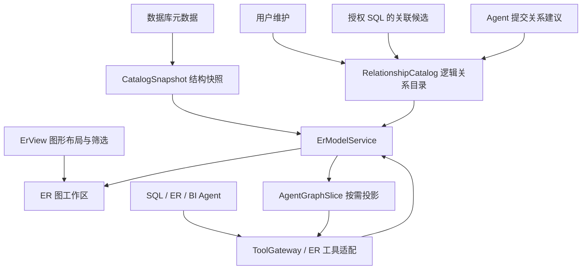

# FluxDB ER 关系模型与图形工作区设计

> 日期：2026-09-19。状态：画布原型已实施（§8 步骤 3），数据结构（第 5 节 D1-D9）仍待确认。  
> 本文补充并细化 [Agent 与 MCP 设计](agent-mcp-design.md)，ER 关系模型相关决策以本文后续确认版本为准。  
> 修订记录：  
> - 2026-09-19 实施「最小可跑 ER 标签页」画布原型（§8 步骤 3）：侧边栏「ER 图」节点打开 `库名 · ER` 标签，首次打开自动读取真实库的表/列/外键并绘制表节点与连线。落地 `ErGraphData` 纯数据模型（core er_model.rs）、加载编排（app er_service.rs）、desktop 渲染（er/canvas.rs）。不触碰第 5 节逻辑关系数据模型，不做逻辑关系编辑/持久化/缩放/Agent 工具。验证：macOS 启动正常，`cargo test` app 461 通过（含 er 集成测试）。  
> - 2026-09-19 移除多租户式权限机制（ReadContext、权限指纹、policy_revision、按主体绑定的游标与缓存键、`authorization_changed`）。FluxDB 是单机桌面应用，授权边界只有两层：连接可见性与外部 MCP 客户端。涉及 §3.5、§5.1、§5.9、§6.4–6.8、§6.10、§7、§9.1、§11。  
> - 2026-09-19 明确 ER 结构快照为 ER 功能唯一元数据来源，不与 completion_index 互相复制。涉及 §6.8、§7。

已确认需求：**首次打开数据库 ER 时自动生成，不需要再次点击“生成”或确认；必须重视首次加载和后续使用体验。**该确认不代表第 5 节的数据结构已全部获批。

## 1. 目标和待确认范围

### 1.1 用户目标

1. ER 背后的结构能够让 Agent 准确读取表之间的关联，不能只保存图片和连线坐标。
2. 点击连接/数据库后有 ER 标签页，能够查看整个数据库的表与关系。
3. 同时支持只看当前表相关关系的局部 ER 图。
4. 大量表时仍能定位、探索和编辑，不能将所有表的全部字段同时塞入画布。
5. 先确认关系数据结构，再实现业务代码。
6. 首次打开 ER 自动生成，加载过程可见、可操作；有外键自动建立关系，没有外键仍自动展示表节点。

本文将“只有该表关联的 ER 图”理解为：以当前表为中心，默认展示直接关联表，可逐层展开。全库图和当前表图使用同一个关系模型，只是视图不同。

### 1.2 核心决策建议

- 数据模型分成四层：**数据库结构快照、逻辑关系目录、图形视图、Agent 查询投影**。
- 不要求数据库存在物理外键。逻辑关系可以由用户维护、SQL 提取或 Agent 建议。
- “来源”“人工确认”“数据库约束”“有效性”“验证证据”分别保存，不用一个 confidence 数字代替。
- 生成 SQL 不依赖画布先完成；ER 页面和 SQL Agent 并行读取相同服务。
- Agent 只通过受控工具读取结构化 ER 信息，不直接访问 SQLite、内部 Rust 对象、整个 ER 文件或依赖截图识别；内部工具直接调用 Rust 服务，MCP 为外部调用提供适配。
- 编辑逻辑关系只改变 FluxDB 本地模型，不创建数据库外键、不执行 DDL。
- **授权边界只有两层**：一是连接可见性（该连接是否已配置并可用，其数据库账号能读到什么由数据库自身决定），二是外部 MCP 客户端可访问的模型/工具范围。本文不设计应用内的多主体权限体系。
- 所有类型和 JSON 示例均为拟议契约，用户确认前不作为已确定实现。

## 2. 当前项目用什么组件实现

### 2.1 已核对的依赖和代码

| 项目 | 实际情况 | 结论 |
| --- | --- | --- |
| [desktop/Cargo.toml](../apps/fluxdb-desktop/Cargo.toml) | `gpui-pre 0.3.3`、`gpui-component 0.6.0` | 保持现有 Rust/GPUI 技术栈 |
| gpui-component 0.6.0 `src/lib.rs`、`src/chart/mod.rs` | 提供按钮、输入、菜单、列表、树、分栏，以及 Line/Bar/Pie/Sankey 等图表 | 没有现成 ER/节点连线编辑器；Sankey 不满足字段端口、关系编辑等语义 |
| gpui-pre 0.3.3 `src/elements/canvas.rs`、`src/path_builder.rs`、`src/window.rs` | 存在 canvas、PathBuilder::stroke/move_to/line_to/curve_to/build、Window::paint_path | 有原生路径绘制基础；不等于已验证完整缩放编辑器 |
| [data_table_ui/table_area.rs](../apps/fluxdb-desktop/src/main_parts/data_table_ui/table_area.rs) | 项目已使用 canvas | 复用现有 GPUI 渲染体系 |
| [content_views.rs](../apps/fluxdb-desktop/src/main_parts/content_views.rs) | 按 TabKind 渲染工作页 | 新增 ER 标签页分支 |

组件库源码在本机 Cargo registry 中核对；实施前以 Cargo.lock 实际解析版本为准。

### 2.2 推荐组合

| 部分 | 实现方案 |
| --- | --- |
| 工具栏、搜索、筛选、菜单、弹框 | gpui-component 及项目已有封装 |
| 页面分栏、关系详情面板 | 现有布局容器与 resizable 组件 |
| 表节点 | 自定义 ErNode 图形元素，显示表名、可见列、关系端口；交互按钮复用组件 |
| 连线与端点 | GPUI canvas + PathBuilder；独立于节点层绘制 |
| 平移、缩放、选择和拖动 | ErViewportController 维护世界坐标到屏幕坐标的变换 |
| 大列表 | 组件虚拟列表；画布使用视口裁剪，二者不要混用 |
| 自动布局 | App 侧纯数据布局算法在后台运行，UI 只消费坐标 |
| 模型和图数据存储 | 现有 fluxdb-storage 与 rusqlite/serde_json |

自定义 ErNode 和连线是组件库缺少的专用图形能力，不是另造通用按钮或输入框，符合仓库 UI 约定。

首版不引入 WebView。图表或 ER 的 Web 方案需要新增打包、桥接、权限、键盘及三平台依赖；目前没有证据说明它比原生实现更合适。也不把 React Flow、drawDB、ChartDB 当作可直接使用的 GPUI 控件。

### 2.3 原生画布原型的验收门槛

先做最小原型验证：50/200 个节点、字段端口、两种线型、缩放/平移、拖动时连线同步、点击命中、不同 DPI、键盘选择和关系详情。

使用一个明确的坐标变换：`screen = viewport_origin + world * scale + pan`，绘制与命中测试共用；UI 侧 Pixels 不进入持久化数据。节点尺寸随详细程度变化时重新计算端口，不能让连线留在旧坐标。

图形元素不能全部只有鼠标交互：提供同步的表/关系列表，支持键盘选择、展开和打开详情；颜色之外还用线型和文字区分建议/确认/失效关系。

自动布局首版采用稳定分组：schema/用户分组 → 连通分量 → 分层或网格排列，循环关系与孤立表保留。避免每次刷新全图力导向迭代；用户拖动后标记 pinned，增量布局优先移动未固定节点。布局依赖或算法最终选择在原型测量后确定，不先承诺某个库的性能。

## 3. 标签页与导航行为

### 3.1 全库 ER

- 用户点击已连接的数据库节点时，打开/激活 `数据库名 · ER` 工作标签页，不替换已打开的数据或 SQL 标签。
- 连接只有一个明确数据库时，点击连接可直接进入该数据库 ER。
- 连接包含多个数据库且没有明确目标时，连接入口先显示数据库选择；不能将“连接”误当作一个数据库，也不能静默选择维护库。
- PostgreSQL 默认覆盖选定数据库中授权可见的 schemas；MySQL 按 database；SQLite 按选定主库/附加库范围。Redis 首版显示不适用，不套用关系表模型。
- 同一 `(连接修订对应的模型, database, all)` 重复打开复用标签页。是否保留当前对象列表为默认落点，可由最终交互确认调整；本文建议数据库 ER 成为该入口激活页。
- ER 工具栏提供“表列表”入口；原有查表、打开数据和新建查询能力不被删除。

### 3.2 当前表关联 ER

- 当前表页提供“关联 ER”操作，或表右键菜单打开 `表名 · 关联 ER`。
- 默认包含中心表、直接相邻关系及关联表；入向/出向都显示，不按业务方向遗漏边。
- 用户可选择 1 跳/2 跳，或在节点上逐次展开。没有关系时显示中心表和“尚无已确认关系”，可进入关系编辑或请求 Agent 建议。
- 默认不混入未确认候选；开启“显示建议”后用虚线和文字明确标记。
- 支持从全库图定位表并切入关联视图；返回全库图保留原有视口。
- tab/view 仅保存模型引用和范围；不复制一套表关系数据。

### 3.3 自动生成与刷新生命周期

| 触发时机 | 行为 |
| --- | --- |
| 保存新连接 | 只保存配置，不扫描全部数据库，不创建空 ER 标签 |
| 连接成功 | 加载导航所需目录，不自动扫描连接下所有数据库 |
| 首次打开数据库 ER | 立即打开标签并自动读取元数据、生成节点和已有关系，无额外生成按钮或确认 |
| 首次打开当前表关联 ER | 优先加载中心表与局部关系，复用模型缓存，不等待全库详情加载完毕 |
| 再次打开 ER | 身份与权限范围检查通过后展示缓存，按过期状态后台刷新；不每次重做全库布局 |
| 用户手动刷新 | 重新检查范围内元数据；保留当前视口、人工布局和逻辑关系 |
| FluxDB 内完成 DDL | 标记受影响范围过期；相关 ER 可见时合并触发刷新，不每条语句启动一个任务 |
| 数据库在外部发生变化 | 后续打开、过期刷新或手动刷新时发现；没有变更订阅时不承诺实时同步 |

自动生成只读取元数据，不执行业务数据扫描、不修改数据库、不自动调用模型。没有物理外键时仍生成表图；Agent 推断关系由用户显式触发，并执行其独立权限与外发检查。

同一模型范围的重复打开和刷新请求合并，共享一个加载任务；任务使用 generation/连接修订区分结果。当前表视图可以优先请求必要详情，但不绕过并发限制重复扫描全库。

### 3.4 首次加载体验

1. **标签立即可见**：显示数据库名称、工具栏和“正在读取表结构”，不等待网络返回后才创建页面。明确展示 scope，避免用户不知道正在读取哪个库。
2. **先有概览再补详情**：首批表目录到达即生成节点或分组；关系到达后补线，字段按需加载。部分结果出现后可搜索、选择、平移和打开已加载表。
3. **进度真实**：阶段分别为读取表目录、读取关系、整理布局。总量未知时展示阶段与已读取数量，不伪造百分比；总量已知后才显示完成数/总数。
4. **首屏适配只做一次**：首批布局完成、用户尚未操作时自动适配视口。用户开始拖动、缩放或选择后，后续数据到达不能重新缩放、抢焦点或移动已操作节点。
5. **大库直接进入概览**：无需用户先等全部字段；显示分组、表数和搜索入口。新增节点放入稳定分组区域，用户可主动“适配全部”或“重新布局”。
6. **停止有明确效果**：停止按钮取消本视图发起且不再被其他视图使用的加载请求，保留已加载节点并标记不完整；可点击继续加载。关闭最后一个消费者的标签时取消剩余任务；仅切换标签不丢弃结果，后台工作可降优先级。

“停止当前加载”不是撤销读取已完成的元数据；多个视图共享任务时按订阅范围撤销，不让关闭一个标签中断另一个标签仍需的读取。

### 3.5 缓存、错误和空状态

| 状态 | 页面反馈与操作 |
| --- | --- |
| 正常缓存 | 先显示图及上次更新时间，后台刷新使用轻量进度，不整页遮挡 |
| 刷新失败 | 保留仍有权展示的旧图，标记可能过期，提供重试；不清空用户布局 |
| 部分表/关系失败 | 显示受影响范围与重试入口，明确“关系加载不完整” |
| 用户取消 | 保留当前图，显示“加载已停止，部分结构未读取”，提供继续 |
| 库内无表 | 显示“该数据库暂无表”，提供刷新及现有创建表入口 |
| 有表无已知关系 | 显示表节点及“未发现已声明外键”，提供添加逻辑关系/请求 Agent 建议 |
| 没有元数据权限 | 显示“无法读取表结构”及可理解原因，不能伪装为空库 |
| 连接被删除、改地址或改账号 | 该连接的缓存整体失效，重新读取；不能仅凭同一 ConnectionId 继续展示旧图 |

缓存按 `(ConnectionId, 连接配置修订, database)` 分区；连接修订变化即整体失效，不做更细粒度的权限失效判定。刷新过程中数据库返回权限不足时，按“部分范围读取失败”处理（§4.2），不清空已加载模型。缓存刷新频率应配置化并去抖，避免切换标签造成重复数据库压力。

阶段信息放在 ER 页面内；需要短暂全局提示时走 show_message，避免每一批元数据弹一次提示。错误详情可展开查看，不把驱动堆栈、连接密码或原始秘密直接显示给用户。

### 3.6 保持操作可预测

- 拖动、缩放、字段折叠和分组视图在再次打开时恢复；刷新不重置这些状态。
- 新增表/关系以轻量数量提示呈现，用户主动定位；不自动跳到远处新节点。
- 自动布局不覆盖 pinned 节点。“重新布局”如果会覆盖人工坐标，先明确影响范围，并支持撤销布局改动。
- 选中关系时高亮其完整字段配对；复合关系不能只高亮其中一个字段。
- 无关菜单和详情弹框关闭后恢复合理焦点；搜索结果可以键盘定位节点，提供“回到中心表”和“适配当前范围”。
- 搜索尚未完成的目录时提示“仍在加载”，不对缺失条目直接断言不存在。

## 4. 表太多时如何处理

### 4.1 全库可达，不等于同时全量展开

全库 ER 的语义是所有授权表都可搜索、定位和展开，不是必须在一个屏幕上渲染所有字段和连线。图中应明确显示总表数、已加载数量、可见节点数、隐藏关系数及失败/未加载范围。

建议初始可调阈值如下，属于性能原型起点，不能当作已验证指标：

| 规模 | 默认展示 |
| --- | --- |
| 不超过 50 张表 | 表级节点，默认显示主键及关联字段，其他字段折叠 |
| 51–200 张表 | 表名和分组概览，选中表才展开字段 |
| 超过 200 张表 | schema/用户分组/连通分量概览，逐组进入；孤立表也可见 |
| 1,000–10,000 张表 | 搜索和分组优先，不触发全库详细字段获取或全量节点挂载 |

图上分组之间的聚合边表示“有 N 条已知关系”，不能把聚合边伪装成具体 SQL JOIN。

### 4.2 数据加载策略

1. 先分页/分批读取表目录和已有逻辑关系索引，立即显示可用结果。
2. 在后台按能力批量加载外键/唯一约束等关系信息，显示完成度和更新时间。
3. 仅对当前可见、选中或 Agent 请求的表加载字段详情。
4. 失败细化到 database/schema/table；部分失败不清空已加载模型。
5. 刷新可取消、限制并发，不为每张表无界创建任务。

现有 Connector 元数据能力需要确认是否真正支持分页/批量；如果只支持全量列表，不得声称已实现增量加载，先补能力或明确限制。

### 4.3 绘制与布局策略

- 只绘制视口与预留边界内节点；连线按线段包围盒检测，不能因两端在屏幕外就错误丢弃穿过视口的线。
- 使用空间索引处理命中和裁剪；不在每次鼠标移动时遍历全部表和字段。
- 大范围缩小时隐藏字段和细节标签；提高缩放级别后逐步显示。
- 拖动只更新受影响节点和边；完整布局在后台并带 generation，旧结果不能覆盖新操作。
- 图加载、布局中都显示进度；增加节点/边预算，超限明确显示已折叠/未展开内容。
- 桥接到当前局部图以外的关系显示“还有 N 条关联”，不显示已加载图为完整关系全集。

### 4.4 Agent 不依赖视口

Agent 通过 ER 工具调用关系服务检索授权目录，画布折叠、缩放、隐藏表只影响显示，不改变逻辑关系。另一方面，Agent 请求也必须有范围、分页、节点/边数和 token 预算；“服务有完整索引”不意味着“全部发送给模型”。

关系返回必须包含完整度：`complete / partial / unknown`、覆盖范围和游标。尚未读取外键或没有权限时，不能回答“没有关联关系”。

## 5. 待确认的数据结构

### 5.1 四层结构



ER 模型中的内容包括表名、注释和业务说明，可能敏感。这属于**外发问题而非访问控制问题**：本机用户本来就能看到这些内容，需要约束的是它们被发送给模型提供方或外部 MCP 客户端，按 [Agent 设计 §6.3](agent-mcp-design.md) 的外发策略处理。不为此建立应用内的对象级访问控制。

### 5.2 CatalogSnapshot：数据库真实结构

| 字段 | 用途 |
| --- | --- |
| model_id | FluxDB 本地模型稳定 ID |
| revision / captured_at | 本次快照修订与采集时间 |
| connection_binding | ConnectionId、配置修订和明确 database scope；不包含密码 |
| entities | 表/视图目录，字段详情可以未加载 |
| coverage | 各范围加载状态、失败、是否完整 |

Entity 保存 `entity_id`、原始 qualified name、对象类型、注释、列、主键/唯一约束和元数据加载状态。Column 保存 `column_id`、原始名称、类型、nullable、顺序和注释。

ID 采用本地持久化 opaque ID，与名称分离；引用使用 ID，展示和 SQL 使用绑定的原始限定名。模型重载不重新随机生成所有 ID。数据库名称大小写和引号规则由方言处理，不统一转小写。

数据库能提供稳定对象标识时仅作为匹配证据，需考虑删除重建/标识复用。无法可靠证明改名时标记待重新绑定，不根据相似名字自动迁移关系。删除后重建的同名表不能自动继承所有已确认关系。

#### 刷新后的重绑定算法

只定义状态而不定义匹配规则，实现时必然各处不一致。刷新时按固定顺序匹配，**逐列独立进行**：

| 顺序 | 匹配键 | 结果 |
| --- | --- | --- |
| 1 | 数据库稳定对象标识（如 PostgreSQL `attrelid`/`attnum`），且该标识未被重建过 | 直接重绑，关系保持 `current` |
| 2 | `(实体限定名, 列名)` 完全一致 | 直接重绑，关系保持 `current` |
| 3 | 实体匹配、列名不存在 | 该关系置 `unresolved`，记录缺失的具体 column_id |
| 4 | 实体限定名不存在 | 该关系置 `unresolved`，记录缺失端点 |

不做第 5 步。**不按名称相似度、类型相同或位置序号猜测重绑**：猜错的后果是关系静默指向另一列，比 `unresolved` 让用户手工重绑严重得多。

`unresolved` 关系保留定义与历史证据，`usage.join_candidate = false`，在 UI 中集中列出待处理项。列类型变化但名称不变时重绑成功，但若新类型与对端不再可比较，关系置 `invalid` 而非 `unresolved`——两者的修复动作不同。

重建检测：实体的稳定对象标识变化但限定名不变时，按第 2 步规则重绑结构，同时把该实体上的所有关系标记为 `needs_review`，提示用户确认这是同一张表而非同名新表。不自动继承，也不自动丢弃。

### 5.3 Relationship：关系的核心结构

推荐第一版字段：

| 字段 | 含义及约束 |
| --- | --- |
| id / revision | 稳定关系 ID 和乐观锁修订 |
| left_entity / right_entity | 实体引用，允许自关联；左右不是固定 SQL JOIN 类型 |
| role | 业务角色，例如下单客户、付款客户；相同两表可以有多条不同角色关系。`(left_entity, right_entity, role)` 唯一 |
| column_pairs | 有序字段配对，第一版只支持等值 AND；一次关系可包含多列 |
| required_filters | 关系成立所必需的常驻谓词，例如 `customers.is_deleted = 0`；结构化字面量条件，不是 SQL 字符串 |
| match_cardinality | 从左行到右侧、从右行到左侧的匹配数量范围，允许 unknown |
| description | 人可读的业务说明，作为不可信内容提供给模型 |
| origin | 初始来源：database_constraint / user / sql_observation / agent |
| review | proposed / confirmed / rejected；附确认人、时间和确认的关系修订 |
| enforcement | 是否有数据库约束声明及对应引用；不能由确认状态推断 |
| validity | current / stale / unresolved / invalid，附原因 |
| evidence_refs | 证据列表，独立存储并受权限控制 |
| usage | 是否允许作为已接受 JOIN 候选；由服务根据状态和策略计算，不由 Agent 自设 |

避免单个 confidence 分数决定自动使用。一个“用户确认”的关系可能已因删列失效；一个数据库外键也不一定已验证或启用，应保存后端可提供的实际约束状态。

字段配对必须非空、实体/列存在、同一对不重复、类型可比较；不通过自动 cast 悄悄改变关联含义。复合关系条件按全部列连接，不可拆成多条独立单列关系。

`role` 在同一对实体内唯一。允许同名会让 `find_join_paths` 返回的 `ambiguous` 结果失去意义——两条候选路径显示相同角色名时，Agent 与用户都无法区分该选哪条，澄清流程直接失效。UI 在新增关系时校验重名并要求改名。自关联的两条边（如“上级/下级”）同样依赖这一点区分方向。

#### required_filters：关系上的常驻谓词

很多关系的成立条件不止等值配对：

```sql
ON o.customer_id = c.id AND c.is_deleted = 0
```

把 `is_deleted = 0` 只写进 `description`，后果不是少一个功能，而是 **Agent 生成的 SQL 把软删数据算进了销售额，并且结果看起来完全正常**。没有报错、没有告警，数字只是偏大。这类静默错误比不支持该场景更糟，因此第一版就必须结构化，不能推迟。

```text
required_filters: [
  { entity: left | right, column_id, op, literal }
]
op ∈ eq | ne | is_null | is_not_null | in
```

约束：

- 只接受字面量常量，不接受表达式、函数调用、子查询或任意 SQL 字符串。需要更复杂条件时保持 `unsupported_predicate` 并降级为说明，不开后门。
- 字面量类型必须与列类型兼容，校验规则与 `column_pairs` 一致。
- 生成 SQL 时，`required_filters` 与 `column_pairs` 一起进入 JOIN 的 ON 子句（而非 WHERE），否则 LEFT JOIN 语义会被改变。
- AgentGraphSlice 必须完整返回 `required_filters`，与字段配对一样**不可截断**（§6.6）。半条关系不可执行。

条件为空是常态，不是缺失；空列表与“未加载”必须可区分。

### 5.4 基数与 optionality

使用两组显式匹配范围：

```text
left_to_right_matches:  { min: zero | one | unknown, max: one | many | unknown }
right_to_left_matches:  { min: zero | one | unknown, max: one | many | unknown }
```

例如订单到客户通常最多一个客户，客户到订单可以多个。但没有物理约束时不能仅凭字段名假定必然匹配，也不能因为当前样本唯一就认定永远唯一。

基数另附 basis：database_constraint、user_assertion、profile_observation、unknown。字段 nullable 不等同于一定存在或不存在匹配；字段唯一性也要考虑复合键、条件唯一索引和 NULL 语义。

Agent 使用基数判断重复计数风险，但 SQL JOIN 类型仍由用户问题决定：inner/left 不属于关系的永久固定属性。默认不把一条关系固化为 `LEFT JOIN`。

### 5.5 复合关联示例

以下为一个已由用户确认、但没有数据库外键的租户内订单—客户关系。ID 为文档展示值，生产使用 opaque ID：

```json
{
  "id": "rel-order-customer",
  "revision": 3,
  "left_entity": "entity-orders",
  "right_entity": "entity-customers",
  "role": "order_customer",
  "column_pairs": [
    {"left_column": "orders-tenant-id", "right_column": "customers-tenant-id"},
    {"left_column": "orders-customer-id", "right_column": "customers-id"}
  ],
  "required_filters": [
    {"entity": "right", "column_id": "customers-is-deleted", "op": "eq", "literal": 0}
  ],
  "match_cardinality": {
    "left_to_right": {"min": "unknown", "max": "one", "basis": "user_assertion"},
    "right_to_left": {"min": "zero", "max": "many", "basis": "user_assertion"}
  },
  "description": "订单归属于同一租户内的客户；两个字段条件必须同时满足。",
  "origin": "user",
  "review": {"state": "confirmed", "confirmed_revision": 3},
  "enforcement": {"kind": "none"},
  "validity": {"state": "current"},
  "evidence_refs": ["evidence-user-confirmation"]
}
```

Agent 必须得到全部三个条件，才能生成：

```sql
ON o.tenant_id = c.tenant_id
AND o.customer_id = c.id
AND c.is_deleted = 0
```

只保存“orders 连 customers”或单个 customer_id 会丢失租户边界；丢掉 `required_filters` 则会把已软删的客户算进结果。三类遗漏的共同点是**结果依然返回、依然看起来合理**，这是数据结构比图像识别更重要的直接原因。

### 5.6 Evidence：可核对的依据

证据类型可以是数据库约束、用户确认、SQL JOIN 观察、结构匹配、经授权的数据剖析。记录来源引用、时间、关联的结构/关系修订和摘要，不把整段敏感 SQL 永久复制到每条边。

数据剖析记录是否采样、数据范围、计数、过滤条件、执行时间和指标；一次观测不代表长期成立。失效证据不删除历史，但默认不能支持当前自动 JOIN 建议。

Agent 推测 → 保存 proposed → 可选验证 → 用户确认 → 可用于一般 JOIN 候选。模型不能调用确认接口冒充用户。物理约束来自可信元数据采集可直接成为已接受候选，不需要用户为每条外键点击确认；仍检查有效性及约束实际状态。

### 5.7 ErView：视图与关系独立

ErView 保存：view_id、model_id、revision、scope、中心表、跳数、筛选、分组、node_positions、pinned、字段展开状态。视口平移/缩放归个人会话偏好，导出模型时默认不包含当前选中项。

全库图和表关联图通过不同 view_id 引用同一 model_id。节点位置用与 DPI 无关的逻辑世界坐标；有限数值校验，禁止 NaN/Infinity 或超大坐标。

字段关联的修改更新 RelationshipCatalog；拖动节点只修改 ErView；刷新结构只更新 CatalogSnapshot 并重新计算关系有效性。不同数据不得用一次“保存图”全部覆盖。

### 5.8 AgentGraphSlice：给 Agent 的专用读取结果

按任务只返回必要内容：

```text
model_id / graph_revision / catalog_revision / relationships_revision
snapshot_id / scope / coverage / freshness / truncated / next_cursor
entities: 原始限定名、相关字段、注释、主键/唯一键
relationships: 精确字段配对、required_filters、角色、双向基数、确认/约束/有效状态、证据摘要
candidate_paths: 关系 ID 序列、实体别名、所需条件、重复计数风险、skipped_hubs
```

不包含坐标、颜色、缩放和隐藏状态；默认不返回拒绝/失效关系作为可用路径。建议关系只有在请求解释或确认时提供，并明确不能自动当作已确认事实。

图路径生成要区分多个角色、自关联和循环。最短路径不一定业务正确；若存在“付款客户”和“下单客户”两条路径，返回歧义，Agent 根据问题或向用户澄清，不任意选第一条。

多对多通常经中间表表达；必须保留两条关系和中间表，不能压成一条可以直接 JOIN 的虚构边。时间有效期、不等值条件和多态关联第一版只保存为说明/候选，不自动编译执行；后续增加有版本的类型化谓词结构，禁止用任意 SQL 字符串作为安全关系定义。

### 5.9 `usage` 的确定性规则

`usage` 是 ErModelService 每次读取时根据关系状态与结构有效性计算的投影字段，不是 Agent 可写属性。返回：`join_candidate: bool`、`reason_codes: []`、`warnings: []`。这是关联候选资格，不授予 SQL 执行权限，不保证聚合结果正确。

判定只依赖模型内状态，不依赖调用主体，因此结果对同一 `graph_revision` 是确定的、可安全缓存的。按以下顺序判定，先命中的拒绝条件优先：

| 条件 | 候选资格 | 原因/警告 |
| --- | --- | --- |
| 端点实体在当前结构快照中缺失或未加载 | 不返回该关系 | 覆盖情况由 `coverage` 表达，不解释为“无关系” |
| rejected，或端点/字段无效、绑定不明、确认修订过期 | false | `rejected` / `invalid_binding` / `confirmation_outdated` |
| 关系 stale，或必要字段/条件尚未加载完整 | false | `stale` / `incomplete_definition` |
| 谓词类型首版不支持，或字段类型无法比较，或 `required_filters` 引用的列已失效/字面量类型不兼容 | false | `unsupported_predicate` / `incompatible_types` / `filter_unresolved` |
| 有效数据库约束声明，且没有用户拒绝 | true | 未启用/未验证约束返回 `constraint_not_enforced` 警告，不声称数据完整性成立 |
| 当前关系修订已由用户确认，且字段和条件有效 | true | 无数据库约束时标记 `logical_only` |
| 仅来自 SQL 观察或 Agent 推断，未确认 | false | `confirmation_required` |

accepted 过滤器只返回 `join_candidate=true`；proposed 过滤器用于查看建议，不将建议升级为 accepted。基数未知的已确认关系仍可作为 JOIN 候选，但附 `cardinality_unknown`；多对多或可能放大行数附 `fanout_risk`，不能据此直接累加金额。物理外键也不能消除任意多表路径上的重复计数风险。

确认、撤销确认、列类型变化、端点重绑和约束变化都触发重新计算。只保存原始状态和校验结果；需要缓存资格时，缓存键为 `(model_id, graph_revision)`，不含主体维度。

## 6. Rust 契约与现有类型改造

### 6.1 类型归属

```rust
// 设计草图，需确认后实现；省略序列化、ID newtype 和错误类型。
pub struct ErRelationship {
    pub id: RelationshipId,
    pub revision: u64,
    pub left_entity: EntityId,
    pub right_entity: EntityId,
    /// 在 (left_entity, right_entity) 内唯一
    pub role: String,
    pub column_pairs: Vec<ErColumnPair>,
    /// 关系成立所必需的常驻谓词；空列表是常态，不表示未加载
    pub required_filters: Vec<ErRequiredFilter>,
    pub match_cardinality: MatchCardinality,
    pub origin: RelationshipOrigin,
    pub review: RelationshipReview,
    pub enforcement: RelationshipEnforcement,
    pub validity: RelationshipValidity,
    pub evidence_refs: Vec<EvidenceId>,
}

pub struct ErColumnPair {
    pub left_column: ColumnId,
    pub right_column: ColumnId,
}

pub struct ErRequiredFilter {
    pub side: RelationshipSide, // Left | Right
    pub column: ColumnId,
    pub op: FilterOp,           // Eq | Ne | IsNull | IsNotNull | In
    pub literal: FilterLiteral, // 仅字面量，无表达式/函数/子查询
}

pub enum ErScope {
    Database,
    Neighborhood { center: EntityId, depth: u8 },
}
```

图结构和关系类型归 fluxdb-core；解析、快照匹配、状态校验和 Agent 投影归 fluxdb-app；读取数据库归 connectors；保存归 storage；Pixels、GPUI Element 和鼠标状态只留 desktop。

### 6.2 当前外键接口的实际限制

[core/data_page.rs](../crates/fluxdb-core/src/parts/data_page.rs) 的 `ForeignKeyInfo` 当前为单列结构：name、column、ref_schema、ref_table、ref_column，缺少复合键有序列集合、完整约束状态及引用数据库等信息。

不能盲目按名字分组后声称已正确支持复合外键。建议新增完整约束读模型 `ForeignKeyConstraintInfo`：有序字段配对、源/目标限定名、约束标识、可用的 validated/enabled 信息，并在各连接器读取原始序号。现有 UI/补全用的扁平接口可保留兼容适配，避免一次修改全部调用链。

同样需明确唯一键读取能力；不能仅凭 `Column.primary_key = true` 恢复复合主键列序号和完整唯一约束。

### 6.3 应用命令

```text
OpenEr(scope, connection/database)
RefreshErMetadata(model_id)
LoadErEntityDetails(model_id, entity_ids)
SaveErView(view, expected_revision)
ProposeErRelationship(relationship)
ConfirmErRelationship(id, expected_revision)
RejectErRelationship(id, expected_revision)
UpdateErRelationship(id, patch, expected_revision)
```

人工确认关系后再修改字段配对、端点或基数，会生成新修订并使旧确认失效；纯说明修订的确认策略可独立配置。所有编辑保存采用 expected_revision，避免 Agent 建议覆盖用户刚修改的关系。

### 6.4 Agent/MCP 工具

首版只向模型开放四个读取工具，写入建议独立开放：

| 工具 | 关键参数 | 返回内容 |
| --- | --- | --- |
| `er.search_entities` | model_id、query、schema/type 筛选、page_size、cursor | 实体 ID、限定名、简短说明、匹配原因 |
| `er.get_neighborhood` | center_entity_id、depth、column_detail、relationship_filter、预算、cursor | 有界关系子图、usage、完整字段配对、证据摘要 |
| `er.find_join_paths` | source/target 实体 ID、可选角色、max_depth/max_paths/搜索预算 | 候选路径、别名、全部 JOIN 条件、歧义和放大风险 |
| `er.describe_entities` | 实体 ID 列表、column_detail、selected_column_ids、column_query、预算、cursor | 所需字段、类型、注释、主键和唯一约束；不返回业务行 |
| `er.propose_relationship` | 端点、字段配对、业务角色及依据 | 新建议 ID；不批准、不修改数据库 |

`er.get_relationship` 暂不作为常驻模型工具；首版邻域返回足够的关系摘要，完整证据详情由 UI 直接读取。以后确有上下文需求时再增加专门工具。

工具统一走 Agent/MCP 工具网关，网关负责参数校验、输出预算、外发策略与审计。**范围限制在网关入口一次性完成**：内部调用绑定当前工作台已激活的连接与 database；外部 MCP 客户端绑定其配置中允许的 model_id 列表。进入 ErModelService 后不再做逐条关系的主体判定。

`er.get_neighborhood` 与 `er.find_join_paths` 返回的表名限于同一 model_id 内，而该 model 对应一个已授权连接的元数据快照，本身不构成跨连接泄露。图访问权不自动带来 SQL 执行权，数据探查必须另行经过执行和外发权限。

### 6.5 查询服务与工具边界

ErModelService 提供搜索、邻域、实体详情、路径和同步方法。工具负责解析并绑定 model_id、参数校验、输出预算和脱敏；服务负责关系查询、索引、版本及 usage。UI 与工具共用服务，不能各自实现不同的关系判定。

内置调用：`Agent → ToolExecutor/ToolGateway → ErTool → ErModelService`。外部调用：`MCP Server Adapter → 同一 ToolGateway → 同一服务`。模型仅获得版本化 DTO，不获得数据库句柄或文件路径；内部调用不需要经过本机 HTTP。

**服务签名不携带调用主体。** model_id 已经限定了连接与 database 范围，这是唯一需要的边界；再加一层 per-call 主体参数只会让每个方法、每个游标和每个缓存键都背上无实际取值差异的维度。外部 MCP 客户端的 model_id 白名单在网关入口校验，校验通过后调用与内部调用完全同构：

```rust
impl ErModelService {
    pub async fn search_entities(&self, query: EntitySearch)
        -> Result<QueryPage<EntitySummary>, ErError>;
    pub async fn get_neighborhood(&self, query: NeighborhoodQuery)
        -> Result<QueryPage<GraphSlice>, ErError>;
    pub async fn describe_entities(&self, query: DescribeEntitiesQuery)
        -> Result<QueryPage<EntityDetails>, ErError>;
    pub async fn find_join_paths(&self, query: JoinPathQuery)
        -> Result<JoinPathResult, ErError>;
    // 下列接口服务 UI/宿主缓存，不默认注册为模型工具。
    pub async fn get_changes(&self, query: ChangeQuery)
        -> Result<ChangePage, ErError>;
}
```

每个 query 结构自身携带 model_id。上述为签名示意，并非合法的完整 impl；实际实现需方法体。无多实现替换需求时保留具体服务类型，工具适配复用总设计中的 Tool trait。

### 6.6 字段粒度和查询预算

`column_detail` 明确分级：

| 值 | 含义 |
| --- | --- |
| none | 实体摘要，不返回列；用于检索和分组概览 |
| relationship_keys | 当前返回关系涉及的完整列配对、`required_filters` 引用的列，以及必要的主键/唯一约束字段；邻域默认值 |
| selected | 仅返回指定列和 column_query 匹配列；必要依赖列以 `dependency` 标记补充 |
| full | 请求全部授权列，但仍分页、有字节预算，不代表一次返回全表详情 |

字段信息不足时使用 describe 补充，不把全部 schema 预先注入模型。字段搜索只检索已有授权索引；未加载字段应返回覆盖不足并由宿主按需加载，不能将未检索内容当作不存在。

邻域默认参数示例（初始预算可配置，最终以评测调整）：

```json
{
  "model_id": "model-sales",
  "center_entity_id": "entity-orders",
  "depth": 1,
  "column_detail": "relationship_keys",
  "relationship_filter": "accepted",
  "max_entities": 20,
  "max_relationships": 40
}
```

另外由宿主硬性限制输入对象数、列数、输出字节/token、执行时间和最大跳数；模型只能请求更小预算，不能扩大宿主上限。大注释按字段截断并标记；**关系的 `column_pairs` 与 `required_filters` 都不能从中间截断**——少一个配对丢失关联边界，少一个过滤条件算进无效数据，两者都产生看起来正常的错误结果。单条完整关系就超限时返回 `item_too_large` 和受控详情入口，不输出半条可执行关系。

每页新增关系的端点及必要关联列必须可解析，可以重复必要的实体摘要；也可以引用同一 snapshot 中已返回的实体。full 列分页附 `columns_complete`，不得把少返回的列解释为真实缺失。

### 6.7 查询响应、快照与分页

QueryPage 公共信封：

```text
api_version / model_id / snapshot_id / graph_revision
catalog_revision / relationships_revision
coverage { state, covered_scope, pending_scope }
freshness { captured_at, checked_at, state }
items / returned_counts
truncated / truncation_reasons / next_cursor
```

coverage 表示已读取范围内的索引/元数据覆盖；truncated 表示本次输出或搜索预算限制，两者不混用。freshness 表示数据库元数据的新鲜度；快照一致不代表与数据库实时一致。

`graph_revision` 是模型内单调提交版本，关联 catalog/relationships 的确定组合；布局移动不推进它。第一页读取一个短期只读事务并生成有界结果快照，包含所需 DTO，不长期持有数据库事务。后续页读取该快照，不用新数据拼接旧结果。

cursor 为宿主保管的不透明令牌，绑定 model_id、查询参数摘要、snapshot_id 和位置。快照有 TTL、容量和条目上限——**这是内存边界，不是安全边界**：不存在无限保留的完整全库结果，超出返回 `scope_too_large` 要求缩小范围。快照分页只遍历这次有界查询结果，不承诺继续探索整个库。

普通排序稳定使用相关性级别/限定名/实体 ID，邻域使用 BFS 层级/实体 ID/关系 ID；避免 OFFSET 在实时变更集合中漏项或重复。游标被换参数使用返回 `invalid_cursor`；快照过期返回 `snapshot_expired`，重新查询，不静默切版本。连接修订变化使该连接下所有模型的快照失效，返回 `snapshot_expired`。

标准错误还包括 `scope_unavailable`、`metadata_unavailable`、`budget_exceeded`、`cancelled`。预算内已完成结果可以返回 partial；错误与 partial 的区别由工具协议明确，不能以成功空列表吞掉错误。

### 6.8 双向邻接索引与搜索索引

关系查询索引与画布空间索引用途不同，必须分别实现。存储层建议维护：

| 索引 | 关键键 | 用途 |
| --- | --- | --- |
| 实体定位 | `(model_id, entity_id)`、`(model_id, qualified_name_key)` | ID 解析、限定名定位 |
| 列定位 | `(model_id, entity_id, column_id)`、名称检索键 | 精确字段获取 |
| 左端邻接 | `(model_id, left_entity_id, review_state, validity_state, relationship_id)` | 出向/左端关系，状态在索引内过滤 |
| 右端邻接 | `(model_id, right_entity_id, review_state, validity_state, relationship_id)` | 入向/右端关系，状态在索引内过滤 |
| 字段配对 | `(relationship_id, ordinal)`，左右 column_id 反查 | 复合条件与结构变更影响范围 |
| 变更日志 | `(model_id, graph_revision, event_ordinal)` | 增量查询 |

第一版使用 er_relationships 的双端 B-tree 索引作为持久化邻接结构，不另建容易失步的重复边表。按需生成有容量限制的邻接缓存；自关联读左右端时去重，平行的不同角色边不能合并。

**`review_state` 与 `validity_state` 必须是索引前缀列，不能只作为行内字段。** 否则 `accepted` 过滤在 SQL 层无法生效：读取一个被 200 张表引用的 hub 实体（`users`、`tenants` 在多数库中都是这种形状）时，需要把全部 200 条边取回内存再逐条判定，而其中可能只有少数几条是 accepted。把两个状态放进索引前缀后，`relationship_filter = "accepted"` 退化为一次范围扫描，扫描行数与结果行数同阶。§5.9 中其余判定（字段类型可比较、谓词是否支持）仍在内存完成，但那些条件只作用在已经过滤剩下的少量边上。

该优化成立的前提是 §5.9 的判定不依赖调用主体——判定确定即可下推，这是去掉主体维度的直接收益。

表名/限定名/业务别名优先精确、前缀匹配；注释和字段名使用受控的文本倒排索引。建议采用 SQLite FTS5：先验证当前 bundled SQLite 构建的 FTS5/tokenizer 能力，再实现索引；中文注释需实测分词，不能假定默认 tokenizer 满足子串搜索。若需要 n-gram/trigram，明确最短查询长度、索引大小和更新成本；未完成时只承诺名称精确/前缀搜索，不隐藏退回全库无界 `%LIKE%` 扫描。

搜索排序为限定名精确 > 名称/别名精确 > 前缀 > 字段/注释文本相关度，同级稳定排序。返回匹配原因，不把文本相关度作为关系可信度。检索范围由 model_id 限定，不需要在排序后再做过滤。

数据行、邻接索引、搜索索引和 change log 在同一提交更新。索引可重建但必须有版本/完成标记；落后时拒绝宣称结果完整。索引重建在后台完成后原子切换，不能让 Agent 读半套索引。

**元数据来源唯一。** ER 结构快照（catalog_entities/columns/constraints）是 ER 功能的唯一元数据来源，不从 [completion_index](../crates/fluxdb-app/src/parts/completion_index.rs) 复制，也不反向写回。两套缓存各自按不同时机刷新必然漂移，而漂移表现为 Agent 读到的列与补全提示的列不一致，难以定位。ER 需要的复合约束序号、唯一约束完整定义本就超出补全索引现有能力（§6.2）。后续若补全也需要这些信息，由 ER 快照单向供给，不建第三份缓存。

### 6.9 有界路径搜索

首版实现双向可遍历的多重图 BFS 候选枚举，使用原始关系的左右字段方向输出条件，不把入向遍历误写成错误映射。每条候选路径保存实体别名及关系 ID 序列；相同端点的不同角色边分别保留。

建议初始上限：深度 3、候选路径 5、扩展边 1,000、服务计算时间 200 ms；均由宿主配置并通过测试调整，时间预算不包括额外数据库加载。每轮检查取消与所有预算，不仅限制最终返回的路径数。

**必须抑制 hub 中转，否则上述预算在常见库形状下会稳定耗尽。** `users`、`tenants`、`orgs` 这类被几十上百张表引用的实体几乎存在于每个业务库；BFS 一旦经过它们，第二跳就会展开出全部邻居，1,000 条扩展边预算在深度 2 就被吃光，返回“本次范围内未找到路径”。用户看到的是功能坏掉，而不是预算不足。

抑制规则：

- 按邻接度数设阈值（建议初始 30，可配置）标记 hub 实体，度数随写入维护或按 graph_revision 重算。
- **默认不把 hub 当作中转节点**：路径可以以 hub 为起点或终点，但不允许“进入 hub 再出来”。经 hub 中转的连接在语义上通常也不成立——两张表都引用 `users` 不意味着它们之间有业务关联。
- 结果中返回 `skipped_hubs: [entity_id]`，说明因此未展开哪些节点。用户确实需要经 hub 的路径时，通过显式参数 `allow_hub_transit` 单次放开，并同时收紧深度。
- 桥表（中间表）不因度数被误判为 hub：仅有两个端点方向、且两端都参与主键/唯一约束的实体豁免该规则，这类正是多对多必经的中转。

- 只在满足 usage 的边上搜索；未知或未确认关系不能用于补齐路径。
- 普通路径禁止重复实体，避免循环爆炸；显式自关联任务单独允许带两个角色别名的一步自边，不进行任意循环路径枚举。
- 经桥表的多对多保留完整路径。用户指定角色时先过滤；其余候选按语义角色匹配、证据等级、放大风险、跳数和稳定 ID 排序。排名仅供选择，不证明业务含义正确。
- 同时保留有意义的多个候选并返回 `ambiguous`；不能只找到最短路径就终止并宣称唯一。
- 返回 `search_complete`、`stop_reason`、`expanded_edges`、`depth_limit`、`skipped_hubs`。预算用尽或元数据不完整时不能说“没有关系”；只可说在本次范围/预算内未找到，并说明是预算耗尽还是 hub 抑制所致——两者的后续操作不同（放宽预算 vs 放开中转）。
- 路径结果不提供可盲目执行的任意 SQL。按类型化字段配对生成条件，JOIN 类型与业务指标交由后续应用/Agent 决策。

邻域查询成本与授权局部节点/边相关；路径枚举最坏仍会组合爆炸，邻接索引不能消除这种复杂度。查询预算、部分结果语义和实际评测共同保证可控，不能仅凭使用 BFS 宣称大库足够快。

### 6.10 增量同步属于宿主，分页属于查询

缺少 `since_revision` 不代表所有请求全量；scope、column_detail、分页已经支持按需读取。增量同步专门用于 UI 和工具宿主缓存更新，**默认不注册为模型工具**，不要求模型维护同步状态。

内部 `get_changes` 请求：`model_id`、固定订阅范围、`since_revision`、page_size 和 change_cursor。首次固定 `until_revision`，按 `(graph_revision,event_ordinal)` 返回该区间变化；下一批同步从最终已完成的 until_revision 开始。change_cursor 与查询 cursor 分开，均绑定 model_id 与订阅范围。

事件包含 entity/column/constraint/relationship 的 upsert/delete/invalidate，附 ID、修订和需要失效的缓存引用。删除使用 tombstone，防止旧缓存永久残留；关系确认变化同样进入日志。跨页必须保留同一提交事件的顺序，宿主在完整批次收到后原子应用或标记同步中。

日志保留有容量/时间上限。since_revision 早于保留范围、模型重绑或订阅范围变更时，返回 `resync_required`；宿主先失效受影响缓存，再获取完整的订阅范围，不默认全库全字段。连接被删除或改配置时整体失效该连接下的模型与订阅，不逐条发 tombstone。

缓存键为 `(model_id, 查询/字段投影, graph_revision)`；宿主根据变更范围失效或更新，不让模型自己判断缓存是否安全。执行 SQL 前仍重新校验引用对象/关系修订，旧工具结果不构成实时有效性证明。

### 6.11 实际 Agent 读取流程

用户问“当前订单表各客户上月销售额”：宿主传入已验证中心实体引用 → get_neighborhood 获取客户关系及复合键 → describe_entities 补充日期/金额/状态列 → semantic.resolve_metric 明确口径 → 有多角色路径时 find_join_paths 并澄清 → 生成 SQL → 独立权限网关校验执行。

如果中心表不明确，先 search_entities。ER 工具不负责业务数据取样，数据库工具不负责绕过确认采纳推测关系；两者共用元数据服务，避免缓存和权限口径分叉。

## 7. 持久化、刷新与导出

- 使用 FileStorage 的平台根目录和现有 rusqlite；存储至少分 catalog_entities/columns/constraints、er_relationships、er_evidence、er_views。
- ER 核心模型独立于 Agent，关闭/未配置 Agent 时仍可查看和编辑。
- 可与后续 Agent 元信息共用物理存储基础，但不能让 ER CRUD 依赖 AgentHost 启动。文件/表名在实现时与总存储迁移方案统一。
- 完整快照替换必须在覆盖范围确认完整后进行；权限不足、读取失败或部分加载不能被当作表已删除。
- 结构变化使关系 stale/unresolved，提示用户重绑；不静默删除逻辑关系或迁移到相似字段。
- 保存状态和视图改动显示未保存/失败提示；退出前处理未保存修改。
- 导出为带 schema_version 的 FluxDB ER JSON；DBML/Mermaid/SVG 是交换/展示格式，无法表达的确认状态、证据、布局不能静默丢失，应提示有损导出。
- 导入先进行大小/Schema/引用验证，显示连接绑定和关系差异；导入文件中的 confirmed 不等于当前工作区已批准，导入后重新确认。

## 8. 代码布局与实施顺序

拟定路径，确认后按阶段新增：

```text
crates/fluxdb-core/src/parts/er_model.rs
crates/fluxdb-core/src/parts/er_view.rs
crates/fluxdb-core/src/parts/er_query.rs
crates/fluxdb-app/src/parts/er/state.rs
crates/fluxdb-app/src/parts/er/service.rs
crates/fluxdb-app/src/parts/er/reconcile.rs
crates/fluxdb-app/src/parts/er/graph_query.rs
crates/fluxdb-app/src/parts/er/layout.rs
crates/fluxdb-app/src/parts/er/agent_projection.rs
crates/fluxdb-app/src/parts/er/tools.rs
crates/fluxdb-app/src/parts/er/sync.rs
crates/fluxdb-storage/src/parts/er_store.rs
crates/fluxdb-storage/src/parts/er_indexes.rs
apps/fluxdb-desktop/src/main_parts/er/tab.rs
apps/fluxdb-desktop/src/main_parts/er/canvas.rs
apps/fluxdb-desktop/src/main_parts/er/node.rs
apps/fluxdb-desktop/src/main_parts/er/interaction.rs
apps/fluxdb-desktop/src/main_parts/er/details.rs
```

在现有 AppCommand/AppEvent 和 TabKind 中增加 ER 入口；涉及超过 1,200 行的现有状态/导航文件先拆职责，保持 include! 作用域，结构拆分与行为改动分开。

实施步骤：

1. **确认数据模型**：四层结构、关系字段（含 `required_filters` 与 role 唯一约束）、重绑规则、确认流程、首版关系表达范围。
2. **查询契约与数据服务**：先落实第 6.5–6.10 节契约；实现快照、稳定 ID、约束读取、关系 CRUD、usage、带状态前缀的双向索引、搜索和带 hub 抑制的有界路径，再接入分页与宿主增量同步。
3. **画布原型**：原生节点/连线、命中、平移缩放、布局及性能基线；未达标再评估替代实现。
4. **ER 产品界面**：全库/当前表标签页、分组搜索、关系编辑、刷新、错误和保存反馈。
5. **Agent 接入**：邻域/路径读取、提议关系、精确复合条件生成；不要求先有全部高级图形编辑能力。

## 9. 验证与验收

### 9.1 关系准确性

- 没有物理外键也可手动建立、保存、读取逻辑关系。
- 复合租户条件不丢列；多个业务角色、自关联和桥表不被合并。
- **`required_filters` 全链路不丢失**：存储、邻域返回、路径条件、生成的 SQL 中都存在；软删过滤缺失的用例必须被测试捕获，而不是靠人工核对数字。
- `required_filters` 进入 ON 子句而非 WHERE；LEFT JOIN 场景下语义不被改变。
- 同一对实体的 role 重名被拒绝；自关联两个方向可区分。
- 用户确认与数据库 enforced 状态分离；未知基数不会自动变成 1:N。
- 候选、失效、拒绝关系不会进入默认已接受 JOIN 路径。
- 多路径歧义明确返回；画布裁剪不影响关系查询结果。
- 加载不完整时不把空结果解释成无关系。
- 删除重建、改名和部分刷新不错误继承或删除关系；重绑四步规则有逐条用例，**不存在按相似度猜测的第 5 步**；列改名后关系为 `unresolved` 而非静默指向他列。
- 四种列粒度都不遗漏完整复合条件与 `required_filters`；截断大注释不能截断字段配对或过滤条件；full 分页正确标记完整度。
- 翻页期间新增/删除关系不混入快照；游标过期、改参数返回明确错误。
- 增量 upsert/delete/invalidate、同提交跨页、tombstone 清理和 resync 恢复正确，不重复丢失事件。
- usage 对每种状态、修改修订、未知基数和未验证约束都有确定性用例；同一 `graph_revision` 下多次调用结果一致。
- 邻接查询覆盖入边、出边、自边与平行角色边；`accepted` 过滤走索引前缀，hub 实体的邻域扫描行数与结果行数同阶（以 SQLite query plan 与实测扫描行数为准）。
- 路径搜索：hub 中转默认被抑制并在 `skipped_hubs` 中说明；桥表不被误判为 hub；`allow_hub_transit` 放开后行为符合预期；预算耗尽与 hub 抑制两种停止原因可区分，均不报告“无关系”。

### 9.2 性能与交互

新增自动生成体验验收：首次打开无需二次点击；慢连接下立即显示明确加载状态；首批结果可操作；未知总数不出现假进度；重复点击不重复扫描；用户操作后新批次不重置视口；停止后保留部分结果且可继续；刷新失败不清空图；无表、无关系、无权限三种状态明确区分；加载元数据不触发模型调用。

生成 50、200、1,000、10,000 表测试集，包含孤立表、**度数 100+ 的 hub 表**、桥表、复合关系、带 `required_filters` 的关系和循环。测量首屏、峰值内存、数据库请求数、布局耗时、平移/拖动延迟和 Agent 返回预算。

关系服务独立测量：名称/中文注释搜索、1 跳/2 跳邻域、稠密图候选路径的 p50/p95、扫描/扩展边数、冷/热缓存、快照内存与增量同步成本。检查 SQLite query plan 确认**带 `review_state`/`validity_state` 前缀的双端索引生效**，且 hub 实体上 `accepted` 邻域的实际扫描行数接近结果行数而非总边数；hub 抑制开关对比测量路径搜索的耗尽率。原型未达标前不承诺延迟目标。模拟模型工具调用验证：默认不读全表字段、不直接读存储文件、不需要模型管理 since_revision。

初始目标：元数据首批到达后尽快显示概览；拖动/缩放争取 60 FPS，测试机器、DPI、可见节点/边数量必须记录；这是待实测目标，不是当前性能承诺。慢数据库下 UI 仍可操作，取消能终止后续元数据请求。

主题用 UiColors，图标用 AppIcon，所有通用控件复用 gpui-component；确认弹框支持 Esc/遮罩/关闭按钮。Linux、Windows、macOS 分别验证字体测量、缩放、触控板、鼠标和键盘行为。

实施 Rust 修改后运行 cargo fmt、cargo check 及相关测试；UI 修改后运行 cargo run -p fluxdb-desktop 验证主窗口和 ER 交互。§8 步骤 3 画布原型已实施（见 §12 实施记录），其余步骤仍待数据模型确认后推进。

## 10. 参考项目

| 参考 | 本文采用的启发 | 证据范围 |
| --- | --- | --- |
| [ChartDB](https://github.com/chartdb/chartdb) | 已有数据库结构导入、图形浏览 | 官方 README；未在本轮验证内部渲染实现 |
| [drawDB](https://github.com/drawdb-io/drawdb) | 表/关系编辑交互 | 官方 README；不直接移植其 Web 代码 |
| [DBML](https://github.com/holistics/dbml) | 文本化实体和多对一关系表达 | 官方 README；导入/导出契约需另行验证 |
| [WrenAI](https://github.com/Canner/WrenAI) | 业务模型与关系供 Agent 使用 | 已核对的源码入口见 Agent 设计 R9/R16 |

ChartDB/drawDB 的许可证与嵌入方式必须独立评估；本方案默认只借鉴设计，自行实现原生图形能力。

## 11. 请用户确认的决策

| 编号 | 推荐决定 | 为什么需要确认 |
| --- | --- | --- |
| D1 | 四层分离：结构快照 / 逻辑关系 / 图形视图 / Agent 投影 | 决定模型边界，之后 ER 和 Agent 都建立在此基础上 |
| D2 | 一条关系必须包含精确字段配对、`required_filters`、角色（对内唯一）、双向基数及其依据、来源、确认、约束、有效性和证据 | 决定 Agent 是否能准确生成复合 JOIN，并区分事实与推测 |
| D3 | 逻辑关系仅保存本地；Agent 只能提议，用户确认后进入一般 JOIN 候选 | 决定无外键场景的工作方式与控制权 |
| D4 | 第一版支持单列/复合等值 AND、字面量常驻谓词、自关联、经桥表多对多；复杂时间/多态关系先只记录说明 | 决定首版实现边界。软删/租户这类过滤条件必须结构化，否则产生静默错误结果 |
| D5 | 全库 ER 使用分组概览，当前表 ER 默认一跳；两者读取同一模型 | 决定大库体验和全库/局部数据一致性 |
| D6 | 原生 GPUI 画布 + 现有通用组件，原型通过后正式实现 | 新增专用图形能力需要先验证性能与可访问性 |
| D7 | 四个读取工具、统一关系服务、宿主管理增量、快照分页、usage 和有界路径契约 | 本轮补齐的工程草案，接口/预算需评测后定稿 |
| D8 | 授权边界只有连接可见性与外部 MCP 白名单两层；服务签名不带调用主体 | 桌面单机场景下多主体权限体系无实际取值差异，且会阻断状态下推索引优化 |
| D9 | 刷新重绑按稳定标识 → 限定名四步匹配，无相似度猜测；hub 实体默认不作为路径中转 | 前者决定结构变更后关系是否可信，后者决定路径搜索在真实库形状下是否可用 |

已确认：首次打开 ER 自动生成，并关注用户体验，具体方案见第 3.3–3.6 节。上表数据结构（D1-D9）及其他决策仍保持“待确认”；D1-D9 对应的逻辑关系 Rust 类型（ErRelationship/CatalogSnapshot/required_filters/usage 等）尚未创建。用户确认或调整后，再将对应决策标记为已确认并按阶段实施。

## 12. 实施记录：画布原型（§8 步骤 3，2026-09-19）

已落地最小可跑 ER 标签页（首次打开自动生成），作为确认 D1-D9 之前的可见产出：

- **core 纯数据模型**（[er_model.rs](../crates/fluxdb-core/src/parts/er_model.rs)）：`ErGraphData`/`ErTableNode`/`ErColumn`/`ErForeignKeyEdge`，仅承载一次后台加载的结果，不含加载/驱动逻辑。
- **app 加载编排**（[er_service.rs](../crates/fluxdb-app/src/parts/er_service.rs)）：`load_er_graph_in_background` 编排 `list_objects`（枚举表）+ `list_completion_columns_for_tables`（批量列/主键/注释）+ 逐表 `list_foreign_keys`（N+1）组装 ErGraphData。PG 拼 `schema.table` 区分同名表。
- **desktop 渲染**（[er/canvas.rs](../apps/fluxdb-desktop/src/main_parts/er/canvas.rs)）：侧边栏「ER 图」节点 → `OpenErDiagram` 命令 → `库名 · ER` 标签；首次进入 content 自动触发后台加载（loading → 结果/错误），固定栅格排布表节点 div + PathBuilder 画外键连线。节点/对象/文本走 UiColors + 组件，连线共用同一套世界坐标。
- **当前表关联 ER**：表右键菜单「关联 ER」→ 同一 `OpenErDiagram`（表级 path）→ `表名 · 关联 ER` 标签；`ErDiagramState.center_table` 标记中心表，`load_er_neighborhood_in_background` 以中心表 1 跳（入向/出向外键）过滤子图后走同一画布。<br>**附加（性能方向）**：FK 批量化（Connector `list_foreign_keys_for_tables`，MySQL 单次查全库）+ 超大库降级截断（`MAX_CANVAS_TABLES`=300，banner 提示），200+ 表的分组/裁剪仍留 §13 TODO。
- **验证**：`cargo fmt`、`cargo check --workspace`、（app）`cargo test` 463、（desktop）`cargo test` 401 全部通过（含 `load_er_graph_reads_tables_and_foreign_keys`、`load_er_graph_reads_demo_database`、`er_layout_produces_finite_non_overlapping_positions`、`load_er_neighborhood_keeps_center_and_one_hop`）、desktop 可 `cargo build`、macOS 实机验证。

实跑验证发现并修复：

- **连线不可见 bug**：ErCanvas `paint` 用了节点局部世界坐标却未加 `bounds.origin`，GPUI paint 坐标系相对元素起点；节点 div 由布局自动定位故正常，连线整体偏移被裁。修复：线段坐标统一加 `bounds.origin.x/y`。真实 MySQL（er_demo：customers/products/orders 3 表 2 外键）实机确认连线正常。
- **demo.db 原为空文件**（0 字节）：SQLite Demo 连接开 ER 只得空画布。已填充示例库（customers/products/orders 3 表 + 2 外键 + 示例行），便于开箱验证画布渲染。
- **侧边栏分组断言更新**：新增 ER 节点后分租数 6→7，`expanded_connection_lists_database_and_unassigned_table` 断言同步更新。

**此节为「最小可跑画布原型」实施记录。性能优化后续按 §13 TODO 推进。**

**本轮边界**：不创建 D1-D9 逻辑关系模型与命令（关系编辑/required_filters/usage/Agent 工具仍待确认）；画布固定栅格无平移/缩放/hit-test；无持久化（tab 不跨重启恢复，同 BackupList）；仅 macOS 实机验证，Windows/Linux 待复核。

## 13. 待办 TODO

### 性能优化（连接已确认：后续再优化，当前以保可用为准）
- [x] **FK 批量读取（MySQL）**：Connector trait 加 `list_foreign_keys_for_tables`（默认逐表兼容），MySQL 单次查全库外键替代逐表 N+1。SQLite 走默认逐表（本地快），PG 保留逐表（需 schema 拼节点名）。
- [x] **超大库降级截断**：`er_canvas_view` 超过 `MAX_CANVAS_TABLES`（300）只渲染前 300 表节点 + 黄色提示条；防 1500 表一次性挂载卡死。
- [ ] **超大库分组/概览视图**：设计文档 §4.1——>200 表按 schema/用户分组/连通分量概览，逐组进入；截断是临时降级，非最终形态。
- [ ] **平移/缩放/视口裁剪**（design §2.3）：ErViewportController 变换 + 只渲染视口内节点与边；解决大库探索与仅显示 300 的局限。
- [ ] **渲染缓存**：布局与 path 缓存，避免每帧重算；节点拖动/增量布局（design §2.3）。
- [x] **当前表局部 ER / 邻域视图（1 跳）**（design §3.2、D5）：表右键「关联 ER」打开 `表名 · 关联 ER` 标签，以该表为中心 1 跳绘制邻域（入向/出向外键都含）。`ErDiagramState.center_table` + `load_er_neighborhood_in_background`。**逐层展开（节点上再展开 2 跳/更深）留待后续**。

### 功能后续（依赖 D1-D9 或独立）
- [ ] **D1-D9 数据结构确认**：逻辑关系模型（ErRelationship/required_filters/usage 等）确认后才创建 §6 Rust 类型与命令。
- [ ] **数据服务层**（design §8 步骤 1-2）：ErModelService、带状态前缀的双端邻接索引、有界路径搜索、er_store 持久化。
- [ ] **关系编辑**：用户维护逻辑关系（无外键也能连线）、确认/拒绝流程、required_filters 结构化谓词。
- [ ] **Agent/MCP 工具**（design §6.4）：er.search_entities / get_neighborhood / find_join_paths 等。
- [ ] **画布高级交互**：节点拖动、关系详情面板、键盘选择、导出（DBML/Mermaid/SVG）。
- [ ] **三平台复核**：仅 macOS 实机验证；Windows / Linux 待实机确认字体、滚动、缩放、DPI。

