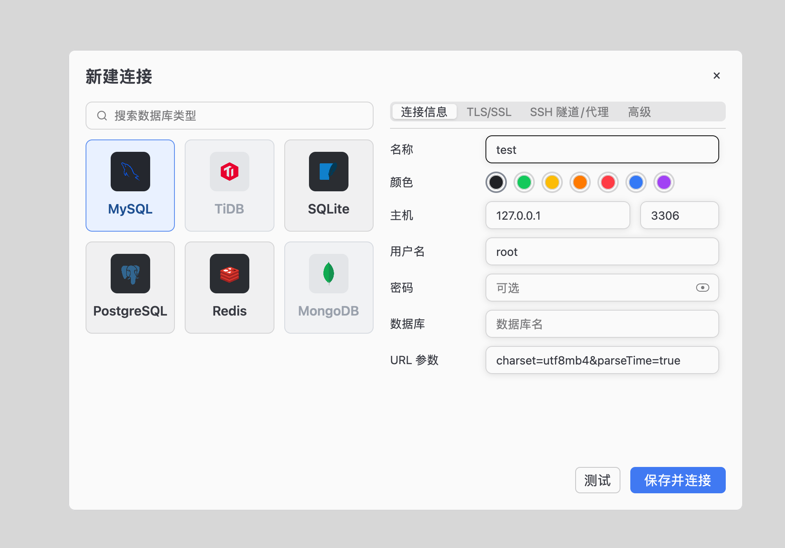
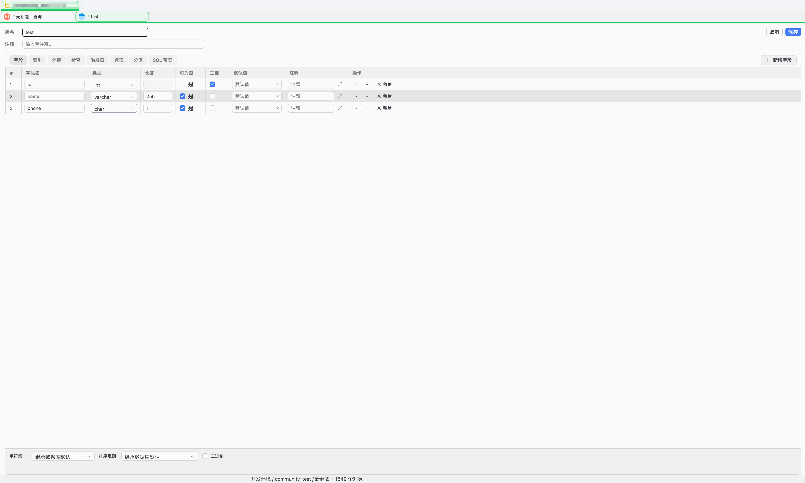
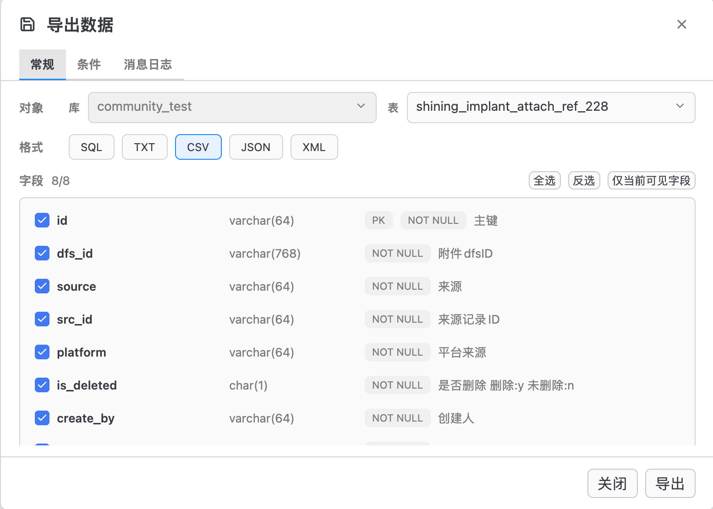
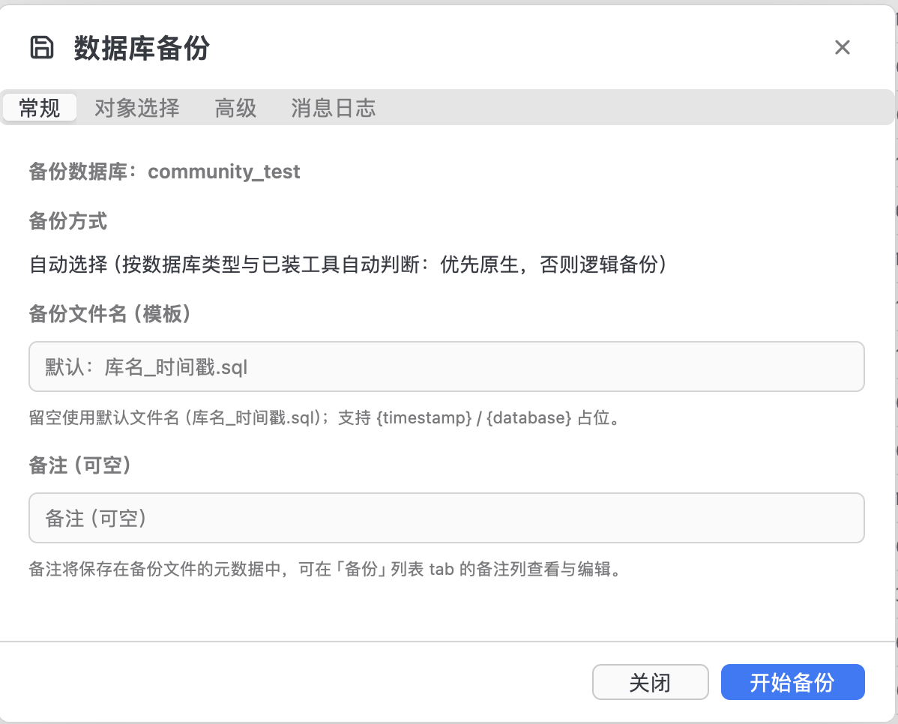
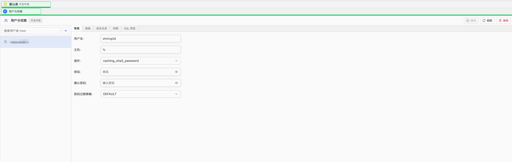
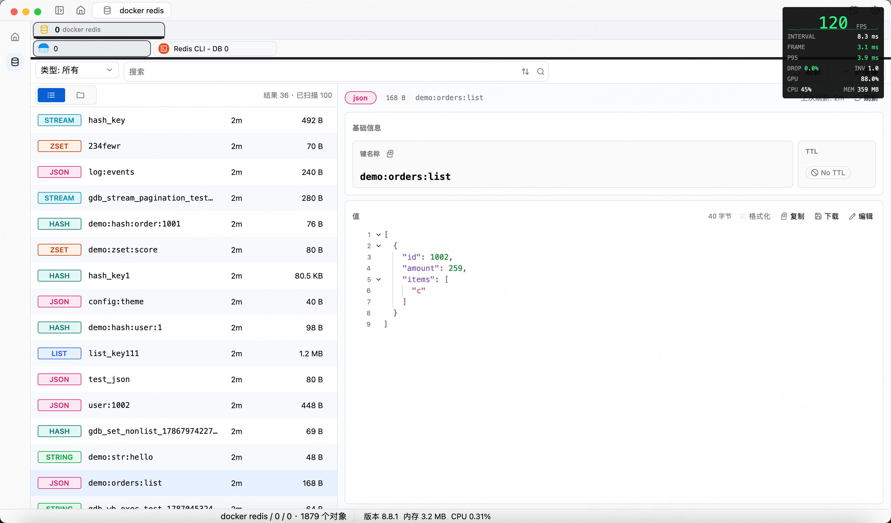
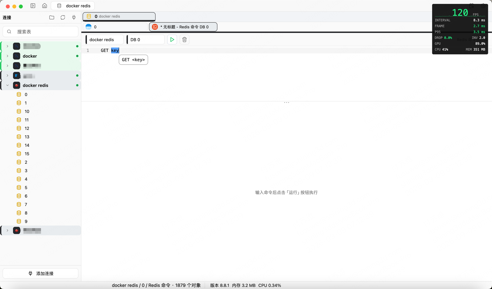
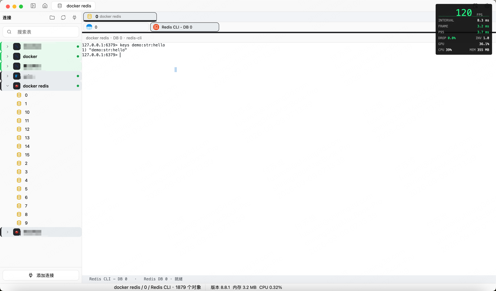
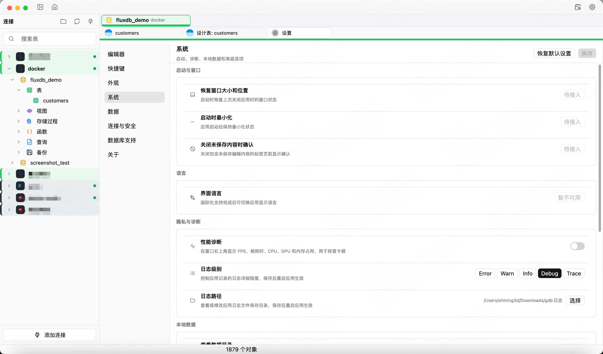

# FluxDB 操作手册

> 适用范围：FluxDB Desktop 当前版本（macOS）
>
> 支持的数据源：MySQL、TiDB、PostgreSQL、SQLite、Redis
> 项目仍处于早期开发阶段。执行写入、删除、清空、恢复或权限变更前，请先备份重要数据，并确认当前连接和数据库无误。

## 目录

- [1. 启动与主界面](#1-启动与主界面)
- [2. 新建数据库连接](#2-新建数据库连接)
- [3. 管理连接与数据库](#3-管理连接与数据库)
- [4. 使用 SQL 编辑器](#4-使用-sql-编辑器)
- [5. 浏览、筛选和编辑表数据](#5-浏览筛选和编辑表数据)
- [6. 查看和设计表结构](#6-查看和设计表结构)
- [7. 导出数据与执行 SQL 文件](#7-导出数据与执行-sql-文件)
- [8. 数据库备份](#8-数据库备份)
- [9. 用户与权限管理](#9-用户与权限管理)
- [10. 使用 Redis](#10-使用-redis)
- [11. 设置](#11-设置)
- [12. 常用快捷键](#12-常用快捷键)
- [13. 常见问题](#13-常见问题)
- [14. 数据安全建议](#14-数据安全建议)

## 1. 启动与主界面

### 1.1 从源码启动

1. 安装 [Rust 工具链](https://rustup.rs)。
2. 克隆项目并进入项目目录：

   ```bash
   git clone https://github.com/fluxdb-alt/fluxDB.git
   cd fluxDB
   ```

3. 启动桌面端：

   ```bash
   cargo run -p fluxdb-desktop
   ```

首次编译耗时通常较长。应用启动后，如果左侧没有连接，可点击“添加连接”开始配置。

### 1.2 认识主界面


主界面主要分为以下区域：

1. **连接侧边栏**：管理连接、分组、数据库、Schema 和表对象。
2. **标签栏**：承载首页、查询编辑器、数据表、建表、备份、用户权限、设置等页面。
3. **工作区**：显示当前标签页的编辑器、表格、结果或配置内容。
4. **消息提示**：保存、复制、执行、报错等轻量反馈会显示在主窗口中。

常见操作：

- 单击连接或对象左侧箭头：展开或收起节点。
- 双击表：打开数据浏览与编辑页。
- 右键连接、数据库、Schema 或表：打开对应操作菜单。
- 点击标签页关闭按钮，或按 `⌘W`：关闭当前标签页。
- 按 `⌘1`：显示或隐藏连接侧边栏。

## 2. 新建数据库连接

### 2.1 打开新建连接窗口

可使用任意一种方式：

- 点击左侧“连接”标题栏右侧的“添加连接”。
- 首页没有连接时，点击“添加连接”。
- 首页快捷操作中点击“新建连接”。



### 2.2 选择数据库类型

当前可实际创建和使用的连接包括：

| 类型 | 主要连接信息 | 常用默认端口 |
| --- | --- | ---: |
| MySQL / TiDB | 主机、端口、用户名、密码、数据库、URL 参数 | 3306 |
| PostgreSQL | 主机、端口、用户名、密码、数据库、URL 参数 | 5432 |
| SQLite | 本地数据库文件路径 | 无 |
| Redis | 主机、端口、用户名、密码、参数 | 6379 |

MongoDB 目前仍在规划中，不能作为完整可用的数据源使用。

### 2.3 填写连接信息

1. 在“名称”中填写便于识别的连接名，例如“本地 MySQL”或“生产只读库”。
2. 选择连接颜色。颜色用于在连接树和查询上下文中快速区分环境。
3. 按数据库类型填写主机、端口、账号等信息：
   - MySQL、TiDB、PostgreSQL：数据库可按实际需要填写；连接后也可以在树中切换数据库。
   - SQLite：点击文件选择按钮，选择现有数据库文件。
   - Redis：ACL 未启用时用户名可以留空；密码按服务器配置填写。
4. 如连接串包含额外参数，可填写“URL 参数”或“参数”。
5. 点击“测试”。底部显示连接成功后，再点击“保存并连接”。

如果测试失败，依次检查主机、端口、账号密码、目标数据库、服务器监听地址、防火墙及账号来源地址限制。

### 2.4 配置 TLS/SSL

MySQL、TiDB、PostgreSQL 和 Redis 可在“TLS/SSL”页签中配置加密连接：

1. 开启“启用 TLS”。
2. 按服务端要求选择 SSL 模式。
3. 需要双向认证时，分别选择 CA 证书、客户端证书和客户端密钥。
4. 如证书校验使用的主机名与连接地址不同，填写“SNI / 主机名”。
5. 生产环境建议保持“校验服务器证书”开启。

### 2.5 配置 SSH 隧道

数据库只能通过跳板机访问时：

1. 打开“SSH 隧道/代理”页签。
2. 开启“启用 SSH 隧道”。
3. 填写跳板机主机、端口和 SSH 用户名。
4. 选择密码或私钥认证，并填写对应凭据。
5. 返回底部点击“测试”，确认隧道和数据库连接均正常。

### 2.6 高级设置

- MySQL / TiDB：可配置连接和查询超时、字符集、TCP 保活等选项。
- PostgreSQL：可配置建连超时、查询超时、应用名、默认 Schema、TCP 保活，以及是否显示其他数据库和系统 Schema。
- Redis：可配置连接复用、超时、TCP 保活及拓扑相关选项。

不确定时保留默认值即可。

### 2.7 凭据保存说明

在 macOS 正常运行环境中，密码类凭据由系统 Keychain 保存；连接配置只保存凭据引用和非敏感选项，不把明文密码直接写入连接配置文件。删除连接时，该连接拥有的 Keychain 凭据也会一并清理。

## 3. 管理连接与数据库

### 3.1 打开、关闭和刷新连接

在左侧右键连接，可执行：

- **打开连接 / 关闭连接**：建立或释放当前数据库会话。
- **刷新**：重新加载数据库和对象树。
- **编辑连接**：修改连接参数后重新测试并保存。
- **复制连接**：以现有配置为基础创建一份副本。
- **删除连接**：删除保存的连接及其凭据引用；此操作不会删除服务端数据库。

### 3.2 使用连接分组

1. 点击“连接”标题栏中的“新建分组”。
2. 输入分组名称。
3. 右键连接，选择“移至分组”。
4. 需要移出时，右键连接选择“取消分组”。

建议按环境或项目分组，例如“本地”“测试”“生产”。

### 3.3 管理数据库节点

右键数据库可执行以下常见操作：

- 打开或关闭数据库。
- 置顶或取消置顶。
- 设置默认数据库。
- 新建查询、新建表、执行 SQL 文件或备份。
- 在数据库中查找对象。
- 刷新或删除数据库。

PostgreSQL 数据库下还会显示 Schema。右键 Schema 可新建查询、新建表、设置默认 Schema 或刷新。

> 删除数据库会影响服务端真实数据。请核对连接、数据库名和备份状态后再确认。

### 3.4 管理标签页

右键标签页可以关闭当前、关闭其他、关闭左侧、关闭右侧或关闭全部标签页。包含未保存内容或未提交修改的页面在关闭前会给出确认提示。

## 4. 使用 SQL 编辑器


### 4.1 新建查询

可使用以下方式：

- 右键 SQL 类型连接、数据库或 PostgreSQL Schema，选择“新建查询”。
- 点击首页“新建查询”。
- 按 `⌘Y`。

如果当前没有明确的连接或数据库，FluxDB 会要求先选择查询作用域。编辑器顶部会显示当前连接和数据库，请在执行前核对。

### 4.2 编写和补全 SQL

- 输入 SQL 关键字、表名或字段名时，编辑器会提供补全建议。
- 按 `Control+Space` 可主动触发补全。
- 按 `⌘/` 可切换当前行或选中行的行注释。
- “美化 SQL”优先格式化选区；没有选区时格式化全文。
- “压缩 SQL”优先压缩选区；没有选区时压缩全文。
- 自动换行按钮可以切换当前编辑器的长行换行方式。

### 4.3 执行 SQL

1. 只执行特定 SQL 时，选中完整语句。
2. 未选中时，把光标放在要执行的语句中。
3. 点击“运行”，或按 `⌘Enter`。

执行优先级为：完整选中语句 → 选中文本 → 光标所在语句。无法确定语句时，应用会提示先选中 SQL 或把光标放入语句。

其他执行方式：

| 操作 | macOS 快捷键 | 说明 |
| --- | --- | --- |
| 执行 | `⌘R` | 编辑器聚焦时执行当前 SQL；会覆盖全局刷新快捷键 |
| 查询结果模式 | `⌘⇧R` | 以 Select 模式执行 |
| 执行计划 | `⌘⇧E` | 对可解释的查询执行 Explain |
| 停止 | 工具栏“停止” | 请求取消正在执行的查询 |

包含高风险更新或删除的 SQL 可能触发二次确认。取消请求发出后，仍应检查服务端数据状态；数据库可能已经完成部分操作。

### 4.4 使用运行参数

SQL 中使用命名参数（例如 `:user_id`）时，运行前会出现“运行参数”窗口：

1. 在“逐个输入”中分别填写每个参数；或切换到“数组输入”批量提供值。
2. 点击“应用并运行”。
3. 参数会转换为 SQL 字面量并写入本次执行文本，请在执行高风险语句前再次检查生成内容。

### 4.5 查看查询结果

结果区会显示：

- 每条语句的成功或失败状态。
- 返回的数据表和分页控件。
- 受影响行数、耗时及执行摘要。
- 查询错误、出错 SQL、复制错误和重试入口。

结果区可以在底部或右侧显示；拖动分隔线可调整编辑器和结果区大小。

### 4.6 保存和复用查询

点击“保存”或按 `⌘S`，可以：

- 保存到本地 SQL 文件。
- 保存到当前连接中，供后续复用。

点击“历史记录”或按 `⌘⇧H`，可以搜索并重新使用历史 SQL。执行历史可能包含业务数据，请按本机数据安全策略管理。

## 5. 浏览、筛选和编辑表数据


### 5.1 打开数据表

1. 在连接树中展开连接、数据库和表节点。
2. 双击表，或右键表选择“查看数据”。
3. 等待数据加载完成。

底部显示分页、行数和加载状态。切换页码或刷新前，如果当前有未提交修改，应用会先要求确认，避免直接丢失本地修改。

### 5.2 搜索、筛选和排序

- **搜索**：点击工具栏“搜索”，在当前数据页中查找内容；也可按 `⌘F`。
- **筛选 & 排序**：添加字段、运算符和值，必要时增加多条规则，再点击“应用筛选 & 排序”。底部会显示生成的 SQL 条件。
- **单元格快捷筛选**：右键单元格，在“筛选”子菜单中选择等于、不等于、类似、小于或大于当前值。
- **单元格快捷排序**：右键单元格，在“排序”子菜单中选择升序、降序或移除当前字段排序。
- **字段筛选**：控制表格中显示哪些字段，适合字段较多的表。
- **移除所有筛选 & 排序**：从单元格右键菜单一键恢复默认数据范围。

筛选条件会转换为数据库方言对应的 SQL。生产环境中使用复杂条件时，建议先检查 SQL 预览。

### 5.3 编辑单元格

当结果区显示“可编辑”时：

1. 双击或按界面提供的编辑入口修改单元格。
2. 右键单元格可设置为空字符串、设置为 `NULL`、复制、复制字段名或粘贴。
3. 修改只会先进入本地待提交状态，不会立即写入数据库。
4. 查看底部待修改数量和 SQL 预览。
5. 点击“提交更改”写入数据库；点击“取消更改”放弃本地修改并重新加载数据。

如果查询结果不能可靠定位源表或记录，编辑能力会被禁用。不要通过绕过主键或唯一标识的方式强行更新数据。

### 5.4 新增、克隆和删除行

右键行号或记录区域，可以：

- 打开“行详情”。
- 新增一行。
- 克隆为新行。
- 删除当前行或选中行。
- 复制或导出当前行。

新增、修改和删除会统一进入待提交状态。提交前可查看生成的 SQL；确认条件不会误命中其他记录后再提交。

### 5.5 查看表属性

点击“表属性”，可查看当前表的字段、索引、外键、触发器和 DDL。再次点击可关闭属性面板。


### 5.6 当前未开放入口

数据工具栏中的“数据分析”“导入”“数据生成”等入口如果处于禁用状态或点击无动作，表示当前版本尚未完整接入，不影响已有的数据浏览、编辑和导出功能。

## 6. 查看和设计表结构

### 6.1 查看结构

在数据页点击“表属性”，分别查看：

- 字段名、类型、可空、默认值和注释。
- 索引及其字段。
- 外键和引用目标。
- 触发器。
- 建表 DDL。

### 6.2 新建表

1. 右键数据库或 PostgreSQL Schema。
2. 选择“新建表”。
3. 填写表名。
4. 在“字段”页添加字段，设置类型、可空、默认值、主键、自增和注释等属性。
5. 按需配置“索引”“外键”“检查”“触发器”“选项”和“分区”。
6. 打开“SQL 预览”检查将执行的语句。
7. 保存并执行建表操作。



PostgreSQL 触发器需要引用已存在的函数；不能直接使用 MySQL 风格的行内触发器体。

### 6.3 设计现有表

1. 右键表，选择“设计表”。
2. 修改字段、索引、外键、检查或其他结构项。
3. 打开“SQL 预览”核对变更语句。
4. 确认后保存。

结构变更可能锁表、重建表或丢失数据。大表和生产库应在维护窗口操作，并提前验证备份可用。

### 6.4 表的其他右键操作

表右键菜单还包括置顶、复制名称、刷新、重命名、复制表、复制表结构、备份、导出、删除表和清空表等操作。

“删除表”和“清空表”均为高风险操作：

- 删除表会移除表结构和数据。
- 清空表会删除表中全部记录，并可能按选项重置自增序列。
- 界面要求确认时，请完整阅读 SQL 和影响范围，不要仅凭按钮位置连续确认。

## 7. 导出数据与执行 SQL 文件

### 7.1 导出表数据

可从以下入口打开导出窗口：

- 数据页工具栏“导出”。
- 表右键菜单“导出” → “导出数据”。
- 行或选区右键菜单中的“导出”。

典型流程：

1. 选择导出字段；可全选、反选或只选当前可见字段。
2. 选择导出范围或设置自定义条件。
3. 检查预计导出数量和 SQL 预览。
4. 选择输出位置和格式。
5. 点击“导出”，通过消息日志查看进度和结果。



导出文件可能包含敏感数据。完成后请检查文件权限，不要把真实业务数据提交到代码仓库。

### 7.2 执行 SQL 文件

1. 右键 SQL 类型连接或数据库。
2. 选择“执行 SQL 文件”。
3. 点击“浏览”，选择 `.sql` 文件。
4. 检查目标连接、数据库和执行选项。
5. 点击“执行”。
6. 在消息日志中检查每个阶段是否成功；需要排查时可复制日志。

大型 SQL 文件执行中不要直接强制退出应用。发生错误时，应先确认数据库事务状态和已执行范围，再决定重试。

## 8. 数据库备份

### 8.1 首次配置

1. 打开“设置”。
2. 进入“数据”。
3. 设置“备份目录”。
4. 按数据库类型检查原生客户端：
   - SQLite：`sqlite3`
   - MySQL / TiDB：MySQL 客户端工具
   - PostgreSQL：PostgreSQL 客户端工具
5. 可使用设置页中的检测或下载安装入口确认工具状态。

未配置备份目录时，备份窗口会提示前往设置。

### 8.2 新建备份

1. 右键目标数据库或表。
2. 选择“备份”或“新建备份”。
3. 选择备份方式：
   - **自动选择**：根据数据库类型和已安装工具，优先选择原生备份，否则使用逻辑备份。
   - **原生备份**：使用数据库客户端工具，通常按整库处理。
   - **逻辑备份**：可选择具体表对象。
4. 逻辑备份时选择需要备份的表；原生备份的对象选择不会生效。
5. 可填写备注，用于后续识别备份用途。
6. 点击“开始备份”，观察实时日志，直到任务明确显示完成或失败。



### 8.3 管理备份文件

备份标签页中可以：

- 刷新备份列表。
- 查看文件、时间、大小、表清单和备注。
- 编辑备注。
- 再次备份。
- 删除备份文件及其元数据。

删除备份不可恢复。备份成功只代表文件已生成，重要数据还应定期在隔离环境中做恢复演练。

## 9. 用户与权限管理

MySQL、TiDB 和 PostgreSQL 连接支持“用户与权限”入口。

1. 右键连接，选择“用户与权限”。
2. 点击刷新，加载用户或角色列表。
3. 选择现有用户进行编辑，或点击新增按钮创建用户。
4. 配置常规信息、登录能力、资源限制、成员关系和对象权限。
5. 保存前查看 SQL 预览。
6. 点击保存或“执行 SQL”，等待成功提示后刷新列表验证。



权限管理需要当前账号具备读取和修改用户、角色或授权信息的权限。删除用户、撤销权限和修改角色成员关系可能导致业务中断，请先确认依赖该账号的应用和任务。

## 10. 使用 Redis

### 10.1 打开 Redis 数据库

1. 创建并连接 Redis。
2. 展开连接，选择逻辑数据库。
3. 打开后进入键浏览页面。


顶部搜索框可按 Key 模式查找；可使用搜索历史重复查询，点击“刷新”重新加载，点击“新增键”创建数据。

### 10.2 新增 Key

1. 点击“新增键”。
2. 选择 Key 类型：String、Hash、List、Set、ZSet、Stream 或 JSON。
3. 填写 Key Name。
4. TTL 可留空表示永不过期；填写时确认单位和期望的过期时间。
5. 按类型填写值、成员、分数或字段。
6. 保存后回到键列表确认数据和 TTL。

> Redis JSON 依赖服务端 RedisJSON 能力；服务端不支持对应命令时会返回错误。

### 10.3 查看和编辑 Key

选择 Key 后，详情区会根据类型提供对应操作：

- **String / JSON**：查看、格式化和保存完整值。
- **Hash**：查询、新增、修改或删除字段。
- **List**：查看列表、新增条目或按规则删除元素。
- **Set**：查询、新增或删除成员。
- **ZSet**：查询成员，编辑成员及分数。
- **Stream**：查看和新增 Entry，并查看消费者组信息。

Key 元信息区域可以刷新、修改键名和 TTL。保存前确认键名不会覆盖不应替换的现有数据。超大值可能只显示截断预览，应进入完整值编辑入口后再修改。



### 10.4 Redis Workbench

对 Redis 连接执行“新建查询”会打开 Workbench，而不是 SQL 编辑器。



1. 输入 Redis 命令。
2. 点击“运行”。
3. 每条执行记录会显示命令、状态、执行时间、耗时和响应。
4. JSON 命令结果可在 Text / JSON 视图间切换。
5. 可单独重跑或删除某条执行记录。
6. “历史记录”会按连接和逻辑数据库显示已执行命令。

FLUSH、DEL 等危险命令可能触发二次确认。执行后仍应主动刷新键列表验证结果。

### 10.5 Redis CLI

1. 右键 Redis 逻辑数据库。
2. 选择“Redis CLI”。
3. 在终端中输入命令并回车执行。



CLI 更接近直接命令行操作，适合熟悉 Redis 命令的用户。高风险命令不会因为在终端中执行就自动变得安全，请先核对当前连接和 DB 编号。

### 10.6 Pub/Sub

1. 右键 Redis 逻辑数据库。
2. 选择“打开 Pub/Sub”。
3. 添加要订阅的频道或模式。
4. 使用发布区域填写频道和消息并发送。
5. 点击已订阅项目可取消订阅。

Pub/Sub 消息是实时的，不会因为关闭页面而在 Redis 中自动补发历史消息。

## 11. 设置

点击应用中的“设置”，进入以下分类：



| 分类 | 主要内容 |
| --- | --- |
| 编辑器 | 字号、行高、自动换行等 SQL 编辑器偏好 |
| 快捷键 | 查看、修改和恢复应用快捷键 |
| 外观 | 浅色/深色/跟随系统、圆角、阴影、密度、状态栏、滚动条、字体和无障碍选项 |
| 系统 | 启动、诊断、日志、本地数据和高级选项；部分仍待接入 |
| 数据 | 默认分页行数、备份目录和数据库客户端工具 |
| 连接与安全 | 连接行为和敏感信息策略 |
| 数据库支持 | 当前内置连接器和各数据库能力状态 |
| 关于 | 应用和配置说明 |

修改后点击右上角“保存”。部分系统设置会提示重启应用后生效。标记为“待接入”或“暂不可用”的项目仅表示规划状态，当前修改不会产生实际效果。

## 12. 常用快捷键

以下为 macOS 默认快捷键，可在“设置” → “快捷键”中修改：

| 快捷键 | 功能 |
| --- | --- |
| `⌘Y` | 新建查询 |
| `⌘R` | 刷新当前连接、对象或数据页；编辑器聚焦时执行 SQL |
| `⌘S` | 保存查询、保存设置或提交当前数据修改 |
| `⌘W` | 关闭当前标签页 |
| `⌘1` | 显示或隐藏连接侧边栏 |
| `⌘Enter` | 执行当前 SQL，或应用当前数据编辑内容 |
| `⌘F` | 打开当前数据页搜索 |
| `⌘⇧H` | SQL 历史快速搜索 |
| `⌘C` | 复制当前选中的表格数据 |
| `Control+Space` | 触发 SQL 补全 |
| `⌘/` | 切换行注释 |
| `Esc` | 关闭当前弹窗、菜单或浮层 |

非 macOS 平台规划使用 `Ctrl` 替代大部分 `⌘`，但当前正式支持平台仍为 macOS。

## 13. 常见问题

### 13.1 连接测试失败

按以下顺序检查：

1. 数据库服务是否已启动并监听填写的地址和端口。
2. 主机和端口是否能从当前 Mac 访问。
3. 用户名、密码和数据库名是否正确。
4. 数据库账号是否允许来自当前地址的连接。
5. TLS 模式、证书和 SNI 是否与服务端要求一致。
6. SSH 跳板机是否可登录，认证方式和目标地址是否正确。
7. 云数据库安全组、防火墙或 VPN 是否放行。

### 13.2 连接成功但看不到数据库或表

- 右键连接或数据库选择“刷新”。
- 右键连接选择“选择显示数据库”，检查目标数据库是否被隐藏。
- PostgreSQL 检查默认 Schema 和“显示系统 Schema”设置。
- 确认账号拥有读取元数据和目标对象的权限。

### 13.3 查询可以运行，但结果不能编辑

结果编辑需要能够可靠识别源表和记录。连接查询、多表查询、聚合结果、缺少主键或唯一标识的结果可能只读。可双击原始表打开数据页后再尝试编辑。

### 13.4 修改了数据但数据库没有变化

表格编辑先保存在本地待提交区。请查看底部是否有待提交数量，并点击“提交更改”；点击“取消更改”、刷新或关闭页面会放弃尚未提交的修改。

### 13.5 备份按钮不可用或备份失败

- 在“设置” → “数据”中配置备份目录。
- 检查目录是否存在且当前用户可写。
- 检测对应数据库客户端工具，必要时重新选择路径。
- 查看备份窗口实时日志中的具体错误。
- 原生工具版本最好与数据库服务端主版本兼容。

### 13.6 Redis 搜索不到 Key

- 确认当前逻辑数据库编号正确。
- 清空搜索条件后刷新。
- 检查 Key 模式是否过于严格。
- 确认账号具备 SCAN 和读取相关数据类型的权限。
- 集群、哨兵或代理环境下，检查连接拓扑配置是否正确。

### 13.7 应用操作后界面没有更新

先等待当前 loading 状态结束，再刷新当前对象。不要在备份、导出、SQL 文件执行或大查询仍在运行时反复点击相同操作。

## 14. 数据安全建议

- 为生产环境连接设置醒目的名称和颜色，并单独分组。
- 日常浏览优先使用只读账号；仅在需要时使用具备写入或管理权限的账号。
- 执行 `UPDATE`、`DELETE`、`TRUNCATE`、`DROP`、Redis `FLUSH*` 等操作前，先确认连接、数据库、Schema 和条件范围。
- 表格批量修改前查看 SQL 预览；条件不明确时取消提交。
- 结构变更、权限变更和批量导入前先备份，并验证备份可恢复。
- 不要把导出的业务数据、数据库密码、私钥或证书提交到 Git 仓库。
- 查询被取消、应用异常退出或网络中断后，应重新连接并核对事务和数据状态，不要仅凭界面提示判断回滚结果。
